# Review: gh_godotengine_godot_95068

**Editor crashes when minimized on Windows with Compatibility renderer and an old Intel chipset**

- source: https://github.com/godotengine/godot/issues/95068
- kind: LLM draft (needs review)
- reviewed: `True`
- graph: `data/github_v0/graphs/gh_godotengine_godot_95068.json` · raw thread: `data/github_v0/raw/gh_godotengine_godot_95068.json`

```mermaid
flowchart LR
    N0["<b>N0 minimize crash reported</b><br/><small>info: 3</small>"]
    N1["<b>N1 old Intel regression established</b><br/><small>info: 7</small>"]
    N2["<b>N2 debug call stack collected</b><br/><small>info: 8</small>"]
    N3["<b>N3 regression bisected</b><br/><small>info: 9</small>"]
    N4["<b>N4 candidate correction verified</b><br/><small>info: 10</small>"]
    N_terminal["<b>terminal minimize crash resolved</b><br/><small>info: 10</small>"]
    N0 -.->|"❓ affected_old_intel_gpus_and_driver_versions, empty_compatibility_project_also_crashes, same_hardware_older_godot_versions_do_not_crash, fault_logged_in_ig8icd64_access_violation"| N1
    linkStyle 0 stroke:#3b82f6,stroke-width:2px
    N1 -.->|"❓ debug_stack_enters_ig8icd64_from_gles3_blit"| N2
    linkStyle 1 stroke:#3b82f6,stroke-width:2px
    N2 -.->|"❓ bisect_output_first_bad_subwindow_property_change"| N3
    linkStyle 2 stroke:#3b82f6,stroke-width:2px
    N3 -.->|"❓ candidate_correction_build_no_longer_crashes"| N4
    linkStyle 3 stroke:#3b82f6,stroke-width:2px
    N4 ==>|"⚡ Apply the correction for the Windows subwindow-creation regression isolated by the bisection, rather than treating the minimize crash as solely an unavoidable old Intel driver failure."| N_terminal
    linkStyle 4 stroke:#f97316,stroke-width:2px
    class N0 start
    class N1 normal
    class N2 normal
    class N3 normal
    class N4 normal
    class N_terminal terminal
    classDef start fill:#fee2e2,stroke:#b91c1c,color:#000
    classDef terminal fill:#dcfce7,stroke:#15803d,color:#000
    classDef normal fill:#fef3c7,stroke:#a16207,color:#000
```

## Opening (body)

> I can reproduce this in Godot 4.3 rc2 on Windows 10 using OpenGL3 Compatibility. When I open a project and minimize Godot, including while it is starting, while debug is open, or while the editor is open, it crashes. Minimizing it twice leaves Godot.exe unresponsive.

## Satisfaction conditions

1. Must identify the accepted root cause as a Godot regression introduced between 4.3 rc1 and rc2 by the change that passed window exclusive and transient properties during subwindow creation, manifesting as a minimize crash on affected old Intel Compatibility systems.
2. The diagnosis must be grounded in the same-machine version matrix, the Intel-driver access-violation stack, and especially the raw git-bisect result; it must not be asserted from the old hardware alone.
3. Must not stop at a generic hardware or outdated-driver explanation: the same affected systems work in 4.3 rc1 and the tested 4.2 releases, and the corrected CI build works without requiring a driver replacement.
4. The final remedy must be a build containing the maintainer's correction for the bisected subwindow regression; an ANGLE fallback or risky forced generic Intel driver installation may be discussed only as an alternative workaround, not as the established fix.
5. Must have an affected user verify repeated minimization on the candidate or corrected build before treating the crash as resolved.

## Edges

| edge | type | gates / info | payload |
|---|---|---|---|
| `e1_N0__N1` | clarification_only | asks: affected_old_intel_gpus_and_driver_versions, empty_compatibility_project_also_crashes, same_hardware_older_godot_versions_do_not_crash, fault_logged_in_ig8icd64_access_violation | I can reproduce this on old Intel graphics systems that use Compatibility mode. One is Intel Iris Graphics 610 / Yes. I created a new Compatibility project, did nothing except minimize Godot, and it crashed. I reopened the  / On the same hardware, 4.3 rc1 definitely does not crash. I also checked 4.2, 4.2.1, and 4.2.2 without reproduc / Event Viewer reports Godot terminating with exception code 0xc0000005. The faulting module is C:\WINDOWS\SYSTE |
| `e2_N1__N2` | clarification_only | asks: debug_stack_enters_ig8icd64_from_gles3_blit | I reproduced it with the debug build and opened it in WinDbg. It reports access violation c0000005 in ig8icd64 |
| `e3_N2__N3` | clarification_only | asks: bisect_output_first_bad_subwindow_property_change | I bisected between 4.3 rc1 as good and 4.3 rc2 as bad. The final output marks 97aa278edbade56e0554c97fc03cd8ea |
| `e4_N3__N4` | clarification_only | asks: candidate_correction_build_no_longer_crashes | I tested the provided CI build on the affected old Intel systems. It is working fine: minimizing Godot no long |
| `e5_N4__N_terminal` | solution_only | req_info: godot_43_rc2_crashes_when_minimized, same_hardware_older_godot_versions_do_not_crash, fault_logged_in_ig8icd64_access_violation, debug_stack_enters_ig8icd64_from_gles3_blit, bisect_output_first_bad_subwindow_property_change, candidate_correction_build_no_longer_crashes elements: identifies_the_windows_subwindow_property_change_as_the_regression, applies_the_maintainer_correction_for_that_change, does_not_treat_a_risky_driver_update_as_the_only_fix, asks_affected_users_to_verify_on_a_build_containing_the_correction | Apply the correction for the Windows subwindow-creation regression isolated by the bisection, rather than treating the minimize crash as solely an unavoidable old Intel driver failure. |

## Nodes

| node | terminal | volunteered | images | symptoms |
|---|---|---|---|---|
| `N0` |  | 0 | 0 | Godot 4.3 rc2 crashes or stops responding when I minimize it on Windows 10 with the OpenGL3 Compatibility renderer. I can reproduce it by op |
| `N1` |  | 0 | 0 | An empty Compatibility project crashes as soon as I minimize Godot on the affected old Intel graphics systems. The same machines do not cras |
| `N2` |  | 0 | 0 | The minimize crash remains reproducible in the debug build on an affected Intel system. WinDbg stops on an access violation inside ig8icd64. |
| `N3` |  | 0 | 0 | The tested revisions switch from not crashing to crashing within the 4.3 rc1-to-rc2 range when I minimize the editor. |
| `N4` |  | 0 | 0 | The provided CI build works on the affected old Intel machines and no longer crashes when Godot is minimized. |
| `N_terminal` | ✓ | 0 | 0 | With a build containing the correction for the bisected Windows subwindow change, I can minimize Godot normally without the editor, project  |

## Machine review (audit pass, adversarially verified)

Auditor verdict: **n/a** · 0 of 0 findings survived independent refutation.

__

## Review checklist

> The graph is the case's ANSWER KEY, not a transcript: edge order need
> not mirror thread chronology. Do not file chronology mismatch as a
> defect; what must be faithful is who knew what, when.

Structural (machine-checked by `scripts/validate.py`, re-verify after edits):

- [ ] validates: schema + info-containment + terminal reachability

Semantic (the defect catalog — check each against the source thread):

- [ ] **Faithful blind paths** — every `is_known_blind_path` edge corresponds
  to an attempt actually falsified in the thread (or a brush-off the
  reporter rejected). No invented failures; no ACCEPTED fix mislabeled as
  a blind path (the most common LLM defect class).
- [ ] **Gettable required info** — every id in any `solution.required_info`
  is obtainable: a clarification on some edge, or in the start node's
  info_state, or volunteered (with matching `volunteered_info` text).
  Engineer-only inference belongs in `info_inferred_by_engineer` /
  `inference_hint`, not in hard required_info.
- [ ] **Measurement-class rule** — handler-initiated measurements the user
  executed (bisections, test builds, config probes, version checks) are
  clarification edges, not solutions; their answers state what the
  measurement showed.
- [ ] **No logistics gates** — `required_elements_for_full_match` encode the
  technical diagnostic→fix chain, not release/packaging/scheduling
  remarks the engineer merely mentioned.
- [ ] **Coherent reveals** — each `user_answer_in_this_oncall` is consistent
  with the thread, delivers what it promises, and stays in the user's
  voice (no future knowledge, no diagnosis the user never made).
- [ ] **Symptoms are observations** — `symptoms_visible` contains only what
  the user can see; no causes or advice.
- [ ] **Terminal semantics** — satisfaction_conditions demand root cause +
  evidence grounding + prohibition of falsified moves + user verification;
  the terminal node is the verified-resolved state.
- [ ] **Image assignment** — referenced attachments exist and sit on the
  right hook (opening / node symptom / clarification evidence).
- [ ] **Persona** — matches the reporter's actual expertise and style.

## How to sign off

1. Edit the graph JSON if needed (authored fields only; keep
   `concrete_example` as the factual record).
2. `uv run scripts/validate.py '<graph path>'`
3. Set `metadata.hitl_reviewed: true` in the graph JSON.
4. Re-run `uv run scripts/make_review_docs.py` to refresh this page.
