# Review: gh_godotengine_godot_99420

**FPS almost halved going from 4.4 dev3 to 4.4 dev4 in a Forward+ 2D project**

- source: https://github.com/godotengine/godot/issues/99420
- kind: LLM draft (needs review)
- reviewed: `True`
- graph: `data/github_v0/graphs/gh_godotengine_godot_99420.json` · raw thread: `data/github_v0/raw/gh_godotengine_godot_99420.json`

```mermaid
flowchart LR
    N0["<b>N0 severe dev4 FPS regression reported</b><br/><small>info: 4</small>"]
    N1["<b>N1 regression isolated to Forward+ texture and shadow workload</b><br/><small>info: 8</small>"]
    N2["<b>N2 regression range and workload pattern measured</b><br/><small>info: 12</small>"]
    N2_x["<b>N2_x cache-size increase aftermath</b><br/><small>info: 13</small>"]
    N3["<b>N3 shadow-heavy project available for profiling</b><br/><small>info: 16</small>"]
    N4["<b>N4 shadow draw-list candidate tested</b><br/><small>info: 17</small>"]
    N4_x["<b>N4_x shadow draw-list optimization aftermath</b><br/><small>info: 18</small>"]
    N_terminal["<b>terminal performance regression resolved</b><br/><small>info: 20</small>"]
    N0 -.->|"❓ profiler_comparison_and_remote_tree_slowdown, hiding_scene_content_does_not_restore_fps, compatibility_renderer_consistent_across_versions, texture_rect_draws_and_light_shadows_isolate_gap"| N1
    linkStyle 0 stroke:#3b82f6,stroke-width:2px
    N1 -.->|"❓ bisect_raw_output_0d1d945_canvas_change, dev2_matches_dev3_performance, few_objects_and_atlas_regions_keep_versions_close, many_individual_textures_or_lights_widen_gap"| N2
    linkStyle 1 stroke:#3b82f6,stroke-width:2px
    N2 ==>|"💥 blind: Treat uniform-set cache thrashing as the whole regression and increase the 2D batching uniform-set cache until all unique textures fit."| N2_x
    linkStyle 2 stroke:#ef4444,stroke-width:2px
    N2_x -.->|"❓ full_project_shared_privately_for_reproduction, cpu_usage_same_around_eight_percent, shadows_off_with_cache_512_equalizes_versions"| N3
    linkStyle 3 stroke:#3b82f6,stroke-width:2px
    N3 -.->|"❓ shadow_draw_list_candidate_branch_reaches_345_fps"| N4
    linkStyle 4 stroke:#3b82f6,stroke-width:2px
    N4 ==>|"💥 blind: Resolve the shadow-heavy regression by reducing the number of draw lists and RenderingDevice API calls used for PointLight2D shadow rendering."| N4_x
    linkStyle 5 stroke:#ef4444,stroke-width:2px
    N4_x ==>|"⚡ Use a build containing the thread-guard performance optimization: the remaining regression is excessive thread-guard overhead amplified by the shadow-heavy RenderingDevice call pattern, rather than unresolved uniform-set cache capacity alone."| N_terminal
    linkStyle 6 stroke:#f97316,stroke-width:2px
    class N0 start
    class N1 normal
    class N2 normal
    class N2_x normal
    class N3 normal
    class N4 normal
    class N4_x normal
    class N_terminal terminal
    classDef start fill:#fee2e2,stroke:#b91c1c,color:#000
    classDef terminal fill:#dcfce7,stroke:#15803d,color:#000
    classDef normal fill:#fef3c7,stroke:#a16207,color:#000
```

## Opening (body)

> I can reproduce a major FPS drop in Godot 4.4 dev4 on Windows 10 with Vulkan Forward+ and an RTX 4090. In the same 2D game scenario, the editor drops from about 383 FPS in dev3 to 200 FPS in dev4, and the exported game drops from about 402 FPS to 240 FPS. The project makes heavy use of RenderingServer. I have not reproduced this in a new empty scene and do not yet have a minimal reproduction project.

## Satisfaction conditions

1. Must identify the final accepted root cause as excessive thread-guard overhead, amplified by the very large number of RenderingDevice calls in the project's PointLight2D shadow workload.
2. The diagnosis must be grounded in the collected evidence: the regression is Forward+-specific, dev2/dev3 are fast, disabling shadows removes the remaining gap, and the affected project was reproduced and profiled.
3. Must not present increasing the 2D uniform-set cache as the complete fix; it improved performance but plateaued well below dev3 in the reporter's scene.
4. Must not present reducing PointLight2D shadow draw lists as the complete fix; the landed change improved performance but dev7 still remained substantially below dev3 for the reporter.
5. Must recommend testing a build containing the thread-guard performance change and must not declare resolution until the reporter verifies the original scene on that build.

## Edges

| edge | type | gates / info | payload |
|---|---|---|---|
| `e1_N0__N1` | clarification_only | asks: profiler_comparison_and_remote_tree_slowdown, hiding_scene_content_does_not_restore_fps, compatibility_renderer_consistent_across_versions, texture_rect_draws_and_light_shadows_isolate_gap | I captured the debug profilers one after the other in the same loaded level. Dev4 is on the left and dev3 on t / I managed to hide everything in the dev4 scene, but it did not seem to make a difference. / It only happens with Forward+. Compatibility keeps the frames consistent across dev3 and dev4 in every case I  / Commenting out my canvas_item_add_texture_rect calls or turning off shadows for the lights keeps the project a |
| `e2_N1__N2` | clarification_only | asks: bisect_raw_output_0d1d945_canvas_change, dev2_matches_dev3_performance, few_objects_and_atlas_regions_keep_versions_close, many_individual_textures_or_lights_widen_gap | The bisection gave me commit 0d1d94572750b624e10aa6e655011e37028fa1c5, titled '2D: Fix various issues and mino / Dev2 gives me around 384 FPS, pretty much the same as dev3. The attached image is the 2D scene I am rendering. / I am rendering fewer objects. A new game with few objects has roughly the same FPS in both versions. Filling t / The large difference appears when I add more objects through canvas_item_add_texture_rect using mostly singula |
| `e3_N2__N2_x` | solution_only **BLIND** | req_info: two_dimensional_game_uses_renderingserver_heavily, bisect_raw_output_0d1d945_canvas_change, many_individual_textures_or_lights_widen_gap elements: increases_the_uniform_set_cache_size, retests_the_same_scene | Treat uniform-set cache thrashing as the whole regression and increase the 2D batching uniform-set cache until all unique textures fit. |
| `e4_N2_x__N3` | clarification_only | asks: full_project_shared_privately_for_reproduction, cpu_usage_same_around_eight_percent, shadows_off_with_cache_512_equalizes_versions | Yes. I arranged private access and shared the full project so the same scene could be tested without publishin / No. Both stay around 8% CPU usage with the game open and running. / With the cache at 512, setting light shadows to false gives me roughly the same FPS in both builds. With shado |
| `e5_N3__N4` | clarification_only | asks: shadow_draw_list_candidate_branch_reaches_345_fps | I am not sure how to compile with the same optimizations as the development builds, but this branch gives me a |
| `e6_N4__N4_x` | solution_only **BLIND** | req_info: texture_rect_draws_and_light_shadows_isolate_gap, shadows_off_with_cache_512_equalizes_versions, full_project_shared_privately_for_reproduction, shadow_draw_list_candidate_branch_reaches_345_fps elements: reduces_point_light_shadow_draw_lists, reduces_rendering_api_call_overhead | Resolve the shadow-heavy regression by reducing the number of draw lists and RenderingDevice API calls used for PointLight2D shadow rendering. |
| `e7_N4_x__terminal` | solution_only | req_info: fps_drop_dev3_to_dev4_editor_and_export, compatibility_renderer_consistent_across_versions, texture_rect_draws_and_light_shadows_isolate_gap, shadows_off_with_cache_512_equalizes_versions, profiler_comparison_and_remote_tree_slowdown, dev2_matches_dev3_performance, large_uniform_set_cache_only_partially_improves_fps, full_project_shared_privately_for_reproduction, landed_shadow_draw_list_change_does_not_fully_restore_dev7 elements: identifies_thread_guard_overhead_as_the_remaining_root_cause, explains_that_many_shadow_rendering_api_calls_amplify_the_cost, recommends_a_build_containing_the_thread_guard_performance_change, asks_user_to_verify_on_a_build_containing_the_fix | Use a build containing the thread-guard performance optimization: the remaining regression is excessive thread-guard overhead amplified by the shadow-heavy RenderingDevice call pattern, rather than unresolved uniform-set cache capacity alone. |

## Nodes

| node | terminal | volunteered | images | symptoms |
|---|---|---|---|---|
| `N0` |  | 0 | 0 | In the same 2D game scenario, editor performance drops from about 383 FPS in dev3 to 200 FPS in dev4, while the exported game drops from abo |
| `N1` |  | 3 | 0 | The dev4 profiler is slower in the same loaded game state, and the remote scene tree is extremely slow. The version-to-version FPS gap appea |
| `N2` |  | 0 | 0 | Dev2 runs at about 384 FPS, essentially the same as dev3. Scenes with few objects or walls drawn from atlas regions stay similar between ver |
| `N2_x` |  | 1 | 0 | Increasing the uniform-set cache improves dev4 from roughly 256 FPS to about 300 FPS, but dev3 still runs around 390 FPS. Values above 512,  |
| `N3` |  | 1 | 0 | CPU usage remains around 8% in both dev3 and dev4. With the cache set to 512 or higher, disabling light shadows makes the FPS roughly equal  |
| `N4` |  | 0 | 0 | The provided candidate branch reaches about 345 FPS in my self-compiled build, compared with about 300 FPS in dev4, although I cannot compar |
| `N4_x` |  | 1 | 0 | In the later dev7 build, the same scene runs at about 295 FPS rather than the roughly 390 FPS I still get in dev3. |
| `N_terminal` | ✓ | 1 | 0 | After compiling the latest master containing the thread-guard performance change, the same scene runs at around 615 FPS. |

## Machine review (audit pass, adversarially verified)

Auditor verdict: **n/a** · 0 of 0 findings survived independent refutation.

__

## Review checklist

> The graph is the case's ANSWER KEY, not a transcript: edge order need
> not mirror thread chronology. Do not file chronology mismatch as a
> defect; what must be faithful is who knew what, when.

Structural (machine-checked by `scripts/validate.py`, re-verify after edits):

- [ ] validates: schema + info-containment + terminal reachability

Semantic (the defect catalog — check each against the source thread):

- [ ] **Faithful blind paths** — every `is_known_blind_path` edge corresponds
  to an attempt actually falsified in the thread (or a brush-off the
  reporter rejected). No invented failures; no ACCEPTED fix mislabeled as
  a blind path (the most common LLM defect class).
- [ ] **Gettable required info** — every id in any `solution.required_info`
  is obtainable: a clarification on some edge, or in the start node's
  info_state, or volunteered (with matching `volunteered_info` text).
  Engineer-only inference belongs in `info_inferred_by_engineer` /
  `inference_hint`, not in hard required_info.
- [ ] **Measurement-class rule** — handler-initiated measurements the user
  executed (bisections, test builds, config probes, version checks) are
  clarification edges, not solutions; their answers state what the
  measurement showed.
- [ ] **No logistics gates** — `required_elements_for_full_match` encode the
  technical diagnostic→fix chain, not release/packaging/scheduling
  remarks the engineer merely mentioned.
- [ ] **Coherent reveals** — each `user_answer_in_this_oncall` is consistent
  with the thread, delivers what it promises, and stays in the user's
  voice (no future knowledge, no diagnosis the user never made).
- [ ] **Symptoms are observations** — `symptoms_visible` contains only what
  the user can see; no causes or advice.
- [ ] **Terminal semantics** — satisfaction_conditions demand root cause +
  evidence grounding + prohibition of falsified moves + user verification;
  the terminal node is the verified-resolved state.
- [ ] **Image assignment** — referenced attachments exist and sit on the
  right hook (opening / node symptom / clarification evidence).
- [ ] **Persona** — matches the reporter's actual expertise and style.

## How to sign off

1. Edit the graph JSON if needed (authored fields only; keep
   `concrete_example` as the factual record).
2. `uv run scripts/validate.py '<graph path>'`
3. Set `metadata.hitl_reviewed: true` in the graph JSON.
4. Re-run `uv run scripts/make_review_docs.py` to refresh this page.
