# Review: gh_gradio-app_gradio_5143

**Increase httpx timeout to prevent requests from erroring out**

- source: https://github.com/gradio-app/gradio/issues/5143
- kind: LLM draft (needs review)
- reviewed: `True`
- graph: `data/github_v0/graphs/gh_gradio-app_gradio_5143.json` · raw thread: `data/github_v0/raw/gh_gradio-app_gradio_5143.json`

```mermaid
flowchart LR
    N0["<b>N0 queued request front-end error reported</b><br/><small>info: 4</small>"]
    N1["<b>N1 latest-version test unchanged</b><br/><small>info: 5</small>"]
    N2["<b>N2 five-second boundary reproduced</b><br/><small>info: 8</small>"]
    N2_x["<b>N2_x local-environment dismissal rejected</b><br/><small>info: 10</small>"]
    N_terminal["<b>terminal resolved with increased httpx timeout</b><br/><small>info: 11</small>"]
    N0 -.->|"❓ latest_gradio_3_40_1_same_error"| N1
    linkStyle 0 stroke:#3b82f6,stroke-width:2px
    N1 -.->|"❓ minimal_queued_generator_errors_after_five_second_delay, minimal_queued_generator_works_without_delay"| N2
    linkStyle 1 stroke:#3b82f6,stroke-width:2px
    N2 ==>|"💥 blind: Treat the failure as something specific to the reporter's local environment because the same example works for the maintainer locally and in Colab."| N2_x
    linkStyle 2 stroke:#ef4444,stroke-width:2px
    N2_x ==>|"⚡ Increase the httpx timeout used by the Gradio request path so queued callbacks that take more than five seconds can return instead of producing a front-end Error, then rerun the delayed reproducer to verify it."| N_terminal
    linkStyle 3 stroke:#f97316,stroke-width:2px
    class N0 start
    class N1 normal
    class N2 normal
    class N2_x normal
    class N_terminal terminal
    classDef start fill:#fee2e2,stroke:#b91c1c,color:#000
    classDef terminal fill:#dcfce7,stroke:#15803d,color:#000
    classDef normal fill:#fef3c7,stroke:#a16207,color:#000
```

## Opening (body)

> I'm developing a queued Gradio RAG-QA chatbot that streams responses. When I upload one Wikipedia page and create a FAISS vector index, the backend completes successfully in about 3.96 seconds, but the Gradio front end displays an Error instead of the upload status in the Textbox. I need demo.queue() because the chatbot streams its response. This occurs with gradio 3.27.0, gradio_client 0.3.0, langchain 0.0.228, and wikipedia 1.4.0.

## Satisfaction conditions

1. Must identify the accepted cause as the httpx five-second default timeout affecting the queued Gradio request path when the callback takes longer than that before returning or yielding.
2. The diagnosis must be grounded in the timing evidence: the minimal queued generator fails with a five-second delay, works without the delay, and upgrading Gradio did not remove the behavior.
3. Must not dismiss the problem as unique to one local machine, because the reporter reproduced it on their machine, a teammate's machine, and a VM.
4. Must recommend increasing the applicable httpx timeout above the callback duration; editing DEFAULT_TIMEOUT_CONFIG to 30 seconds is the reporter's confirmed workaround, while configuring the timeout from Gradio is the preferred product-level direction.
5. Must ask the reporter to rerun the delayed queued reproducer and must not declare resolution until the front end returns normally without the Error.

## Edges

| edge | type | gates / info | payload |
|---|---|---|---|
| `e1_N0__N1` | clarification_only | asks: latest_gradio_3_40_1_same_error | I tried the latest Gradio version, 3.40.1, and I get the same issue. |
| `e2_N1__N2` | clarification_only | asks: minimal_queued_generator_errors_after_five_second_delay, minimal_queued_generator_works_without_delay | I reduced it to a queued chatbot generator. With time.sleep(5) before it starts yielding, Gradio gives an Erro / If I remove the time.sleep(5) line, it works fine. |
| `e3_N2__N2_x` | solution_only **BLIND** | req_info: queued_gradio_frontend_shows_error_while_backend_succeeds, minimal_queued_generator_errors_after_five_second_delay elements: attributes_issue_to_reporter_local_environment | Treat the failure as something specific to the reporter's local environment because the same example works for the maintainer locally and in Colab. |
| `e4_N2_x__N_terminal` | solution_only | req_info: queued_gradio_frontend_shows_error_while_backend_succeeds, reporter_traced_failure_to_httpx_default_five_second_timeout, same_error_on_local_teammate_and_vm, wikipedia_faiss_index_completes_in_3_96_seconds, latest_gradio_3_40_1_same_error, minimal_queued_generator_errors_after_five_second_delay, minimal_queued_generator_works_without_delay elements: identifies_httpx_five_second_timeout_as_the_cause, increases_the_timeout_above_the_callback_duration, prefers_gradio_side_timeout_configuration_over_permanent_site_packages_editing, asks_user_to_verify_with_the_delayed_queued_reproducer | Increase the httpx timeout used by the Gradio request path so queued callbacks that take more than five seconds can return instead of producing a front-end Error, then rerun the delayed reproducer to verify it. |

## Nodes

| node | terminal | volunteered | images | symptoms |
|---|---|---|---|---|
| `N0` |  | 0 | 0 | The backend successfully creates the Wikipedia FAISS index in about 3.96 seconds, but the queued Gradio front end displays an Error instead  |
| `N1` |  | 0 | 0 | I get the same front-end Error when testing with Gradio 3.40.1. |
| `N2` |  | 1 | 0 | In my self-contained queued chatbot example, the front end displays Error when the generator waits five seconds before streaming; removing t |
| `N2_x` |  | 2 | 0 | The same delayed queued request produces the front-end Error on my local machine, my teammate's machine, and a VM. |
| `N_terminal` | ✓ | 1 | 0 | After increasing the httpx default timeout to 30 seconds, the delayed queued request works and the Gradio front end no longer displays the t |

## Machine review (audit pass, adversarially verified)

Auditor verdict: **n/a** · 0 of 0 findings survived independent refutation.

__

## Review checklist

> The graph is the case's ANSWER KEY, not a transcript: edge order need
> not mirror thread chronology. Do not file chronology mismatch as a
> defect; what must be faithful is who knew what, when.

Structural (machine-checked by `scripts/validate.py`, re-verify after edits):

- [ ] validates: schema + info-containment + terminal reachability

Semantic (the defect catalog — check each against the source thread):

- [ ] **Faithful blind paths** — every `is_known_blind_path` edge corresponds
  to an attempt actually falsified in the thread (or a brush-off the
  reporter rejected). No invented failures; no ACCEPTED fix mislabeled as
  a blind path (the most common LLM defect class).
- [ ] **Gettable required info** — every id in any `solution.required_info`
  is obtainable: a clarification on some edge, or in the start node's
  info_state, or volunteered (with matching `volunteered_info` text).
  Engineer-only inference belongs in `info_inferred_by_engineer` /
  `inference_hint`, not in hard required_info.
- [ ] **Measurement-class rule** — handler-initiated measurements the user
  executed (bisections, test builds, config probes, version checks) are
  clarification edges, not solutions; their answers state what the
  measurement showed.
- [ ] **No logistics gates** — `required_elements_for_full_match` encode the
  technical diagnostic→fix chain, not release/packaging/scheduling
  remarks the engineer merely mentioned.
- [ ] **Coherent reveals** — each `user_answer_in_this_oncall` is consistent
  with the thread, delivers what it promises, and stays in the user's
  voice (no future knowledge, no diagnosis the user never made).
- [ ] **Symptoms are observations** — `symptoms_visible` contains only what
  the user can see; no causes or advice.
- [ ] **Terminal semantics** — satisfaction_conditions demand root cause +
  evidence grounding + prohibition of falsified moves + user verification;
  the terminal node is the verified-resolved state.
- [ ] **Image assignment** — referenced attachments exist and sit on the
  right hook (opening / node symptom / clarification evidence).
- [ ] **Persona** — matches the reporter's actual expertise and style.

## How to sign off

1. Edit the graph JSON if needed (authored fields only; keep
   `concrete_example` as the factual record).
2. `uv run scripts/validate.py '<graph path>'`
3. Set `metadata.hitl_reviewed: true` in the graph JSON.
4. Re-run `uv run scripts/make_review_docs.py` to refresh this page.
