# Review: gh_gradio-app_gradio_7391

**With gradio==4.18.0, only get loading screen for server for remote connections going through nginx**

- source: https://github.com/gradio-app/gradio/issues/7391
- kind: LLM draft (needs review)
- reviewed: `True`
- graph: `data/github_v0/graphs/gh_gradio-app_gradio_7391.json` · raw thread: `data/github_v0/raw/gh_gradio-app_gradio_7391.json`

```mermaid
flowchart LR
    N0["<b>N0 nginx-only loading failure reported</b><br/><small>info: 4</small>"]
    N1["<b>N1 mixed-content errors reproduced</b><br/><small>info: 6</small>"]
    N2["<b>N2 nginx reproduction supplied</b><br/><small>info: 7</small>"]
    N3["<b>N3 candidate build verified on reporter nginx</b><br/><small>info: 8</small>"]
    N_terminal["<b>terminal reporter nginx path resolved</b><br/><small>info: 9</small>"]
    N0 -.->|"❓ browser_console_blocks_http_info_and_theme_from_https_page, trivial_blocks_app_reproduces_proxy_mixed_content"| N1
    linkStyle 0 stroke:#3b82f6,stroke-width:2px
    N1 -.->|"❓ nginx_config_and_public_raw_proxy_repro"| N2
    linkStyle 1 stroke:#3b82f6,stroke-width:2px
    N2 -.->|"❓ candidate_gradio_build_works_through_reporter_nginx"| N3
    linkStyle 2 stroke:#3b82f6,stroke-width:2px
    N3 ==>|"⚡ Use and ship a Gradio build that corrects the 4.18 reverse-proxy URL regression so an application reached through an HTTPS nginx origin requests its API details and theme assets through the public HTTPS origin rather than insecure HTTP URLs."| N_terminal
    linkStyle 3 stroke:#f97316,stroke-width:2px
    class N0 start
    class N1 normal
    class N2 normal
    class N3 normal
    class N_terminal terminal
    classDef start fill:#fee2e2,stroke:#b91c1c,color:#000
    classDef terminal fill:#dcfce7,stroke:#15803d,color:#000
    classDef normal fill:#fef3c7,stroke:#a16207,color:#000
```

## Opening (body)

> With gradio==4.18.0, remote connections through nginx only show a loading screen. The same app works locally and through the raw IP and port. The exact same code works through nginx with gradio==4.17.0, so switching between 4.17.0 and 4.18.0 consistently changes the result. This is blocking my usage.

## Satisfaction conditions

1. Must identify the resolved problem as a Gradio 4.18 reverse-proxy URL regression that caused an HTTPS nginx page to request /info and theme.css through insecure HTTP URLs, which browsers blocked as mixed content.
2. Diagnosis must be grounded in the 4.17-versus-4.18 comparison, raw-port-versus-nginx comparison, browser-console output, supplied nginx reproduction and successful candidate-build test.
3. The final recommendation must use a Gradio build containing the reverse-proxy correction; direct raw-port access or downgrading may be acknowledged as temporary workarounds but not presented as the fix.
4. Must not substitute the later Runpod Host-header diagnosis for the reporter's nginx root cause; that evidence came from a different operator and deployment.
5. Must have the reporter verify the correction through the same HTTPS nginx path on the candidate or another build containing the fix before declaring the original loading-screen issue resolved.
6. Must not fold the later gr.Audio playback problem into this diagnostic chain because the thread moved it to a separate issue.

## Edges

| edge | type | gates / info | payload |
|---|---|---|---|
| `e1_N0__N1` | clarification_only | asks: browser_console_blocks_http_info_and_theme_from_https_page, trivial_blocks_app_reproduces_proxy_mixed_content | In the bad 4.18.0 case, the page is loaded from https://xxxx.ai/, but the console says requests to http://xxxx / My full app is h2oGPT. I also launched a small Blocks app with a Chatbot, Textbox and submit callback on 0.0.0 |
| `e2_N1__N2` | clarification_only | asks: nginx_config_and_public_raw_proxy_repro | I set up an nginx case. Its location proxies to the raw server and sets Host $host, X-Forwarded-Scheme $scheme |
| `e3_N2__N3` | clarification_only | asks: candidate_gradio_build_works_through_reporter_nginx | Yup, that works. The simple app loads through the proxy. I also tried the full h2oGPT app with the shared 4.18 |
| `e4_N3__N_terminal` | solution_only | req_info: proxy_only_loading_screen_gradio_418, direct_ip_port_works_gradio_418, same_code_proxy_works_gradio_417, browser_console_blocks_http_info_and_theme_from_https_page, trivial_blocks_app_reproduces_proxy_mixed_content, nginx_config_and_public_raw_proxy_repro, candidate_gradio_build_works_through_reporter_nginx elements: identifies_gradio_418_reverse_proxy_url_regression, corrects_insecure_resource_urls_behind_https_nginx, uses_a_gradio_build_containing_the_proxy_correction, asks_reporter_to_verify_the_candidate_or_fixed_build_through_the_same_nginx_url, does_not_treat_direct_port_access_or_downgrading_as_the_final_fix | Use and ship a Gradio build that corrects the 4.18 reverse-proxy URL regression so an application reached through an HTTPS nginx origin requests its API details and theme assets through the public HTTPS origin rather than insecure HTTP URLs. |

## Nodes

| node | terminal | volunteered | images | symptoms |
|---|---|---|---|---|
| `N0` |  | 0 | 0 | With Gradio 4.18.0, the app only shows a loading screen when I open it remotely through nginx. The same app loads through its raw IP and por |
| `N1` |  | 0 | 0 | At the HTTPS nginx URL, my browser blocks requests to http://xxxx.ai/info and http://xxxx.ai/theme.css as mixed content and reports that the |
| `N2` |  | 0 | 0 | The raw HTTP IP-and-port URL displays the app, but the HTTPS DNS URL through nginx does not. The nginx configuration already forwards Host,  |
| `N3` |  | 0 | 0 | After installing the supplied candidate Gradio build, the trivial app and the full h2oGPT app both load through my nginx DNS URL. I tried se |
| `N_terminal` | ✓ | 0 | 0 | On a Gradio build containing the correction, both the simple app and h2oGPT load normally through my HTTPS nginx URL instead of remaining on |

## Machine review (audit pass, adversarially verified)

Auditor verdict: **n/a** · 0 of 0 findings survived independent refutation.

__

## Review checklist

> The graph is the case's ANSWER KEY, not a transcript: edge order need
> not mirror thread chronology. Do not file chronology mismatch as a
> defect; what must be faithful is who knew what, when.

Structural (machine-checked by `scripts/validate.py`, re-verify after edits):

- [ ] validates: schema + info-containment + terminal reachability

Semantic (the defect catalog — check each against the source thread):

- [ ] **Faithful blind paths** — every `is_known_blind_path` edge corresponds
  to an attempt actually falsified in the thread (or a brush-off the
  reporter rejected). No invented failures; no ACCEPTED fix mislabeled as
  a blind path (the most common LLM defect class).
- [ ] **Gettable required info** — every id in any `solution.required_info`
  is obtainable: a clarification on some edge, or in the start node's
  info_state, or volunteered (with matching `volunteered_info` text).
  Engineer-only inference belongs in `info_inferred_by_engineer` /
  `inference_hint`, not in hard required_info.
- [ ] **Measurement-class rule** — handler-initiated measurements the user
  executed (bisections, test builds, config probes, version checks) are
  clarification edges, not solutions; their answers state what the
  measurement showed.
- [ ] **No logistics gates** — `required_elements_for_full_match` encode the
  technical diagnostic→fix chain, not release/packaging/scheduling
  remarks the engineer merely mentioned.
- [ ] **Coherent reveals** — each `user_answer_in_this_oncall` is consistent
  with the thread, delivers what it promises, and stays in the user's
  voice (no future knowledge, no diagnosis the user never made).
- [ ] **Symptoms are observations** — `symptoms_visible` contains only what
  the user can see; no causes or advice.
- [ ] **Terminal semantics** — satisfaction_conditions demand root cause +
  evidence grounding + prohibition of falsified moves + user verification;
  the terminal node is the verified-resolved state.
- [ ] **Image assignment** — referenced attachments exist and sit on the
  right hook (opening / node symptom / clarification evidence).
- [ ] **Persona** — matches the reporter's actual expertise and style.

## How to sign off

1. Edit the graph JSON if needed (authored fields only; keep
   `concrete_example` as the factual record).
2. `uv run scripts/validate.py '<graph path>'`
3. Set `metadata.hitl_reviewed: true` in the graph JSON.
4. Re-run `uv run scripts/make_review_docs.py` to refresh this page.
