# Review: gh_grafana_grafana_61524

**Public key failure**

- source: https://github.com/grafana/grafana/issues/61524
- kind: LLM draft (needs review)
- reviewed: `True`
- graph: `data/github_v0/graphs/gh_grafana_grafana_61524.json` · raw thread: `data/github_v0/raw/gh_grafana_grafana_61524.json`

```mermaid
flowchart LR
    N0["<b>N0 repository signature failure reported</b><br/><small>info: 4</small>"]
    N1["<b>N1 package tool versions collected</b><br/><small>info: 5</small>"]
    N2["<b>N2 signed-by configuration collected</b><br/><small>info: 6</small>"]
    N2_x["<b>N2_x dearmor attempt aftermath</b><br/><small>info: 7</small>"]
    N3["<b>N3 duplicate source and key representation inspected</b><br/><small>info: 9</small>"]
    N3b_x["<b>N3b_x raw-key overwrite aftermath</b><br/><small>info: 10</small>"]
    N3c_x["<b>N3c_x clean keyring rebuild aftermath</b><br/><small>info: 11</small>"]
    N4["<b>N4 correct key identity and repository scope confirmed</b><br/><small>info: 13</small>"]
    N_terminal["<b>terminal resolved</b><br/><small>info: 17</small>"]
    N0 -.->|"❓ apt_gpg_and_ubuntu_versions"| N1
    linkStyle 0 stroke:#3b82f6,stroke-width:2px
    N1 -.->|"❓ grafana_source_signed_by_usr_share_keyrings_key"| N2
    linkStyle 1 stroke:#3b82f6,stroke-width:2px
    N2 ==>|"💥 blind: Download the repository key, dearmor it, and write it directly to the key file referenced by the current signed-by source entry."| N2_x
    linkStyle 2 stroke:#ef4444,stroke-width:2px
    N2_x -.->|"❓ grep_finds_main_source_and_enterprise_save_file, usr_share_key_file_initially_binary"| N3
    linkStyle 3 stroke:#3b82f6,stroke-width:2px
    N3 ==>|"💥 blind: Replace the referenced key file with a fresh direct download of the ASCII-armored repository key."| N3b_x
    linkStyle 4 stroke:#ef4444,stroke-width:2px
    N3b_x ==>|"💥 blind: Remove the conflicting Grafana source and key files, recreate the repository configuration from scratch under `/etc/apt/keyrings`, and use a dearmored key referenced by signed-by."| N3c_x
    linkStyle 5 stroke:#ef4444,stroke-width:2px
    N3c_x -.->|"❓ apt_update_clean_when_grafana_sources_removed, installed_key_fingerprint_matches_missing_key_id"| N4
    linkStyle 6 stroke:#3b82f6,stroke-width:2px
    N4 ==>|"⚡ Check and correct access permissions on the apt keyring path so the apt sandbox user can traverse `/etc/apt/keyrings` and read the already-correct Grafana key; recreate the problematic directory and restore the key if necessary, then verify with apt update."| N_terminal
    linkStyle 7 stroke:#f97316,stroke-width:2px
    class N0 start
    class N1 normal
    class N2 normal
    class N2_x normal
    class N3 normal
    class N3b_x normal
    class N3c_x normal
    class N4 normal
    class N_terminal terminal
    classDef start fill:#fee2e2,stroke:#b91c1c,color:#000
    classDef terminal fill:#dcfce7,stroke:#15803d,color:#000
    classDef normal fill:#fef3c7,stroke:#a16207,color:#000
```

## Opening (body)

> After following the blog update regarding the CircleCI security updates, I get a GPG verification error for the Grafana package repository: the public key is not available (`NO_PUBKEY 9E439B102CF3C0C6`), and apt says the repository is not signed. I am using Grafana 9.3.2 on Ubuntu 20.04.1.

## Satisfaction conditions

1. Must identify the final root cause as an accessibility or permission problem under `/etc/apt/keyrings`: the correct Grafana key was present, but apt could not read it through the problematic directory.
2. Diagnosis must be grounded in the collected evidence: the signed-by source referenced a key file, the installed fingerprint ended in the same `9E439B102CF3C0C6` identifier apt requested, and apt succeeded after the keyring directory was recreated.
3. Must not treat dearmoring the key alone, overwriting the key with the raw armored download, or merely rebuilding the source and key files as sufficient fixes; all were attempted without clearing the error on this system.
4. The resolution must make the keyring directory traversable and the key readable to apt while retaining the matching signed-by configuration.
5. Must have the reporter rerun apt update and confirm that the Grafana repository no longer produces the NO_PUBKEY error before declaring the issue resolved.

## Edges

| edge | type | gates / info | payload |
|---|---|---|---|
| `e1_N0__N1` | clarification_only | asks: apt_gpg_and_ubuntu_versions | I have apt 2.0.9 (amd64), GnuPG 2.2.19 with libgcrypt 1.8.5, and Ubuntu 20.04 focal. `/etc/lsb-release` descri |
| `e2_N1__N2` | clarification_only | asks: grafana_source_signed_by_usr_share_keyrings_key | The file contains `deb [signed-by=/usr/share/keyrings/grafana.key] https://<redacted-host> stable main`. |
| `e3_N2__N2_x` | solution_only **BLIND** | req_info: apt_reports_no_pubkey_9e439b102cf3c0c6, grafana_source_signed_by_usr_share_keyrings_key elements: dearmors_key_into_current_signed_by_path | Download the repository key, dearmor it, and write it directly to the key file referenced by the current signed-by source entry. |
| `e4_N2_x__N3` | clarification_only | asks: grep_finds_main_source_and_enterprise_save_file, usr_share_key_file_initially_binary | I only find `/etc/apt/sources.list.d/grafana.list.save:1:deb https://<redacted-host>/enterprise/deb stable mai / Reading `/usr/share/keyrings/grafana.key` gives me binary output. |
| `e5_N3__N3b_x` | solution_only **BLIND** | req_info: apt_reports_no_pubkey_9e439b102cf3c0c6, usr_share_key_file_initially_binary elements: redownloads_raw_key_into_existing_key_path | Replace the referenced key file with a fresh direct download of the ASCII-armored repository key. |
| `e6_N3b_x__N3c_x` | solution_only **BLIND** | req_info: apt_reports_no_pubkey_9e439b102cf3c0c6, grep_finds_main_source_and_enterprise_save_file, usr_share_key_file_initially_binary elements: removes_old_grafana_source_and_key_files, creates_dearmored_key_under_etc_apt_keyrings, recreates_source_with_matching_signed_by_path | Remove the conflicting Grafana source and key files, recreate the repository configuration from scratch under `/etc/apt/keyrings`, and use a dearmored key referenced by signed-by. |
| `e7_N3c_x__N4` | clarification_only | asks: apt_update_clean_when_grafana_sources_removed, installed_key_fingerprint_matches_missing_key_id | When I remove the files from the source list, apt update throws no errors and seems to work as expected. / The output shows a Grafana Labs rsa3072 public key with fingerprint `0E22EB88E39E12277A7760AE9E439B102CF3C0C6` |
| `e8_N4__N_terminal` | solution_only | req_info: apt_reports_no_pubkey_9e439b102cf3c0c6, clean_keyring_and_source_rebuild_still_no_pubkey, grafana_source_signed_by_usr_share_keyrings_key, apt_update_clean_when_grafana_sources_removed, installed_key_fingerprint_matches_missing_key_id elements: identifies_keyring_access_permissions_as_root_cause, ensures_apt_can_traverse_directory_and_read_key, preserves_the_correct_grafana_key_and_signed_by_configuration, asks_user_to_verify_with_apt_update | Check and correct access permissions on the apt keyring path so the apt sandbox user can traverse `/etc/apt/keyrings` and read the already-correct Grafana key; recreate the problematic directory and restore the key if necessary, then verify with apt update. |

## Nodes

| node | terminal | volunteered | images | symptoms |
|---|---|---|---|---|
| `N0` |  | 0 | 0 | After following the CircleCI security-update blog, apt reports `NO_PUBKEY 9E439B102CF3C0C6` for the Grafana repository and says the reposito |
| `N1` |  | 0 | 0 | The Grafana repository still produces the same missing-public-key error during apt update. |
| `N2` |  | 0 | 0 | The Grafana repository still produces `NO_PUBKEY 9E439B102CF3C0C6`. |
| `N2_x` |  | 1 | 0 | After downloading and dearmoring the key into `/usr/share/keyrings/grafana.key`, apt update still reports `NO_PUBKEY 9E439B102CF3C0C6` and d |
| `N3` |  | 0 | 0 | The missing-key error remains; the configured source points at `/usr/share/keyrings/grafana.key`, and reading that key file produces binary  |
| `N3b_x` |  | 1 | 0 | After downloading the key directly over `/usr/share/keyrings/grafana.key`, the file prints `-----BEGIN PGP PUBLIC KEY BLOCK-----`, while the |
| `N3c_x` |  | 1 | 0 | After removing the old Grafana source and key files, creating `/etc/apt/keyrings`, dearmoring the key there, and recreating the signed-by so |
| `N4` |  | 0 | 0 | The installed key is the Grafana Labs key whose fingerprint ends in `9E439B102CF3C0C6`, but apt still reports that exact key as unavailable. |
| `N_terminal` | ✓ | 3 | 0 | After recreating `/etc/apt/keyrings` and moving `grafana.gpg` back, apt can read the key and update the Grafana repository without the `NO_P |

## Machine review (audit pass, adversarially verified)

Auditor verdict: **n/a** · 0 of 0 findings survived independent refutation.

__

## Review checklist

> The graph is the case's ANSWER KEY, not a transcript: edge order need
> not mirror thread chronology. Do not file chronology mismatch as a
> defect; what must be faithful is who knew what, when.

Structural (machine-checked by `scripts/validate.py`, re-verify after edits):

- [ ] validates: schema + info-containment + terminal reachability

Semantic (the defect catalog — check each against the source thread):

- [ ] **Faithful blind paths** — every `is_known_blind_path` edge corresponds
  to an attempt actually falsified in the thread (or a brush-off the
  reporter rejected). No invented failures; no ACCEPTED fix mislabeled as
  a blind path (the most common LLM defect class).
- [ ] **Gettable required info** — every id in any `solution.required_info`
  is obtainable: a clarification on some edge, or in the start node's
  info_state, or volunteered (with matching `volunteered_info` text).
  Engineer-only inference belongs in `info_inferred_by_engineer` /
  `inference_hint`, not in hard required_info.
- [ ] **Measurement-class rule** — handler-initiated measurements the user
  executed (bisections, test builds, config probes, version checks) are
  clarification edges, not solutions; their answers state what the
  measurement showed.
- [ ] **No logistics gates** — `required_elements_for_full_match` encode the
  technical diagnostic→fix chain, not release/packaging/scheduling
  remarks the engineer merely mentioned.
- [ ] **Coherent reveals** — each `user_answer_in_this_oncall` is consistent
  with the thread, delivers what it promises, and stays in the user's
  voice (no future knowledge, no diagnosis the user never made).
- [ ] **Symptoms are observations** — `symptoms_visible` contains only what
  the user can see; no causes or advice.
- [ ] **Terminal semantics** — satisfaction_conditions demand root cause +
  evidence grounding + prohibition of falsified moves + user verification;
  the terminal node is the verified-resolved state.
- [ ] **Image assignment** — referenced attachments exist and sit on the
  right hook (opening / node symptom / clarification evidence).
- [ ] **Persona** — matches the reporter's actual expertise and style.

## How to sign off

1. Edit the graph JSON if needed (authored fields only; keep
   `concrete_example` as the factual record).
2. `uv run scripts/validate.py '<graph path>'`
3. Set `metadata.hitl_reviewed: true` in the graph JSON.
4. Re-run `uv run scripts/make_review_docs.py` to refresh this page.
