# Review: gh_grafana_grafana_63056

**Dashboard not loading on iOS/OSX Safari**

- source: https://github.com/grafana/grafana/issues/63056
- kind: LLM draft (needs review)
- reviewed: `True`
- graph: `data/github_v0/graphs/gh_grafana_grafana_63056.json` · raw thread: `data/github_v0/raw/gh_grafana_grafana_63056.json`

```mermaid
flowchart LR
    N0["<b>N0 iOS loading failure reported</b><br/><small>info: 6</small>"]
    N1["<b>N1 failure reproduced on iOS test device</b><br/><small>info: 10</small>"]
    N2_x["<b>N2_x Grafana 9.4.7 upgrade aftermath</b><br/><small>info: 11</small>"]
    N3_x["<b>N3_x Grafana 9.5.1 upgrade aftermath</b><br/><small>info: 14</small>"]
    N4_x["<b>N4_x WebSocket proxy change aftermath</b><br/><small>info: 17</small>"]
    N5["<b>N5 failure isolated to Google Tag Manager</b><br/><small>info: 19</small>"]
    N6_x["<b>N6_x viewport-tag correction aftermath</b><br/><small>info: 20</small>"]
    N7["<b>N7 problematic GTM title script identified</b><br/><small>info: 21</small>"]
    N_terminal["<b>terminal resolved</b><br/><small>info: 22</small>"]
    N0 -.->|"❓ stable_9_3_2_also_failed_after_login, ios_16_3_online_device_shows_white_page, debug_backend_log_captured_during_failed_load"| N1
    linkStyle 0 stroke:#3b82f6,stroke-width:2px
    N1 ==>|"💥 blind: Upgrade the unsupported or prerelease Grafana installations to a newer stable Grafana release."| N2_x
    linkStyle 1 stroke:#ef4444,stroke-width:2px
    N2_x ==>|"💥 blind: Upgrade again to Grafana 9.5 in case recent dashboard fixes resolve the Safari loading problem."| N3_x
    linkStyle 2 stroke:#ef4444,stroke-width:2px
    N3_x ==>|"💥 blind: Correct the nginx reverse-proxy WebSocket configuration for Grafana Live."| N4_x
    linkStyle 3 stroke:#ef4444,stroke-width:2px
    N4_x ==>|"⚡ Isolate the site's injected Google Tag Manager code by blocking or removing it and then inspect its custom tags for Safari-breaking DOM changes."| N5
    linkStyle 4 stroke:#f97316,stroke-width:2px
    N5 ==>|"💥 blind: Correct the invalid viewport meta value injected by Google Tag Manager."| N6_x
    linkStyle 5 stroke:#ef4444,stroke-width:2px
    N6_x -.->|"❓ gtm_webkit_mutation_observer_title_script_identified"| N7
    linkStyle 6 stroke:#3b82f6,stroke-width:2px
    N7 ==>|"⚡ Remove or replace the Google Tag Manager title-changing WebKitMutationObserver code that repeatedly assigns the observed title node's text content, then verify the public site in both iOS and macOS Safari."| N_terminal
    linkStyle 7 stroke:#f97316,stroke-width:2px
    class N0 start
    class N1 normal
    class N2_x normal
    class N3_x normal
    class N4_x normal
    class N5 normal
    class N6_x normal
    class N7 normal
    class N_terminal terminal
    classDef start fill:#fee2e2,stroke:#b91c1c,color:#000
    classDef terminal fill:#dcfce7,stroke:#15803d,color:#000
    classDef normal fill:#fef3c7,stroke:#a16207,color:#000
```

## Opening (body)

> Users of my public Grafana website report that dashboards stopped loading on iOS a few weeks ago. Sometimes the whole page stays blank; other times a long `Fetching` status ends with `Grafana has failed to load its application files`. It happens on iPhones and iPads in Safari and Chrome, while macOS was initially reported as working. I do not own an iPhone or iPad, but the instance is publicly accessible and hosted behind a reverse proxy. My production site uses Grafana 7.5.4, and I have seen the same problem on a test environment using Grafana 9.4.0-beta1. Grafana runs on Debian with InfluxDB data sources and several panel plugins.

## Satisfaction conditions

1. Must identify the final accepted root cause: a custom Google Tag Manager script used a WebKitMutationObserver on the page title and assigned `mutation.target.textContent`, freezing the page in iOS and macOS Safari.
2. The diagnosis must be grounded in the isolation evidence that blocking Google Tag Manager allowed Safari to load and in the reporter's inspection of the specific title-changing script.
3. Must recommend removing or replacing the problematic title MutationObserver code, rather than treating a Grafana upgrade, anonymous-access change, Grafana Live/nginx WebSocket configuration, InfluxDB query warning, SSL, non-standard port, or viewport-only correction as the final fix.
4. Must recognize that changing the invalid viewport value to `width=1024` did not resolve the iOS failure, so the invalid viewport warning is not the final accepted diagnosis.
5. Must have the reporter verify successful loading on affected Apple browsers before declaring the issue resolved; the thread confirms successful operation on both iOS and macOS after the title-update method was changed.

## Edges

| edge | type | gates / info | payload |
|---|---|---|---|
| `e1_N0__N1` | clarification_only | asks: stable_9_3_2_also_failed_after_login, ios_16_3_online_device_shows_white_page, debug_backend_log_captured_during_failed_load | A few weeks ago I temporarily had access to an iPhone and tested my development environment on stable Grafana  / I used an online iPhone 14 Pro Max with iOS 16.3. On Grafana 9.4.0-beta1 the screen was completely white, with / I enabled debug logging and started loading the page at about 17:13. The log records the dashboard and API act |
| `e2_N1__N2_x` | solution_only **BLIND** | req_info: issue_seen_on_grafana_7_5_4_and_9_4_0_beta1 elements: recommends_supported_stable_grafana_release | Upgrade the unsupported or prerelease Grafana installations to a newer stable Grafana release. |
| `e3_N2_x__N3_x` | solution_only **BLIND** | req_info: grafana_9_4_7_still_fails_on_ios elements: recommends_grafana_9_5_upgrade | Upgrade again to Grafana 9.5 in case recent dashboard fixes resolve the Safari loading problem. |
| `e4_N3_x__N4_x` | solution_only **BLIND** | req_info: public_grafana_behind_reverse_proxy, debug_backend_log_captured_during_failed_load elements: configures_nginx_websocket_upgrade_headers | Correct the nginx reverse-proxy WebSocket configuration for Grafana Live. |
| `e5_N4_x__N5` | solution_only | req_info: ios_dashboards_blank_or_fail_to_load, nginx_websocket_configuration_corrected_but_ios_still_blank, non_dashboard_pages_also_fail elements: isolates_google_tag_manager, reviews_custom_injected_tags | Isolate the site's injected Google Tag Manager code by blocking or removing it and then inspect its custom tags for Safari-breaking DOM changes. |
| `e6_N5__N6_x` | solution_only **BLIND** | req_info:  elements: corrects_invalid_viewport_meta | Correct the invalid viewport meta value injected by Google Tag Manager. |
| `e7_N6_x__N7` | clarification_only | asks: gtm_webkit_mutation_observer_title_script_identified | I found another Google Tag Manager script that freezes the page on iOS and macOS. It watches `head > title` wi |
| `e8_N7__terminal` | solution_only | req_info: ios_dashboards_blank_or_fail_to_load, blocking_google_tag_manager_allows_safari_load, valid_viewport_value_does_not_restore_ios_loading, gtm_webkit_mutation_observer_title_script_identified elements: identifies_gtm_title_mutation_observer_as_root_cause, removes_or_replaces_the_title_mutation_code, asks_user_to_verify_on_ios_and_macos_safari, does_not_treat_grafana_upgrade_or_nginx_websocket_change_as_the_fix | Remove or replace the Google Tag Manager title-changing WebKitMutationObserver code that repeatedly assigns the observed title node's text content, then verify the public site in both iOS and macOS Safari. |

## Nodes

| node | terminal | volunteered | images | symptoms |
|---|---|---|---|---|
| `N0` |  | 2 | 0 | On iPhones and iPads, the page sometimes stays blank; other times `Fetching` runs for a long time and ends with `Grafana has failed to load  |
| `N1` |  | 1 | 0 | On an online iPhone 14 Pro Max running iOS 16.3, Grafana 9.4.0-beta1 shows a white screen with no top or side bar. With anonymous access dis |
| `N2_x` |  | 1 | 0 | After production was updated to Grafana 9.4.7, users still report that the site does not load on iOS devices. |
| `N3_x` |  | 1 | 0 | The site still does not load after updating to Grafana 9.5.1. The same public instance also fails in desktop Safari on macOS, and the dashbo |
| `N4_x` |  | 1 | 0 | After I updated nginx so the Grafana Live WebSocket starts correctly in Chrome on Windows, the dashboard still does not load in the online i |
| `N5` |  | 0 | 0 | The public site remains blank on iOS and macOS Safari with its Google Tag Manager scripts enabled. |
| `N6_x` |  | 1 | 0 | After changing the Google Tag Manager viewport value from `/` to `width=1024`, the site still does not load on the online iOS device. |
| `N7` |  | 0 | 0 | The page freezes on iOS and macOS while the Google Tag Manager script repeatedly assigns `mutation.target.textContent = "new_title"` inside  |
| `N_terminal` | ✓ | 1 | 0 | After changing how the Google Tag Manager code updates the page title, the site loads correctly on both iOS and macOS. |

## Machine review (audit pass, adversarially verified)

Auditor verdict: **n/a** · 0 of 0 findings survived independent refutation.

__

## Review checklist

> The graph is the case's ANSWER KEY, not a transcript: edge order need
> not mirror thread chronology. Do not file chronology mismatch as a
> defect; what must be faithful is who knew what, when.

Structural (machine-checked by `scripts/validate.py`, re-verify after edits):

- [ ] validates: schema + info-containment + terminal reachability

Semantic (the defect catalog — check each against the source thread):

- [ ] **Faithful blind paths** — every `is_known_blind_path` edge corresponds
  to an attempt actually falsified in the thread (or a brush-off the
  reporter rejected). No invented failures; no ACCEPTED fix mislabeled as
  a blind path (the most common LLM defect class).
- [ ] **Gettable required info** — every id in any `solution.required_info`
  is obtainable: a clarification on some edge, or in the start node's
  info_state, or volunteered (with matching `volunteered_info` text).
  Engineer-only inference belongs in `info_inferred_by_engineer` /
  `inference_hint`, not in hard required_info.
- [ ] **Measurement-class rule** — handler-initiated measurements the user
  executed (bisections, test builds, config probes, version checks) are
  clarification edges, not solutions; their answers state what the
  measurement showed.
- [ ] **No logistics gates** — `required_elements_for_full_match` encode the
  technical diagnostic→fix chain, not release/packaging/scheduling
  remarks the engineer merely mentioned.
- [ ] **Coherent reveals** — each `user_answer_in_this_oncall` is consistent
  with the thread, delivers what it promises, and stays in the user's
  voice (no future knowledge, no diagnosis the user never made).
- [ ] **Symptoms are observations** — `symptoms_visible` contains only what
  the user can see; no causes or advice.
- [ ] **Terminal semantics** — satisfaction_conditions demand root cause +
  evidence grounding + prohibition of falsified moves + user verification;
  the terminal node is the verified-resolved state.
- [ ] **Image assignment** — referenced attachments exist and sit on the
  right hook (opening / node symptom / clarification evidence).
- [ ] **Persona** — matches the reporter's actual expertise and style.

## How to sign off

1. Edit the graph JSON if needed (authored fields only; keep
   `concrete_example` as the factual record).
2. `uv run scripts/validate.py '<graph path>'`
3. Set `metadata.hitl_reviewed: true` in the graph JSON.
4. Re-run `uv run scripts/make_review_docs.py` to refresh this page.
