# Review: gh_grafana_grafana_63934

**Grafana 9.4 fails to load through a Cloudflare Tunnel**

- source: https://github.com/grafana/grafana/issues/63934
- kind: LLM draft (needs review)
- reviewed: `True`
- graph: `data/github_v0/graphs/gh_grafana_grafana_63934.json` · raw thread: `data/github_v0/raw/gh_grafana_grafana_63934.json`

```mermaid
flowchart LR
    N0["<b>N0 Grafana 9.4 fails through Cloudflare</b><br/><small>info: 5</small>"]
    N1["<b>N1 upgrade regression confirmed by affected users</b><br/><small>info: 7</small>"]
    N2_x["<b>N2_x cache-bypass workaround aftermath</b><br/><small>info: 8</small>"]
    N3["<b>N3 Cloudflare optimization interaction isolated</b><br/><small>info: 11</small>"]
    N_terminal["<b>terminal Grafana loads through Cloudflare</b><br/><small>info: 12</small>"]
    N0 -.->|"❓ failure_reproduced_across_94_builds_and_multiple_machines, rollback_to_936_restores_access"| N1
    linkStyle 0 stroke:#3b82f6,stroke-width:2px
    N1 ==>|"💥 blind: Work around the failure using a Cloudflare page rule that bypasses caching and disables performance features, followed by Cloudflare and browser cache purges."| N2_x
    linkStyle 1 stroke:#ef4444,stroke-width:2px
    N2_x -.->|"❓ cloudflare_javascript_auto_minify_toggle_controls_failure, cloudflare_processed_vendor_chunk_identified"| N3
    linkStyle 2 stroke:#3b82f6,stroke-width:2px
    N3 ==>|"⚡ Stop Cloudflare from rewriting Grafana's already-minified JavaScript: leave JavaScript Auto Minify disabled for the Grafana site, purge the transformed files from Cloudflare and the browser, then verify that Grafana loads through the tunnel."| N_terminal
    linkStyle 3 stroke:#f97316,stroke-width:2px
    class N0 start
    class N1 normal
    class N2_x normal
    class N3 normal
    class N_terminal terminal
    classDef start fill:#fee2e2,stroke:#b91c1c,color:#000
    classDef terminal fill:#dcfce7,stroke:#15803d,color:#000
    classDef normal fill:#fef3c7,stroke:#a16207,color:#000
```

## Opening (body)

> I am running a simple Grafana instance in Docker on Ubuntu 22.04 behind a Cloudflare Tunnel. After upgrading Grafana from 9.3 to 9.4, it no longer loads through Cloudflare and shows: "If you're seeing this Grafana has failed to load its application files". It still loads internally through the direct IP and port, and reverting the image to 9.3 makes it work again. I want to understand what changed and whether Grafana or Cloudflare needs to be reconfigured.

## Satisfaction conditions

1. Must identify the accepted root cause: Cloudflare JavaScript Auto Minify rewrites an already-minified Grafana 9.4 vendor bundle and produces content that prevents Grafana's application files from loading; the Cloudflare Tunnel itself is not the failing component.
2. The diagnosis must be grounded in the collected evidence: direct-origin access works, older Grafana images work through the same tunnel, the failure follows 9.4 builds, and toggling Cloudflare's JavaScript optimization controls the result.
3. The final recommendation must disable JavaScript Auto Minify for the Grafana site and purge both Cloudflare's cached transformed files and the browser's cached site data.
4. Must not present the Cache Level: Bypass and Disable Performance page rule alone as a reliable fix, because it remained broken for an affected user even after repeated purges.
5. Must ask the user to verify that Grafana loads through Cloudflare after applying the configuration change and clearing caches before declaring the issue resolved.

## Edges

| edge | type | gates / info | payload |
|---|---|---|---|
| `e1_N0__N1` | clarification_only | asks: failure_reproduced_across_94_builds_and_multiple_machines, rollback_to_936_restores_access | Yes. I have seen it with the 9.4.0 beta and 9.4.1 on multiple machines, and other affected installations repor / Rolling back to 9.3.6 restores access through the same Cloudflare setup. |
| `e2_N1__N2_x` | solution_only **BLIND** | req_info: grafana_94_application_files_error_behind_cloudflare, direct_ip_and_port_loads_normally elements: mentions_cloudflare_cache_bypass_page_rule, mentions_purging_cloudflare_and_browser_caches | Work around the failure using a Cloudflare page rule that bypasses caching and disables performance features, followed by Cloudflare and browser cache purges. |
| `e3_N2_x__N3` | clarification_only | asks: cloudflare_javascript_auto_minify_toggle_controls_failure, cloudflare_processed_vendor_chunk_identified | Disabling JavaScript under Speed > Optimization > Auto Minify makes Grafana load. With JavaScript Auto Minify  / The file associated with the failure is `/public/build/512.6743f01f38a1921b4ef9.js`. Clearing that specific fi |
| `e4_N3__terminal` | solution_only | req_info: grafana_94_application_files_error_behind_cloudflare, grafana_93_works_through_same_cloudflare_tunnel, direct_ip_and_port_loads_normally, failure_reproduced_across_94_builds_and_multiple_machines, grafana_943_works_after_minify_disable_and_cache_purges, cloudflare_javascript_auto_minify_toggle_controls_failure, cloudflare_processed_vendor_chunk_identified elements: identifies_cloudflare_javascript_auto_minify_as_the_trigger, explains_that_cloudflare_is_rewriting_already_minified_grafana_vendor_code, instructs_user_to_disable_javascript_auto_minify, instructs_user_to_purge_cloudflare_and_browser_cached_files, asks_user_to_verify_that_grafana_loads_through_cloudflare | Stop Cloudflare from rewriting Grafana's already-minified JavaScript: leave JavaScript Auto Minify disabled for the Grafana site, purge the transformed files from Cloudflare and the browser, then verify that Grafana loads through the tunnel. |

## Nodes

| node | terminal | volunteered | images | symptoms |
|---|---|---|---|---|
| `N0` |  | 0 | 0 | Grafana 9.4 shows "If you're seeing this Grafana has failed to load its application files" when I access it through Cloudflare. The same ins |
| `N1` |  | 0 | 0 | The application-files error occurs through Cloudflare on multiple Grafana 9.4 builds and machines, while rolling back to 9.3.6 restores acce |
| `N2_x` |  | 1 | 0 | Grafana still shows the application-files error after I set the Cloudflare page rule to bypass caching and disable performance, then purged  |
| `N3` |  | 1 | 0 | With Cloudflare JavaScript Auto Minify enabled, Grafana fails to load; after I disable that option and clear the Cloudflare and browser cach |
| `N_terminal` | ✓ | 0 | 0 | Grafana loads normally through the Cloudflare Tunnel after JavaScript Auto Minify is disabled and the cached application files are cleared. |

## Machine review (audit pass, adversarially verified)

Auditor verdict: **n/a** · 0 of 0 findings survived independent refutation.

__

## Review checklist

> The graph is the case's ANSWER KEY, not a transcript: edge order need
> not mirror thread chronology. Do not file chronology mismatch as a
> defect; what must be faithful is who knew what, when.

Structural (machine-checked by `scripts/validate.py`, re-verify after edits):

- [ ] validates: schema + info-containment + terminal reachability

Semantic (the defect catalog — check each against the source thread):

- [ ] **Faithful blind paths** — every `is_known_blind_path` edge corresponds
  to an attempt actually falsified in the thread (or a brush-off the
  reporter rejected). No invented failures; no ACCEPTED fix mislabeled as
  a blind path (the most common LLM defect class).
- [ ] **Gettable required info** — every id in any `solution.required_info`
  is obtainable: a clarification on some edge, or in the start node's
  info_state, or volunteered (with matching `volunteered_info` text).
  Engineer-only inference belongs in `info_inferred_by_engineer` /
  `inference_hint`, not in hard required_info.
- [ ] **Measurement-class rule** — handler-initiated measurements the user
  executed (bisections, test builds, config probes, version checks) are
  clarification edges, not solutions; their answers state what the
  measurement showed.
- [ ] **No logistics gates** — `required_elements_for_full_match` encode the
  technical diagnostic→fix chain, not release/packaging/scheduling
  remarks the engineer merely mentioned.
- [ ] **Coherent reveals** — each `user_answer_in_this_oncall` is consistent
  with the thread, delivers what it promises, and stays in the user's
  voice (no future knowledge, no diagnosis the user never made).
- [ ] **Symptoms are observations** — `symptoms_visible` contains only what
  the user can see; no causes or advice.
- [ ] **Terminal semantics** — satisfaction_conditions demand root cause +
  evidence grounding + prohibition of falsified moves + user verification;
  the terminal node is the verified-resolved state.
- [ ] **Image assignment** — referenced attachments exist and sit on the
  right hook (opening / node symptom / clarification evidence).
- [ ] **Persona** — matches the reporter's actual expertise and style.

## How to sign off

1. Edit the graph JSON if needed (authored fields only; keep
   `concrete_example` as the factual record).
2. `uv run scripts/validate.py '<graph path>'`
3. Set `metadata.hitl_reviewed: true` in the graph JSON.
4. Re-run `uv run scripts/make_review_docs.py` to refresh this page.
