# Review: gh_grafana_grafana_68390

**Grafana returning wrong query result after upgrading to 9.5**

- source: https://github.com/grafana/grafana/issues/68390
- kind: LLM draft (needs review)
- reviewed: `True`
- graph: `data/github_v0/graphs/gh_grafana_grafana_68390.json` · raw thread: `data/github_v0/raw/gh_grafana_grafana_68390.json`

```mermaid
flowchart LR
    N0["<b>N0 oscillating stat value reported</b><br/><small>info: 6</small>"]
    N1["<b>N1 debug snapshots collected</b><br/><small>info: 7</small>"]
    N2["<b>N2 behavior localized to transformation</b><br/><small>info: 8</small>"]
    N2_x["<b>N2_x patch-release upgrade aftermath</b><br/><small>info: 9</small>"]
    N3["<b>N3 transformed dataframe difference captured</b><br/><small>info: 10</small>"]
    N4["<b>N4 automatic field selection isolated</b><br/><small>info: 12</small>"]
    N_terminal["<b>terminal resolved with query workaround</b><br/><small>info: 14</small>"]
    N0 -.->|"❓ panel_debug_files_for_93_and_95_shared"| N1
    linkStyle 0 stroke:#3b82f6,stroke-width:2px
    N1 -.->|"❓ raw_results_look_identical_when_transformation_removed"| N2
    linkStyle 1 stroke:#3b82f6,stroke-width:2px
    N2 ==>|"💥 blind: Upgrade from the affected initial 9.5 installation to a newer 9.5 patch release in case the behavior has already been corrected."| N2_x
    linkStyle 2 stroke:#ef4444,stroke-width:2px
    N2_x -.->|"❓ csv_comparison_93_counts_two_95_counts_one"| N3
    linkStyle 3 stroke:#3b82f6,stroke-width:2px
    N3 -.->|"❓ manual_selection_of_all_194_fields_stops_misreadings"| N4
    linkStyle 4 stroke:#3b82f6,stroke-width:2px
    N4 ==>|"⚡ Avoid the unstable automatic field-selection behavior by rewriting the InfluxDB query to count matching packet-loss records directly for each switch, then use the transformation only to add the grouped count results."| N_terminal
    linkStyle 5 stroke:#f97316,stroke-width:2px
    class N0 start
    class N1 normal
    class N2 normal
    class N2_x normal
    class N3 normal
    class N4 normal
    class N_terminal terminal
    classDef start fill:#fee2e2,stroke:#b91c1c,color:#000
    classDef terminal fill:#dcfce7,stroke:#15803d,color:#000
    classDef normal fill:#fef3c7,stroke:#a16207,color:#000
```

## Opening (body)

> I have a Grafana stat panel backed by InfluxDB 1.8. Its query selects the last percent_packet_loss value per switch name, filters values greater than zero, and then uses a Reduce row / Count transformation. On Grafana 9.3 the panel works and currently returns 13. After upgrading to Grafana 9.5.2, the displayed result oscillates between values such as 1, 3, 6, and 8 whenever the dashboard refreshes. Downgrading to 9.3 fixes it. I am running Grafana from a package manager on Ubuntu 22.04 and viewing it in Firefox.

## Satisfaction conditions

1. Must localize the failure to the Reduce row transformation's automatic field selection: untransformed results appeared identical, transformed CSV output differed, and explicitly selecting all 194 fields stopped the misreadings.
2. Must not attribute the behavior to an InfluxDB server upgrade or to the two-minute polling interval; the same InfluxDB 1.8 instance was used, and Reduce row is a frontend row-based operation.
3. Must not present upgrading within the affected Grafana 9.5 line as the fix, because the reporter reproduced the wrong transformed count on the newer patch release.
4. The accepted workaround must rewrite the InfluxQL query to count records with percent_packet_loss greater than zero per name, while retaining the transformation only to add the grouped results.
5. Must acknowledge that the exact underlying Grafana regression was not conclusively fixed in the thread; the reporter considered the case resolved through the working query workaround.
6. Must have the reporter verify that the rewritten query produces the correct stable total across refreshes before declaring the issue resolved.

## Edges

| edge | type | gates / info | payload |
|---|---|---|---|
| `e1_N0__N1` | clarification_only | asks: panel_debug_files_for_93_and_95_shared | Here are both debug files: 9.5-debug-Total Switches DOWN and 9.3-debug-Total Switches DOWN. |
| `e2_N1__N2` | clarification_only | asks: raw_results_look_identical_when_transformation_removed | It indeed seems to be an issue with the transformation. With the transformation removed, the results on the tw |
| `e3_N2__N2_x` | solution_only **BLIND** | req_info: grafana_95_stat_value_oscillates_on_refresh, raw_results_look_identical_when_transformation_removed elements: recommends_trying_a_newer_patch_release | Upgrade from the affected initial 9.5 installation to a newer 9.5 patch release in case the behavior has already been corrected. |
| `e4_N2_x__N3` | clarification_only | asks: csv_comparison_93_counts_two_95_counts_one | I exported all four CSV files. At the moment two switches are down. In the transformed 9.3 data, both rows hav |
| `e5_N3__N4` | clarification_only | asks: manual_selection_of_all_194_fields_stops_misreadings | I manually selected all 194 devices in the transformation, and the misreadings stopped. Automatic selection st |
| `e6_N4__terminal` | solution_only | req_info: grafana_95_stat_value_oscillates_on_refresh, nested_last_packet_loss_query_grouped_by_name, manual_field_selection_impractical_for_dynamic_results, reduce_row_count_transformation_enabled, raw_results_look_identical_when_transformation_removed, csv_comparison_93_counts_two_95_counts_one, manual_selection_of_all_194_fields_stops_misreadings elements: rewrites_the_query_to_count_matching_packet_loss_records_directly, preserves_the_bucket_filter_time_filter_and_grouping_by_name, uses_the_transformation_only_to_add_the_grouped_results, explains_that_automatic_field_matching_is_the_localized_failure_area, asks_user_to_verify_a_stable_correct_total_across_refreshes | Avoid the unstable automatic field-selection behavior by rewriting the InfluxDB query to count matching packet-loss records directly for each switch, then use the transformation only to add the grouped count results. |

## Nodes

| node | terminal | volunteered | images | symptoms |
|---|---|---|---|---|
| `N0` |  | 0 | 0 | My stat panel returns a stable value of 13 on Grafana 9.3, but after upgrading to Grafana 9.5.2 it oscillates between values such as 1, 3, 6 |
| `N1` |  | 0 | 0 | The stat value still changes between refreshes on Grafana 9.5 while the Grafana 9.3 panel remains stable. |
| `N2` |  | 0 | 0 | With the transformation removed, the panels on the two Grafana versions appear to show identical results; the wrong total appears when the t |
| `N2_x` |  | 1 | 0 | On Grafana 9.5.6 the transformed result is still wrong even though the same InfluxDB instance is used. |
| `N3` |  | 0 | 0 | With two switches down, the transformed Grafana 9.3 data contains Count 2 on both rows, while the transformed Grafana 9.5 data contains Coun |
| `N4` |  | 1 | 0 | With automatic field selection, the total number of switches changes incorrectly during refreshes; after I manually select all 194 device fi |
| `N_terminal` | ✓ | 1 | 0 | After changing the InfluxDB query to count matching packet-loss records directly and continuing to add the grouped results with the transfor |

## Machine review (audit pass, adversarially verified)

Auditor verdict: **n/a** · 0 of 0 findings survived independent refutation.

__

## Review checklist

> The graph is the case's ANSWER KEY, not a transcript: edge order need
> not mirror thread chronology. Do not file chronology mismatch as a
> defect; what must be faithful is who knew what, when.

Structural (machine-checked by `scripts/validate.py`, re-verify after edits):

- [ ] validates: schema + info-containment + terminal reachability

Semantic (the defect catalog — check each against the source thread):

- [ ] **Faithful blind paths** — every `is_known_blind_path` edge corresponds
  to an attempt actually falsified in the thread (or a brush-off the
  reporter rejected). No invented failures; no ACCEPTED fix mislabeled as
  a blind path (the most common LLM defect class).
- [ ] **Gettable required info** — every id in any `solution.required_info`
  is obtainable: a clarification on some edge, or in the start node's
  info_state, or volunteered (with matching `volunteered_info` text).
  Engineer-only inference belongs in `info_inferred_by_engineer` /
  `inference_hint`, not in hard required_info.
- [ ] **Measurement-class rule** — handler-initiated measurements the user
  executed (bisections, test builds, config probes, version checks) are
  clarification edges, not solutions; their answers state what the
  measurement showed.
- [ ] **No logistics gates** — `required_elements_for_full_match` encode the
  technical diagnostic→fix chain, not release/packaging/scheduling
  remarks the engineer merely mentioned.
- [ ] **Coherent reveals** — each `user_answer_in_this_oncall` is consistent
  with the thread, delivers what it promises, and stays in the user's
  voice (no future knowledge, no diagnosis the user never made).
- [ ] **Symptoms are observations** — `symptoms_visible` contains only what
  the user can see; no causes or advice.
- [ ] **Terminal semantics** — satisfaction_conditions demand root cause +
  evidence grounding + prohibition of falsified moves + user verification;
  the terminal node is the verified-resolved state.
- [ ] **Image assignment** — referenced attachments exist and sit on the
  right hook (opening / node symptom / clarification evidence).
- [ ] **Persona** — matches the reporter's actual expertise and style.

## How to sign off

1. Edit the graph JSON if needed (authored fields only; keep
   `concrete_example` as the factual record).
2. `uv run scripts/validate.py '<graph path>'`
3. Set `metadata.hitl_reviewed: true` in the graph JSON.
4. Re-run `uv run scripts/make_review_docs.py` to refresh this page.
