# Review: gh_grafana_grafana_80185

**TypeError: undefined is not an object (evaluating 'Ue.type.toLowerCase')**

- source: https://github.com/grafana/grafana/issues/80185
- kind: LLM draft (needs review)
- reviewed: `True`
- graph: `data/github_v0/graphs/gh_grafana_grafana_80185.json` · raw thread: `data/github_v0/raw/gh_grafana_grafana_80185.json`

```mermaid
flowchart LR
    N0["<b>N0 saved query cannot be edited</b><br/><small>info: 8</small>"]
    N1_x["<b>N1_x Grafana upgrade aftermath</b><br/><small>info: 9</small>"]
    N2["<b>N2 frontend exception captured</b><br/><small>info: 11</small>"]
    N3["<b>N3 metadata evidence and degraded workaround</b><br/><small>info: 15</small>"]
    N4_x["<b>N4_x premature upstream-tip attempt aftermath</b><br/><small>info: 16</small>"]
    N_terminal["<b>terminal fix released with reporter retest outstanding</b><br/><small>info: 18</small>"]
    N0 ==>|"💥 blind: Upgrade Grafana to a newer maintenance build in case the query-editor crash has already been corrected."| N1_x
    linkStyle 0 stroke:#ef4444,stroke-width:2px
    N1_x -.->|"❓ server_log_has_no_corresponding_editor_failure, browser_stack_points_to_query_hints_metadata_type_tolowercase"| N2
    linkStyle 1 stroke:#3b82f6,stroke-width:2px
    N2 -.->|"❓ metadata_response_has_7600_items_and_anomalous_entries, affected_prometheus_version_2_50_rc"| N3
    linkStyle 2 stroke:#3b82f6,stroke-width:2px
    N3 ==>|"💥 blind: Try the current Prometheus upstream development tip in anticipation of the provider-side metadata correction."| N4_x
    linkStyle 3 stroke:#ef4444,stroke-width:2px
    N4_x ==>|"⚡ Upgrade Prometheus to a fixed release that restores the metadata API contract expected by Grafana, then retest the saved query editor with normal metrics lookup enabled before declaring the reporter's installation resolved."| N_terminal
    linkStyle 4 stroke:#f97316,stroke-width:2px
    N0 ==>|"🚀 Recognize the provider-side Prometheus metadata compatibility regression immediately, recommend upgrading to a fixed Prometheus release, and require a retest before declaring the installation resolved. (skip 8)"| N_terminal
    linkStyle 5 stroke:#0ea5e9,stroke-width:2px
    class N0 start
    class N1_x normal
    class N2 normal
    class N3 normal
    class N4_x normal
    class N_terminal terminal
    classDef start fill:#fee2e2,stroke:#b91c1c,color:#000
    classDef terminal fill:#dcfce7,stroke:#15803d,color:#000
    classDef normal fill:#fef3c7,stroke:#a16207,color:#000
```

## Opening (body)

> When I add a Prometheus query, apply and save the panel, then return to edit it, the query editor crashes with a TypeError involving `type.toLowerCase`. The query itself still works and produces the plot; I just cannot edit it after it has been saved. This happens with downloaded ARM64 Grafana Enterprise 10.2.3 and a 10.3.0 development build on macOS in Chrome and Safari. I started this setup from scratch after moving from a very old Grafana version.

## Satisfaction conditions

1. Must identify the accepted root cause: the affected Prometheus metadata API changed the field casing from the lowercase contract Grafana consumed, leaving `metadata.type` undefined and causing the query-hints code to call `toLowerCase` on an undefined value.
2. Must ground the diagnosis in the collected frontend stack, metadata response, Prometheus version correlation, and rollback or lookup-workaround observations rather than attributing the failure to the unrelated server log errors.
3. Must recommend upgrading Prometheus to a release containing the provider-side metadata correction; Code editor mode with metrics lookup disabled may be described only as a degraded temporary workaround.
4. Must not present upgrading Grafana alone or trying the then-current Prometheus origin/main tip as sufficient fixes, because both were tried in the thread and the editor error remained.
5. Must ask the original reporter to verify that a saved query can be edited with normal metrics lookup enabled before declaring their installation resolved; another affected user's successful test is supporting evidence, not the reporter's own confirmation.

## Edges

| edge | type | gates / info | payload |
|---|---|---|---|
| `e1_N0__N1_x` | solution_only **BLIND** | req_info: saved_prometheus_query_editor_crashes_on_reopen elements: suggests_upgrading_grafana_as_the_fix | Upgrade Grafana to a newer maintenance build in case the query-editor crash has already been corrected. |
| `e2_N1_x__N2` | clarification_only | asks: server_log_has_no_corresponding_editor_failure, browser_stack_points_to_query_hints_metadata_type_tolowercase | I do not see anything unusual in the server console when it happens. I only see an `/api/live/ws` request and  / The browser console says `TypeError: Cannot read properties of undefined (reading 'toLowerCase')`. The stack s |
| `e3_N2__N3` | clarification_only | asks: metadata_response_has_7600_items_and_anomalous_entries, affected_prometheus_version_2_50_rc | I can see about 7,600 items under `data` in the metadata response. I cannot share the whole HAR because it con / This installation was created from scratch and is using Prometheus 2.50.0-rc.0. |
| `e4_N3__N4_x` | solution_only **BLIND** | req_info: affected_prometheus_version_2_50_rc, prometheus_2_50_affected_and_2_49_rollback_observed, metadata_response_has_7600_items_and_anomalous_entries elements: suggests_testing_current_prometheus_upstream_tip | Try the current Prometheus upstream development tip in anticipation of the provider-side metadata correction. |
| `e5_N4_x__N_terminal` | solution_only | req_info: saved_prometheus_query_editor_crashes_on_reopen, affected_prometheus_version_2_50_rc, prometheus_2_50_affected_and_2_49_rollback_observed, code_editor_and_disabled_metrics_lookup_avoid_crash, browser_stack_points_to_query_hints_metadata_type_tolowercase, metadata_response_has_7600_items_and_anomalous_entries elements: identifies_prometheus_metadata_field_casing_change_as_root_cause, recommends_a_fixed_prometheus_release, explains_that_grafana_received_no_lowercase_type_value, asks_original_reporter_to_verify_saved_query_editing_with_normal_lookup_enabled, does_not_declare_original_reporter_resolved_without_their_retest | Upgrade Prometheus to a fixed release that restores the metadata API contract expected by Grafana, then retest the saved query editor with normal metrics lookup enabled before declaring the reporter's installation resolved. |
| `e6_N0__N_terminal` | solution_only | req_info: saved_prometheus_query_editor_crashes_on_reopen, prometheus_datasource elements: identifies_prometheus_metadata_field_casing_change_as_root_cause, recommends_a_fixed_prometheus_release, asks_user_to_verify_saved_query_editing, does_not_treat_a_grafana_upgrade_as_the_fix | Recognize the provider-side Prometheus metadata compatibility regression immediately, recommend upgrading to a fixed Prometheus release, and require a retest before declaring the installation resolved. |

## Nodes

| node | terminal | volunteered | images | symptoms |
|---|---|---|---|---|
| `N0` |  | 1 | 0 | After I add a Prometheus query, apply and save the panel, returning to edit it produces a TypeError and I cannot edit the query. The saved q |
| `N1_x` |  | 1 | 0 | After upgrading to Grafana 10.3.1, the saved Prometheus query still produces its plot but the editor still crashes when I return to edit it. |
| `N2` |  | 0 | 0 | The query editor still crashes, and the browser console reports that `toLowerCase` is being read from an undefined value in `query_hints.ts` |
| `N3` |  | 2 | 0 | With the normal Prometheus metric lookup enabled, opening or interacting with the saved query can still break the editor. Using the Code edi |
| `N4_x` |  | 1 | 0 | After trying the tip of Prometheus origin/main, the Grafana query editor still fails in the same way. |
| `N_terminal` | ✓ | 1 | 0 | Another affected user reports that the query editor works after upgrading to the fixed Prometheus release; I have not reported a retest on m |

## Machine review (audit pass, adversarially verified)

Auditor verdict: **n/a** · 0 of 0 findings survived independent refutation.

__

## Review checklist

> The graph is the case's ANSWER KEY, not a transcript: edge order need
> not mirror thread chronology. Do not file chronology mismatch as a
> defect; what must be faithful is who knew what, when.

Structural (machine-checked by `scripts/validate.py`, re-verify after edits):

- [ ] validates: schema + info-containment + terminal reachability

Semantic (the defect catalog — check each against the source thread):

- [ ] **Faithful blind paths** — every `is_known_blind_path` edge corresponds
  to an attempt actually falsified in the thread (or a brush-off the
  reporter rejected). No invented failures; no ACCEPTED fix mislabeled as
  a blind path (the most common LLM defect class).
- [ ] **Gettable required info** — every id in any `solution.required_info`
  is obtainable: a clarification on some edge, or in the start node's
  info_state, or volunteered (with matching `volunteered_info` text).
  Engineer-only inference belongs in `info_inferred_by_engineer` /
  `inference_hint`, not in hard required_info.
- [ ] **Measurement-class rule** — handler-initiated measurements the user
  executed (bisections, test builds, config probes, version checks) are
  clarification edges, not solutions; their answers state what the
  measurement showed.
- [ ] **No logistics gates** — `required_elements_for_full_match` encode the
  technical diagnostic→fix chain, not release/packaging/scheduling
  remarks the engineer merely mentioned.
- [ ] **Coherent reveals** — each `user_answer_in_this_oncall` is consistent
  with the thread, delivers what it promises, and stays in the user's
  voice (no future knowledge, no diagnosis the user never made).
- [ ] **Symptoms are observations** — `symptoms_visible` contains only what
  the user can see; no causes or advice.
- [ ] **Terminal semantics** — satisfaction_conditions demand root cause +
  evidence grounding + prohibition of falsified moves + user verification;
  the terminal node is the verified-resolved state.
- [ ] **Image assignment** — referenced attachments exist and sit on the
  right hook (opening / node symptom / clarification evidence).
- [ ] **Persona** — matches the reporter's actual expertise and style.

## How to sign off

1. Edit the graph JSON if needed (authored fields only; keep
   `concrete_example` as the factual record).
2. `uv run scripts/validate.py '<graph path>'`
3. Set `metadata.hitl_reviewed: true` in the graph JSON.
4. Re-run `uv run scripts/make_review_docs.py` to refresh this page.
