# Review: gh_grafana_grafana_83833

**PostgreSQL: table dropdown empty, code-editor works**

- source: https://github.com/grafana/grafana/issues/83833
- kind: LLM draft (needs review)
- reviewed: `True`
- graph: `data/github_v0/graphs/gh_grafana_grafana_83833.json` · raw thread: `data/github_v0/raw/gh_grafana_grafana_83833.json`

```mermaid
flowchart LR
    N0["<b>N0 provisioned datasource builder dropdown empty</b><br/><small>info: 6</small>"]
    N1["<b>N1 environment and database setup clarified</b><br/><small>info: 11</small>"]
    N2["<b>N2 frontend request difference measured</b><br/><small>info: 16</small>"]
    N3["<b>N3 missing database value ruled out</b><br/><small>info: 17</small>"]
    N3_x["<b>N3_x search-path change aftermath</b><br/><small>info: 18</small>"]
    N_terminal["<b>terminal provisioning configuration corrected</b><br/><small>info: 20</small>"]
    N0 -.->|"❓ grafana_runs_as_linux_container_in_docker_desktop, same_builder_problem_on_grafana_10_4_1, real_postgresql_13, only_public_schema_used, provisioned_and_manual_datasources_have_same_settings"| N1
    linkStyle 0 stroke:#3b82f6,stroke-width:2px
    N1 -.->|"❓ metadata_sql_returns_all_expected_tables, provisioned_builder_sends_no_xhr_query, manual_builder_and_code_editor_receive_200_with_tables, no_browser_console_or_grafana_server_errors"| N2
    linkStyle 1 stroke:#3b82f6,stroke-width:2px
    N2 -.->|"❓ database_name_field_is_populated"| N3
    linkStyle 2 stroke:#3b82f6,stroke-width:2px
    N3 ==>|"💥 blind: Set an explicit default PostgreSQL search path for the Grafana database role so table discovery can find the public schema."| N3_x
    linkStyle 3 stroke:#ef4444,stroke-width:2px
    N3_x ==>|"⚡ Correct the provisioned PostgreSQL datasource by placing the database name inside `jsonData` rather than only at the datasource's top level, reload the provisioning configuration, and verify that Builder now requests and displays the tables."| N_terminal
    linkStyle 4 stroke:#f97316,stroke-width:2px
    class N0 start
    class N1 normal
    class N2 normal
    class N3 normal
    class N3_x normal
    class N_terminal terminal
    classDef start fill:#fee2e2,stroke:#b91c1c,color:#000
    classDef terminal fill:#dcfce7,stroke:#15803d,color:#000
    classDef normal fill:#fef3c7,stroke:#a16207,color:#000
```

## Opening (body)

> I am using a PostgreSQL datasource in Grafana 10.3.3. In the query builder, clicking the table selector shows an empty dropdown, and I cannot enter a table name manually. Queries work when I switch to the code editor. I provisioned the datasource through YAML with `database: TestDB` at the datasource's top level, and I also added the same datasource manually through the Grafana UI. Grafana OSS is running in Docker on Windows/WSL, and I am using Firefox 123.

## Satisfaction conditions

1. Must identify the accepted root cause: the provisioned YAML placed `database` at the old top-level location, while the PostgreSQL query-builder frontend expects the database name in `jsonData`; the backend fallback lets Code mode continue to work but does not make Builder initiate table discovery.
2. The diagnosis must be grounded in the collected evidence: direct metadata SQL returns the tables, the provisioned Builder sends no XHR query, and the equivalent manually added datasource sends a successful request containing the tables.
3. Must correct the provisioning YAML by moving the database name under `jsonData`, then reload or reprovision the datasource.
4. Must not present an explicit PostgreSQL `search_path = public` change as the fix, because the reporter tried it and the dropdown remained empty.
5. Must ask the reporter to verify that the corrected provisioned datasource sends the Builder metadata request and displays the table names before declaring the issue resolved.

## Edges

| edge | type | gates / info | payload |
|---|---|---|---|
| `e1_N0__N1` | clarification_only | asks: grafana_runs_as_linux_container_in_docker_desktop, same_builder_problem_on_grafana_10_4_1, real_postgresql_13, only_public_schema_used, provisioned_and_manual_datasources_have_same_settings | I use Docker Desktop with Linux containers, and grafana-oss runs as a Docker container. / I tried Grafana 10.4.1 and have the same problem. / It is real PostgreSQL version 13, as configured in the datasource. / I only use the public schema and did not add any other schema. / Yes, both datasources have the same settings. |
| `e2_N1__N2` | clarification_only | asks: metadata_sql_returns_all_expected_tables, provisioned_builder_sends_no_xhr_query, manual_builder_and_code_editor_receive_200_with_tables, no_browser_console_or_grafana_server_errors | I ran the supplied SQL in the code editor and got all table names as expected. / For the provisioned datasource, Builder does not send an XHR `query` request at all. I have also reproduced th / With the manually added datasource, Builder sends the request and gets a 200 response containing the tables. C / There are no errors in the browser developer console and no relevant entries in the Grafana logs. |
| `e3_N2__N3` | clarification_only | asks: database_name_field_is_populated | Yes, the database name is set. I checked the datasource settings again. |
| `e4_N3__N3_x` | solution_only **BLIND** | req_info: only_public_schema_used, metadata_sql_returns_all_expected_tables elements: sets_explicit_public_search_path_for_database_role | Set an explicit default PostgreSQL search path for the Grafana database role so table discovery can find the public schema. |
| `e5_N3_x__N_terminal` | solution_only | req_info: provisioning_yaml_has_database_at_top_level, code_editor_manual_query_works, metadata_sql_returns_all_expected_tables, provisioned_builder_sends_no_xhr_query, manual_builder_and_code_editor_receive_200_with_tables, database_name_field_is_populated elements: moves_database_name_from_top_level_into_jsondata, reprovisions_or_reloads_the_corrected_datasource, explains_that_code_mode_can_work_via_backend_fallback_while_builder_does_not_start_its_metadata_request, asks_user_to_verify_that_builder_sends_the_request_and_populates_the_dropdown | Correct the provisioned PostgreSQL datasource by placing the database name inside `jsonData` rather than only at the datasource's top level, reload the provisioning configuration, and verify that Builder now requests and displays the tables. |

## Nodes

| node | terminal | volunteered | images | symptoms |
|---|---|---|---|---|
| `N0` |  | 1 | 0 | Clicking the PostgreSQL table selector in the query builder gives me an empty dropdown, and I cannot enter the table name manually. The data |
| `N1` |  | 0 | 0 | The table selector remains empty in the affected query builder, while a manually written SQL query works. |
| `N2` |  | 1 | 0 | With the provisioned datasource, opening Builder does not send the table-metadata query at all. With the manually added datasource, the Buil |
| `N3` |  | 0 | 0 | The provisioned datasource still has an empty table dropdown even though its Database name field is populated. |
| `N3_x` |  | 1 | 0 | After setting the PostgreSQL user's default search path to `public`, the provisioned datasource's table dropdown is still empty. |
| `N_terminal` | ✓ | 1 | 0 | After correcting the provisioning YAML so the database name is under `jsonData`, the table names appear in the query-builder dropdown. |

## Machine review (audit pass, adversarially verified)

Auditor verdict: **n/a** · 0 of 0 findings survived independent refutation.

__

## Review checklist

> The graph is the case's ANSWER KEY, not a transcript: edge order need
> not mirror thread chronology. Do not file chronology mismatch as a
> defect; what must be faithful is who knew what, when.

Structural (machine-checked by `scripts/validate.py`, re-verify after edits):

- [ ] validates: schema + info-containment + terminal reachability

Semantic (the defect catalog — check each against the source thread):

- [ ] **Faithful blind paths** — every `is_known_blind_path` edge corresponds
  to an attempt actually falsified in the thread (or a brush-off the
  reporter rejected). No invented failures; no ACCEPTED fix mislabeled as
  a blind path (the most common LLM defect class).
- [ ] **Gettable required info** — every id in any `solution.required_info`
  is obtainable: a clarification on some edge, or in the start node's
  info_state, or volunteered (with matching `volunteered_info` text).
  Engineer-only inference belongs in `info_inferred_by_engineer` /
  `inference_hint`, not in hard required_info.
- [ ] **Measurement-class rule** — handler-initiated measurements the user
  executed (bisections, test builds, config probes, version checks) are
  clarification edges, not solutions; their answers state what the
  measurement showed.
- [ ] **No logistics gates** — `required_elements_for_full_match` encode the
  technical diagnostic→fix chain, not release/packaging/scheduling
  remarks the engineer merely mentioned.
- [ ] **Coherent reveals** — each `user_answer_in_this_oncall` is consistent
  with the thread, delivers what it promises, and stays in the user's
  voice (no future knowledge, no diagnosis the user never made).
- [ ] **Symptoms are observations** — `symptoms_visible` contains only what
  the user can see; no causes or advice.
- [ ] **Terminal semantics** — satisfaction_conditions demand root cause +
  evidence grounding + prohibition of falsified moves + user verification;
  the terminal node is the verified-resolved state.
- [ ] **Image assignment** — referenced attachments exist and sit on the
  right hook (opening / node symptom / clarification evidence).
- [ ] **Persona** — matches the reporter's actual expertise and style.

## How to sign off

1. Edit the graph JSON if needed (authored fields only; keep
   `concrete_example` as the factual record).
2. `uv run scripts/validate.py '<graph path>'`
3. Set `metadata.hitl_reviewed: true` in the graph JSON.
4. Re-run `uv run scripts/make_review_docs.py` to refresh this page.
