# Review: gh_grafana_grafana_95370

**Out of memory on Firefox and Chrome from Grafana 9.5.20 to 11.2.2 and later**

- source: https://github.com/grafana/grafana/issues/95370
- kind: LLM draft (needs review)
- reviewed: `True`
- graph: `data/github_v0/graphs/gh_grafana_grafana_95370.json` · raw thread: `data/github_v0/raw/gh_grafana_grafana_95370.json`

```mermaid
flowchart LR
    N0["<b>N0 browser out-of-memory reported</b><br/><small>info: 9</small>"]
    N1["<b>N1 sanitized dashboard and network artifacts supplied</b><br/><small>info: 10</small>"]
    N2["<b>N2 dashboard loads with join panels removed</b><br/><small>info: 12</small>"]
    N3_x["<b>N3_x Grafana 12.1 update aftermath</b><br/><small>info: 14</small>"]
    N4_x["<b>N4_x generic Group by attempt aftermath</b><br/><small>info: 15</small>"]
    N5["<b>N5 reduced panel debug data collected</b><br/><small>info: 17</small>"]
    N_terminal["<b>terminal panel works with pre-join aggregation</b><br/><small>info: 22</small>"]
    N0 -.->|"❓ sanitized_dashboard_and_hars_shared"| N1
    linkStyle 0 stroke:#3b82f6,stroke-width:2px
    N1 ==>|"⚡ Use the supplied dashboard to isolate the immediate trigger, then temporarily remove the two panels containing the inner joinByField transformation so the rest of the dashboard remains usable."| N2
    linkStyle 1 stroke:#f97316,stroke-width:2px
    N2 ==>|"💥 blind: Upgrade to Grafana 12.1 and retry the original inner-join panels on the assumption that the newer join performance work resolves their memory failure."| N3_x
    linkStyle 2 stroke:#ef4444,stroke-width:2px
    N3_x ==>|"💥 blind: Add a generic Group by transformation before the join without fully configuring how the non-key value fields should be reduced."| N4_x
    linkStyle 3 stroke:#ef4444,stroke-width:2px
    N4_x -.->|"❓ panel_debug_dashboard_with_data_shared, reduced_debug_dashboard_about_100_points_shared"| N5
    linkStyle 4 stroke:#3b82f6,stroke-width:2px
    N5 ==>|"⚡ Keep the modern SQL-style join behavior and prevent duplicate join values from multiplying rows: aggregate each join group first, calculate the last non-null value for each value field, then join and perform human-readable field organization afterward."| N_terminal
    linkStyle 5 stroke:#f97316,stroke-width:2px
    class N0 start
    class N1 normal
    class N2 normal
    class N3_x normal
    class N4_x normal
    class N5 normal
    class N_terminal terminal
    classDef start fill:#fee2e2,stroke:#b91c1c,color:#000
    classDef terminal fill:#dcfce7,stroke:#15803d,color:#000
    classDef normal fill:#fef3c7,stroke:#a16207,color:#000
```

## Opening (body)

> I have 32 GB of memory, an Intel Core i7-10700, and Windows 11 Pro 23H2. After loading a fairly complex dashboard with 30 panels in Grafana 11.2.2 and scrolling about halfway down, the dashboard freezes and both Chrome and Firefox show a browser out-of-memory error. Windows Task Manager reaches 98% memory usage, then returns to 15% after I close the Grafana tab; CPU usage remains stable. I have tried multiple newer Grafana versions and always reverted to 9.5.20 because it works, while the issue form also lists docker 9.5.2.0 as having worked before. The Docker dashboard uses varied Prometheus and InfluxDB sources. This is a browser-tab error rather than an error inside one panel, and no corresponding error appears in the Grafana log.

## Satisfaction conditions

1. Must identify the accepted root cause: the modern inner join follows SQL-style many-to-many semantics, so duplicate values in the join field multiply matching rows combinatorially and can exhaust the browser's memory.
2. The diagnosis must be grounded in the supplied dashboard and panel debug data, including the reduced reproduction showing that current join behavior expands repeated-key frames, rather than being asserted from the out-of-memory symptom alone.
3. The working panel configuration must aggregate before joining: Group by the join identity, calculate the Last or Last non-null value for the value fields, then perform the join and organize or rename fields afterward.
4. Must not claim that upgrading to Grafana 12.1 alone fixes the issue, and must not present an unconfigured generic Group by transform as sufficient; both were tried on the reporter's panel without making it open.
5. Removing the two join panels may be offered only as a temporary workaround, not as the complete resolution.
6. Must ask the reporter to verify the reworked panel and treat the case as resolved only after the reporter confirms that it opens and produces the intended result.

## Edges

| edge | type | gates / info | payload |
|---|---|---|---|
| `e1_N0__N1` | clarification_only | asks: sanitized_dashboard_and_hars_shared | I attached the dashboard JSON and sanitized HAR files. The 11.2.2 HAR is only from the initial browser load be |
| `e2_N1__N2` | solution_only | req_info: complex_30_panel_dashboard_ooms_after_scrolling, sanitized_dashboard_and_hars_shared elements: identifies_the_join_panels_as_the_trigger, frames_panel_removal_as_a_temporary_workaround | Use the supplied dashboard to isolate the immediate trigger, then temporarily remove the two panels containing the inner joinByField transformation so the rest of the dashboard remains usable. |
| `e3_N2__N3_x` | solution_only **BLIND** | req_info: removing_two_join_panels_avoids_dashboard_oom, dashboard_contains_inner_joinbyfield_on_ifname elements: recommends_testing_the_join_panels_on_grafana_12_1 | Upgrade to Grafana 12.1 and retry the original inner-join panels on the assumption that the newer join performance work resolves their memory failure. |
| `e4_N3_x__N4_x` | solution_only **BLIND** | req_info: grafana_12_1_join_panels_still_will_not_open, dashboard_contains_inner_joinbyfield_on_ifname elements: suggests_adding_group_by_before_join_without_a_complete_value_reduction | Add a generic Group by transformation before the join without fully configuring how the non-key value fields should be reduced. |
| `e5_N4_x__N5` | clarification_only | asks: panel_debug_dashboard_with_data_shared, reduced_debug_dashboard_about_100_points_shared | I attached one of my panels with its diagnostic data as POEPanel.json.zip. / This smaller debug dashboard should work. It has about 100 data points. |
| `e6_N5__N_terminal` | solution_only | req_info: multiple_newer_versions_fail_and_reporter_reverts_to_9_5_20, generic_group_by_panel_still_will_not_open, dashboard_contains_inner_joinbyfield_on_ifname, panel_debug_dashboard_with_data_shared, reduced_debug_dashboard_about_100_points_shared elements: explains_that_duplicate_join_values_create_many_to_many_row_multiplication, configures_group_by_on_the_join_identity_before_joining, configures_value_fields_to_calculate_last_or_last_non_null, places_field_organization_or_renaming_after_the_join, does_not_promise_that_a_version_upgrade_alone_fixes_the_panel, asks_user_to_verify_the_reworked_panel_before_declaring_resolution | Keep the modern SQL-style join behavior and prevent duplicate join values from multiplying rows: aggregate each join group first, calculate the last non-null value for each value field, then join and perform human-readable field organization afterward. |

## Nodes

| node | terminal | volunteered | images | symptoms |
|---|---|---|---|---|
| `N0` |  | 1 | 0 | After I load the 30-panel dashboard and scroll about halfway down, the Grafana tab freezes and both Chrome and Firefox display an out-of-mem |
| `N1` |  | 0 | 0 | The 11.2.2 browser tab still freezes after I scroll through the dashboard, so its HAR only covers the initial load before scrolling. |
| `N2` |  | 1 | 0 | After I removed the two panels that use the inner-join transformation, the dashboard loaded without the browser running out of memory on the |
| `N3_x` |  | 2 | 0 | I pulled Grafana 12.1, but the panels using inner join still would not open; the same panels came up immediately in a separate Grafana 9.5.2 |
| `N4_x` |  | 1 | 0 | I inserted a Group by transformation in the panel under Grafana 9.5.2.0, saved it, and imported it into 12.1, but the panel still would not  |
| `N5` |  | 0 | 0 | The join panel still will not open with my earlier Group by setup; I have supplied debug dashboards containing its data for reproduction. |
| `N_terminal` | ✓ | 2 | 0 | Once I configured Calculate Last for the values in the Group by transformation and used the revised transformation sequence, the panel opene |

## Machine review (audit pass, adversarially verified)

Auditor verdict: **n/a** · 0 of 0 findings survived independent refutation.

__

## Review checklist

> The graph is the case's ANSWER KEY, not a transcript: edge order need
> not mirror thread chronology. Do not file chronology mismatch as a
> defect; what must be faithful is who knew what, when.

Structural (machine-checked by `scripts/validate.py`, re-verify after edits):

- [ ] validates: schema + info-containment + terminal reachability

Semantic (the defect catalog — check each against the source thread):

- [ ] **Faithful blind paths** — every `is_known_blind_path` edge corresponds
  to an attempt actually falsified in the thread (or a brush-off the
  reporter rejected). No invented failures; no ACCEPTED fix mislabeled as
  a blind path (the most common LLM defect class).
- [ ] **Gettable required info** — every id in any `solution.required_info`
  is obtainable: a clarification on some edge, or in the start node's
  info_state, or volunteered (with matching `volunteered_info` text).
  Engineer-only inference belongs in `info_inferred_by_engineer` /
  `inference_hint`, not in hard required_info.
- [ ] **Measurement-class rule** — handler-initiated measurements the user
  executed (bisections, test builds, config probes, version checks) are
  clarification edges, not solutions; their answers state what the
  measurement showed.
- [ ] **No logistics gates** — `required_elements_for_full_match` encode the
  technical diagnostic→fix chain, not release/packaging/scheduling
  remarks the engineer merely mentioned.
- [ ] **Coherent reveals** — each `user_answer_in_this_oncall` is consistent
  with the thread, delivers what it promises, and stays in the user's
  voice (no future knowledge, no diagnosis the user never made).
- [ ] **Symptoms are observations** — `symptoms_visible` contains only what
  the user can see; no causes or advice.
- [ ] **Terminal semantics** — satisfaction_conditions demand root cause +
  evidence grounding + prohibition of falsified moves + user verification;
  the terminal node is the verified-resolved state.
- [ ] **Image assignment** — referenced attachments exist and sit on the
  right hook (opening / node symptom / clarification evidence).
- [ ] **Persona** — matches the reporter's actual expertise and style.

## How to sign off

1. Edit the graph JSON if needed (authored fields only; keep
   `concrete_example` as the factual record).
2. `uv run scripts/validate.py '<graph path>'`
3. Set `metadata.hitl_reviewed: true` in the graph JSON.
4. Re-run `uv run scripts/make_review_docs.py` to refresh this page.
