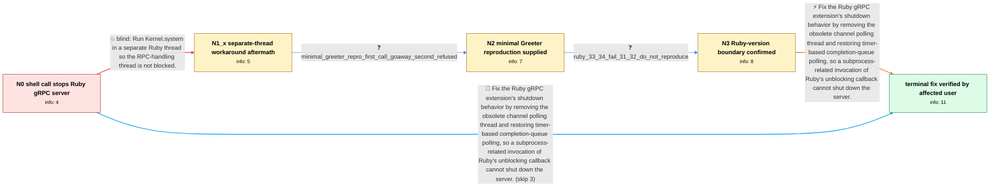

# Review: gh_grpc_grpc_38210

**Kernel.system calls cause server to stop working**

- source: https://github.com/grpc/grpc/issues/38210
- kind: LLM draft (needs review)
- reviewed: `True`
- graph: `data/github_v0/graphs/gh_grpc_grpc_38210.json` · raw thread: `data/github_v0/raw/gh_grpc_grpc_38210.json`

## Opening (body)

> I am using gRPC 1.65.0 or newer with MRI Ruby 3.3.0 or newer on Linux, Linux containers, and macOS. If a server handler calls Kernel.system or executes a command with backticks, the current or following RPC is cancelled and the server stops accepting requests. I included a unit-test reproduction and a GRPC::Cancelled stack trace.

## Satisfaction conditions

1. Must identify the accepted root cause: on newer Ruby versions, subprocess activity can invoke the rb_thread_call_without_gvl unblocking callback, and the affected gRPC Ruby polling path had made that callback initiate server shutdown.
2. Diagnosis must be grounded in the minimal Greeter behavior and Ruby-version boundary: the first call logs GOAWAY, the next is refused, and the issue reproduces on Ruby 3.3/3.4 but not 3.1/3.2.
3. The durable fix must remove the obsolete channel polling thread and restore timer-based completion-queue polling under Event Engine rather than requiring application handlers to remove Kernel.system.
4. Must not present an unsynchronized background Thread.new call as the complete fix, because waiting for the shell result reproduces the failure.
5. Must ask an affected user to verify consecutive shell-calling RPCs on a build containing the fix and must not declare resolution until that verification succeeds.

## Edges

| edge | type | gates / info | payload |
|---|---|---|---|
| `e1_N0__N1_x` | solution_only **BLIND** | req_info: grpc_165_plus_ruby_33_mri_shell_call_stops_server, kernel_system_and_backticks_trigger_issue elements: runs_shell_call_in_separate_thread | Run Kernel.system in a separate Ruby thread so the RPC-handling thread is not blocked. |
| `e2_N1_x__N2` | clarification_only | asks: minimal_greeter_repro_first_call_goaway_second_refused | I can reproduce it with the standard Greeter server by adding Kernel.system('echo "test"') inside say_hello. T |
| `e3_N2__N3` | clarification_only | asks: ruby_33_34_fail_31_32_do_not_reproduce | I checked again and cannot reproduce it on Ruby 3.1 or 3.2; my earlier 3.1 claim was mistaken. Across our affe |
| `e4_N3__N_terminal` | solution_only | req_info: grpc_165_plus_ruby_33_mri_shell_call_stops_server, kernel_system_and_backticks_trigger_issue, separate_thread_fails_when_shell_result_is_awaited, minimal_greeter_repro_first_call_goaway_second_refused, ruby_33_34_fail_31_32_do_not_reproduce elements: identifies_unblocking_callback_triggered_shutdown_as_the_failure, removes_obsolete_channel_polling_thread, restores_timer_based_completion_queue_polling, asks_user_to_verify_on_a_build_containing_the_fix | Fix the Ruby gRPC extension's shutdown behavior by removing the obsolete channel polling thread and restoring timer-based completion-queue polling, so a subprocess-related invocation of Ruby's unblocking callback cannot shut down the server. |
| `e5_N0__N_terminal` | solution_only | req_info: grpc_165_plus_ruby_33_mri_shell_call_stops_server, kernel_system_and_backticks_trigger_issue elements: identifies_unblocking_callback_triggered_shutdown_as_the_failure, removes_obsolete_channel_polling_thread, restores_timer_based_completion_queue_polling, asks_user_to_verify_on_a_build_containing_the_fix | Fix the Ruby gRPC extension's shutdown behavior by removing the obsolete channel polling thread and restoring timer-based completion-queue polling, so a subprocess-related invocation of Ruby's unblocking callback cannot shut down the server. |

## Nodes

| node | terminal | volunteered | images | symptoms |
|---|---|---|---|---|
| `N0` |  | 1 | 0 | With gRPC 1.65.0 or newer and MRI Ruby 3.3.0 or newer, calling Kernel.system or using backticks inside a server handler causes a GRPC::Cance |
| `N1_x` |  | 1 | 0 | If I put the shell call in another thread but wait for its result, the cancellation and server failure reappear. |
| `N2` |  | 1 | 0 | In the minimal Greeter example, the first call returns its greeting but logs a GOAWAY that cancels calls; the second client call then fails  |
| `N3` |  | 0 | 0 | The shell-call tests fail on Ruby 3.3 and 3.4 across Linux and macOS, while I cannot reproduce the failure on Ruby 3.1 or 3.2. |
| `N_terminal` | ✓ | 1 | 0 | On the source-built development gem containing the fix, the functional tests that previously failed after Kernel.system calls now pass on Ru |

## Machine review (audit pass, adversarially verified)

Auditor verdict: **n/a** · 0 of 0 findings survived independent refutation.

__

## Review checklist

> The graph is the case's ANSWER KEY, not a transcript: edge order need
> not mirror thread chronology. Do not file chronology mismatch as a
> defect; what must be faithful is who knew what, when.

Structural (machine-checked by `scripts/validate.py`, re-verify after edits):

- [ ] validates: schema + info-containment + terminal reachability

Semantic (the defect catalog — check each against the source thread):

- [ ] **Faithful blind paths** — every `is_known_blind_path` edge corresponds
  to an attempt actually falsified in the thread (or a brush-off the
  reporter rejected). No invented failures; no ACCEPTED fix mislabeled as
  a blind path (the most common LLM defect class).
- [ ] **Gettable required info** — every id in any `solution.required_info`
  is obtainable: a clarification on some edge, or in the start node's
  info_state, or volunteered (with matching `volunteered_info` text).
  Engineer-only inference belongs in `info_inferred_by_engineer` /
  `inference_hint`, not in hard required_info.
- [ ] **Measurement-class rule** — handler-initiated measurements the user
  executed (bisections, test builds, config probes, version checks) are
  clarification edges, not solutions; their answers state what the
  measurement showed.
- [ ] **No logistics gates** — `required_elements_for_full_match` encode the
  technical diagnostic→fix chain, not release/packaging/scheduling
  remarks the engineer merely mentioned.
- [ ] **Coherent reveals** — each `user_answer_in_this_oncall` is consistent
  with the thread, delivers what it promises, and stays in the user's
  voice (no future knowledge, no diagnosis the user never made).
- [ ] **Symptoms are observations** — `symptoms_visible` contains only what
  the user can see; no causes or advice.
- [ ] **Terminal semantics** — satisfaction_conditions demand root cause +
  evidence grounding + prohibition of falsified moves + user verification;
  the terminal node is the verified-resolved state.
- [ ] **Image assignment** — referenced attachments exist and sit on the
  right hook (opening / node symptom / clarification evidence).
- [ ] **Persona** — matches the reporter's actual expertise and style.

## How to sign off

1. Edit the graph JSON if needed (authored fields only; keep
   `concrete_example` as the factual record).
2. `uv run scripts/validate.py '<graph path>'`
3. Set `metadata.hitl_reviewed: true` in the graph JSON.
4. Re-run `uv run scripts/make_review_docs.py` to refresh this page.
