# Review: gh_grpc_grpc_38538

**Grpc.Tools 2.69.0 and later crash with exit code 139 on Linux ARM64**

- source: https://github.com/grpc/grpc/issues/38538
- kind: LLM draft (needs review)
- reviewed: `True`
- graph: `data/github_v0/graphs/gh_grpc_grpc_38538.json` · raw thread: `data/github_v0/raw/gh_grpc_grpc_38538.json`

```mermaid
flowchart LR
    N0["<b>N0 Linux ARM64 protoc crash reported</b><br/><small>info: 7</small>"]
    N1["<b>N1 direct invocation succeeds</b><br/><small>info: 10</small>"]
    N2["<b>N2 response-file trigger isolated</b><br/><small>info: 14</small>"]
    N2_x["<b>N2_x 2.82 update aftermath</b><br/><small>info: 15</small>"]
    N_terminal["<b>terminal fix shipped and externally confirmed</b><br/><small>info: 18</small>"]
    N0 -.->|"❓ bundled_protoc_direct_command_exits_zero, manual_protocompile_process_simulation_succeeds, official_protoc29_archive_binary_succeeds"| N1
    linkStyle 0 stroke:#3b82f6,stroke-width:2px
    N1 -.->|"❓ minimal_response_file_invocation_segfaults, direct_equivalent_argument_succeeds, response_file_failure_reproduces_across_arm64_distros, grpc_tools_269_through_276_show_response_file_failure"| N2
    linkStyle 1 stroke:#3b82f6,stroke-width:2px
    N2 ==>|"💥 blind: Update to the newly published Grpc.Tools package on the assumption that it already contains the ARM64 fix."| N2_x
    linkStyle 2 stroke:#ef4444,stroke-width:2px
    N2_x ==>|"⚡ Use a Grpc.Tools build containing the actual Linux ARM64 protoc response-file crash fix, then have the affected reporter rebuild and verify that MSBuild's normal @response-file invocation completes."| N_terminal
    linkStyle 3 stroke:#f97316,stroke-width:2px
    class N0 start
    class N1 normal
    class N2 normal
    class N2_x normal
    class N_terminal terminal
    classDef start fill:#fee2e2,stroke:#b91c1c,color:#000
    classDef terminal fill:#dcfce7,stroke:#15803d,color:#000
    classDef normal fill:#fef3c7,stroke:#a16207,color:#000
```

## Opening (body)

> Grpc.Tools 2.68.1 works, but upgrading to 2.69.0 or 2.69.0-pre1 breaks compilation on Debian Linux ARM64 with .NET 8 and .NET 9. The bundled tools/linux_arm64/protoc exits with code 139 from Google.Protobuf.Tools.targets. I expected compilation to pass or documentation explaining what changed and how to address it. Building newer protobuf code with Grpc.Tools 2.68.1 works, and I suspect the build changes from #38084, merged as 367d7e1edb98ecc064e770a065552138d7447eae.

## Satisfaction conditions

1. Must identify the accepted root cause at the level established by the thread: the bundled Linux ARM64 protoc in the affected Grpc.Tools packages crashes while processing @response files, and MSBuild ProtoCompile exercises that path.
2. The diagnosis must be grounded in the collected comparison that 'protoc @r.rsp' returns segmentation fault 139 while the equivalent direct invocation succeeds, including the minimal response file containing only '--version'.
3. Must recommend using a Grpc.Tools build that actually contains the Linux ARM64 protoc response-file fix and ask the user to verify it with the original dotnet build.
4. Must not treat merely updating to the earlier package tested by the reporter as the fix; that package still produced exit code 139.
5. Must not settle on Protobuf.MSBuild.dll, process spawning, proto content, or a generic Debian/GLIBC incompatibility as the final root cause after the response-file-only reproducer is available.
6. May mention downgrading or using an external protoc binary only as a temporary workaround, not as the shipped resolution.
7. Must not declare the original reporter's system verified resolved solely from maintainer testing or another affected operator's confirmation.

## Edges

| edge | type | gates / info | payload |
|---|---|---|---|
| `e1_N0__N1` | clarification_only | asks: bundled_protoc_direct_command_exits_zero, manual_protocompile_process_simulation_succeeds, official_protoc29_archive_binary_succeeds | I copied the full protoc command from the diagnostic log and ran it directly in the container. It completed wi / I wrote a small program that constructs ProtoCompile and also executes the process myself. The simulated execu / I downloaded protoc-29.0-linux-aarch_64.zip and its protoc executes correctly. The two binaries are based on t |
| `e2_N1__N2` | clarification_only | asks: minimal_response_file_invocation_segfaults, direct_equivalent_argument_succeeds, response_file_failure_reproduces_across_arm64_distros, grpc_tools_269_through_276_show_response_file_failure | Yes. I put only '--version' in r.rsp. Running 'protoc @r.rsp' prints 'Segmentation fault' and returns 139, whi / The equivalent direct invocation succeeds repeatedly, including 50 out of 50 runs and under load. Only the @fi / I reproduced the same result on ARM64 Ubuntu 24.04 and Azure Linux 3.0. Changing environment variables, signal / Grpc.Tools 2.68.1 and 2.67.0 work. The bundled libprotoc 29.x binaries in Grpc.Tools 2.69 through 2.76 segfaul |
| `e3_N2__N2_x` | solution_only **BLIND** | req_info: grpc_tools_269_linux_arm64_protoc_exits_139 elements: recommends_trying_the_then_current_package_as_if_it_contains_the_fix | Update to the newly published Grpc.Tools package on the assumption that it already contains the ARM64 fix. |
| `e4_N2_x__terminal` | solution_only | req_info: grpc_tools_2681_compiles_on_linux_arm64, grpc_tools_269_linux_arm64_protoc_exits_139, bundled_protoc_direct_command_exits_zero, official_protoc29_archive_binary_succeeds, minimal_response_file_invocation_segfaults, direct_equivalent_argument_succeeds, grpc_tools_269_through_276_show_response_file_failure, grpc_tools_282_still_exits_139 elements: identifies_the_failure_as_specific_to_response_file_handling_in_the_bundled_linux_arm64_protoc, recommends_a_grpc_tools_build_containing_the_arm64_protoc_fix, asks_user_to_verify_with_the_original_dotnet_build_on_linux_arm64, does_not_declare_the_original_reporter_resolved_without_their_retest | Use a Grpc.Tools build containing the actual Linux ARM64 protoc response-file crash fix, then have the affected reporter rebuild and verify that MSBuild's normal @response-file invocation completes. |

## Nodes

| node | terminal | volunteered | images | symptoms |
|---|---|---|---|---|
| `N0` |  | 3 | 0 | After upgrading from Grpc.Tools 2.68.1 to 2.69.0 or 2.69.0-pre1, my Debian ARM64 builds fail because tools/linux_arm64/protoc exits with cod |
| `N1` |  | 0 | 0 | The build still reports that the bundled Linux ARM64 protoc exited with code 139, although I can run the logged protoc command directly with |
| `N2` |  | 0 | 0 | With the affected bundled ARM64 protoc, running protoc --version succeeds, but putting only --version in a response file and running protoc  |
| `N2_x` |  | 1 | 0 | After installing Grpc.Tools 2.82.0, my Linux ARM64 build still fails in Google.Protobuf.Tools.targets because the bundled protoc exits with  |
| `N_terminal` | ✓ | 3 | 0 | A maintainer reports that the fixed package works on an aarch64 Linux machine, and another affected user confirms that Grpc.Tools 2.83.0 fix |

## Machine review (audit pass, adversarially verified)

Auditor verdict: **n/a** · 0 of 0 findings survived independent refutation.

__

## Review checklist

> The graph is the case's ANSWER KEY, not a transcript: edge order need
> not mirror thread chronology. Do not file chronology mismatch as a
> defect; what must be faithful is who knew what, when.

Structural (machine-checked by `scripts/validate.py`, re-verify after edits):

- [ ] validates: schema + info-containment + terminal reachability

Semantic (the defect catalog — check each against the source thread):

- [ ] **Faithful blind paths** — every `is_known_blind_path` edge corresponds
  to an attempt actually falsified in the thread (or a brush-off the
  reporter rejected). No invented failures; no ACCEPTED fix mislabeled as
  a blind path (the most common LLM defect class).
- [ ] **Gettable required info** — every id in any `solution.required_info`
  is obtainable: a clarification on some edge, or in the start node's
  info_state, or volunteered (with matching `volunteered_info` text).
  Engineer-only inference belongs in `info_inferred_by_engineer` /
  `inference_hint`, not in hard required_info.
- [ ] **Measurement-class rule** — handler-initiated measurements the user
  executed (bisections, test builds, config probes, version checks) are
  clarification edges, not solutions; their answers state what the
  measurement showed.
- [ ] **No logistics gates** — `required_elements_for_full_match` encode the
  technical diagnostic→fix chain, not release/packaging/scheduling
  remarks the engineer merely mentioned.
- [ ] **Coherent reveals** — each `user_answer_in_this_oncall` is consistent
  with the thread, delivers what it promises, and stays in the user's
  voice (no future knowledge, no diagnosis the user never made).
- [ ] **Symptoms are observations** — `symptoms_visible` contains only what
  the user can see; no causes or advice.
- [ ] **Terminal semantics** — satisfaction_conditions demand root cause +
  evidence grounding + prohibition of falsified moves + user verification;
  the terminal node is the verified-resolved state.
- [ ] **Image assignment** — referenced attachments exist and sit on the
  right hook (opening / node symptom / clarification evidence).
- [ ] **Persona** — matches the reporter's actual expertise and style.

## How to sign off

1. Edit the graph JSON if needed (authored fields only; keep
   `concrete_example` as the factual record).
2. `uv run scripts/validate.py '<graph path>'`
3. Set `metadata.hitl_reviewed: true` in the graph JSON.
4. Re-run `uv run scripts/make_review_docs.py` to refresh this page.
