# Review: gh_haproxy_haproxy_2004

**QUIC protocol error with Chrome-based browsers**

- source: https://github.com/haproxy/haproxy/issues/2004
- kind: LLM draft (needs review)
- reviewed: `False`
- graph: `data/github_v0/graphs/gh_haproxy_haproxy_2004.json` · raw thread: `data/github_v0/raw/gh_haproxy_haproxy_2004.json`

```mermaid
flowchart LR
    N0["<b>N0 Chromium QUIC image failures reported</b><br/><small>info: 6</small>"]
    N1["<b>N1 complete QUIC trace supplied</b><br/><small>info: 7</small>"]
    N2_x["<b>N2_x first candidate build still fails</b><br/><small>info: 9</small>"]
    N3["<b>N3 combined protocol and mux traces collected</b><br/><small>info: 10</small>"]
    N4_x["<b>N4_x mux candidate improves frequency but does not resolve</b><br/><small>info: 13</small>"]
    N5["<b>N5 updated candidates fail and local reproducer supplied</b><br/><small>info: 17</small>"]
    N_terminal["<b>N_terminal development reproducer fixed</b><br/><small>info: 20</small>"]
    N0 -.->|"❓ unfiltered_haring_trace_with_transport_parameter_lines"| N1
    linkStyle 0 stroke:#3b82f6,stroke-width:2px
    N1 -.->|"❓ control_stream_stop_sending_candidate_still_errors"| N2_x
    linkStyle 1 stroke:#3b82f6,stroke-width:2px
    N2_x -.->|"❓ combined_quic_qmux_h3_developer_traces_shared"| N3
    linkStyle 2 stroke:#3b82f6,stroke-width:2px
    N3 -.->|"❓ first_mux_candidate_reduces_errors_but_causes_stalls, stalls_followed_by_h2_fallback, dev_lb_has_no_cpu_memory_or_udp_pressure"| N4_x
    linkStyle 3 stroke:#3b82f6,stroke-width:2px
    N4_x -.->|"❓ updated_candidate_one_produces_early_handshake_failures, updated_candidate_two_stalls_then_handshake_failures, local_proxy_reproducer_shared_with_intermittent_results"| N5
    linkStyle 4 stroke:#3b82f6,stroke-width:2px
    N5 ==>|"⚡ Apply the final pair of HAProxy QUIC/mux fixes that remove or reduce unjustified RESET_STREAM emission, then have the reporter repeat the previously failing Chromium image-grid reproducer on a build containing both fixes."| N_terminal
    linkStyle 5 stroke:#f97316,stroke-width:2px
    class N0 start
    class N1 normal
    class N2_x normal
    class N3 normal
    class N4_x normal
    class N5 normal
    class N_terminal terminal
    classDef start fill:#fee2e2,stroke:#b91c1c,color:#000
    classDef terminal fill:#dcfce7,stroke:#15803d,color:#000
    classDef normal fill:#fef3c7,stroke:#a16207,color:#000
```

## Opening (body)

> On our development environment with QUIC enabled, images regularly fail in Chromium-based browsers with `net::ERR_QUIC_PROTOCOL_ERROR 200`. After this happens, the browser may refuse to use QUIC with our origin for a while. The best reproducer is to start Chromium while forcing QUIC for the origin, open a page containing many images, switch to the grid view so larger thumbnails load, and paginate until it occurs, usually within one or two pages. Plain HTML and smaller payloads do not trigger it as regularly. I included QUIC traces, the relevant HAProxy configuration, and `haproxy -vv` output. The affected build is HAProxy 2.8-dev1-86aac23 with an HTTP/3 QUIC bind using `allow-0rtt` and `shards by-thread`.

## Satisfaction conditions

1. Must identify the final accepted cause as HAProxy emitting spurious or unjustified RESET_STREAM frames in the QUIC/mux path, grounded in the combined traces and the behavior of the candidate builds.
2. Must recommend using a build containing both finalized stream-reset fixes, not treating the earlier control-stream STOP_SENDING change or either experimental mux patch as a complete resolution.
3. Must account for the falsified attempts: the first candidate left the original protocol errors unchanged, the next candidate only reduced their frequency while introducing stalls and HTTP/2 fallback, and the updated variants produced stalls or reported handshake failures.
4. Must ask the reporter to repeat the Chromium image-grid reproducer on a build containing both final fixes before declaring the reproduced case resolved.
5. Resolution must remain appropriately qualified: the reporter confirmed that the previous development reproducer stopped failing, but did not have comprehensive production monitoring to prove that every intermittent end-user case was eliminated.

## Edges

| edge | type | gates / info | payload |
|---|---|---|---|
| `e1_N0__N1` | clarification_only | asks: unfiltered_haring_trace_with_transport_parameter_lines | I originally ran `haring -f haproxy-quic \| grep 'T11:17'`, but it turns out some lines are not time-prefixed.  |
| `e2_N1__N2_x` | clarification_only | asks: control_stream_stop_sending_candidate_still_errors | Unfortunately it still happens. I uploaded another trace from the failed run. |
| `e3_N2_x__N3` | clarification_only | asks: combined_quic_qmux_h3_developer_traces_shared | I enabled the requested qmux and h3 developer traces with the QUIC trace and uploaded the resulting capture. |
| `e4_N3__N4_x` | clarification_only | asks: first_mux_candidate_reduces_errors_but_causes_stalls, stalls_followed_by_h2_fallback, dev_lb_has_no_cpu_memory_or_udp_pressure | With the patch, the errors are much less frequent: about once every 150 images instead of once every 30. Howev / Yes. The network panel clearly shows batches of requests stalling for about 10 seconds, then QUIC protocol err / This is a nearly idle development VM. Its CPU and UDP statistics show no CPU or memory pressure and no UDP err |
| `e5_N4_x__N5` | clarification_only | asks: updated_candidate_one_produces_early_handshake_failures, updated_candidate_two_stalls_then_handshake_failures, local_proxy_reproducer_shared_with_intermittent_results | Option 1 failed almost immediately. Chromium reported QUIC handshake failures within the first 11 requests, in / Option 2 started well with about 220 good fetches. Then one or two requests stalled for around five seconds, a / I shared a hacky HAProxy configuration that proxies our development site through local HAProxy. It requires `/ |
| `e6_N5__N_terminal` | solution_only | req_info: chromium_images_fail_with_err_quic_protocol_error_200, browser_temporarily_stops_using_quic_after_errors, large_image_grid_pagination_reproduces_quickly, dev_lb_has_no_cpu_memory_or_udp_pressure, unfiltered_haring_trace_with_transport_parameter_lines, combined_quic_qmux_h3_developer_traces_shared, control_stream_stop_sending_candidate_still_errors, first_mux_candidate_reduces_errors_but_causes_stalls, stalls_followed_by_h2_fallback, updated_candidate_one_produces_early_handshake_failures, updated_candidate_two_stalls_then_handshake_failures, local_proxy_reproducer_shared_with_intermittent_results elements: identifies_unjustified_reset_stream_emission_as_the_accepted_cause, applies_both_finalized_quic_mux_corrections_rather_than_the_earlier_experimental_candidates, asks_user_to_verify_on_a_build_containing_both_fixes, acknowledges_that_long_term_production_confirmation_is_limited | Apply the final pair of HAProxy QUIC/mux fixes that remove or reduce unjustified RESET_STREAM emission, then have the reporter repeat the previously failing Chromium image-grid reproducer on a build containing both fixes. |

## Nodes

| node | terminal | volunteered | images | symptoms |
|---|---|---|---|---|
| `N0` |  | 1 | 0 | Images regularly fail in Chromium with `net::ERR_QUIC_PROTOCOL_ERROR 200`, usually after one or two pages of large grid thumbnails. After en |
| `N1` |  | 0 | 0 | The image failures still occur while the browser remains open, and the trace contains two apparent events around 09:26–09:29. |
| `N2_x` |  | 1 | 0 | The same QUIC protocol errors still occur with the first candidate build. HAProxy logs the affected requests at error level even though thei |
| `N3` |  | 0 | 0 | The Chromium image requests continue to fail while QUIC, qmux, and HTTP/3 developer tracing are enabled. |
| `N4_x` |  | 1 | 0 | With the attached mux candidate, errors fall from about one per 30 images to about one per 150 images, but some requests stall for 4–10 seco |
| `N5` |  | 1 | 0 | One updated candidate starts showing reported QUIC handshake failures within the first 11 image requests. The other handles roughly 220 fetc |
| `N_terminal` | ✓ | 2 | 0 | After testing a build containing the two final fixes, my previous development-environment reproducer no longer triggers the QUIC image failu |

## Machine review (audit pass, adversarially verified)

Auditor verdict: **n/a** · 0 of 0 findings survived independent refutation.

__

## Review checklist

> The graph is the case's ANSWER KEY, not a transcript: edge order need
> not mirror thread chronology. Do not file chronology mismatch as a
> defect; what must be faithful is who knew what, when.

Structural (machine-checked by `scripts/validate.py`, re-verify after edits):

- [ ] validates: schema + info-containment + terminal reachability

Semantic (the defect catalog — check each against the source thread):

- [ ] **Faithful blind paths** — every `is_known_blind_path` edge corresponds
  to an attempt actually falsified in the thread (or a brush-off the
  reporter rejected). No invented failures; no ACCEPTED fix mislabeled as
  a blind path (the most common LLM defect class).
- [ ] **Gettable required info** — every id in any `solution.required_info`
  is obtainable: a clarification on some edge, or in the start node's
  info_state, or volunteered (with matching `volunteered_info` text).
  Engineer-only inference belongs in `info_inferred_by_engineer` /
  `inference_hint`, not in hard required_info.
- [ ] **Measurement-class rule** — handler-initiated measurements the user
  executed (bisections, test builds, config probes, version checks) are
  clarification edges, not solutions; their answers state what the
  measurement showed.
- [ ] **No logistics gates** — `required_elements_for_full_match` encode the
  technical diagnostic→fix chain, not release/packaging/scheduling
  remarks the engineer merely mentioned.
- [ ] **Coherent reveals** — each `user_answer_in_this_oncall` is consistent
  with the thread, delivers what it promises, and stays in the user's
  voice (no future knowledge, no diagnosis the user never made).
- [ ] **Symptoms are observations** — `symptoms_visible` contains only what
  the user can see; no causes or advice.
- [ ] **Terminal semantics** — satisfaction_conditions demand root cause +
  evidence grounding + prohibition of falsified moves + user verification;
  the terminal node is the verified-resolved state.
- [ ] **Image assignment** — referenced attachments exist and sit on the
  right hook (opening / node symptom / clarification evidence).
- [ ] **Persona** — matches the reporter's actual expertise and style.

## How to sign off

1. Edit the graph JSON if needed (authored fields only; keep
   `concrete_example` as the factual record).
2. `uv run scripts/validate.py '<graph path>'`
3. Set `metadata.hitl_reviewed: true` in the graph JSON.
4. Re-run `uv run scripts/make_review_docs.py` to refresh this page.
