# Review: gh_haproxy_haproxy_2046

**Irregular CPU load spikes with HAProxy 2.7.2**

- source: https://github.com/haproxy/haproxy/issues/2046
- kind: LLM draft (needs review)
- reviewed: `True`
- graph: `data/github_v0/graphs/gh_haproxy_haproxy_2046.json` · raw thread: `data/github_v0/raw/gh_haproxy_haproxy_2046.json`

```mermaid
flowchart LR
    N0["<b>N0 irregular production CPU spikes reported</b><br/><small>info: 9</small>"]
    N1["<b>N1 activity counters captured</b><br/><small>info: 10</small>"]
    N2["<b>N2 spinning-worker evidence collected</b><br/><small>info: 16</small>"]
    N2_x["<b>N2_x old-worker theory aftermath</b><br/><small>info: 17</small>"]
    N3["<b>N3 rollback removes the production symptom</b><br/><small>info: 17</small>"]
    N_terminal["<b>terminal fixed release verified in production</b><br/><small>info: 21</small>"]
    N0 -.->|"❓ show_info_activity_pair_from_hogging_process"| N1
    linkStyle 0 stroke:#3b82f6,stroke-width:2px
    N1 -.->|"❓ show_tasks_lists_h1_ssl_and_connection_callbacks, show_fd_and_anonymized_sessions_from_spiking_workers"| N2
    linkStyle 1 stroke:#3b82f6,stroke-width:2px
    N2 ==>|"💥 blind: Attribute the CPU usage to frequent reloads leaving old workers that continue running backend health checks."| N2_x
    linkStyle 2 stroke:#ef4444,stroke-width:2px
    N2 ==>|"⚡ Temporarily roll production back to the known-stable HAProxy 2.6 line to stop the CPU spikes while the 2.7 defect is diagnosed."| N3
    linkStyle 3 stroke:#f97316,stroke-width:2px
    N2_x ==>|"⚡ After the old-worker theory is contradicted, temporarily roll production back to the known-stable HAProxy 2.6 line while the current-worker spin is diagnosed."| N3
    linkStyle 4 stroke:#f97316,stroke-width:2px
    N3 ==>|"⚡ Deploy a fixed HAProxy 2.7 build containing the H1 multiplexer error-handling correction, which stops errored TLS/H1 connections from remaining runnable and spinning, then verify the production CPU pattern."| N_terminal
    linkStyle 5 stroke:#f97316,stroke-width:2px
    class N0 start
    class N1 normal
    class N2 normal
    class N2_x normal
    class N3 normal
    class N_terminal terminal
    classDef start fill:#fee2e2,stroke:#b91c1c,color:#000
    classDef terminal fill:#dcfce7,stroke:#15803d,color:#000
    classDef normal fill:#fef3c7,stroke:#a16207,color:#000
```

## Opening (body)

> After upgrading our HAProxy load balancers from 2.6.7 to 2.7.2, CPU usage became highly irregular even though requests, sessions, and connection metrics did not change significantly. Individual HAProxy processes sometimes consume more than 300% CPU, and each roughly 25% jump corresponds to one core on our four-core VMs. We run one four-thread HAProxy worker and reload with SIGUSR2 when updating the crt-list, so old processes may coexist, but a single process can exhibit the spike by itself while the CLI still reports more than 50% idle. Perf shows substantial crypto and scheduler-related activity. The pattern is strongest on Azure but appears on other providers. An isolated Jammy/OpenSSL 3 deployment still used about 80% per core but did not reproduce the production spike pattern.

## Satisfaction conditions

1. Must identify the accepted root cause: an SSL transport error could leave an H1 connection without the corresponding socket shutdown state, so the H1 multiplexer waited while connection callbacks repeatedly woke and consumed a core.
2. Diagnosis must be grounded in the collected activity, task, FD, session, and strace evidence, including the recurring H1/SSL/connection callbacks and errored frontend connections during low traffic.
3. Must not attribute the primary spike to accumulated old workers or their health checks; the affected operators observed one current worker consuming the CPU while old workers remained quiet, including on a single-worker VM.
4. A rollback to the stable 2.6 deployment may be offered as a temporary mitigation, but the durable resolution is a fixed 2.7 build containing the H1 multiplexer error-handling correction.
5. Must ask the affected user to verify the production load pattern on a build containing the fix before declaring the issue resolved.
6. Must not conflate the later spinning-stream crashes reported after this issue was resolved with the original CPU-spike defect; maintainers explicitly treated them as a separate problem.

## Edges

| edge | type | gates / info | payload |
|---|---|---|---|
| `e1_N0__N1` | clarification_only | asks: show_info_activity_pair_from_hogging_process | I selected the HAProxy process that was hogging a full core and ran the two CLI queries ten seconds apart. Bot |
| `e2_N1__N2` | clarification_only | asks: show_tasks_lists_h1_ssl_and_connection_callbacks, show_fd_and_anonymized_sessions_from_spiking_workers | I ran it several times at 100% CPU. The output alternates between small sets containing h1_io_cb, ssl_sock_io_ / I collected show fd and anonymized show sess all dumps from the affected workers. One later capture had more t |
| `e3_N2__N2_x` | solution_only **BLIND** | req_info: frequent_sigusr2_reloads_allow_old_workers elements: attributes_spikes_to_old_workers_or_health_checks | Attribute the CPU usage to frequent reloads leaving old workers that continue running backend health checks. |
| `e4_N2__N3` | solution_only | req_info: cpu_spikes_started_after_2_6_7_to_2_7_2_upgrade, single_current_worker_consumes_cpu_while_old_workers_remain_quiet, show_info_activity_pair_from_hogging_process, show_tasks_lists_h1_ssl_and_connection_callbacks elements: proposes_temporary_rollback_to_known_stable_2_6_build, asks_to_compare_the_cpu_pattern_after_rollback | Temporarily roll production back to the known-stable HAProxy 2.6 line to stop the CPU spikes while the 2.7 defect is diagnosed. |
| `e5_N2_x__N3` | solution_only | req_info: cpu_spikes_started_after_2_6_7_to_2_7_2_upgrade, old_worker_health_check_theory_rejected, single_current_worker_consumes_cpu_while_old_workers_remain_quiet, show_tasks_lists_h1_ssl_and_connection_callbacks elements: abandons_old_worker_explanation, proposes_temporary_rollback_to_known_stable_2_6_build | After the old-worker theory is contradicted, temporarily roll production back to the known-stable HAProxy 2.6 line while the current-worker spin is diagnosed. |
| `e6_N3__terminal` | solution_only | req_info: cpu_spikes_started_after_2_6_7_to_2_7_2_upgrade, rollback_to_2_6_9_removes_cpu_spikes, strace_repeats_clock_gettime_and_zero_timeout_epoll_wait, single_current_worker_consumes_cpu_while_old_workers_remain_quiet, show_info_activity_pair_from_hogging_process, show_tasks_lists_h1_ssl_and_connection_callbacks, show_fd_and_anonymized_sessions_from_spiking_workers elements: identifies_errored_tls_h1_connections_as_the_spinning_tasks, explains_missing_socket_shutdown_or_equivalent_terminal_error_handling, recommends_a_fixed_2_7_build_containing_the_h1_multiplexer_fix, asks_user_to_verify_on_a_build_containing_the_fix | Deploy a fixed HAProxy 2.7 build containing the H1 multiplexer error-handling correction, which stops errored TLS/H1 connections from remaining runnable and spinning, then verify the production CPU pattern. |

## Nodes

| node | terminal | volunteered | images | symptoms |
|---|---|---|---|---|
| `N0` |  | 2 | 1 | Since upgrading from HAProxy 2.6.7 to 2.7.2, CPU usage moves between irregular levels and sometimes reaches 100% on all four cores even thou |
| `N1` |  | 0 | 0 | The selected HAProxy process continues to occupy a full core even though its two CLI samples ten seconds apart show Idle_pct 78 and very lit |
| `N2` |  | 4 | 5 | During a spike, strace repeatedly prints clock_gettime calls and epoll_wait calls that immediately return with no events. HATop shows hundre |
| `N2_x` |  | 1 | 0 | The CPU remains pinned in one or two current workers; old workers do not consume significant CPU, and the spike also occurs when only one wo |
| `N3` |  | 1 | 1 | After reverting the deployment to HAProxy 2.6.9, the irregular CPU levels and pinned-core behavior are gone and the load graph is stable aga |
| `N_terminal` | ✓ | 1 | 0 | After upgrading production to HAProxy 2.7.5, our CPU load pattern looks normal and the irregular pinned-core spikes no longer occur. |

## Machine review (audit pass, adversarially verified)

Auditor verdict: **n/a** · 0 of 0 findings survived independent refutation.

__

## Review checklist

> The graph is the case's ANSWER KEY, not a transcript: edge order need
> not mirror thread chronology. Do not file chronology mismatch as a
> defect; what must be faithful is who knew what, when.

Structural (machine-checked by `scripts/validate.py`, re-verify after edits):

- [ ] validates: schema + info-containment + terminal reachability

Semantic (the defect catalog — check each against the source thread):

- [ ] **Faithful blind paths** — every `is_known_blind_path` edge corresponds
  to an attempt actually falsified in the thread (or a brush-off the
  reporter rejected). No invented failures; no ACCEPTED fix mislabeled as
  a blind path (the most common LLM defect class).
- [ ] **Gettable required info** — every id in any `solution.required_info`
  is obtainable: a clarification on some edge, or in the start node's
  info_state, or volunteered (with matching `volunteered_info` text).
  Engineer-only inference belongs in `info_inferred_by_engineer` /
  `inference_hint`, not in hard required_info.
- [ ] **Measurement-class rule** — handler-initiated measurements the user
  executed (bisections, test builds, config probes, version checks) are
  clarification edges, not solutions; their answers state what the
  measurement showed.
- [ ] **No logistics gates** — `required_elements_for_full_match` encode the
  technical diagnostic→fix chain, not release/packaging/scheduling
  remarks the engineer merely mentioned.
- [ ] **Coherent reveals** — each `user_answer_in_this_oncall` is consistent
  with the thread, delivers what it promises, and stays in the user's
  voice (no future knowledge, no diagnosis the user never made).
- [ ] **Symptoms are observations** — `symptoms_visible` contains only what
  the user can see; no causes or advice.
- [ ] **Terminal semantics** — satisfaction_conditions demand root cause +
  evidence grounding + prohibition of falsified moves + user verification;
  the terminal node is the verified-resolved state.
- [ ] **Image assignment** — referenced attachments exist and sit on the
  right hook (opening / node symptom / clarification evidence).
- [ ] **Persona** — matches the reporter's actual expertise and style.

## How to sign off

1. Edit the graph JSON if needed (authored fields only; keep
   `concrete_example` as the factual record).
2. `uv run scripts/validate.py '<graph path>'`
3. Set `metadata.hitl_reviewed: true` in the graph JSON.
4. Re-run `uv run scripts/make_review_docs.py` to refresh this page.
