# Review: gh_haproxy_haproxy_2247

**QUIC - ha_panic in quic_pktns_tx_pkts_release->...->eb_walk_down**

- source: https://github.com/haproxy/haproxy/issues/2247
- kind: LLM draft (needs review)
- reviewed: `True`
- graph: `data/github_v0/graphs/gh_haproxy_haproxy_2247.json` · raw thread: `data/github_v0/raw/gh_haproxy_haproxy_2247.json`

```mermaid
flowchart LR
    N0["<b>N0 QUIC crash reported</b><br/><small>info: 4</small>"]
    N1["<b>N1 requested crash evidence collected</b><br/><small>info: 6</small>"]
    N2["<b>N2 first ASAN failure captured</b><br/><small>info: 8</small>"]
    N2_x["<b>N2_x crash after first patch</b><br/><small>info: 10</small>"]
    N3["<b>N3 continuing crash evidence collected</b><br/><small>info: 13</small>"]
    N4["<b>N4 final candidate tested</b><br/><small>info: 14</small>"]
    N_terminal["<b>N_terminal QUIC crash resolved</b><br/><small>info: 16</small>"]
    N0 -.->|"❓ gdb_qc_state_7_flags_100763736, nonmerged_pools_still_show_quic_release_crashes"| N1
    linkStyle 0 stroke:#3b82f6,stroke-width:2px
    N1 -.->|"❓ first_asan_report_quic_conn_release_heap_overflow"| N2
    linkStyle 1 stroke:#3b82f6,stroke-width:2px
    N2 ==>|"💥 blind: Guard QUIC connection release against a negative file descriptor when per-connection socket ownership is not effective."| N2_x
    linkStyle 2 stroke:#ef4444,stroke-width:2px
    N2_x -.->|"❓ second_asan_reports_qc_snd_buf_heap_overflow, pool_log_tag_mismatch_in_quic_conn_release"| N3
    linkStyle 3 stroke:#3b82f6,stroke-width:2px
    N3 -.->|"❓ final_candidate_stable_for_two_hours"| N4
    linkStyle 4 stroke:#3b82f6,stroke-width:2px
    N4 ==>|"⚡ Fix the remaining QUIC crash by preventing the send-failure path from acting on a released full QUIC connection after it has been replaced by the lighter closing-connection object, then require production verification before declaring the issue resolved."| N_terminal
    linkStyle 5 stroke:#f97316,stroke-width:2px
    class N0 start
    class N1 normal
    class N2 normal
    class N2_x normal
    class N3 normal
    class N4 normal
    class N_terminal terminal
    classDef start fill:#fee2e2,stroke:#b91c1c,color:#000
    classDef terminal fill:#dcfce7,stroke:#15803d,color:#000
    classDef normal fill:#fef3c7,stroke:#a16207,color:#000
```

## Opening (body)

> HAProxy crashes, apparently around QUIC. I expected it not to crash. I am running HAProxy 2.9-dev2-624979c+mangadex-6bfe2eb on Linux 5.15 with QUIC enabled, OpenSSL 1.1.1u+quic, multi-threading, DEBUG_MEMORY_POOLS and DEBUG_STRICT. My configuration is otherwise as usual.

## Satisfaction conditions

1. Must identify the final accepted root cause: after the full quic_conn was released and replaced by a lighter quic_cc_conn, a failed sendto() path could still act on the released connection and flag it for killing, causing memory corruption and QUIC crashes.
2. The diagnosis must be grounded in the collected ASAN reports, pool tag-mismatch output and repeated cores, rather than inferred from the initial QUIC backtrace alone.
3. Must not claim that guarding qc->fd when it is negative fully resolves the issue; that first patch fixed a real bug, but the reporter reproduced further crashes after installing it.
4. The final correction must address the released-connection lifetime/send-failure path and preserve the earlier negative-fd protection.
5. Must require verification on a build containing the final lifetime fix and must not declare resolution until the reporter confirms production stability under the previously crashing workload.

## Edges

| edge | type | gates / info | payload |
|---|---|---|---|
| `e1_N0__N1` | clarification_only | asks: gdb_qc_state_7_flags_100763736, nonmerged_pools_still_show_quic_release_crashes | In the relevant frame, `p qc->state` prints 7 and `p qc->flags` prints 100763736. / I am now running with non-merged pools. I still get crashes, mostly through qc_parse_ack_frm, qc_ackrng_pkts,  |
| `e2_N1__N2` | clarification_only | asks: first_asan_report_quic_conn_release_heap_overflow | On current master, my ASAN build aborts within milliseconds. It reports `heap-buffer-overflow`, `WRITE of size |
| `e3_N2__N2_x` | solution_only **BLIND** | req_info: socket_owner_configured_connection_but_effectively_listener, first_asan_report_quic_conn_release_heap_overflow elements: guards_quic_release_when_fd_is_negative, relates_first_overflow_to_ineffective_per_connection_socket_ownership | Guard QUIC connection release against a negative file descriptor when per-connection socket ownership is not effective. |
| `e4_N2_x__N3` | clarification_only | asks: second_asan_reports_qc_snd_buf_heap_overflow, pool_log_tag_mismatch_in_quic_conn_release | The new ASAN report is a `READ of size 8` heap-buffer-overflow in `qc_snd_buf` at `src/quic_sock.c:652`, calle / Yes. It says `FATAL: pool inconsistency detected in thread 2: tag mismatch on free()`. The caller is `quic_con |
| `e5_N3__N4` | clarification_only | asks: final_candidate_stable_for_two_hours | I took it for a spin. It was still stable after 25 minutes and then after two hours, so I made a proper produc |
| `e6_N4__N_terminal` | solution_only | req_info: haproxy_quic_process_crashes, first_patch_did_not_stop_all_crashes, second_asan_reports_qc_snd_buf_heap_overflow, pool_log_tag_mismatch_in_quic_conn_release, final_candidate_stable_for_two_hours elements: identifies_send_failure_after_quic_conn_release_as_the_remaining_trigger, prevents_access_or_kill_flagging_of_the_replaced_full_connection, does_not_treat_the_negative_fd_guard_alone_as_complete, asks_user_to_verify_on_a_build_containing_the_lifetime_fix | Fix the remaining QUIC crash by preventing the send-failure path from acting on a released full QUIC connection after it has been replaced by the lighter closing-connection object, then require production verification before declaring the issue resolved. |

## Nodes

| node | terminal | volunteered | images | symptoms |
|---|---|---|---|---|
| `N0` |  | 0 | 0 | My HAProxy process crashes with a backtrace involving QUIC packet release and eb_walk_down. |
| `N1` |  | 0 | 0 | With non-merged pools enabled, I still get crashes in paths such as qc_parse_ack_frm, qc_ackrng_pkts, qc_treat_acked_tx_frm and qc_release_f |
| `N2` |  | 1 | 0 | An ASAN build aborts within milliseconds of startup with an eight-byte heap-buffer-overflow write in quic_conn_release. |
| `N2_x` |  | 1 | 0 | After installing the first patch, one ASAN instance ran for two hours, but HAProxy then crashed again in __pool_free. |
| `N3` |  | 1 | 0 | The patched build still aborts after a few minutes. ASAN reports an out-of-bounds read in qc_snd_buf, and the pool diagnostics report a tag  |
| `N4` |  | 0 | 0 | With the second candidate patch, the ASAN build remains stable for two hours, including long enough for me to proceed with a production depl |
| `N_terminal` | ✓ | 1 | 0 | The production deployment is much more stable and the QUIC connection-release crashes from this issue no longer occur; the few remaining cra |

## Machine review (audit pass, adversarially verified)

Auditor verdict: **n/a** · 0 of 0 findings survived independent refutation.

__

## Review checklist

> The graph is the case's ANSWER KEY, not a transcript: edge order need
> not mirror thread chronology. Do not file chronology mismatch as a
> defect; what must be faithful is who knew what, when.

Structural (machine-checked by `scripts/validate.py`, re-verify after edits):

- [ ] validates: schema + info-containment + terminal reachability

Semantic (the defect catalog — check each against the source thread):

- [ ] **Faithful blind paths** — every `is_known_blind_path` edge corresponds
  to an attempt actually falsified in the thread (or a brush-off the
  reporter rejected). No invented failures; no ACCEPTED fix mislabeled as
  a blind path (the most common LLM defect class).
- [ ] **Gettable required info** — every id in any `solution.required_info`
  is obtainable: a clarification on some edge, or in the start node's
  info_state, or volunteered (with matching `volunteered_info` text).
  Engineer-only inference belongs in `info_inferred_by_engineer` /
  `inference_hint`, not in hard required_info.
- [ ] **Measurement-class rule** — handler-initiated measurements the user
  executed (bisections, test builds, config probes, version checks) are
  clarification edges, not solutions; their answers state what the
  measurement showed.
- [ ] **No logistics gates** — `required_elements_for_full_match` encode the
  technical diagnostic→fix chain, not release/packaging/scheduling
  remarks the engineer merely mentioned.
- [ ] **Coherent reveals** — each `user_answer_in_this_oncall` is consistent
  with the thread, delivers what it promises, and stays in the user's
  voice (no future knowledge, no diagnosis the user never made).
- [ ] **Symptoms are observations** — `symptoms_visible` contains only what
  the user can see; no causes or advice.
- [ ] **Terminal semantics** — satisfaction_conditions demand root cause +
  evidence grounding + prohibition of falsified moves + user verification;
  the terminal node is the verified-resolved state.
- [ ] **Image assignment** — referenced attachments exist and sit on the
  right hook (opening / node symptom / clarification evidence).
- [ ] **Persona** — matches the reporter's actual expertise and style.

## How to sign off

1. Edit the graph JSON if needed (authored fields only; keep
   `concrete_example` as the factual record).
2. `uv run scripts/validate.py '<graph path>'`
3. Set `metadata.hitl_reviewed: true` in the graph JSON.
4. Re-run `uv run scripts/make_review_docs.py` to refresh this page.
