# Review: gh_haproxy_haproxy_2562

**Reg-tests timeouts**

- source: https://github.com/haproxy/haproxy/issues/2562
- kind: LLM draft (needs review)
- reviewed: `True`
- graph: `data/github_v0/graphs/gh_haproxy_haproxy_2562.json` · raw thread: `data/github_v0/raw/gh_haproxy_haproxy_2562.json`

```mermaid
flowchart LR
    N0["<b>N0 recurring reg-test timeouts reported</b><br/><small>info: 5</small>"]
    N1["<b>N1 CI-environment dependence established</b><br/><small>info: 8</small>"]
    N2_x["<b>N2_x updated-vtest aftermath</b><br/><small>info: 9</small>"]
    N3["<b>N3 shutdown behavior captured</b><br/><small>info: 12</small>"]
    N4["<b>N4 signal-path experiment succeeds</b><br/><small>info: 14</small>"]
    N4_x["<b>N4_x init-wrapper aftermath</b><br/><small>info: 15</small>"]
    N5["<b>N5 backgrounded execution context identified</b><br/><small>info: 16</small>"]
    N_terminal["<b>terminal CI timeouts resolved</b><br/><small>info: 20</small>"]
    N0 -.->|"❓ timeouts_persist_through_03ca16f, same_build_passes_in_github_actions"| N1
    linkStyle 0 stroke:#3b82f6,stroke-width:2px
    N1 ==>|"💥 blind: Update vtest to the branch containing the pending master-worker sd_notify support, on the theory that an outdated vtest causes these failures."| N2_x
    linkStyle 1 stroke:#ef4444,stroke-width:2px
    N2_x -.->|"❓ verbose_shutdown_waits_two_seconds_then_reports_signal_15_status_143, failure_set_grew_to_six_tests_on_later_run"| N3
    linkStyle 2 stroke:#3b82f6,stroke-width:2px
    N3 -.->|"❓ diagnostic_worker_exit_patch_makes_all_tests_pass, process_tree_shows_bash_pid_one_but_make_vtest_haproxy_are_not_pid_one"| N4
    linkStyle 3 stroke:#3b82f6,stroke-width:2px
    N4 ==>|"💥 blind: Place a dedicated init and signal-forwarding process such as tini at PID 1 in the CI container."| N4_x
    linkStyle 4 stroke:#ef4444,stroke-width:2px
    N4_x -.->|"❓ gitlab_runner_wrapper_has_backgrounded_ancestor"| N5
    linkStyle 5 stroke:#3b82f6,stroke-width:2px
    N5 ==>|"⚡ Fix HAProxy master-worker shutdown so worker and program processes terminate correctly when vtest sends SIGINT, including when the test process has a backgrounded shell ancestor, then ask the reporter to verify the merged fix in the affected CI."| N_terminal
    linkStyle 6 stroke:#f97316,stroke-width:2px
    class N0 start
    class N1 normal
    class N2_x normal
    class N3 normal
    class N4 normal
    class N4_x normal
    class N5 normal
    class N_terminal terminal
    classDef start fill:#fee2e2,stroke:#b91c1c,color:#000
    classDef terminal fill:#dcfce7,stroke:#15803d,color:#000
    classDef normal fill:#fef3c7,stroke:#a16207,color:#000
```

## Opening (body)

> My HAProxy reg-test runs started taking an extra 5-6 minutes because four tests regularly fail after about two seconds: reg-tests/http-rules/acl_cli_spaces.vtc, reg-tests/mcli/mcli_show_info.vtc, reg-tests/mcli/mcli_start_progs.vtc, and reg-tests/connection/http_reuse_always.vtc. They passed with 3.0-dev4-7151076 but fail with 3.0-dev8-e158b7e in our GitLab CI environment. The failures report bad exit statuses and, for the mcli tests, assertions in haproxy_wait(). The environment is Linux in CI with a fairly ordinary linux-glibc build configuration.

## Satisfaction conditions

1. Must identify the final root cause: GitLab runner execution had a backgrounded shell ancestor, and under those job-control semantics HAProxy worker or program processes did not terminate on vtest's SIGINT even though the master handled it, causing vtest to wait and then send SIGTERM.
2. Diagnosis must be grounded in the collected evidence: the two-second gap between Kill(2) and Kill(15), exit status 143 instead of the expected SIGINT status, the successful diagnostic worker-exit patch, and the backgrounded GitLab wrapper.
3. Must recommend the HAProxy master-worker signal-handling fix that promptly stops workers when vtest sends SIGINT, rather than treating a vtest update or a PID-1 init wrapper as the resolution.
4. Must not settle on updating vtest's sd_notify support or adding tini: both were tried in the affected CI and the timeouts remained.
5. Must ask the reporter to rerun the ordinary GitLab CI job on a build containing the fix, without the diagnostic patch, and only declare resolution after the reporter confirms that the tests pass without the idle delay.

## Edges

| edge | type | gates / info | payload |
|---|---|---|---|
| `e1_N0__N1` | clarification_only | asks: timeouts_persist_through_03ca16f, same_build_passes_in_github_actions | Yes. It still happens at least through 03ca16f: the same four tests fail after about 2.2 seconds. / It does not happen in my GitHub Actions workflow. I only see it in the GitLab CI jobs running as pods in our K |
| `e2_N1__N2_x` | solution_only **BLIND** | req_info: four_regtests_timeout_after_about_two_seconds, same_build_passes_in_github_actions elements: recommends_updating_vtest_with_pending_master_worker_support | Update vtest to the branch containing the pending master-worker sd_notify support, on the theory that an outdated vtest causes these failures. |
| `e3_N2_x__N3` | clarification_only | asks: verbose_shutdown_waits_two_seconds_then_reports_signal_15_status_143, failure_set_grew_to_six_tests_on_later_run | In my verbose log, vtest sends Kill(2), then nothing finishes for about two seconds. It follows with Kill(15), / The original four still fail, and two more now show the same timing: reg-tests/mcli/mcli_debug_dev.vtc and reg |
| `e4_N3__N4` | clarification_only | asks: diagnostic_worker_exit_patch_makes_all_tests_pass, process_tree_shows_bash_pid_one_but_make_vtest_haproxy_are_not_pid_one | The last job with the updated patch passes all the tests. Without the corrected version, I still saw the same  / In the pod, bash is PID 1. The process tree during the reg-tests shows make, vtest, and HAProxy further down t |
| `e5_N4__N4_x` | solution_only **BLIND** | req_info: failures_specific_to_kubernetes_gitlab_ci, verbose_shutdown_waits_two_seconds_then_reports_signal_15_status_143, process_tree_shows_bash_pid_one_but_make_vtest_haproxy_are_not_pid_one elements: recommends_a_dedicated_container_init_for_signal_forwarding | Place a dedicated init and signal-forwarding process such as tini at PID 1 in the CI container. |
| `e6_N4_x__N5` | clarification_only | asks: gitlab_runner_wrapper_has_backgrounded_ancestor | I don't start make in the background myself, but the process highlighted above it is GitLab CI's own wrapper a |
| `e7_N5__N_terminal` | solution_only | req_info: four_regtests_timeout_after_about_two_seconds, same_build_passes_in_github_actions, failures_specific_to_kubernetes_gitlab_ci, verbose_shutdown_waits_two_seconds_then_reports_signal_15_status_143, diagnostic_worker_exit_patch_makes_all_tests_pass, process_tree_shows_bash_pid_one_but_make_vtest_haproxy_are_not_pid_one, gitlab_runner_wrapper_has_backgrounded_ancestor elements: identifies_backgrounded_execution_as_the_trigger_for_sigint_behavior, explains_that_master_worker_children_were_not_terminating_on_vtest_sigint, fixes_haproxy_worker_shutdown_instead_of_only_changing_the_ci_init, asks_user_to_verify_on_a_build_containing_the_signal_handling_fix | Fix HAProxy master-worker shutdown so worker and program processes terminate correctly when vtest sends SIGINT, including when the test process has a backgrounded shell ancestor, then ask the reporter to verify the merged fix in the affected CI. |

## Nodes

| node | terminal | volunteered | images | symptoms |
|---|---|---|---|---|
| `N0` |  | 5 | 0 | Four reg-tests that used to pass now fail after roughly two seconds, and the complete CI run spends an extra five to six minutes waiting. Th |
| `N1` |  | 1 | 0 | The same four tests still fail in newer development builds in our Kubernetes-hosted GitLab CI. The issue does not occur in my GitHub Actions |
| `N2_x` |  | 1 | 0 | The affected tests still time out in GitLab CI after I updated vtest with the master-worker sd_notify patch. |
| `N3` |  | 2 | 0 | After fixing a separate file-descriptor-limit problem, the same timeout behavior remains. Verbose runs wait about two seconds during shutdow |
| `N4` |  | 0 | 0 | The unmodified CI build still has the delayed test shutdowns. With the updated diagnostic patch applied, the complete reg-test set passes. |
| `N4_x` |  | 1 | 0 | The same reg-tests still time out when I rerun without the diagnostic HAProxy patch, even after trying a dedicated init process such as tini |
| `N5` |  | 0 | 0 | The test timeouts remain in GitLab CI without the HAProxy patch. The GitLab runner's surrounding command chain includes a backgrounded wrapp |
| `N_terminal` | ✓ | 1 | 1 | With the merged HAProxy fix, the reg-tests pass normally in my GitLab CI and the extra six to seven minutes of idle waiting are gone. |

## Machine review (audit pass, adversarially verified)

Auditor verdict: **n/a** · 0 of 0 findings survived independent refutation.

__

## Review checklist

> The graph is the case's ANSWER KEY, not a transcript: edge order need
> not mirror thread chronology. Do not file chronology mismatch as a
> defect; what must be faithful is who knew what, when.

Structural (machine-checked by `scripts/validate.py`, re-verify after edits):

- [ ] validates: schema + info-containment + terminal reachability

Semantic (the defect catalog — check each against the source thread):

- [ ] **Faithful blind paths** — every `is_known_blind_path` edge corresponds
  to an attempt actually falsified in the thread (or a brush-off the
  reporter rejected). No invented failures; no ACCEPTED fix mislabeled as
  a blind path (the most common LLM defect class).
- [ ] **Gettable required info** — every id in any `solution.required_info`
  is obtainable: a clarification on some edge, or in the start node's
  info_state, or volunteered (with matching `volunteered_info` text).
  Engineer-only inference belongs in `info_inferred_by_engineer` /
  `inference_hint`, not in hard required_info.
- [ ] **Measurement-class rule** — handler-initiated measurements the user
  executed (bisections, test builds, config probes, version checks) are
  clarification edges, not solutions; their answers state what the
  measurement showed.
- [ ] **No logistics gates** — `required_elements_for_full_match` encode the
  technical diagnostic→fix chain, not release/packaging/scheduling
  remarks the engineer merely mentioned.
- [ ] **Coherent reveals** — each `user_answer_in_this_oncall` is consistent
  with the thread, delivers what it promises, and stays in the user's
  voice (no future knowledge, no diagnosis the user never made).
- [ ] **Symptoms are observations** — `symptoms_visible` contains only what
  the user can see; no causes or advice.
- [ ] **Terminal semantics** — satisfaction_conditions demand root cause +
  evidence grounding + prohibition of falsified moves + user verification;
  the terminal node is the verified-resolved state.
- [ ] **Image assignment** — referenced attachments exist and sit on the
  right hook (opening / node symptom / clarification evidence).
- [ ] **Persona** — matches the reporter's actual expertise and style.

## How to sign off

1. Edit the graph JSON if needed (authored fields only; keep
   `concrete_example` as the factual record).
2. `uv run scripts/validate.py '<graph path>'`
3. Set `metadata.hitl_reviewed: true` in the graph JSON.
4. Re-run `uv run scripts/make_review_docs.py` to refresh this page.
