# Review: gh_haproxy_haproxy_2951

**>=3.2-dev8: Hanging stats socket with cpu-policy group-by-cluster**

- source: https://github.com/haproxy/haproxy/issues/2951
- kind: LLM draft (needs review)
- reviewed: `True`
- graph: `data/github_v0/graphs/gh_haproxy_haproxy_2951.json` · raw thread: `data/github_v0/raw/gh_haproxy_haproxy_2951.json`

```mermaid
flowchart LR
    N0["<b>N0 stats socket hang reported</b><br/><small>info: 7</small>"]
    N1["<b>N1 workload and older-build reproduction collected</b><br/><small>info: 12</small>"]
    N2["<b>N2 poll loop diagnostics captured</b><br/><small>info: 16</small>"]
    N3["<b>N3 configuration probes rule out adjacent features</b><br/><small>info: 18</small>"]
    N4["<b>N4 failing process data supplied</b><br/><small>info: 19</small>"]
    N_terminal["<b>terminal reporter confirms patched build</b><br/><small>info: 23</small>"]
    N0 -.->|"❓ monitor_runs_show_stat_and_show_info, about_15_checks_every_5_minutes, monitor_connects_to_worker_socket, dev8_reproduces_same_hang, four_single_core_clusters_reported"| N1
    linkStyle 0 stroke:#3b82f6,stroke-width:2px
    N1 -.->|"❓ perf_top_dominated_by_do_poll, gdb_one_thread_in_fd_grab_tgid, worker_process_over_100_percent_cpu, task_profile_has_no_single_spinning_task"| N2
    linkStyle 1 stroke:#3b82f6,stroke-width:2px
    N2 -.->|"❓ idle_pool_sharing_off_still_hangs, prometheus_disabled_still_hangs"| N3
    linkStyle 2 stroke:#3b82f6,stroke-width:2px
    N3 -.->|"❓ core_binary_and_debug_data_sent_privately"| N4
    linkStyle 3 stroke:#3b82f6,stroke-width:2px
    N4 ==>|"⚡ Fix listener accounting when an accepted connection is moved between thread-group listener shards: transfer the listener's connection count to the target listener so its count cannot underflow and leave the CLI accept queue spinning."| N_terminal
    linkStyle 4 stroke:#f97316,stroke-width:2px
    class N0 start
    class N1 normal
    class N2 normal
    class N3 normal
    class N4 normal
    class N_terminal terminal
    classDef start fill:#fee2e2,stroke:#b91c1c,color:#000
    classDef terminal fill:#dcfce7,stroke:#15803d,color:#000
    classDef normal fill:#fef3c7,stroke:#a16207,color:#000
```

## Opening (body)

> Our configuration and systems have been stable on HAProxy 3.1.6 and earlier 3.2 development builds. On HAProxy 3.2-dev11, adding `cpu-policy group-by-cluster` to the global section causes the stats socket to become unresponsive after several minutes, usually less than ten. `echo help | socat /path/to/socket stdio` then returns no response or blocks, and HAProxy uses high CPU, although normal traffic still appears to be served. Reloading does not recover the stats socket; only restarting does. The host runs Debian Linux on x86-64, and HAProxy was built with multithreading and CPU affinity support.

## Satisfaction conditions

1. Must identify the accepted root cause: when accept load balancing moved a connection between listener shards in different thread groups, HAProxy failed to transfer the listener connection count, allowing a CLI listener count to become negative and another listener to remain full.
2. Must connect the accounting error to the observed behavior: the poller repeatedly reports the ready CLI listener, acceptance is refused because of the corrupted limit accounting, CPU rises, and new stats-socket connections remain queued while unrelated traffic continues.
3. Diagnosis must be grounded in the collected evidence, including the worker-socket monitoring workload, `_do_poll`/`fd_grab_tgid` diagnostics, absence of a spinning task, and failing-process artifacts.
4. Must not present disabling shared idle connections or disabling the Prometheus exporter as the fix; both were tested and the same hang remained.
5. Must recommend applying or updating to a build containing the cross-thread-group listener-accounting correction and ask the reporter to verify it under the normal stats-socket workload before declaring resolution.
6. Resolution requires the reporter's patched-build confirmation that the stats socket remained responsive for hours.

## Edges

| edge | type | gates / info | payload |
|---|---|---|---|
| `e1_N0__N1` | clarification_only | asks: monitor_runs_show_stat_and_show_info, about_15_checks_every_5_minutes, monitor_connects_to_worker_socket, dev8_reproduces_same_hang, four_single_core_clusters_reported | My script runs `show stat` and `show info`, parses the output, and looks for a specific proxy. / There are about 15 checks, each issued around every five minutes. / It connects to the configured worker socket, not `/run/haproxy-master.sock`. / I can trigger and reproduce it with 3.2-dev8 as well. / On this host the configuration check prints four clusters, each containing one CPU and one core. |
| `e2_N1__N2` | clarification_only | asks: perf_top_dominated_by_do_poll, gdb_one_thread_in_fd_grab_tgid, worker_process_over_100_percent_cpu, task_profile_has_no_single_spinning_task | During the hang, `perf top` shows HAProxy `_do_poll` at about 35%, with `fd_update_events` and `relax_listener / The backtrace has most threads in `epoll_wait` or `_do_poll`; one thread is in `fd_grab_tgid()` from `_do_poll / The affected worker shows about 142% CPU in `ps` while the master remains at 0%. / I enabled task profiling and captured `show profiling tasks` after it occurred. The output lists normal callba |
| `e3_N2__N3` | clarification_only | asks: idle_pool_sharing_off_still_hangs, prometheus_disabled_still_hangs | With `tune.idle-pool.shared off`, I can still reproduce the same stats-socket hang. / Yes, I use the exporter. I disabled it temporarily, but the stats socket still hangs in the same way. |
| `e4_N3__N4` | clarification_only | asks: core_binary_and_debug_data_sent_privately | I captured the affected process data and sent the core and matching binary privately for inspection. |
| `e5_N4__N_terminal` | solution_only | req_info: stats_socket_hangs_with_group_by_cluster, traffic_continues_while_cli_hangs, high_cpu_during_stats_socket_hang, monitor_runs_show_stat_and_show_info, about_15_checks_every_5_minutes, worker_process_over_100_percent_cpu, monitor_connects_to_worker_socket, dev8_reproduces_same_hang, perf_top_dominated_by_do_poll, gdb_one_thread_in_fd_grab_tgid, task_profile_has_no_single_spinning_task, idle_pool_sharing_off_still_hangs, prometheus_disabled_still_hangs, core_binary_and_debug_data_sent_privately elements: identifies_incorrect_listener_connection_accounting_across_thread_groups, explains_that_connection_count_must_be_transferred_to_the_target_listener, connects_the_bad_count_to_the_cli_accept_loop_and_blocked_socket, recommends_a_build_containing_the_listener_accounting_fix, asks_user_to_verify_under_the_normal_stats_socket_workload | Fix listener accounting when an accepted connection is moved between thread-group listener shards: transfer the listener's connection count to the target listener so its count cannot underflow and leave the CLI accept queue spinning. |

## Nodes

| node | terminal | volunteered | images | symptoms |
|---|---|---|---|---|
| `N0` |  | 0 | 0 | With `cpu-policy group-by-cluster`, the stats socket stops responding after several minutes and HAProxy consumes high CPU, while normal traf |
| `N1` |  | 0 | 0 | The same stats-socket hang and high CPU can be reproduced with 3.2-dev8. My monitoring repeatedly opens the configured worker socket to run  |
| `N2` |  | 0 | 0 | When the socket is stuck, the worker process is above 100% CPU and `perf top` is dominated by `_do_poll`. The stats socket remains unrespons |
| `N3` |  | 0 | 0 | The same stats-socket hang can still be reproduced with shared idle connections disabled. The stats socket also still hangs when the Prometh |
| `N4` |  | 0 | 0 | On the unpatched process, the worker continues consuming high CPU while new CLI connections remain blocked and normal traffic continues. |
| `N_terminal` | ✓ | 1 | 0 | With the patched build, the stats socket keeps responding under the monitoring workload and HAProxy runs normally for hours. |

## Machine review (audit pass, adversarially verified)

Auditor verdict: **n/a** · 0 of 0 findings survived independent refutation.

__

## Review checklist

> The graph is the case's ANSWER KEY, not a transcript: edge order need
> not mirror thread chronology. Do not file chronology mismatch as a
> defect; what must be faithful is who knew what, when.

Structural (machine-checked by `scripts/validate.py`, re-verify after edits):

- [ ] validates: schema + info-containment + terminal reachability

Semantic (the defect catalog — check each against the source thread):

- [ ] **Faithful blind paths** — every `is_known_blind_path` edge corresponds
  to an attempt actually falsified in the thread (or a brush-off the
  reporter rejected). No invented failures; no ACCEPTED fix mislabeled as
  a blind path (the most common LLM defect class).
- [ ] **Gettable required info** — every id in any `solution.required_info`
  is obtainable: a clarification on some edge, or in the start node's
  info_state, or volunteered (with matching `volunteered_info` text).
  Engineer-only inference belongs in `info_inferred_by_engineer` /
  `inference_hint`, not in hard required_info.
- [ ] **Measurement-class rule** — handler-initiated measurements the user
  executed (bisections, test builds, config probes, version checks) are
  clarification edges, not solutions; their answers state what the
  measurement showed.
- [ ] **No logistics gates** — `required_elements_for_full_match` encode the
  technical diagnostic→fix chain, not release/packaging/scheduling
  remarks the engineer merely mentioned.
- [ ] **Coherent reveals** — each `user_answer_in_this_oncall` is consistent
  with the thread, delivers what it promises, and stays in the user's
  voice (no future knowledge, no diagnosis the user never made).
- [ ] **Symptoms are observations** — `symptoms_visible` contains only what
  the user can see; no causes or advice.
- [ ] **Terminal semantics** — satisfaction_conditions demand root cause +
  evidence grounding + prohibition of falsified moves + user verification;
  the terminal node is the verified-resolved state.
- [ ] **Image assignment** — referenced attachments exist and sit on the
  right hook (opening / node symptom / clarification evidence).
- [ ] **Persona** — matches the reporter's actual expertise and style.

## How to sign off

1. Edit the graph JSON if needed (authored fields only; keep
   `concrete_example` as the factual record).
2. `uv run scripts/validate.py '<graph path>'`
3. Set `metadata.hitl_reviewed: true` in the graph JSON.
4. Re-run `uv run scripts/make_review_docs.py` to refresh this page.
