# Review: gh_haproxy_haproxy_3141

**QUIC ERR_HANDSHAKE_TIMEOUT with HAProxy 3.2.x**

- source: https://github.com/haproxy/haproxy/issues/3141
- kind: LLM draft (needs review)
- reviewed: `True`
- graph: `data/github_v0/graphs/gh_haproxy_haproxy_3141.json` · raw thread: `data/github_v0/raw/gh_haproxy_haproxy_3141.json`

```mermaid
flowchart LR
    N0["<b>N0 intermittent QUIC handshake timeout reported</b><br/><small>info: 3</small>"]
    N1_x["<b>N1_x QUIC loss tuning aftermath</b><br/><small>info: 4</small>"]
    N1["<b>N1 lower-layer QUIC trace collected</b><br/><small>info: 8</small>"]
    N2["<b>N2 transport toggles tested</b><br/><small>info: 10</small>"]
    N3["<b>N3 client build comparison completed</b><br/><small>info: 13</small>"]
    N4_x["<b>N4_x initial ncbuf2 candidate aftermath</b><br/><small>info: 16</small>"]
    N5["<b>N5 corrected ncbmbuf build verified</b><br/><small>info: 18</small>"]
    N_terminal["<b>terminal corrected QUIC buffer fix merged and verified</b><br/><small>info: 19</small>"]
    N0 ==>|"💥 blind: Treat the failures as ordinary QUIC packet loss or reordering and increase HAProxy's frame-loss and reorder tolerance."| N1_x
    linkStyle 0 stroke:#ef4444,stroke-width:2px
    N0 -.->|"❓ quic_trace_reports_packet_parsing_failed_and_dropped"| N1
    linkStyle 1 stroke:#3b82f6,stroke-width:2px
    N1_x -.->|"❓ quic_trace_reports_packet_parsing_failed_and_dropped"| N1
    linkStyle 2 stroke:#3b82f6,stroke-width:2px
    N1 -.->|"❓ disabling_udp_gso_does_not_change_curl_hangs, disabling_firefox_http3_avoids_user_hangs"| N2
    linkStyle 3 stroke:#3b82f6,stroke-width:2px
    N2 -.->|"❓ provided_static_curl_builds_do_not_reproduce, custom_ngtcp2_curl_build_reproduces_timeout, custom_openssl_quic_curl_build_does_not_reproduce"| N3
    linkStyle 4 stroke:#3b82f6,stroke-width:2px
    N3 ==>|"💥 blind: Replace the existing non-contiguous QUIC CRYPTO buffer with the initial ncbuf2 implementation so extremely fragmented Initial CRYPTO data can be buffered without exhausting the gap representation."| N4_x
    linkStyle 5 stroke:#ef4444,stroke-width:2px
    N4_x ==>|"⚡ Replace the superseded ncbuf2 candidate with the corrected ncbmbuf implementation and validate it across the real HAProxy deployment and affected browsers."| N5
    linkStyle 6 stroke:#f97316,stroke-width:2px
    N5 ==>|"⚡ Ship the corrected ncbmbuf-based QUIC fix so HAProxy can buffer aggressively fragmented Initial CRYPTO frames without dropping the handshake."| N_terminal
    linkStyle 7 stroke:#f97316,stroke-width:2px
    class N0 start
    class N1_x normal
    class N1 normal
    class N2 normal
    class N3 normal
    class N4_x normal
    class N5 normal
    class N_terminal terminal
    classDef start fill:#fee2e2,stroke:#b91c1c,color:#000
    classDef terminal fill:#dcfce7,stroke:#15803d,color:#000
    classDef normal fill:#fef3c7,stroke:#a16207,color:#000
```

## Opening (body)

> I intermittently get ERR_HANDSHAKE_TIMEOUT when forcing HTTP/3 with curl against HAProxy 3.2.x. A request normally completes over HTTP/3, but roughly one out of every 10-20 attempts hangs until the handshake times out. I captured packet traces from working and hanging sessions.

## Satisfaction conditions

1. Must identify the final accepted root cause: aggressively fragmented QUIC Initial CRYPTO frames create too many small holes for HAProxy's old non-contiguous buffer representation, causing CRYPTO insertion or parsing to fail and Initial packets to be dropped until the client reaches ERR_HANDSHAKE_TIMEOUT.
2. The diagnosis must be grounded in the collected evidence: HAProxy's raw packet-parsing failure, reproduction with the ngtcp2-backed client but not the comparable OpenSSL-QUIC client, and successful real-world testing of the corrected buffer implementation.
3. The final fix must use the corrected ncbmbuf-based QUIC buffering implementation and preserve HTTP/3; disabling HTTP/3 is only a temporary diagnostic workaround.
4. Must not recommend QUIC loss/reorder tuning or disabling UDP GSO as the fix, because both were tested without changing the curl hangs.
5. Must not treat the initial ncbuf2 development branch as the final fix, because maintainers found a separate burst-triggered CRYPTO_ERROR and replaced it with the corrected ncbmbuf implementation.
6. Must require verification with repeated curl requests and affected Firefox or Edge users on a build containing the corrected fix before declaring the issue resolved.

## Edges

| edge | type | gates / info | payload |
|---|---|---|---|
| `e1_N0__N1_x` | solution_only **BLIND** | req_info: intermittent_http3_handshake_timeout_haproxy_3_2, working_and_hanging_packet_traces_captured elements: recommends_adjusting_quic_loss_or_reorder_tuning | Treat the failures as ordinary QUIC packet loss or reordering and increase HAProxy's frame-loss and reorder tolerance. |
| `e2_N0__N1` | clarification_only | asks: quic_trace_reports_packet_parsing_failed_and_dropped | I attached the QUIC trace. Around the failure it prints 'qc_parse_pkt_frms(): leaving on error' followed by 'p |
| `e3_N1_x__N1` | clarification_only | asks: quic_trace_reports_packet_parsing_failed_and_dropped | My attached QUIC trace includes 'qc_parse_pkt_frms(): leaving on error' and then 'packet parsing failed -> dro |
| `e4_N1__N2` | clarification_only | asks: disabling_udp_gso_does_not_change_curl_hangs, disabling_firefox_http3_avoids_user_hangs | I disabled UDP GSO and repeated the curl test, but it still hangs intermittently. / One of our affected Firefox 143.0.4 users disabled QUIC completely and has not seen the hanging connections si |
| `e5_N2__N3` | clarification_only | asks: provided_static_curl_builds_do_not_reproduce, custom_ngtcp2_curl_build_reproduces_timeout, custom_openssl_quic_curl_build_does_not_reproduce | I tried the supplied curl 8.16.0 static build on localhost, a host in the same rack, and a farther-away host,  / I built curl 8.16.0 with OpenSSL 3.5.2 and --with-ngtcp2. That binary uses ngtcp2 1.16.0 and nghttp3 1.12.0, a / When I compile the comparable curl build with --with-openssl-quic instead of ngtcp2, I cannot reproduce the ti |
| `e6_N3__N4_x` | solution_only **BLIND** | req_info: intermittent_http3_handshake_timeout_haproxy_3_2, quic_trace_reports_packet_parsing_failed_and_dropped, custom_ngtcp2_curl_build_reproduces_timeout, custom_openssl_quic_curl_build_does_not_reproduce elements: attributes_failure_to_extreme_initial_crypto_fragmentation, replaces_the_limited_non_contiguous_crypto_buffer, tests_the_candidate_under_repeated_http3_connections | Replace the existing non-contiguous QUIC CRYPTO buffer with the initial ncbuf2 implementation so extremely fragmented Initial CRYPTO data can be buffered without exhausting the gap representation. |
| `e7_N4_x__N5` | solution_only | req_info: ncbuf2_candidate_deployed_without_original_hangs, maintainer_reports_ncbuf2_crypto_error_under_burst_testing elements: uses_the_corrected_ncbmbuf_implementation, does_not_leave_the_superseded_ncbuf2_candidate_deployed, validates_repeated_curl_and_affected_browser_connections | Replace the superseded ncbuf2 candidate with the corrected ncbmbuf implementation and validate it across the real HAProxy deployment and affected browsers. |
| `e8_N5__N_terminal` | solution_only | req_info: corrected_ncbmbuf_candidate_deployed_on_all_machines, firefox_and_edge_users_cannot_reproduce_hangs_with_corrected_build, quic_trace_reports_packet_parsing_failed_and_dropped, custom_ngtcp2_curl_build_reproduces_timeout, custom_openssl_quic_curl_build_does_not_reproduce elements: identifies_old_ncbuf_gap_capacity_as_the_root_cause, ships_the_corrected_ncbmbuf_based_quic_buffer_fix, asks_user_to_verify_on_a_build_containing_the_corrected_buffer_fix_before_declaring_resolution, keeps_http3_enabled_after_the_fix | Ship the corrected ncbmbuf-based QUIC fix so HAProxy can buffer aggressively fragmented Initial CRYPTO frames without dropping the handshake. |

## Nodes

| node | terminal | volunteered | images | symptoms |
|---|---|---|---|---|
| `N0` |  | 1 | 0 | When I repeatedly force HTTP/3 with curl, about one attempt in every 10-20 hangs and ends in ERR_HANDSHAKE_TIMEOUT; the other attempts compl |
| `N1_x` |  | 1 | 0 | The intermittent curl handshake timeout is unchanged after I try higher QUIC frame-loss and reorder-ratio tuning values. |
| `N1` |  | 4 | 0 | The timeout reproduces against multiple servers and over DSL, Starlink, and fiber connections, on both IPv4 and IPv6. During a hanging attem |
| `N2` |  | 0 | 0 | Curl still intermittently hangs when I test with UDP GSO disabled in HAProxy. An affected Firefox user no longer sees hanging connections wh |
| `N3` |  | 0 | 0 | The supplied static curl builds do not reproduce the hang locally, in the same rack, remotely, or on my Mac. With otherwise comparable custo |
| `N4_x` |  | 2 | 0 | After deploying the ncbuf2 development build, my repeated curl loop succeeds and our previously affected user reports no hangs over the week |
| `N5` |  | 2 | 0 | The corrected ncbmbuf build is running on all our machines and remains stable; users who previously saw the problem can no longer reproduce  |
| `N_terminal` | ✓ | 1 | 0 | With the corrected QUIC buffer implementation, repeated HTTP/3 curl requests complete and our Firefox and Edge users no longer encounter the |

## Machine review (audit pass, adversarially verified)

Auditor verdict: **n/a** · 0 of 0 findings survived independent refutation.

__

## Review checklist

> The graph is the case's ANSWER KEY, not a transcript: edge order need
> not mirror thread chronology. Do not file chronology mismatch as a
> defect; what must be faithful is who knew what, when.

Structural (machine-checked by `scripts/validate.py`, re-verify after edits):

- [ ] validates: schema + info-containment + terminal reachability

Semantic (the defect catalog — check each against the source thread):

- [ ] **Faithful blind paths** — every `is_known_blind_path` edge corresponds
  to an attempt actually falsified in the thread (or a brush-off the
  reporter rejected). No invented failures; no ACCEPTED fix mislabeled as
  a blind path (the most common LLM defect class).
- [ ] **Gettable required info** — every id in any `solution.required_info`
  is obtainable: a clarification on some edge, or in the start node's
  info_state, or volunteered (with matching `volunteered_info` text).
  Engineer-only inference belongs in `info_inferred_by_engineer` /
  `inference_hint`, not in hard required_info.
- [ ] **Measurement-class rule** — handler-initiated measurements the user
  executed (bisections, test builds, config probes, version checks) are
  clarification edges, not solutions; their answers state what the
  measurement showed.
- [ ] **No logistics gates** — `required_elements_for_full_match` encode the
  technical diagnostic→fix chain, not release/packaging/scheduling
  remarks the engineer merely mentioned.
- [ ] **Coherent reveals** — each `user_answer_in_this_oncall` is consistent
  with the thread, delivers what it promises, and stays in the user's
  voice (no future knowledge, no diagnosis the user never made).
- [ ] **Symptoms are observations** — `symptoms_visible` contains only what
  the user can see; no causes or advice.
- [ ] **Terminal semantics** — satisfaction_conditions demand root cause +
  evidence grounding + prohibition of falsified moves + user verification;
  the terminal node is the verified-resolved state.
- [ ] **Image assignment** — referenced attachments exist and sit on the
  right hook (opening / node symptom / clarification evidence).
- [ ] **Persona** — matches the reporter's actual expertise and style.

## How to sign off

1. Edit the graph JSON if needed (authored fields only; keep
   `concrete_example` as the factual record).
2. `uv run scripts/validate.py '<graph path>'`
3. Set `metadata.hitl_reviewed: true` in the graph JSON.
4. Re-run `uv run scripts/make_review_docs.py` to refresh this page.
