# Review: gh_hashicorp_consul_21336

**consul 1.19.0 breaks all tags**

- source: https://github.com/hashicorp/consul/issues/21336
- kind: LLM draft (needs review)
- reviewed: `False`
- graph: `data/github_v0/graphs/gh_hashicorp_consul_21336.json` · raw thread: `data/github_v0/raw/gh_hashicorp_consul_21336.json`

```mermaid
flowchart LR
    N0["<b>N0 DNS tag regression reported</b><br/><small>info: 4</small>"]
    N1_x["<b>N1_x apparent persistence after partial 1.19.1 update</b><br/><small>info: 5</small>"]
    N2["<b>N2 tag syntax and query output collected</b><br/><small>info: 7</small>"]
    N3["<b>N3 queried DNS agents found on older version</b><br/><small>info: 8</small>"]
    N_terminal["<b>terminal second affected deployment verified</b><br/><small>info: 10</small>"]
    N_terminal_shortcut["<b>terminal shortcut with affected-operator confirmation</b><br/><small>info: 6</small>"]
    N0 ==>|"💥 blind: Install Consul 1.19.1 only on the servers hosting the registered service and assume that is sufficient to correct tagged DNS lookups."| N1_x
    linkStyle 0 stroke:#ef4444,stroke-width:2px
    N1_x -.->|"❓ affected_tag_has_no_periods, master_tag_query_returns_three_addresses_on_partial_1191_deployment"| N2
    linkStyle 1 stroke:#3b82f6,stroke-width:2px
    N2 -.->|"❓ dns_resolver_agents_were_not_updated_to_1191"| N3
    linkStyle 2 stroke:#3b82f6,stroke-width:2px
    N3 ==>|"⚡ Treat the original behavior as the Consul 1.19.0 tagged-DNS regression addressed by the linked fix, and ensure every Consul agent that can receive or serve the DNS query—including client-side DNS resolvers—is updated to 1.19.1 before retesting."| N_terminal
    linkStyle 3 stroke:#f97316,stroke-width:2px
    N0 ==>|"🚀 Deploy the tagged-DNS fix by updating every Consul agent that can answer DNS requests, including resolver and client agents, then verify the tagged lookup rather than updating only service-hosting servers. (skip 4)"| N_terminal_shortcut
    linkStyle 4 stroke:#0ea5e9,stroke-width:2px
    class N0 start
    class N1_x normal
    class N2 normal
    class N3 normal
    class N_terminal terminal
    class N_terminal_shortcut terminal
    classDef start fill:#fee2e2,stroke:#b91c1c,color:#000
    classDef terminal fill:#dcfce7,stroke:#15803d,color:#000
    classDef normal fill:#fef3c7,stroke:#a16207,color:#000
```

## Opening (body)

> After upgrading from Consul 1.18.2 to 1.19.0, DNS tag lookups stopped filtering services. Any string placed to the left of a service name resolves successfully and returns the same pool as the untagged name. This broke my primary and standby PostgreSQL lookups because both names returned all hosts. Downgrading to 1.18.2 made tagged lookups work again.

## Satisfaction conditions

1. Must identify the original fault as a Consul 1.19.0 DNS tag-lookup regression: arbitrary or mismatched tag prefixes return the unfiltered service pool, while downgrading to 1.18.2 restores filtering.
2. Must ground the apparent continued failure after updating in the collected deployment evidence: the service-hosting servers were on 1.19.1, but the Consul DNS resolver agents receiving the query were not.
3. Must recommend updating every Consul agent that can serve the DNS request, including client or resolver agents, rather than treating an update of only the service-hosting servers as sufficient.
4. Must not invent the internal mechanism of the linked fix because the issue only states that a linked PR resolves the regression.
5. Must ask for the original tagged lookup to be repeated after all relevant DNS-serving agents are updated before declaring that deployment resolved.
6. Must preserve verification provenance: a second affected operator confirmed success after updating the resolvers, but the opening reporter did not report a personal retest.

## Edges

| edge | type | gates / info | payload |
|---|---|---|---|
| `e1_N0__N1_x` | solution_only **BLIND** | req_info: consul_1190_arbitrary_dns_prefix_resolves, downgrade_to_1182_restores_tag_filtering elements: updates_only_service_hosting_servers | Install Consul 1.19.1 only on the servers hosting the registered service and assume that is sufficient to correct tagged DNS lookups. |
| `e2_N1_x__N2` | clarification_only | asks: affected_tag_has_no_periods, master_tag_query_returns_three_addresses_on_partial_1191_deployment | No, there are no periods in the tag. The name I am querying is master.13-pgcluster01.service.consul-dev. / Running `host master.13-pgcluster01.service.consul-dev` returns 10.0.1.168, 10.0.1.170, and 10.0.1.169. |
| `e3_N2__N3` | clarification_only | asks: dns_resolver_agents_were_not_updated_to_1191 | The servers hosting the service were running 1.19.1, but my DNS resolvers were not. |
| `e4_N3__N_terminal` | solution_only | req_info: tagged_dns_queries_return_untagged_service_pool, downgrade_to_1182_restores_tag_filtering, service_hosting_agents_on_1191_but_tag_query_still_returns_all_nodes, dns_resolver_agents_were_not_updated_to_1191 elements: identifies_original_behavior_as_consul_1190_tagged_dns_regression, checks_version_of_agent_actually_serving_dns_query, updates_dns_resolver_and_other_dns_serving_agents_not_only_service_hosts, asks_user_to_verify_with_same_tagged_lookup_after_all_relevant_agents_are_updated | Treat the original behavior as the Consul 1.19.0 tagged-DNS regression addressed by the linked fix, and ensure every Consul agent that can receive or serve the DNS query—including client-side DNS resolvers—is updated to 1.19.1 before retesting. |
| `e5_N0__N_terminal_shortcut` | solution_only | req_info: consul_1190_arbitrary_dns_prefix_resolves, tagged_dns_queries_return_untagged_service_pool, downgrade_to_1182_restores_tag_filtering elements: identifies_original_behavior_as_consul_1190_tagged_dns_regression, updates_every_agent_that_can_serve_dns, includes_dns_resolvers_and_client_agents, asks_user_to_verify_with_the_original_tagged_query | Deploy the tagged-DNS fix by updating every Consul agent that can answer DNS requests, including resolver and client agents, then verify the tagged lookup rather than updating only service-hosting servers. |

## Nodes

| node | terminal | volunteered | images | symptoms |
|---|---|---|---|---|
| `N0` |  | 0 | 0 | On Consul 1.19.0, arbitrary names such as tags.are.definitely.borked.consul.service resolve to the same three hosts as the untagged consul.s |
| `N1_x` |  | 1 | 0 | On another affected deployment, the service-hosting servers show Consul 1.19.1, but querying master.13-pgcluster01.service.consul-dev still  |
| `N2` |  | 0 | 0 | The tag has no periods, and master.13-pgcluster01.service.consul-dev still returns 10.0.1.168, 10.0.1.170, and 10.0.1.169. |
| `N3` |  | 0 | 0 | The tagged lookup still returns all three addresses while the service-hosting servers are on Consul 1.19.1 and the DNS resolver agents are s |
| `N_terminal` | ✓ | 1 | 0 | On my dev deployment, tagged DNS lookups work correctly after I update the DNS resolver agents as well as the service-hosting servers. |
| `N_terminal_shortcut` | ✓ | 1 | 0 | On the second affected deployment, tagged DNS lookups work correctly once every agent serving the DNS request is updated. |

## Review checklist

> The graph is the case's ANSWER KEY, not a transcript: edge order need
> not mirror thread chronology. Do not file chronology mismatch as a
> defect; what must be faithful is who knew what, when.

Structural (machine-checked by `scripts/validate.py`, re-verify after edits):

- [ ] validates: schema + info-containment + terminal reachability

Semantic (the defect catalog — check each against the source thread):

- [ ] **Faithful blind paths** — every `is_known_blind_path` edge corresponds
  to an attempt actually falsified in the thread (or a brush-off the
  reporter rejected). No invented failures; no ACCEPTED fix mislabeled as
  a blind path (the most common LLM defect class).
- [ ] **Gettable required info** — every id in any `solution.required_info`
  is obtainable: a clarification on some edge, or in the start node's
  info_state, or volunteered (with matching `volunteered_info` text).
  Engineer-only inference belongs in `info_inferred_by_engineer` /
  `inference_hint`, not in hard required_info.
- [ ] **Measurement-class rule** — handler-initiated measurements the user
  executed (bisections, test builds, config probes, version checks) are
  clarification edges, not solutions; their answers state what the
  measurement showed.
- [ ] **No logistics gates** — `required_elements_for_full_match` encode the
  technical diagnostic→fix chain, not release/packaging/scheduling
  remarks the engineer merely mentioned.
- [ ] **Coherent reveals** — each `user_answer_in_this_oncall` is consistent
  with the thread, delivers what it promises, and stays in the user's
  voice (no future knowledge, no diagnosis the user never made).
- [ ] **Symptoms are observations** — `symptoms_visible` contains only what
  the user can see; no causes or advice.
- [ ] **Terminal semantics** — satisfaction_conditions demand root cause +
  evidence grounding + prohibition of falsified moves + user verification;
  the terminal node is the verified-resolved state.
- [ ] **Image assignment** — referenced attachments exist and sit on the
  right hook (opening / node symptom / clarification evidence).
- [ ] **Persona** — matches the reporter's actual expertise and style.

## How to sign off

1. Edit the graph JSON if needed (authored fields only; keep
   `concrete_example` as the factual record).
2. `uv run scripts/validate.py '<graph path>'`
3. Set `metadata.hitl_reviewed: true` in the graph JSON.
4. Re-run `uv run scripts/make_review_docs.py` to refresh this page.
