# Review: gh_hashicorp_vault_18648

**Sudden error when trying to authenticate in Vault UI via OIDC provider**

- source: https://github.com/hashicorp/vault/issues/18648
- kind: LLM draft (needs review)
- reviewed: `True`
- graph: `data/github_v0/graphs/gh_hashicorp_vault_18648.json` · raw thread: `data/github_v0/raw/gh_hashicorp_vault_18648.json`

```mermaid
flowchart LR
    N0["<b>N0 Vault UI OIDC pop-up failure reported</b><br/><small>info: 8</small>"]
    N1["<b>N1 platform-specific explanation ruled out</b><br/><small>info: 9</small>"]
    N2["<b>N2 IdP-specific control test completed</b><br/><small>info: 11</small>"]
    N3["<b>N3 differing IdP response header isolated</b><br/><small>info: 14</small>"]
    N4["<b>N4 header-removal probe succeeds</b><br/><small>info: 16</small>"]
    N_terminal["<b>terminal IdP mitigation verified</b><br/><small>info: 18</small>"]
    N0 -.->|"❓ failure_confirmed_on_macos_and_windows"| N1
    linkStyle 0 stroke:#3b82f6,stroke-width:2px
    N1 -.->|"❓ auth0_tutorial_configuration_works"| N2
    linkStyle 1 stroke:#3b82f6,stroke-width:2px
    N2 -.->|"❓ own_idp_response_contains_coop_same_origin"| N3
    linkStyle 2 stroke:#3b82f6,stroke-width:2px
    N3 -.->|"❓ temporary_header_removal_allows_ui_login"| N4
    linkStyle 3 stroke:#3b82f6,stroke-width:2px
    N4 ==>|"⚡ Correct the IdP response policy for Vault's pop-up OIDC flow by selectively omitting the restrictive Cross-Origin-Opener-Policy header from OAuth-related endpoints, then verify that UI login completes."| N_terminal
    linkStyle 4 stroke:#f97316,stroke-width:2px
    class N0 start
    class N1 normal
    class N2 normal
    class N3 normal
    class N4 normal
    class N_terminal terminal
    classDef start fill:#fee2e2,stroke:#b91c1c,color:#000
    classDef terminal fill:#dcfce7,stroke:#15803d,color:#000
    classDef normal fill:#fef3c7,stroke:#a16207,color:#000
```

## Opening (body)

> I’m suddenly unable to complete OIDC login through the Vault UI after weeks of normal operation with Vault 1.12.2. The main window immediately says the provider window was closed before authentication completed, while the successfully authenticated pop-up ends with “Cannot read properties of null (reading 'postMessage')”. CLI OIDC authentication still works, and I can use the resulting token in the UI. The issue occurs across Brave, Chrome, Firefox, and Safari, including incognito windows and other computers. There were no Vault configuration changes or node restarts before it began. Debug logs, reverse-proxy logs, browser developer tools, and packet traces show no relevant errors or IdP traffic from the UI flow. Electing another active node, rolling-restarting all five nodes, disabling and reconfiguring OIDC, and downgrading to 1.11.4 did not change the behavior. Our test cluster is affected too.

## Satisfaction conditions

1. Must identify the accepted root cause: the reporter's IdP began returning `Cross-Origin-Opener-Policy: same-origin`, which isolated Vault's OIDC pop-up and left `window.opener` null when the callback attempted `postMessage`.
2. The diagnosis must be grounded in the working Auth0 control, the failing IdP's response header and callback trace, and the successful temporary header-removal test.
3. Must recommend selectively removing or disabling the restrictive COOP header on the IdP's OAuth/OIDC endpoints; `same-origin-allow-popups` must not be presented as a verified fix because it did not mitigate this case.
4. Must not recommend Vault failover, cluster restart, OIDC reconfiguration, version downgrade, browser switching, incognito mode, or pop-up-blocker changes as the resolution; those directions were already falsified by the reporter's evidence.
5. Must have the reporter verify that the Vault UI OIDC flow completes after the IdP-side change before declaring the issue resolved.

## Edges

| edge | type | gates / info | payload |
|---|---|---|---|
| `e1_N0__N1` | clarification_only | asks: failure_confirmed_on_macos_and_windows | I personally use macOS and Brave, but I have confirmed the same behavior on both Windows and macOS with Chrome |
| `e2_N1__N2` | clarification_only | asks: auth0_tutorial_configuration_works | I tried the Auth0 tutorial configuration and it worked. I then restored a basic OIDC configuration for my own  |
| `e3_N2__N3` | clarification_only | asks: own_idp_response_contains_coop_same_origin | The failing IdP response contains `Cross-Origin-Opener-Policy: same-origin`. The pop-up console says `Cannot r |
| `e4_N3__N4` | clarification_only | asks: temporary_header_removal_allows_ui_login | I used a Firefox extension to remove the header from the response, and the Vault UI login completed successful |
| `e5_N4__N_terminal` | solution_only | req_info: vault_ui_oidc_popup_postmessage_failure, cli_oidc_flow_works_and_token_usable_in_ui, idp_framework_update_injected_coop_by_default, ui_flow_produces_no_detected_idp_traffic, auth0_tutorial_configuration_works, own_idp_response_contains_coop_same_origin, popup_trace_reads_window_opener_postmessage, temporary_header_removal_allows_ui_login elements: identifies_the_idp_coop_same_origin_header_as_breaking_the_popup_opener_relationship, recommends_selectively_disabling_or_removing_the_header_for_oauth_related_endpoints, distinguishes_the_idp_response_problem_from_vault_cluster_or_browser_specific_failure, asks_user_to_verify_that_vault_ui_oidc_login_completes_after_the_change | Correct the IdP response policy for Vault's pop-up OIDC flow by selectively omitting the restrictive Cross-Origin-Opener-Policy header from OAuth-related endpoints, then verify that UI login completes. |

## Nodes

| node | terminal | volunteered | images | symptoms |
|---|---|---|---|---|
| `N0` |  | 7 | 0 | When I click “Sign in with OIDC provider,” the main Vault window almost immediately says the provider window was closed before authenticatio |
| `N1` |  | 0 | 0 | I can reproduce the same pop-up and postMessage errors on both macOS and Windows with Chrome, Brave, Firefox, and Safari. |
| `N2` |  | 1 | 0 | The Auth0 tutorial configuration completes login successfully from the Vault UI, but restoring a basic configuration for my own IdP brings b |
| `N3` |  | 2 | 0 | In the failing pop-up, the console reports that window.opener is null when the callback calls postMessage. The network response from my IdP  |
| `N4` |  | 1 | 0 | When I use a Firefox extension to remove that response header temporarily, the Vault UI OIDC login completes normally. |
| `N_terminal` | ✓ | 2 | 0 | After I selectively disabled the COOP header on the IdP's OAuth-related endpoints, the Vault UI OIDC login completed normally. |

## Machine review (audit pass, adversarially verified)

Auditor verdict: **n/a** · 0 of 0 findings survived independent refutation.

__

## Review checklist

> The graph is the case's ANSWER KEY, not a transcript: edge order need
> not mirror thread chronology. Do not file chronology mismatch as a
> defect; what must be faithful is who knew what, when.

Structural (machine-checked by `scripts/validate.py`, re-verify after edits):

- [ ] validates: schema + info-containment + terminal reachability

Semantic (the defect catalog — check each against the source thread):

- [ ] **Faithful blind paths** — every `is_known_blind_path` edge corresponds
  to an attempt actually falsified in the thread (or a brush-off the
  reporter rejected). No invented failures; no ACCEPTED fix mislabeled as
  a blind path (the most common LLM defect class).
- [ ] **Gettable required info** — every id in any `solution.required_info`
  is obtainable: a clarification on some edge, or in the start node's
  info_state, or volunteered (with matching `volunteered_info` text).
  Engineer-only inference belongs in `info_inferred_by_engineer` /
  `inference_hint`, not in hard required_info.
- [ ] **Measurement-class rule** — handler-initiated measurements the user
  executed (bisections, test builds, config probes, version checks) are
  clarification edges, not solutions; their answers state what the
  measurement showed.
- [ ] **No logistics gates** — `required_elements_for_full_match` encode the
  technical diagnostic→fix chain, not release/packaging/scheduling
  remarks the engineer merely mentioned.
- [ ] **Coherent reveals** — each `user_answer_in_this_oncall` is consistent
  with the thread, delivers what it promises, and stays in the user's
  voice (no future knowledge, no diagnosis the user never made).
- [ ] **Symptoms are observations** — `symptoms_visible` contains only what
  the user can see; no causes or advice.
- [ ] **Terminal semantics** — satisfaction_conditions demand root cause +
  evidence grounding + prohibition of falsified moves + user verification;
  the terminal node is the verified-resolved state.
- [ ] **Image assignment** — referenced attachments exist and sit on the
  right hook (opening / node symptom / clarification evidence).
- [ ] **Persona** — matches the reporter's actual expertise and style.

## How to sign off

1. Edit the graph JSON if needed (authored fields only; keep
   `concrete_example` as the factual record).
2. `uv run scripts/validate.py '<graph path>'`
3. Set `metadata.hitl_reviewed: true` in the graph JSON.
4. Re-run `uv run scripts/make_review_docs.py` to refresh this page.
