# Review: gh_hashicorp_vault_22493

**`migrate` from gcs backend is broken (context canceled / timeout)**

- source: https://github.com/hashicorp/vault/issues/22493
- kind: LLM draft (needs review)
- reviewed: `True`
- graph: `data/github_v0/graphs/gh_hashicorp_vault_22493.json` · raw thread: `data/github_v0/raw/gh_hashicorp_vault_22493.json`

```mermaid
flowchart LR
    N0["<b>N0 opaque migration cancellation reported</b><br/><small>info: 7</small>"]
    N1["<b>N1 source-list timing instrumented</b><br/><small>info: 11</small>"]
    N2["<b>N2 destination write isolated</b><br/><small>info: 12</small>"]
    N3["<b>N3 hidden destination errors surfaced</b><br/><small>info: 14</small>"]
    N_terminal["<b>terminal oversized secret removed</b><br/><small>info: 16</small>"]
    N0 -.->|"❓ instrumented_scan_prefix_contains_one_object"| N1
    linkStyle 0 stroke:#3b82f6,stroke-width:2px
    N1 -.->|"❓ scan_completes_when_destination_put_is_skipped"| N2
    linkStyle 1 stroke:#3b82f6,stroke-width:2px
    N2 -.->|"❓ destination_put_logs_file_name_too_long, destination_put_logs_raft_value_exceeds_one_mib"| N3
    linkStyle 2 stroke:#3b82f6,stroke-width:2px
    N3 ==>|"⚡ Treat the opaque cancellation as a masked destination-write failure, locate the oversized KVv2 entry that exceeds the Raft destination limit, remove it if it is no longer needed, and rerun the migration to verify completion."| N_terminal
    linkStyle 3 stroke:#f97316,stroke-width:2px
    class N0 start
    class N1 normal
    class N2 normal
    class N3 normal
    class N_terminal terminal
    classDef start fill:#fee2e2,stroke:#b91c1c,color:#000
    classDef terminal fill:#dcfce7,stroke:#15803d,color:#000
    classDef normal fill:#fef3c7,stroke:#a16207,color:#000
```

## Opening (body)

> I'm trying to migrate Vault storage from GCS to another backend, initially Raft and also file, but the migration eventually fails with `context canceled`. The first run consistently fails after roughly 37.5k copied items. If I restart with `-start` at the last copied item, it remains at `[DEBUG] creating client` for about 4m20s and then reports `failed to scan for children: failed to read object: context canceled`. Emptying the destination directory does not change the result. The VM has enough CPU, RAM, and disk and is in the same region as the GCS bucket. This is blocking our production system. I'm using Vault CLI v1.41.1 on Debian 12.

## Satisfaction conditions

1. Must identify the accepted root cause: the generic `context canceled` result masked a destination `Put` failure; for the resolved Raft path, a 1,742,831-byte KVv2 entry exceeded the 1,048,576-byte destination limit.
2. Diagnosis must be grounded in the collected evidence: cancellation occurred immediately during the instrumented scan, traversal completed when destination writes were skipped, and direct write logging exposed the Raft size error.
3. Must not continue treating a slow or oversized GCS prefix as the root cause; the failing prefix contained one object, GCS-client and parallelism changes did not alter the result, and skipping destination writes allowed traversal to complete.
4. Must explain that migration does not automatically split or repack an entry to fit a destination backend and recommend locating and deleting the oversized KVv2 secret/version when appropriate; changing the destination limit may be discussed as an alternative but was not the reporter's chosen resolution.
5. Must ask the reporter to rerun the migration after addressing the oversized entry and must not declare resolution until the affected reporter confirms the issue is resolved.

## Edges

| edge | type | gates / info | payload |
|---|---|---|---|
| `e1_N0__N1` | clarification_only | asks: instrumented_scan_prefix_contains_one_object | I added logging around `dfsScan` and the GCS `List` iterator. The failing prefix is a deeply nested `logical/. |
| `e2_N1__N2` | clarification_only | asks: scan_completes_when_destination_put_is_skipped | I commented out the `Put` call in `operator_migrate.go` and ran it again. With the write skipped, it worked an |
| `e3_N2__N3` | clarification_only | asks: destination_put_logs_file_name_too_long, destination_put_logs_raft_value_exceeds_one_mib | After logging the error directly around `to.Put`, the file destination reports `open data2/logical/.../_11uciV / For Raft, my added write log says: `put failed due to value being too large; got 1742831 bytes, max: 1048576 b |
| `e4_N3__N_terminal` | solution_only | req_info: gcs_migration_to_raft_or_file_cancels, first_run_fails_near_37500_items, instrumented_scan_prefix_contains_one_object, cancel_occurs_immediately_after_scan_starts, scan_completes_when_destination_put_is_skipped, destination_put_logs_raft_value_exceeds_one_mib elements: identifies_the_failure_as_a_destination_write_constraint_hidden_by_context_cancellation, recognizes_that_the_raft_entry_exceeds_the_destination_size_limit, explains_that_migration_does_not_automatically_split_or_convert_the_entry, recommends_locating_and_removing_the_oversized_kvv2_data_when_appropriate, asks_user_to_rerun_and_verify_the_migration | Treat the opaque cancellation as a masked destination-write failure, locate the oversized KVv2 entry that exceeds the Raft destination limit, remove it if it is no longer needed, and rerun the migration to verify completion. |

## Nodes

| node | terminal | volunteered | images | symptoms |
|---|---|---|---|---|
| `N0` |  | 0 | 0 | My GCS migration to Raft or file consistently stops with `context canceled`, with the first run reaching about 37.5k items. When I resume wi |
| `N1` |  | 3 | 0 | My instrumented runs cancel at roughly 16,483 to 16,490 scanned items. For the last prefix, the cancellation follows the first object fetch  |
| `N2` |  | 0 | 0 | When I comment out the destination `Put` in a diagnostic build, the scan completes instead of ending with `context canceled`. |
| `N3` |  | 0 | 0 | With extra logging around the destination write, the file migration prints `file name too long` for a generated temporary path. The Raft mig |
| `N_terminal` | ✓ | 1 | 0 | I found and deleted the oversized secret, and the migration issue is resolved. |

## Machine review (audit pass, adversarially verified)

Auditor verdict: **n/a** · 0 of 0 findings survived independent refutation.

__

## Review checklist

> The graph is the case's ANSWER KEY, not a transcript: edge order need
> not mirror thread chronology. Do not file chronology mismatch as a
> defect; what must be faithful is who knew what, when.

Structural (machine-checked by `scripts/validate.py`, re-verify after edits):

- [ ] validates: schema + info-containment + terminal reachability

Semantic (the defect catalog — check each against the source thread):

- [ ] **Faithful blind paths** — every `is_known_blind_path` edge corresponds
  to an attempt actually falsified in the thread (or a brush-off the
  reporter rejected). No invented failures; no ACCEPTED fix mislabeled as
  a blind path (the most common LLM defect class).
- [ ] **Gettable required info** — every id in any `solution.required_info`
  is obtainable: a clarification on some edge, or in the start node's
  info_state, or volunteered (with matching `volunteered_info` text).
  Engineer-only inference belongs in `info_inferred_by_engineer` /
  `inference_hint`, not in hard required_info.
- [ ] **Measurement-class rule** — handler-initiated measurements the user
  executed (bisections, test builds, config probes, version checks) are
  clarification edges, not solutions; their answers state what the
  measurement showed.
- [ ] **No logistics gates** — `required_elements_for_full_match` encode the
  technical diagnostic→fix chain, not release/packaging/scheduling
  remarks the engineer merely mentioned.
- [ ] **Coherent reveals** — each `user_answer_in_this_oncall` is consistent
  with the thread, delivers what it promises, and stays in the user's
  voice (no future knowledge, no diagnosis the user never made).
- [ ] **Symptoms are observations** — `symptoms_visible` contains only what
  the user can see; no causes or advice.
- [ ] **Terminal semantics** — satisfaction_conditions demand root cause +
  evidence grounding + prohibition of falsified moves + user verification;
  the terminal node is the verified-resolved state.
- [ ] **Image assignment** — referenced attachments exist and sit on the
  right hook (opening / node symptom / clarification evidence).
- [ ] **Persona** — matches the reporter's actual expertise and style.

## How to sign off

1. Edit the graph JSON if needed (authored fields only; keep
   `concrete_example` as the factual record).
2. `uv run scripts/validate.py '<graph path>'`
3. Set `metadata.hitl_reviewed: true` in the graph JSON.
4. Re-run `uv run scripts/make_review_docs.py` to refresh this page.
