# Review: gh_hasura_graphql-engine_9964

**Wrong docker compose for Clickhouse + Hasura Setup**

- source: https://github.com/hasura/graphql-engine/issues/9964
- kind: LLM draft (needs review)
- reviewed: `False`
- graph: `data/github_v0/graphs/gh_hasura_graphql-engine_9964.json` · raw thread: `data/github_v0/raw/gh_hasura_graphql-engine_9964.json`

```mermaid
flowchart LR
    N0["<b>N0 compose port and health-check failure reported</b><br/><small>info: 4</small>"]
    N1["<b>N1 temporary compose workaround applied</b><br/><small>info: 6</small>"]
    N2["<b>N2 connector runtime details collected</b><br/><small>info: 7</small>"]
    N3["<b>N3 invalid health-check mechanism identified</b><br/><small>info: 9</small>"]
    N_terminal["<b>terminal compose health check resolved</b><br/><small>info: 10</small>"]
    N0 ==>|"⚡ Remove the host-port collision by mapping the data connector to host port 8081 while retaining container port 8080, and temporarily disable the failing health check so Hasura can start."| N1
    linkStyle 0 stroke:#f97316,stroke-width:2px
    N1 -.->|"❓ connector_v232_runtime_and_log_details"| N2
    linkStyle 1 stroke:#3b82f6,stroke-width:2px
    N2 ==>|"⚡ Diagnose the supplied health check as incompatible with the connector's scratch-based image because it invokes curl, which is not present; treat the telemetry export failure as non-blocking and prepare a corrected image and compose file."| N3
    linkStyle 2 stroke:#f97316,stroke-width:2px
    N3 ==>|"⚡ Use the published connector image and corrected sample compose configuration that resolve the health-check setup, retain the non-conflicting 8081:8080 host mapping, and ask the reporter to verify startup with health checks enabled."| N_terminal
    linkStyle 3 stroke:#f97316,stroke-width:2px
    class N0 start
    class N1 normal
    class N2 normal
    class N3 normal
    class N_terminal terminal
    classDef start fill:#fee2e2,stroke:#b91c1c,color:#000
    classDef terminal fill:#dcfce7,stroke:#15803d,color:#000
    classDef normal fill:#fef3c7,stroke:#a16207,color:#000
```

## Opening (body)

> I'm using the OSS ClickHouse + Hasura docker-compose file, but the health check fails instead of the services starting normally. Both the data-connector and Hasura services are exposed on host port 8080, even though the data connector's log says it listens internally on port 8080. The data connector mapping should be 8081:8080.

## Satisfaction conditions

1. Must identify both setup defects behind the opening failure: the data connector conflicts with Hasura when both use host port 8080, and the supplied health check invokes curl even though the scratch-based connector image does not contain curl.
2. Must ground the diagnosis in the collected compose and runtime evidence: the connector listens internally on port 8080, the corrected host mapping is 8081:8080, and disabling the supplied health check permits Hasura to start.
3. Must not treat the OpenTelemetry export failure to localhost as the blocking cause; the maintainer explicitly identified it as non-critical.
4. The permanent recommendation must use the corrected compose configuration and an updated connector image rather than presenting removal of health checks as the final fix.
5. Must ask the reporter to verify a build containing the health-check correction and only treat the compose-health issue as resolved after the reporter confirms that health-check errors are gone.

## Edges

| edge | type | gates / info | payload |
|---|---|---|---|
| `e1_N0__N1` | solution_only | req_info: clickhouse_hasura_compose_healthcheck_fails, hasura_and_connector_both_exposed_on_host_8080, connector_log_says_internal_port_8080, reporter_proposes_connector_mapping_8081_8080 elements: maps_connector_host_port_8081_to_container_port_8080, treats_healthcheck_removal_as_temporary_workaround | Remove the host-port collision by mapping the data connector to host port 8081 while retaining container port 8080, and temporarily disable the failing health check so Hasura can start. |
| `e2_N1__N2` | clarification_only | asks: connector_v232_runtime_and_log_details | I'm using `hasura/clickhouse-data-connector:v2.32.0`. The connector is mapped as `8081:8080`, and its log says |
| `e3_N2__N3` | solution_only | req_info: healthcheck_commented_out_to_allow_hasura_start, connector_log_says_internal_port_8080, connector_v232_runtime_and_log_details elements: identifies_curl_based_healthcheck_as_incompatible_with_scratch_image, distinguishes_telemetry_warning_from_healthcheck_failure, keeps_healthcheck_removal_temporary | Diagnose the supplied health check as incompatible with the connector's scratch-based image because it invokes curl, which is not present; treat the telemetry export failure as non-blocking and prepare a corrected image and compose file. |
| `e4_N3__N_terminal` | solution_only | req_info: clickhouse_hasura_compose_healthcheck_fails, healthcheck_commented_out_to_allow_hasura_start, hasura_and_connector_both_exposed_on_host_8080, connector_v232_runtime_and_log_details elements: uses_updated_connector_image_and_corrected_compose, retains_connector_mapping_from_host_8081_to_container_8080, does_not_require_curl_inside_the_scratch_container, asks_user_to_verify_on_a_build_containing_the_healthcheck_fix | Use the published connector image and corrected sample compose configuration that resolve the health-check setup, retain the non-conflicting 8081:8080 host mapping, and ask the reporter to verify startup with health checks enabled. |

## Nodes

| node | terminal | volunteered | images | symptoms |
|---|---|---|---|---|
| `N0` |  | 0 | 0 | The ClickHouse + Hasura setup reports a health-check error instead of starting normally. The compose file exposes both Hasura and the data c |
| `N1` |  | 2 | 0 | With the connector mapped as 8081:8080, the host-port collision is gone. I still have to comment out the health check; otherwise it fails an |
| `N2` |  | 0 | 0 | The services can start with the health check disabled, but enabling the supplied health check prevents Hasura from starting. |
| `N3` |  | 0 | 0 | My setup starts only while the supplied curl-based health check remains commented out. |
| `N_terminal` | ✓ | 1 | 0 | After using the updated connector image and corrected compose configuration, there are no health-check errors and I can connect to a databas |

## Review checklist

> The graph is the case's ANSWER KEY, not a transcript: edge order need
> not mirror thread chronology. Do not file chronology mismatch as a
> defect; what must be faithful is who knew what, when.

Structural (machine-checked by `scripts/validate.py`, re-verify after edits):

- [ ] validates: schema + info-containment + terminal reachability

Semantic (the defect catalog — check each against the source thread):

- [ ] **Faithful blind paths** — every `is_known_blind_path` edge corresponds
  to an attempt actually falsified in the thread (or a brush-off the
  reporter rejected). No invented failures; no ACCEPTED fix mislabeled as
  a blind path (the most common LLM defect class).
- [ ] **Gettable required info** — every id in any `solution.required_info`
  is obtainable: a clarification on some edge, or in the start node's
  info_state, or volunteered (with matching `volunteered_info` text).
  Engineer-only inference belongs in `info_inferred_by_engineer` /
  `inference_hint`, not in hard required_info.
- [ ] **Measurement-class rule** — handler-initiated measurements the user
  executed (bisections, test builds, config probes, version checks) are
  clarification edges, not solutions; their answers state what the
  measurement showed.
- [ ] **No logistics gates** — `required_elements_for_full_match` encode the
  technical diagnostic→fix chain, not release/packaging/scheduling
  remarks the engineer merely mentioned.
- [ ] **Coherent reveals** — each `user_answer_in_this_oncall` is consistent
  with the thread, delivers what it promises, and stays in the user's
  voice (no future knowledge, no diagnosis the user never made).
- [ ] **Symptoms are observations** — `symptoms_visible` contains only what
  the user can see; no causes or advice.
- [ ] **Terminal semantics** — satisfaction_conditions demand root cause +
  evidence grounding + prohibition of falsified moves + user verification;
  the terminal node is the verified-resolved state.
- [ ] **Image assignment** — referenced attachments exist and sit on the
  right hook (opening / node symptom / clarification evidence).
- [ ] **Persona** — matches the reporter's actual expertise and style.

## How to sign off

1. Edit the graph JSON if needed (authored fields only; keep
   `concrete_example` as the factual record).
2. `uv run scripts/validate.py '<graph path>'`
3. Set `metadata.hitl_reviewed: true` in the graph JSON.
4. Re-run `uv run scripts/make_review_docs.py` to refresh this page.
