# Review: gh_helix-editor_helix_15532

**Workspace trust dialog gets stuck**

- source: https://github.com/helix-editor/helix/issues/15532
- kind: LLM draft (needs review)
- reviewed: `True`
- graph: `data/github_v0/graphs/gh_helix-editor_helix_15532.json` · raw thread: `data/github_v0/raw/gh_helix-editor_helix_15532.json`

```mermaid
flowchart LR
    N0["<b>N0 trust dialog accepts no input</b><br/><small>info: 5</small>"]
    N1["<b>N1 input loss is not limited to Git or menu keys</b><br/><small>info: 7</small>"]
    N2_x["<b>N2_x disabling trust dialog aftermath</b><br/><small>info: 8</small>"]
    N3["<b>N3 failure narrowed to particular terminal interactions</b><br/><small>info: 13</small>"]
    N4["<b>N4 candidate branch avoids the stall</b><br/><small>info: 14</small>"]
    N5["<b>N5 parser can be manually resynchronized</b><br/><small>info: 15</small>"]
    N_terminal["<b>terminal resolved on latest master</b><br/><small>info: 18</small>"]
    N0 -.->|"❓ all_tested_keys_ignored, problem_occurs_when_opening_any_file"| N1
    linkStyle 0 stroke:#3b82f6,stroke-width:2px
    N1 ==>|"💥 blind: Disable workspace trust prompts by setting the editor's insecure option."| N2_x
    linkStyle 1 stroke:#ef4444,stroke-width:2px
    N2_x -.->|"❓ instrumented_branch_logs_no_key_events, aerc_subterminal_reproduces_input_loss_on_linux"| N3
    linkStyle 2 stroke:#3b82f6,stroke-width:2px
    N3 -.->|"❓ candidate_branch_avoids_macos_terminal_stall"| N4
    linkStyle 3 stroke:#3b82f6,stroke-width:2px
    N4 -.->|"❓ escape_then_backslash_recovers_stuck_input"| N5
    linkStyle 4 stroke:#3b82f6,stroke-width:2px
    N5 ==>|"⚡ Fix the terminal-response parser so an OSC color-query response terminated in the alternate supported form cannot leave Helix waiting indefinitely and swallowing subsequent keyboard input."| N_terminal
    linkStyle 5 stroke:#f97316,stroke-width:2px
    class N0 start
    class N1 normal
    class N2_x normal
    class N3 normal
    class N4 normal
    class N5 normal
    class N_terminal terminal
    classDef start fill:#fee2e2,stroke:#b91c1c,color:#000
    classDef terminal fill:#dcfce7,stroke:#15803d,color:#000
    classDef normal fill:#fef3c7,stroke:#a16207,color:#000
```

## Opening (body)

> After updating Helix to 25.07.1 (253e6195) from source on macOS, making a Git commit with `hx` configured as `core.editor` opens Helix with a workspace trust dialog. In the native macOS Terminal 2.15 (466), arrow keys and other keyboard buttons do nothing, so I cannot make a selection. The only new Helix log line says that building syntax for `~/.cache/helix/helix.log` exceeded the configured timeout.

## Satisfaction conditions

1. Must identify the final accepted root cause: an OSC 11 terminal response used a terminator that Helix's terminal parser did not accept in that state, leaving the parser waiting and preventing subsequent keyboard input from reaching the editor.
2. The diagnosis must be grounded in the collected evidence: no key events were logged, direct launches worked in other terminals, the candidate branch avoided the stall, and Escape followed by backslash could recover an affected nested-terminal session.
3. Must fix or resynchronize the terminal parser so it handles the relevant OSC response terminators; disabling workspace trust with `editor.insecure = true` is not a fix because the terminal remained stuck after the dialog disappeared.
4. Must not characterize the problem as inherently limited to the workspace trust dialog or to macOS, because it occurred for ordinary files and was also reproduced when aerc launched Helix in a Linux sub-terminal.
5. Must ask the reporter to verify a build containing the parser fix in the native macOS Terminal and only declare resolution after that verification.

## Edges

| edge | type | gates / info | payload |
|---|---|---|---|
| `e1_N0__N1` | clarification_only | asks: all_tested_keys_ignored, problem_occurs_when_opening_any_file | Nothing happens. Escape does nothing, number keys do nothing, arrow keys do nothing, and arbitrary letters do  / It happens every time I open a file in Helix, even when I open the Helix log file. |
| `e2_N1__N2_x` | solution_only **BLIND** | req_info: git_core_editor_opens_workspace_trust_dialog, problem_occurs_when_opening_any_file elements: suggests_disabling_the_workspace_trust_dialog | Disable workspace trust prompts by setting the editor's insecure option. |
| `e3_N2_x__N3` | clarification_only | asks: instrumented_branch_logs_no_key_events, aerc_subterminal_reproduces_input_loss_on_linux | I tried the provided diagnostic branch and apparently no keys are logged when I press them. / I also hit this with Helix 25.07.1 on Linux when aerc launches it inside its sub-terminal. Helix works when I  |
| `e4_N3__N4` | clarification_only | asks: candidate_branch_avoids_macos_terminal_stall | I believe the provided branch fixes it. The macOS Terminal app no longer gets stuck while I am using that bran |
| `e5_N4__N5` | clarification_only | asks: escape_then_backslash_recovers_stuck_input | When Helix hangs inside aerc, I press Escape, wait briefly, and press backslash; after that it starts respondi |
| `e6_N5__N_terminal` | solution_only | req_info: helix_253e6195_installed_from_source, macos_native_terminal_2_15, trust_dialog_ignores_arrow_keys, all_tested_keys_ignored, problem_occurs_when_opening_any_file, aerc_subterminal_reproduces_input_loss_on_linux, instrumented_branch_logs_no_key_events, candidate_branch_avoids_macos_terminal_stall, escape_then_backslash_recovers_stuck_input elements: identifies_the_osc_response_terminator_mismatch_as_the_root_cause, fixes_the_terminal_parser_to_accept_both_response_terminators_or_resynchronize, asks_user_to_verify_on_a_build_containing_the_fix, does_not_treat_disabling_workspace_trust_as_the_fix | Fix the terminal-response parser so an OSC color-query response terminated in the alternate supported form cannot leave Helix waiting indefinitely and swallowing subsequent keyboard input. |

## Nodes

| node | terminal | volunteered | images | symptoms |
|---|---|---|---|---|
| `N0` |  | 1 | 0 | When Git opens Helix 25.07.1 (253e6195) in the native macOS Terminal, the workspace trust dialog appears but arrow keys and other keyboard b |
| `N1` |  | 0 | 0 | Escape, number keys, arrow keys, and arbitrary letters all do nothing. The same loss of keyboard input happens every time I open a file in H |
| `N2_x` |  | 1 | 0 | With `editor.insecure = true`, the trust dialog no longer appears, but the native Terminal tab still accepts no keyboard input after Helix s |
| `N3` |  | 3 | 0 | The instrumented build writes no key-event lines while I press keys in the stuck native macOS Terminal. The same Helix version works on my h |
| `N4` |  | 0 | 0 | The provided candidate branch starts normally in the native macOS Terminal, and the terminal no longer gets stuck. |
| `N5` |  | 0 | 0 | In an affected aerc session, pressing Escape, pausing, and then pressing backslash makes the stuck Helix session start accepting input. |
| `N_terminal` | ✓ | 1 | 0 | With the latest master build, the workspace trust dialog responds to the keyboard normally in the native macOS Terminal and no longer gets s |

## Machine review (audit pass, adversarially verified)

Auditor verdict: **n/a** · 0 of 0 findings survived independent refutation.

__

## Review checklist

> The graph is the case's ANSWER KEY, not a transcript: edge order need
> not mirror thread chronology. Do not file chronology mismatch as a
> defect; what must be faithful is who knew what, when.

Structural (machine-checked by `scripts/validate.py`, re-verify after edits):

- [ ] validates: schema + info-containment + terminal reachability

Semantic (the defect catalog — check each against the source thread):

- [ ] **Faithful blind paths** — every `is_known_blind_path` edge corresponds
  to an attempt actually falsified in the thread (or a brush-off the
  reporter rejected). No invented failures; no ACCEPTED fix mislabeled as
  a blind path (the most common LLM defect class).
- [ ] **Gettable required info** — every id in any `solution.required_info`
  is obtainable: a clarification on some edge, or in the start node's
  info_state, or volunteered (with matching `volunteered_info` text).
  Engineer-only inference belongs in `info_inferred_by_engineer` /
  `inference_hint`, not in hard required_info.
- [ ] **Measurement-class rule** — handler-initiated measurements the user
  executed (bisections, test builds, config probes, version checks) are
  clarification edges, not solutions; their answers state what the
  measurement showed.
- [ ] **No logistics gates** — `required_elements_for_full_match` encode the
  technical diagnostic→fix chain, not release/packaging/scheduling
  remarks the engineer merely mentioned.
- [ ] **Coherent reveals** — each `user_answer_in_this_oncall` is consistent
  with the thread, delivers what it promises, and stays in the user's
  voice (no future knowledge, no diagnosis the user never made).
- [ ] **Symptoms are observations** — `symptoms_visible` contains only what
  the user can see; no causes or advice.
- [ ] **Terminal semantics** — satisfaction_conditions demand root cause +
  evidence grounding + prohibition of falsified moves + user verification;
  the terminal node is the verified-resolved state.
- [ ] **Image assignment** — referenced attachments exist and sit on the
  right hook (opening / node symptom / clarification evidence).
- [ ] **Persona** — matches the reporter's actual expertise and style.

## How to sign off

1. Edit the graph JSON if needed (authored fields only; keep
   `concrete_example` as the factual record).
2. `uv run scripts/validate.py '<graph path>'`
3. Set `metadata.hitl_reviewed: true` in the graph JSON.
4. Re-run `uv run scripts/make_review_docs.py` to refresh this page.
