# Review: gh_home-assistant_core_101291

**Zigbee smart plugs turning off on their own randomly - Not Tuya TS001F Issue**

- source: https://github.com/home-assistant/core/issues/101291
- kind: LLM draft (needs review)
- reviewed: `False`
- graph: `data/github_v0/graphs/gh_home-assistant_core_101291.json` · raw thread: `data/github_v0/raw/gh_home-assistant_core_101291.json`

```mermaid
flowchart LR
    N0["<b>N0 synchronized plug turnoffs reported</b><br/><small>info: 7</small>"]
    N1["<b>N1 affected plug identified</b><br/><small>info: 9</small>"]
    N2["<b>N2 2023.10.1 debug reproduction</b><br/><small>info: 12</small>"]
    N3["<b>N3 2023.9.3 debug reproduction</b><br/><small>info: 13</small>"]
    N4["<b>N4 2023.8.4 good comparison log</b><br/><small>info: 14</small>"]
    N5["<b>N5 2023.9.2 also affected</b><br/><small>info: 15</small>"]
    N6["<b>N6 regression narrowed to 2023.8.4 through 2023.9.1</b><br/><small>info: 16</small>"]
    N7_x["<b>N7_x development-build upgrade aftermath</b><br/><small>info: 17</small>"]
    N_terminal["<b>terminal resolved after corrected OTA handling</b><br/><small>info: 21</small>"]
    N0 -.->|"❓ affected_device_diagnostic_sonoff_sa_030_1, only_woolley_branded_ewelink_sonoff_plugs_affected"| N1
    linkStyle 0 stroke:#3b82f6,stroke-width:2px
    N1 -.->|"❓ coordinator_corrected_to_sonoff_dongle_e_stock_firmware, core_2023_10_1_still_turns_plugs_off, debug_log_2023_10_1_event_around_20_57"| N2
    linkStyle 1 stroke:#3b82f6,stroke-width:2px
    N2 -.->|"❓ debug_log_2023_9_3_event_around_09_16"| N3
    linkStyle 2 stroke:#3b82f6,stroke-width:2px
    N3 -.->|"❓ debug_log_2023_8_4_several_hours_without_turnoff"| N4
    linkStyle 3 stroke:#3b82f6,stroke-width:2px
    N4 -.->|"❓ debug_log_2023_9_2_immediate_turnoff"| N5
    linkStyle 4 stroke:#3b82f6,stroke-width:2px
    N5 -.->|"❓ debug_log_2023_9_1_contains_two_turnoffs"| N6
    linkStyle 5 stroke:#3b82f6,stroke-width:2px
    N6 ==>|"💥 blind: Install the currently available 2023.11 development build on the assumption that it already contains the change which closed the issue."| N7_x
    linkStyle 6 stroke:#ef4444,stroke-width:2px
    N7_x ==>|"⚡ Use a Home Assistant build containing the corrected ZHA/zigpy OTA handling so the coordinator no longer triggers the defective eWeLink/Sonoff plug firmware to reboot when it checks for an OTA image, then have the user verify that the plugs remain on."| N_terminal
    linkStyle 7 stroke:#f97316,stroke-width:2px
    class N0 start
    class N1 normal
    class N2 normal
    class N3 normal
    class N4 normal
    class N5 normal
    class N6 normal
    class N7_x normal
    class N_terminal terminal
    classDef start fill:#fee2e2,stroke:#b91c1c,color:#000
    classDef terminal fill:#dcfce7,stroke:#15803d,color:#000
    classDef normal fill:#fef3c7,stroke:#a16207,color:#000
```

## Opening (body)

> Since upgrading to Home Assistant Core 2023.9.3, all my Zigbee smart plugs have been turning themselves off randomly, usually within a few minutes of each other. The logbook only says they turned off; it does not show an automation or manual button press because there wasn't one. I use ZHA with a Sonoff Dongle-P. Restoring 2023.8.4 stops the problem. The old machine also had zero problems on 2023.8.4, but the plugs started turning off there too when I upgraded it to 2023.9.3, so the software version appears to be the difference. I attached the ZHA integration diagnostics.

## Satisfaction conditions

1. Must identify the root cause as an incompatibility between the newer ZHA/zigpy OTA image-query handling and the firmware of the affected eWeLink/Sonoff SA-030-1 family: the OTA exchange causes the plug to crash or reboot, which turns its relay off.
2. The diagnosis must be grounded in the affected-device diagnostic, the debug logs around the turnoffs, and the version comparison showing 2023.8.4 good but 2023.9.1 and later affected.
3. Must recommend a Home Assistant build containing the corrected OTA handling rather than blaming automations, ordinary manual commands, the machine migration, or coordinator firmware without evidence.
4. Must not treat the tested 2023.11 development installation as proof of resolution, because the plugs still turned off on that actual attempt.
5. Must ask the user to verify on a build containing the fix and only declare resolution after the plugs remain on beyond their normal failure interval; the surfaced verification is eight hours on a Core build containing the corrected OTA handling.

## Edges

| edge | type | gates / info | payload |
|---|---|---|---|
| `e1_N0__N1` | clarification_only | asks: affected_device_diagnostic_sonoff_sa_030_1, only_woolley_branded_ewelink_sonoff_plugs_affected | I've uploaded the device diagnostic file for one of the plugs. Hopefully that works; it is identified there as / Yes, only those plugs. They are sold as Woolley here, but ZHA reports them as Sonoff SA-030-1. I'm not using Z |
| `e2_N1__N2` | clarification_only | asks: coordinator_corrected_to_sonoff_dongle_e_stock_firmware, core_2023_10_1_still_turns_plugs_off, debug_log_2023_10_1_event_around_20_57 | Yes, it is a Dongle-E with the firmware that came with it. / I upgraded to 2023.10.1. About 20 minutes later they turned off again. / I enabled debug logging from the integration page and uploaded the generated home-assistant log. The turnoff w |
| `e3_N2__N3` | clarification_only | asks: debug_log_2023_9_3_event_around_09_16 | I upgraded to 2023.9.3, turned the lights on the next morning, and they switched off not long after as predict |
| `e4_N3__N4` | clarification_only | asks: debug_log_2023_8_4_several_hours_without_turnoff | Here's a log from a few hours of running 2023.8.4. The issue did not happen during that time. |
| `e5_N4__N5` | clarification_only | asks: debug_log_2023_9_2_immediate_turnoff | I found the version list and tried 2023.9.2. It did the same thing almost immediately, and I've uploaded the l |
| `e6_N5__N6` | clarification_only | asks: debug_log_2023_9_1_contains_two_turnoffs | Here's the log for 2023.9.1. It also happened, twice in this log I think. Since 2023.8.4 works, it seems to ha |
| `e7_N6__N7_x` | solution_only **BLIND** | req_info: all_zigbee_plugs_randomly_turn_off_on_2023_9_3, debug_log_2023_9_1_contains_two_turnoffs elements: recommends_current_2023_11_dev_build_as_already_fixed | Install the currently available 2023.11 development build on the assumption that it already contains the change which closed the issue. |
| `e8_N7_x__N_terminal` | solution_only | req_info: all_zigbee_plugs_randomly_turn_off_on_2023_9_3, core_2023_8_4_does_not_show_problem, only_woolley_branded_ewelink_sonoff_plugs_affected, same_behavior_on_old_and_new_machines, affected_device_diagnostic_sonoff_sa_030_1, debug_log_2023_10_1_event_around_20_57, debug_log_2023_9_3_event_around_09_16, debug_log_2023_8_4_several_hours_without_turnoff, debug_log_2023_9_2_immediate_turnoff, debug_log_2023_9_1_contains_two_turnoffs elements: identifies_ota_image_query_exchange_as_trigger_for_plug_reboot, explains_that_the_reboot_causes_the_relay_to_turn_off, recommends_a_build_containing_corrected_zha_zigpy_ota_handling, asks_user_to_verify_on_a_build_containing_the_fix | Use a Home Assistant build containing the corrected ZHA/zigpy OTA handling so the coordinator no longer triggers the defective eWeLink/Sonoff plug firmware to reboot when it checks for an OTA image, then have the user verify that the plugs remain on. |

## Nodes

| node | terminal | volunteered | images | symptoms |
|---|---|---|---|---|
| `N0` |  | 1 | 0 | On Home Assistant Core 2023.9.3, all my Zigbee smart plugs turn themselves off randomly, usually within a few minutes of one another. The lo |
| `N1` |  | 0 | 0 | Only my Woolley-branded plugs are turning off; ZHA identifies the affected device as a Sonoff SA-030-1. |
| `N2` |  | 0 | 0 | After upgrading to Core 2023.10.1, the plugs turned off again about 20 minutes later. The coordinator is a Sonoff Dongle-E with its stock fi |
| `N3` |  | 0 | 0 | On a fresh Core 2023.9.3 test, the plugs switched off shortly after I turned them on; the event was at about 09:16. |
| `N4` |  | 0 | 0 | On Core 2023.8.4, the plugs remained on throughout a few hours of debug logging. |
| `N5` |  | 0 | 0 | Core 2023.9.2 produced the same turnoff almost immediately. |
| `N6` |  | 0 | 0 | The plugs also turned off on Core 2023.9.1, apparently twice during the attached debug log. |
| `N7_x` |  | 1 | 0 | After I installed the available 2023.11 development build, the plugs still turned off as they had before. |
| `N_terminal` | ✓ | 1 | 0 | On Core 2023.10.4, the plugs stayed on for eight hours without turning off, much longer than the usual failure interval. |

## Review checklist

> The graph is the case's ANSWER KEY, not a transcript: edge order need
> not mirror thread chronology. Do not file chronology mismatch as a
> defect; what must be faithful is who knew what, when.

Structural (machine-checked by `scripts/validate.py`, re-verify after edits):

- [ ] validates: schema + info-containment + terminal reachability

Semantic (the defect catalog — check each against the source thread):

- [ ] **Faithful blind paths** — every `is_known_blind_path` edge corresponds
  to an attempt actually falsified in the thread (or a brush-off the
  reporter rejected). No invented failures; no ACCEPTED fix mislabeled as
  a blind path (the most common LLM defect class).
- [ ] **Gettable required info** — every id in any `solution.required_info`
  is obtainable: a clarification on some edge, or in the start node's
  info_state, or volunteered (with matching `volunteered_info` text).
  Engineer-only inference belongs in `info_inferred_by_engineer` /
  `inference_hint`, not in hard required_info.
- [ ] **Measurement-class rule** — handler-initiated measurements the user
  executed (bisections, test builds, config probes, version checks) are
  clarification edges, not solutions; their answers state what the
  measurement showed.
- [ ] **No logistics gates** — `required_elements_for_full_match` encode the
  technical diagnostic→fix chain, not release/packaging/scheduling
  remarks the engineer merely mentioned.
- [ ] **Coherent reveals** — each `user_answer_in_this_oncall` is consistent
  with the thread, delivers what it promises, and stays in the user's
  voice (no future knowledge, no diagnosis the user never made).
- [ ] **Symptoms are observations** — `symptoms_visible` contains only what
  the user can see; no causes or advice.
- [ ] **Terminal semantics** — satisfaction_conditions demand root cause +
  evidence grounding + prohibition of falsified moves + user verification;
  the terminal node is the verified-resolved state.
- [ ] **Image assignment** — referenced attachments exist and sit on the
  right hook (opening / node symptom / clarification evidence).
- [ ] **Persona** — matches the reporter's actual expertise and style.

## How to sign off

1. Edit the graph JSON if needed (authored fields only; keep
   `concrete_example` as the factual record).
2. `uv run scripts/validate.py '<graph path>'`
3. Set `metadata.hitl_reviewed: true` in the graph JSON.
4. Re-run `uv run scripts/make_review_docs.py` to refresh this page.
