# Review: gh_home-assistant_core_101291

**Zigbee smart plugs turning off on their own randomly - Not Tuya TS001F Issue**

- source: https://github.com/home-assistant/core/issues/101291
- kind: LLM draft (needs review)
- reviewed: `True`
- graph: `data/github_v0/graphs/gh_home-assistant_core_101291.json` · raw thread: `data/github_v0/raw/gh_home-assistant_core_101291.json`

```mermaid
flowchart LR
    N0["<b>N0 correlated plug shutdowns reported</b><br/><small>info: 8</small>"]
    N1["<b>N1 affected devices identified</b><br/><small>info: 11</small>"]
    N2["<b>N2 shutdown captured on 2023.10.1</b><br/><small>info: 13</small>"]
    N3["<b>N3 working-version comparison captured</b><br/><small>info: 14</small>"]
    N4["<b>N4 regression narrowed to 2023.9.1</b><br/><small>info: 15</small>"]
    N5_x["<b>N5_x development-build aftermath</b><br/><small>info: 16</small>"]
    N_terminal["<b>terminal fixed build verified</b><br/><small>info: 19</small>"]
    N0 -.->|"❓ affected_plugs_are_woolley_branded_sonoff_sa_030_1, device_diagnostic_uploaded, coordinator_confirmed_as_sonoff_dongle_e_stock_firmware"| N1
    linkStyle 0 stroke:#3b82f6,stroke-width:2px
    N1 -.->|"❓ core_2023_10_1_also_turns_plugs_off, debug_log_from_2023_10_1_at_shutdown_uploaded"| N2
    linkStyle 1 stroke:#3b82f6,stroke-width:2px
    N2 -.->|"❓ debug_log_from_2023_8_4_without_shutdown_uploaded"| N3
    linkStyle 2 stroke:#3b82f6,stroke-width:2px
    N3 -.->|"❓ debug_log_from_2023_9_1_with_two_shutdowns_uploaded"| N4
    linkStyle 3 stroke:#3b82f6,stroke-width:2px
    N4 ==>|"💥 blind: Assume the latest 2023.11 development build already contains the effective fix and upgrade to it."| N5_x
    linkStyle 4 stroke:#ef4444,stroke-width:2px
    N5_x ==>|"⚡ Treat the shutdown as a firmware crash or reboot of the affected eWeLink/Sonoff plug during ZHA's no-OTA-image exchange, use a build containing the corrected ZHA OTA-response handling, and verify that the plugs remain powered on before declaring resolution."| N_terminal
    linkStyle 5 stroke:#f97316,stroke-width:2px
    class N0 start
    class N1 normal
    class N2 normal
    class N3 normal
    class N4 normal
    class N5_x normal
    class N_terminal terminal
    classDef start fill:#fee2e2,stroke:#b91c1c,color:#000
    classDef terminal fill:#dcfce7,stroke:#15803d,color:#000
    classDef normal fill:#fef3c7,stroke:#a16207,color:#000
```

## Opening (body)

> Since upgrading to Home Assistant Core 2023.9.3, all my Zigbee smart plugs randomly turn themselves off, usually within a few minutes of one another. The logbook only says they “turned off”; no automation or manual button press triggered it. I initially suspected migrating to a new machine, but the same problem occurs after upgrading the old machine. Restoring 2023.8.4 stops it. I am using Home Assistant OS, ZHA, and what I described as a Sonoff Dongle-P.

## Satisfaction conditions

1. Must identify the accepted root cause: affected Woolley/eWeLink devices identified as Sonoff SA-030-1 crash or reboot during ZHA's OTA no-image response exchange, and that reboot leaves the plugs off; this is not an automation or manual off command.
2. The diagnosis must be grounded in the affected-device diagnostics, shutdown-time ZHA debug log, and working-versus-broken version comparison rather than inferred from correlated shutdowns alone.
3. Must recommend a Home Assistant build containing corrected ZHA OTA-response handling and ask the user to monitor the plugs beyond their normal failure interval before declaring resolution.
4. Must not treat installation of an allegedly fixed development build as sufficient: the reporter tested a 2023.11 development build and the plugs still turned off.
5. Resolution requires firsthand verification by the reporter; the graph establishes that the plugs stayed on for eight hours after installing the tested build containing the change.

## Edges

| edge | type | gates / info | payload |
|---|---|---|---|
| `e1_N0__N1` | clarification_only | asks: affected_plugs_are_woolley_branded_sonoff_sa_030_1, device_diagnostic_uploaded, coordinator_confirmed_as_sonoff_dongle_e_stock_firmware | I uploaded the device diagnostic. They are branded Woolley here, but ZHA identifies them as Sonoff SA-030-1. O / Hopefully this is the right file: zha-18c9e8603b58b3ffb5155c5df3d49529-Sonoff.SA-030-1-f12d3f0f6f6db027e1ba2d3 / Yes, it is a Dongle-E with the firmware that came with it. |
| `e2_N1__N2` | clarification_only | asks: core_2023_10_1_also_turns_plugs_off, debug_log_from_2023_10_1_at_shutdown_uploaded | I upgraded to 2023.10.1. About twenty minutes later the plugs turned off again. / I enabled debug logging from the integration menu and uploaded home-assistant_2023-10-11T20-47-45.750Z.log. Th |
| `e3_N2__N3` | clarification_only | asks: debug_log_from_2023_8_4_without_shutdown_uploaded | I restored 2023.8.4, ran it for a few hours without the issue happening, and uploaded home-assistant_2023-10-1 |
| `e4_N3__N4` | clarification_only | asks: debug_log_from_2023_9_1_with_two_shutdowns_uploaded | I installed 2023.9.1 and uploaded home-assistant_zha_2023-10-14T11-11-49.388Z-9.1.log. I think the plugs turne |
| `e5_N4__N5_x` | solution_only **BLIND** | req_info: core_2023_8_4_working_2023_9_3_broken, affected_plugs_are_woolley_branded_sonoff_sa_030_1 elements: recommends_current_development_build_as_already_fixed | Assume the latest 2023.11 development build already contains the effective fix and upgrade to it. |
| `e6_N5_x__terminal` | solution_only | req_info: core_2023_8_4_working_2023_9_3_broken, no_automation_or_manual_press, affected_plugs_are_woolley_branded_sonoff_sa_030_1, debug_log_from_2023_10_1_at_shutdown_uploaded, debug_log_from_2023_8_4_without_shutdown_uploaded, debug_log_from_2023_9_1_with_two_shutdowns_uploaded elements: identifies_ota_no_image_exchange_as_trigger_for_affected_plug_reboot, recommends_build_containing_corrected_zha_ota_handling, distinguishes_plug_firmware_crash_from_automation_or_manual_off_command, asks_user_to_verify_on_a_build_containing_the_fix, does_not_assume_an_unverified_development_build_resolved_it | Treat the shutdown as a firmware crash or reboot of the affected eWeLink/Sonoff plug during ZHA's no-OTA-image exchange, use a build containing the corrected ZHA OTA-response handling, and verify that the plugs remain powered on before declaring resolution. |

## Nodes

| node | terminal | volunteered | images | symptoms |
|---|---|---|---|---|
| `N0` |  | 1 | 0 | On Home Assistant Core 2023.9.3, all my Zigbee smart plugs randomly turn themselves off, usually within a few minutes of one another. The lo |
| `N1` |  | 0 | 0 | Only my Woolley-branded plugs, identified by ZHA as Sonoff SA-030-1 devices, turn themselves off. |
| `N2` |  | 0 | 0 | About twenty minutes after I upgraded to 2023.10.1 and turned the plugs on, they turned themselves off again. |
| `N3` |  | 0 | 0 | After restoring 2023.8.4 and leaving debug logging enabled for a few hours, the plugs stayed on. |
| `N4` |  | 0 | 0 | On 2023.9.1 the plugs turned themselves off twice while debug logging was running. |
| `N5_x` |  | 1 | 0 | After I upgraded to the 2023.11 development build, the plugs still turned themselves off as they always had. |
| `N_terminal` | ✓ | 1 | 0 | After installing 2023.10.4, the plugs remained on for eight hours without turning themselves off. |

## Machine review (audit pass, adversarially verified)

Auditor verdict: **n/a** · 0 of 0 findings survived independent refutation.

__

## Review checklist

> The graph is the case's ANSWER KEY, not a transcript: edge order need
> not mirror thread chronology. Do not file chronology mismatch as a
> defect; what must be faithful is who knew what, when.

Structural (machine-checked by `scripts/validate.py`, re-verify after edits):

- [ ] validates: schema + info-containment + terminal reachability

Semantic (the defect catalog — check each against the source thread):

- [ ] **Faithful blind paths** — every `is_known_blind_path` edge corresponds
  to an attempt actually falsified in the thread (or a brush-off the
  reporter rejected). No invented failures; no ACCEPTED fix mislabeled as
  a blind path (the most common LLM defect class).
- [ ] **Gettable required info** — every id in any `solution.required_info`
  is obtainable: a clarification on some edge, or in the start node's
  info_state, or volunteered (with matching `volunteered_info` text).
  Engineer-only inference belongs in `info_inferred_by_engineer` /
  `inference_hint`, not in hard required_info.
- [ ] **Measurement-class rule** — handler-initiated measurements the user
  executed (bisections, test builds, config probes, version checks) are
  clarification edges, not solutions; their answers state what the
  measurement showed.
- [ ] **No logistics gates** — `required_elements_for_full_match` encode the
  technical diagnostic→fix chain, not release/packaging/scheduling
  remarks the engineer merely mentioned.
- [ ] **Coherent reveals** — each `user_answer_in_this_oncall` is consistent
  with the thread, delivers what it promises, and stays in the user's
  voice (no future knowledge, no diagnosis the user never made).
- [ ] **Symptoms are observations** — `symptoms_visible` contains only what
  the user can see; no causes or advice.
- [ ] **Terminal semantics** — satisfaction_conditions demand root cause +
  evidence grounding + prohibition of falsified moves + user verification;
  the terminal node is the verified-resolved state.
- [ ] **Image assignment** — referenced attachments exist and sit on the
  right hook (opening / node symptom / clarification evidence).
- [ ] **Persona** — matches the reporter's actual expertise and style.

## How to sign off

1. Edit the graph JSON if needed (authored fields only; keep
   `concrete_example` as the factual record).
2. `uv run scripts/validate.py '<graph path>'`
3. Set `metadata.hitl_reviewed: true` in the graph JSON.
4. Re-run `uv run scripts/make_review_docs.py` to refresh this page.
