# Review: gh_home-assistant_core_54144

**Z-Wave Everspring ST814 no longer updates temperature or humidity**

- source: https://github.com/home-assistant/core/issues/54144
- kind: LLM draft (needs review)
- reviewed: `True`
- graph: `data/github_v0/graphs/gh_home-assistant_core_54144.json` · raw thread: `data/github_v0/raw/gh_home-assistant_core_54144.json`

```mermaid
flowchart LR
    N0["<b>N0 ST814 values no longer update</b><br/><small>info: 7</small>"]
    N1["<b>N1 delayed manual refresh observed</b><br/><small>info: 9</small>"]
    N2["<b>N2 endpoint evidence collected</b><br/><small>info: 10</small>"]
    N3_x["<b>N3_x initial endpoint mapping aftermath</b><br/><small>info: 13</small>"]
    N4_x["<b>N4_x re-add aftermath exposes association failure</b><br/><small>info: 15</small>"]
    N_terminal["<b>terminal ST814 reporting restored</b><br/><small>info: 17</small>"]
    N0 -.->|"❓ last_worked_approximately_two_months_earlier, refresh_value_updates_only_after_several_minutes"| N1
    linkStyle 0 stroke:#3b82f6,stroke-width:2px
    N1 -.->|"❓ reinterview_dump_has_entity_values_on_endpoints_but_reports_arrive_on_root"| N2
    linkStyle 1 stroke:#3b82f6,stroke-width:2px
    N2 ==>|"💥 blind: Apply the initial ST814 compatibility mapping that redirects unsolicited root-device reports to endpoint 1, update the Z-Wave JS driver, and re-interview the device."| N3_x
    linkStyle 2 stroke:#ef4444,stroke-width:2px
    N3_x ==>|"💥 blind: Remove and add the ST814 again, then re-interview it to rebuild its Z-Wave values and associations."| N4_x
    linkStyle 3 stroke:#ef4444,stroke-width:2px
    N4_x ==>|"⚡ Update the Z-Wave JS add-on to a build containing both the corrected ST814 root-report compatibility handling and the association-group lifeline fix, then re-interview the device and verify that both sensors update automatically."| N_terminal
    linkStyle 4 stroke:#f97316,stroke-width:2px
    class N0 start
    class N1 normal
    class N2 normal
    class N3_x normal
    class N4_x normal
    class N_terminal terminal
    classDef start fill:#fee2e2,stroke:#b91c1c,color:#000
    classDef terminal fill:#dcfce7,stroke:#15803d,color:#000
    classDef normal fill:#fef3c7,stroke:#a16207,color:#000
```

## Opening (body)

> I am using Z-Wave JS 0.1.34 with Home Assistant Core 2021.8.1 on Home Assistant OS. My Everspring ST814 no longer reports temperature or humidity, although the logs show it waking every hour. The device previously started working after a fix, and the logs then showed unsolicited reports being mapped from the root device to endpoint 1, but I no longer see those messages. Another user reports the same issue in the linked community discussion.

## Satisfaction conditions

1. Must identify the original ST814 integration mismatch: unsolicited temperature and humidity reports arrive from the root endpoint while Home Assistant watches endpoint-specific values, so the entities do not receive those updates.
2. Must also account for the later interview evidence that association group 1 could not be assigned; without the lifeline association, the re-added device sends no unsolicited sensor reports.
3. The durable fix must be a Z-Wave JS add-on or driver update containing the corrected ST814 compatibility and lifeline handling, followed by re-interviewing the device.
4. Must not present manual refresh, the initial endpoint-1-only mapping, or removing and re-adding the node by itself as the complete fix; each was insufficient in the thread.
5. Must ask the affected user to verify that both temperature and humidity update automatically on a build containing the fixes before declaring the issue resolved.

## Edges

| edge | type | gates / info | payload |
|---|---|---|---|
| `e1_N0__N1` | clarification_only | asks: last_worked_approximately_two_months_earlier, refresh_value_updates_only_after_several_minutes | I cannot recall an exact version, but I would say it last worked around two months ago. I generally keep quite / At first it looked like nothing changed, but the refresh does update the entity after a few minutes. Automatic |
| `e2_N1__N2` | clarification_only | asks: reinterview_dump_has_entity_values_on_endpoints_but_reports_arrive_on_root | I re-interviewed the device with detailed logging enabled and saved the log and network dump. The dump lists t |
| `e3_N2__N3_x` | solution_only **BLIND** | req_info: st814_temperature_and_humidity_not_updating, reinterview_dump_has_entity_values_on_endpoints_but_reports_arrive_on_root elements: maps_root_reports_to_endpoint_1, reinterviews_device_after_driver_update | Apply the initial ST814 compatibility mapping that redirects unsolicited root-device reports to endpoint 1, update the Z-Wave JS driver, and re-interview the device. |
| `e4_N3_x__N4_x` | solution_only **BLIND** | req_info: initial_endpoint_mapping_update_and_reinterview_not_sufficient elements: removes_and_readds_st814, runs_fresh_interview | Remove and add the ST814 again, then re-interview it to rebuild its Z-Wave values and associations. |
| `e5_N4_x__N_terminal` | solution_only | req_info: st814_temperature_and_humidity_not_updating, initial_endpoint_mapping_update_and_reinterview_not_sufficient, refresh_value_updates_only_after_several_minutes, reinterview_dump_has_entity_values_on_endpoints_but_reports_arrive_on_root, interview_log_says_lifeline_assignment_failed elements: identifies_root_report_and_entity_endpoint_mismatch, identifies_missing_group_1_lifeline_as_reason_reports_stopped, updates_the_zwave_js_addon_containing_both_driver_corrections, reinterviews_the_st814_after_updating, asks_user_to_verify_automatic_temperature_and_humidity_updates | Update the Z-Wave JS add-on to a build containing both the corrected ST814 root-report compatibility handling and the association-group lifeline fix, then re-interview the device and verify that both sensors update automatically. |

## Nodes

| node | terminal | volunteered | images | symptoms |
|---|---|---|---|---|
| `N0` |  | 2 | 0 | My Everspring ST814 no longer updates its temperature or humidity entities, even though I can see it waking every hour in the logs. I no lon |
| `N1` |  | 0 | 0 | The values still do not update automatically, but manually refreshing an entity eventually updates it after a few minutes. |
| `N2` |  | 0 | 0 | The Z-Wave log receives temperature and humidity reports from endpoint 0, while the corresponding Home Assistant entities remain unchanged. |
| `N3_x` |  | 2 | 2 | After updating the driver and re-interviewing the ST814, the values still do not update correctly. The re-interview leaves multiple temperat |
| `N4_x` |  | 2 | 0 | After removing and adding the ST814 again, it no longer sends temperature or humidity reports at all. The interview log says the lifeline co |
| `N_terminal` | ✓ | 1 | 0 | After updating the Z-Wave JS add-on and re-interviewing the ST814, its temperature and humidity values update as expected. |

## Machine review (audit pass, adversarially verified)

Auditor verdict: **n/a** · 0 of 0 findings survived independent refutation.

__

## Review checklist

> The graph is the case's ANSWER KEY, not a transcript: edge order need
> not mirror thread chronology. Do not file chronology mismatch as a
> defect; what must be faithful is who knew what, when.

Structural (machine-checked by `scripts/validate.py`, re-verify after edits):

- [ ] validates: schema + info-containment + terminal reachability

Semantic (the defect catalog — check each against the source thread):

- [ ] **Faithful blind paths** — every `is_known_blind_path` edge corresponds
  to an attempt actually falsified in the thread (or a brush-off the
  reporter rejected). No invented failures; no ACCEPTED fix mislabeled as
  a blind path (the most common LLM defect class).
- [ ] **Gettable required info** — every id in any `solution.required_info`
  is obtainable: a clarification on some edge, or in the start node's
  info_state, or volunteered (with matching `volunteered_info` text).
  Engineer-only inference belongs in `info_inferred_by_engineer` /
  `inference_hint`, not in hard required_info.
- [ ] **Measurement-class rule** — handler-initiated measurements the user
  executed (bisections, test builds, config probes, version checks) are
  clarification edges, not solutions; their answers state what the
  measurement showed.
- [ ] **No logistics gates** — `required_elements_for_full_match` encode the
  technical diagnostic→fix chain, not release/packaging/scheduling
  remarks the engineer merely mentioned.
- [ ] **Coherent reveals** — each `user_answer_in_this_oncall` is consistent
  with the thread, delivers what it promises, and stays in the user's
  voice (no future knowledge, no diagnosis the user never made).
- [ ] **Symptoms are observations** — `symptoms_visible` contains only what
  the user can see; no causes or advice.
- [ ] **Terminal semantics** — satisfaction_conditions demand root cause +
  evidence grounding + prohibition of falsified moves + user verification;
  the terminal node is the verified-resolved state.
- [ ] **Image assignment** — referenced attachments exist and sit on the
  right hook (opening / node symptom / clarification evidence).
- [ ] **Persona** — matches the reporter's actual expertise and style.

## How to sign off

1. Edit the graph JSON if needed (authored fields only; keep
   `concrete_example` as the factual record).
2. `uv run scripts/validate.py '<graph path>'`
3. Set `metadata.hitl_reviewed: true` in the graph JSON.
4. Re-run `uv run scripts/make_review_docs.py` to refresh this page.
