# Review: gh_home-assistant_core_54144

**Z-Wave Everspring ST814 no longer updates temperature or humidity**

- source: https://github.com/home-assistant/core/issues/54144
- kind: LLM draft (needs review)
- reviewed: `False`
- graph: `data/github_v0/graphs/gh_home-assistant_core_54144.json` · raw thread: `data/github_v0/raw/gh_home-assistant_core_54144.json`

```mermaid
flowchart LR
    N0["<b>N0 ST814 values no longer update</b><br/><small>info: 6</small>"]
    N1["<b>N1 manual refresh behavior established</b><br/><small>info: 8</small>"]
    N2["<b>N2 report and entity endpoints captured</b><br/><small>info: 9</small>"]
    N2_x["<b>N2_x endpoint-1-only mapping aftermath</b><br/><small>info: 10</small>"]
    N3["<b>N3 humidity endpoint evidence collected</b><br/><small>info: 12</small>"]
    N4_x["<b>N4_x earlier driver update and re-interview aftermath</b><br/><small>info: 15</small>"]
    N5_x["<b>N5_x re-added device has no reports</b><br/><small>info: 18</small>"]
    N_terminal["<b>terminal ST814 updates restored</b><br/><small>info: 21</small>"]
    N0 -.->|"❓ last_worked_approximately_two_months_earlier"| N1
    linkStyle 0 stroke:#3b82f6,stroke-width:2px
    N1 -.->|"❓ reinterview_artifacts_show_reports_endpoint_0_values_endpoints_1_and_2"| N2
    linkStyle 1 stroke:#3b82f6,stroke-width:2px
    N2 ==>|"💥 blind: Override the ST814 device configuration so unsolicited root reports are mapped to endpoint 1, then reload the configuration and re-interview the device."| N2_x
    linkStyle 2 stroke:#ef4444,stroke-width:2px
    N2_x -.->|"❓ humidity_log_reports_endpoint_0_then_maps_endpoint_1"| N3
    linkStyle 3 stroke:#3b82f6,stroke-width:2px
    N3 ==>|"💥 blind: Install the available Z-Wave JS driver update containing the ST814 device-configuration change and re-interview the sensor."| N4_x
    linkStyle 4 stroke:#ef4444,stroke-width:2px
    N4_x ==>|"💥 blind: Remove and re-add the ST814 after shortening its reporting interval, then re-interview it to recreate the device and entities."| N5_x
    linkStyle 5 stroke:#ef4444,stroke-width:2px
    N5_x ==>|"⚡ Update the Z-Wave JS add-on to a build containing both the corrected ST814 root-value compatibility handling and the association setup correction, then re-interview the node and verify that both sensor entities update."| N_terminal
    linkStyle 6 stroke:#f97316,stroke-width:2px
    class N0 start
    class N1 normal
    class N2 normal
    class N2_x normal
    class N3 normal
    class N4_x normal
    class N5_x normal
    class N_terminal terminal
    classDef start fill:#fee2e2,stroke:#b91c1c,color:#000
    classDef terminal fill:#dcfce7,stroke:#15803d,color:#000
    classDef normal fill:#fef3c7,stroke:#a16207,color:#000
```

## Opening (body)

> I am using Z-Wave JS 0.1.34 with Home Assistant Core 2021.8.1 on Home Assistant OS. My Everspring ST814 no longer reports temperature or humidity, although the logs show it waking every hour. When it previously worked, the logs contained a message mapping an unsolicited report from the root device to endpoint 1, but I no longer see that message. Another user has reported the same problem in the Home Assistant community forum.

## Satisfaction conditions

1. Must identify the accepted root cause from the collected artifacts: the ST814 sends unsolicited temperature and humidity reports from the root endpoint while Home Assistant's exposed values were associated with different endpoints, so incoming reports did not update the corresponding entities.
2. Must also account for the later no-report state after reinclusion: the interview log showed that the group-1 lifeline association could not be assigned, preventing unsolicited reports from reaching the controller.
3. The final fix must be an updated Z-Wave JS add-on or driver build containing the ST814 compatibility and association-handling corrections, followed by a device re-interview.
4. Must not present manual refresh, endpoint-1-only mapping, the earlier driver update alone, or removing and re-adding the device as the complete fix; each was incomplete or failed in the thread.
5. Must ask the user to verify that both temperature and humidity update on a build containing the corrections before treating the issue as resolved.

## Edges

| edge | type | gates / info | payload |
|---|---|---|---|
| `e1_N0__N1` | clarification_only | asks: last_worked_approximately_two_months_earlier | I cannot recall an exact version. I would say it last worked around two months ago, and I generally keep Home  |
| `e2_N1__N2` | clarification_only | asks: reinterview_artifacts_show_reports_endpoint_0_values_endpoints_1_and_2 | I've attached the re-interview log, the network dump, and a separate log containing updates from the ST814. Th |
| `e3_N2__N2_x` | solution_only **BLIND** | req_info: previous_logs_mapped_root_report_to_endpoint_1, reinterview_artifacts_show_reports_endpoint_0_values_endpoints_1_and_2 elements: maps_unsolicited_root_reports_to_endpoint_1, reinterviews_after_config_change | Override the ST814 device configuration so unsolicited root reports are mapped to endpoint 1, then reload the configuration and re-interview the device. |
| `e4_N2_x__N3` | clarification_only | asks: humidity_log_reports_endpoint_0_then_maps_endpoint_1 | The humidity report says Endpoint 0 with value 54, followed by 'Mapping unsolicited report from root device to |
| `e5_N3__N4_x` | solution_only **BLIND** | req_info: humidity_log_reports_endpoint_0_then_maps_endpoint_1, reinterview_artifacts_show_reports_endpoint_0_values_endpoints_1_and_2 elements: updates_the_zwave_js_driver, reinterviews_the_battery_device_after_update | Install the available Z-Wave JS driver update containing the ST814 device-configuration change and re-interview the sensor. |
| `e6_N4_x__N5_x` | solution_only **BLIND** | req_info: st814_temperature_and_humidity_not_updating, reinterview_on_updated_driver_still_not_working elements: removes_and_readds_the_st814, reinterviews_after_reinclusion | Remove and re-add the ST814 after shortening its reporting interval, then re-interview it to recreate the device and entities. |
| `e7_N5_x__N_terminal` | solution_only | req_info: st814_temperature_and_humidity_not_updating, st814_still_wakes_hourly, reinterview_artifacts_show_reports_endpoint_0_values_endpoints_1_and_2, humidity_log_reports_endpoint_0_then_maps_endpoint_1, interview_log_says_lifeline_assignment_failed elements: identifies_root_report_and_entity_endpoint_mismatch, identifies_failed_lifeline_association_as_reason_no_reports_arrive_after_reinclusion, updates_to_a_zwave_js_addon_build_containing_the_driver_corrections, reinterviews_the_st814_after_updating, asks_user_to_verify_both_temperature_and_humidity_update_before_declaring_resolution | Update the Z-Wave JS add-on to a build containing both the corrected ST814 root-value compatibility handling and the association setup correction, then re-interview the node and verify that both sensor entities update. |

## Nodes

| node | terminal | volunteered | images | symptoms |
|---|---|---|---|---|
| `N0` |  | 2 | 0 | My Everspring ST814 temperature and humidity values no longer update in Home Assistant, even though I see the device wake every hour. I no l |
| `N1` |  | 1 | 0 | Automatic temperature and humidity reports still do not update the entities. Calling refresh on an entity can update it, but the result take |
| `N2` |  | 0 | 0 | The Z-Wave logs receive temperature and humidity values, but the corresponding Home Assistant entities do not change. |
| `N2_x` |  | 1 | 0 | After applying the endpoint-1 mapping override, the temperature entity updates but the humidity entity still does not. |
| `N3` |  | 1 | 0 | Temperature can update with the override, but humidity remains stale even though a humidity report appears in the Z-Wave log. |
| `N4_x` |  | 3 | 2 | After updating to driver 8.4.1 and server 1.10.7 and re-interviewing the device, the sensor still does not reliably update. The re-interview |
| `N5_x` |  | 3 | 0 | After setting the report interval to five minutes, I see the setting being received but no temperature or humidity reports arrive. I removed |
| `N_terminal` | ✓ | 1 | 0 | After updating the Z-Wave JS add-on and re-interviewing the ST814, its temperature and humidity entities update as expected. |

## Review checklist

> The graph is the case's ANSWER KEY, not a transcript: edge order need
> not mirror thread chronology. Do not file chronology mismatch as a
> defect; what must be faithful is who knew what, when.

Structural (machine-checked by `scripts/validate.py`, re-verify after edits):

- [ ] validates: schema + info-containment + terminal reachability

Semantic (the defect catalog — check each against the source thread):

- [ ] **Faithful blind paths** — every `is_known_blind_path` edge corresponds
  to an attempt actually falsified in the thread (or a brush-off the
  reporter rejected). No invented failures; no ACCEPTED fix mislabeled as
  a blind path (the most common LLM defect class).
- [ ] **Gettable required info** — every id in any `solution.required_info`
  is obtainable: a clarification on some edge, or in the start node's
  info_state, or volunteered (with matching `volunteered_info` text).
  Engineer-only inference belongs in `info_inferred_by_engineer` /
  `inference_hint`, not in hard required_info.
- [ ] **Measurement-class rule** — handler-initiated measurements the user
  executed (bisections, test builds, config probes, version checks) are
  clarification edges, not solutions; their answers state what the
  measurement showed.
- [ ] **No logistics gates** — `required_elements_for_full_match` encode the
  technical diagnostic→fix chain, not release/packaging/scheduling
  remarks the engineer merely mentioned.
- [ ] **Coherent reveals** — each `user_answer_in_this_oncall` is consistent
  with the thread, delivers what it promises, and stays in the user's
  voice (no future knowledge, no diagnosis the user never made).
- [ ] **Symptoms are observations** — `symptoms_visible` contains only what
  the user can see; no causes or advice.
- [ ] **Terminal semantics** — satisfaction_conditions demand root cause +
  evidence grounding + prohibition of falsified moves + user verification;
  the terminal node is the verified-resolved state.
- [ ] **Image assignment** — referenced attachments exist and sit on the
  right hook (opening / node symptom / clarification evidence).
- [ ] **Persona** — matches the reporter's actual expertise and style.

## How to sign off

1. Edit the graph JSON if needed (authored fields only; keep
   `concrete_example` as the factual record).
2. `uv run scripts/validate.py '<graph path>'`
3. Set `metadata.hitl_reviewed: true` in the graph JSON.
4. Re-run `uv run scripts/make_review_docs.py` to refresh this page.
