# Review: gh_home-assistant_core_61551

**Tibber Energy dashboard shows large negative consumption around midnight**

- source: https://github.com/home-assistant/core/issues/61551
- kind: LLM draft (needs review)
- reviewed: `True`
- graph: `data/github_v0/graphs/gh_home-assistant_core_61551.json` · raw thread: `data/github_v0/raw/gh_home-assistant_core_61551.json`

```mermaid
flowchart LR
    N0["<b>N0 negative midnight consumption reported</b><br/><small>info: 5</small>"]
    N1["<b>N1 Tibber reset pattern established</b><br/><small>info: 10</small>"]
    N2_x["<b>N2_x ordinary update aftermath</b><br/><small>info: 11</small>"]
    N3["<b>N3 local rollover patch installed</b><br/><small>info: 15</small>"]
    N4["<b>N4 rollover behavior verified</b><br/><small>info: 17</small>"]
    N_terminal["<b>terminal resolved</b><br/><small>info: 17</small>"]
    N0 -.->|"❓ tibber_accumulated_consumption_used_as_energy_source, accumulated_sensor_rises_then_resets_near_midnight, negative_value_approximately_previous_day_total"| N1
    linkStyle 0 stroke:#3b82f6,stroke-width:2px
    N1 ==>|"💥 blind: Treat the issue as already corrected by an ordinary Home Assistant 2021.12 patch update and ask the user to update without confirming that the build contains the Tibber rollover fix."| N2_x
    linkStyle 1 stroke:#ef4444,stroke-width:2px
    N2_x ==>|"⚡ Keep the Tibber accumulated-consumption entities as total sensors, but make their real daily rollover explicit by setting last_reset when the accumulated value decreases around midnight; retain ordinary within-day decreases as corrections rather than meter resets."| N3
    linkStyle 2 stroke:#f97316,stroke-width:2px
    N3 -.->|"❓ patched_component_crossed_midnight_without_negative_spike"| N4
    linkStyle 3 stroke:#3b82f6,stroke-width:2px
    N4 ==>|"⚡ Ship the verified Tibber rollover handling so accumulated-consumption sensors declare their actual daily reset through last_reset while preserving ordinary hourly corrections, then ask the user to verify a build containing that fix before declaring the issue resolved."| N_terminal
    linkStyle 4 stroke:#f97316,stroke-width:2px
    class N0 start
    class N1 normal
    class N2_x normal
    class N3 normal
    class N4 normal
    class N_terminal terminal
    classDef start fill:#fee2e2,stroke:#b91c1c,color:#000
    classDef terminal fill:#dcfce7,stroke:#15803d,color:#000
    classDef normal fill:#fef3c7,stroke:#a16207,color:#000
```

## Opening (body)

> After updating to Home Assistant 2021.12.0 late last night, my Energy dashboard shows large negative consumption around midnight for all my meters. I have no energy production, so this is clearly wrong. It happens on both a Supervised installation and an OS installation. The last working Core version was 2021.11.5, and I cannot see anything useful in the logs.

## Satisfaction conditions

1. Must identify the root cause: Tibber accumulated-consumption is a daily-resetting total that can also receive smaller within-day corrections; after its state class changed to total without a usable last_reset boundary, the midnight reset was accumulated as a large negative delta.
2. The diagnosis must be grounded in the collected evidence: the dashboard drop coincides with the Tibber sensor reset, approximately equals the previous day's total, repeats without another update, and disappears when the candidate rollover handling is tested across midnight.
3. The fix must preserve the Tibber accumulated-consumption entity for Energy, use last_reset to mark the genuine daily rollover, and avoid treating ordinary hourly corrections as new meter cycles.
4. Must not claim that an ordinary 2021.12 patch update resolves the issue unless the installed build is known to contain the Tibber rollover fix; that move was falsified in the thread.
5. Must ask the user to verify a Home Assistant build containing the fix through a midnight rollover before declaring the issue resolved.

## Edges

| edge | type | gates / info | payload |
|---|---|---|---|
| `e1_N0__N1` | clarification_only | asks: tibber_accumulated_consumption_used_as_energy_source, accumulated_sensor_rises_then_resets_near_midnight, negative_value_approximately_previous_day_total | I'm using Tibber data, specifically sensor.accumulated_consumption_xxx, as the Energy dashboard input. Other a / The accumulated-consumption sensor rises steadily during the day and resets around midnight. My two meters do  / The incorrect negative amount is approximately the previous day's total. For example, about 17 kWh of usage is |
| `e2_N1__N2_x` | solution_only **BLIND** | req_info: negative_energy_consumption_around_midnight_after_2021_12_0, tibber_accumulated_consumption_used_as_energy_source elements: recommends_an_ordinary_update_without_confirming_the_tibber_fix_is_present | Treat the issue as already corrected by an ordinary Home Assistant 2021.12 patch update and ask the user to update without confirming that the build contains the Tibber rollover fix. |
| `e3_N2_x__N3` | solution_only | req_info: negative_energy_consumption_around_midnight_after_2021_12_0, tibber_accumulated_consumption_used_as_energy_source, accumulated_sensor_rises_then_resets_near_midnight, negative_value_approximately_previous_day_total elements: keeps_the_tibber_accumulated_sensor_usable_in_energy, adds_last_reset_handling_for_the_real_daily_rollover, distinguishes_midnight_reset_from_within_day_corrections | Keep the Tibber accumulated-consumption entities as total sensors, but make their real daily rollover explicit by setting last_reset when the accumulated value decreases around midnight; retain ordinary within-day decreases as corrections rather than meter resets. |
| `e4_N3__N4` | clarification_only | asks: patched_component_crossed_midnight_without_negative_spike | Midnight passed without incident. I did not get the large negative value. There was the one bump when I first  |
| `e5_N4__N_terminal` | solution_only | req_info: negative_energy_consumption_around_midnight_after_2021_12_0, tibber_accumulated_consumption_used_as_energy_source, accumulated_sensor_rises_then_resets_near_midnight, negative_value_approximately_previous_day_total, patched_component_crossed_midnight_without_negative_spike elements: identifies_missing_reset_boundary_as_the_cause_of_the_negative_delta, uses_last_reset_for_the_actual_tibber_daily_rollover, does_not_treat_normal_hourly_corrections_as_meter_resets, asks_user_to_verify_on_a_build_containing_the_fix | Ship the verified Tibber rollover handling so accumulated-consumption sensors declare their actual daily reset through last_reset while preserving ordinary hourly corrections, then ask the user to verify a build containing that fix before declaring the issue resolved. |

## Nodes

| node | terminal | volunteered | images | symptoms |
|---|---|---|---|---|
| `N0` |  | 0 | 0 | After updating to Home Assistant 2021.12.0, all my Energy dashboard meters show large negative consumption around midnight even though I hav |
| `N1` |  | 2 | 0 | The Tibber accumulated-consumption sensor rises during the day, but the Energy dashboard records a large negative value when that sensor res |
| `N2_x` |  | 1 | 0 | After updating to Home Assistant 2021.12.2, the Energy dashboard still records the same large negative Tibber consumption around midnight. |
| `N3` |  | 2 | 2 | Immediately after I patched the Tibber component and restarted Home Assistant, the Energy dashboard showed one unusually large positive cons |
| `N4` |  | 1 | 0 | With the patched Tibber component, midnight passed without the large negative consumption value. Apart from the one-time peak when the patch |
| `N_terminal` | ✓ | 0 | 0 | After installing and verifying a Home Assistant build containing the Tibber rollover fix, accumulated consumption crosses midnight without a |

## Machine review (audit pass, adversarially verified)

Auditor verdict: **n/a** · 0 of 0 findings survived independent refutation.

__

## Review checklist

> The graph is the case's ANSWER KEY, not a transcript: edge order need
> not mirror thread chronology. Do not file chronology mismatch as a
> defect; what must be faithful is who knew what, when.

Structural (machine-checked by `scripts/validate.py`, re-verify after edits):

- [ ] validates: schema + info-containment + terminal reachability

Semantic (the defect catalog — check each against the source thread):

- [ ] **Faithful blind paths** — every `is_known_blind_path` edge corresponds
  to an attempt actually falsified in the thread (or a brush-off the
  reporter rejected). No invented failures; no ACCEPTED fix mislabeled as
  a blind path (the most common LLM defect class).
- [ ] **Gettable required info** — every id in any `solution.required_info`
  is obtainable: a clarification on some edge, or in the start node's
  info_state, or volunteered (with matching `volunteered_info` text).
  Engineer-only inference belongs in `info_inferred_by_engineer` /
  `inference_hint`, not in hard required_info.
- [ ] **Measurement-class rule** — handler-initiated measurements the user
  executed (bisections, test builds, config probes, version checks) are
  clarification edges, not solutions; their answers state what the
  measurement showed.
- [ ] **No logistics gates** — `required_elements_for_full_match` encode the
  technical diagnostic→fix chain, not release/packaging/scheduling
  remarks the engineer merely mentioned.
- [ ] **Coherent reveals** — each `user_answer_in_this_oncall` is consistent
  with the thread, delivers what it promises, and stays in the user's
  voice (no future knowledge, no diagnosis the user never made).
- [ ] **Symptoms are observations** — `symptoms_visible` contains only what
  the user can see; no causes or advice.
- [ ] **Terminal semantics** — satisfaction_conditions demand root cause +
  evidence grounding + prohibition of falsified moves + user verification;
  the terminal node is the verified-resolved state.
- [ ] **Image assignment** — referenced attachments exist and sit on the
  right hook (opening / node symptom / clarification evidence).
- [ ] **Persona** — matches the reporter's actual expertise and style.

## How to sign off

1. Edit the graph JSON if needed (authored fields only; keep
   `concrete_example` as the factual record).
2. `uv run scripts/validate.py '<graph path>'`
3. Set `metadata.hitl_reviewed: true` in the graph JSON.
4. Re-run `uv run scripts/make_review_docs.py` to refresh this page.
