# Review: gh_home-assistant_core_61551

**Tibber Energy dashboard records large negative consumption around midnight**

- source: https://github.com/home-assistant/core/issues/61551
- kind: LLM draft (needs review)
- reviewed: `True`
- graph: `data/github_v0/graphs/gh_home-assistant_core_61551.json` · raw thread: `data/github_v0/raw/gh_home-assistant_core_61551.json`

```mermaid
flowchart LR
    N0["<b>N0 negative midnight consumption reported</b><br/><small>info: 5</small>"]
    N1["<b>N1 Tibber daily-reset pattern established</b><br/><small>info: 9</small>"]
    N2["<b>N2 metadata regression identified</b><br/><small>info: 10</small>"]
    N2_x["<b>N2_x last-meter workaround aftermath</b><br/><small>info: 10</small>"]
    N2b["<b>N2b workaround rejected and metadata regression identified</b><br/><small>info: 11</small>"]
    N3["<b>N3 candidate reset-marker patch installed</b><br/><small>info: 16</small>"]
    N4["<b>N4 candidate fix verified across midnight</b><br/><small>info: 18</small>"]
    N_terminal["<b>terminal Tibber midnight statistics resolved</b><br/><small>info: 18</small>"]
    N0 -.->|"❓ tibber_accumulated_consumption_used_as_energy_source, source_sensor_rises_during_day_and_resets_daily, negative_value_repeats_each_midnight_without_update, negative_entry_approximately_previous_day_total"| N1
    linkStyle 0 stroke:#3b82f6,stroke-width:2px
    N1 -.->|"❓ accumulated_sensor_changed_from_total_increasing_to_total"| N2
    linkStyle 1 stroke:#3b82f6,stroke-width:2px
    N1 ==>|"💥 blind: Replace the Tibber accumulated-consumption entity in the Energy dashboard with the last-meter-consumption entity."| N2_x
    linkStyle 2 stroke:#ef4444,stroke-width:2px
    N2_x -.->|"❓ accumulated_sensor_changed_from_total_increasing_to_total"| N2b
    linkStyle 3 stroke:#3b82f6,stroke-width:2px
    N2 ==>|"⚡ Keep Tibber accumulated consumption as a total that permits corrections, but record the genuine daily cycle boundary when the value drops during the midnight hour."| N3
    linkStyle 4 stroke:#f97316,stroke-width:2px
    N2b ==>|"⚡ Return to the Tibber accumulated-consumption source and apply reset-boundary handling instead of relying on the unavailable or time-shifted replacement sensor."| N3
    linkStyle 5 stroke:#f97316,stroke-width:2px
    N3 -.->|"❓ patched_accumulated_sensor_crossed_midnight_without_negative_entry, patched_daily_total_matches_midnight_accumulated_value"| N4
    linkStyle 6 stroke:#3b82f6,stroke-width:2px
    N4 ==>|"⚡ Adopt the verified Tibber reset-boundary handling so accumulated consumption remains usable by the Energy dashboard without interpreting its daily reset as negative usage."| N_terminal
    linkStyle 7 stroke:#f97316,stroke-width:2px
    class N0 start
    class N1 normal
    class N2 normal
    class N2_x normal
    class N2b normal
    class N3 normal
    class N4 normal
    class N_terminal terminal
    classDef start fill:#fee2e2,stroke:#b91c1c,color:#000
    classDef terminal fill:#dcfce7,stroke:#15803d,color:#000
    classDef normal fill:#fef3c7,stroke:#a16207,color:#000
```

## Opening (body)

> After updating to Home Assistant 2021.12.0 late last night, my Energy dashboard shows large negative consumption around midnight for all my meters. I have no energy production, so this is clearly wrong. It happens on both a Supervised installation and a Home Assistant OS installation. The last working Core version was 2021.11.5, and I cannot see anything useful in the logs.

## Satisfaction conditions

1. Must identify the accepted root cause: after Tibber accumulated consumption changed from total_increasing to total, its daily reset lacked the reset-boundary handling needed by Energy statistics, so the midnight drop was counted as negative consumption approximately equal to the prior day's total.
2. Must preserve total-style semantics rather than simply force the sensor back to strictly increasing behavior, because the Tibber accumulated value can receive ordinary downward corrections as well as its daily reset.
3. The fix must record the genuine daily reset boundary for Tibber accumulated consumption and production while keeping the original accumulated-consumption sensor usable in the Energy dashboard.
4. Must not present sensor.last_meter_consumption_xxx as the general fix: it is unavailable on some Tibber setups and can produce approximately one-hour-shifted hourly values.
5. Must ground resolution in an affected user's overnight verification: no negative entry appears at midnight and the completed Energy total matches the accumulated-consumption value.

## Edges

| edge | type | gates / info | payload |
|---|---|---|---|
| `e1_N0__N1` | clarification_only | asks: tibber_accumulated_consumption_used_as_energy_source, source_sensor_rises_during_day_and_resets_daily, negative_value_repeats_each_midnight_without_update, negative_entry_approximately_previous_day_total | I'm using Tibber data, specifically sensor.accumulated_consumption_xxx, as the Energy dashboard input. Other a / The accumulated-consumption sensor rises through the day and starts over around midnight. It is not showing ac / I updated at about 22:30 on 11 December, but the large negative value repeated around the next midnight withou / The incorrect negative amount is approximately the previous day's total consumption; for example, about 17 kWh |
| `e2_N1__N2` | clarification_only | asks: accumulated_sensor_changed_from_total_increasing_to_total | The linked change replaced total_increasing with total for Tibber accumulated consumption and production. Befo |
| `e3_N1__N2_x` | solution_only **BLIND** | req_info: tibber_accumulated_consumption_used_as_energy_source, source_sensor_rises_during_day_and_resets_daily elements: recommends_last_meter_consumption_as_replacement | Replace the Tibber accumulated-consumption entity in the Energy dashboard with the last-meter-consumption entity. |
| `e4_N2_x__N2b` | clarification_only | asks: accumulated_sensor_changed_from_total_increasing_to_total | The accumulated-consumption entity changed from total_increasing to total in 2021.12. |
| `e5_N2__N3` | solution_only | req_info: tibber_accumulated_consumption_used_as_energy_source, source_sensor_rises_during_day_and_resets_daily, negative_entry_approximately_previous_day_total, accumulated_sensor_changed_from_total_increasing_to_total elements: keeps_total_semantics_for_non_strict_accumulated_values, records_the_real_daily_reset_boundary, asks_for_an_overnight_test | Keep Tibber accumulated consumption as a total that permits corrections, but record the genuine daily cycle boundary when the value drops during the midnight hour. |
| `e6_N2b__N3` | solution_only | req_info: tibber_accumulated_consumption_used_as_energy_source, last_meter_consumption_avoids_negative_but_is_unavailable_or_time_shifted, source_sensor_rises_during_day_and_resets_daily, accumulated_sensor_changed_from_total_increasing_to_total elements: returns_to_accumulated_consumption, records_the_real_daily_reset_boundary, does_not_rely_on_last_meter_consumption | Return to the Tibber accumulated-consumption source and apply reset-boundary handling instead of relying on the unavailable or time-shifted replacement sensor. |
| `e7_N3__N4` | clarification_only | asks: patched_accumulated_sensor_crossed_midnight_without_negative_entry, patched_daily_total_matches_midnight_accumulated_value | Midnight passed without incident. Apart from the one initial bump after I introduced the patch, there was no l / The Energy dashboard total for the completed day is exactly the Tibber Pulse accumulated-consumption value at  |
| `e8_N4__N_terminal` | solution_only | req_info: tibber_accumulated_consumption_used_as_energy_source, source_sensor_rises_during_day_and_resets_daily, negative_entry_approximately_previous_day_total, accumulated_sensor_changed_from_total_increasing_to_total, patched_accumulated_sensor_crossed_midnight_without_negative_entry, patched_daily_total_matches_midnight_accumulated_value elements: identifies_missing_daily_reset_boundary_as_cause_of_negative_delta, retains_total_semantics_because_values_can_receive_corrections, ships_the_reset_boundary_handling_verified_across_midnight, does_not_replace_the_source_with_last_meter_consumption | Adopt the verified Tibber reset-boundary handling so accumulated consumption remains usable by the Energy dashboard without interpreting its daily reset as negative usage. |

## Nodes

| node | terminal | volunteered | images | symptoms |
|---|---|---|---|---|
| `N0` |  | 0 | 0 | After updating to Home Assistant 2021.12.0, all my meters show large negative consumption around midnight even though I have no energy produ |
| `N1` |  | 0 | 0 | The Energy dashboard records a large negative entry around each midnight while my Tibber accumulated-consumption sensor rises during the day |
| `N2` |  | 0 | 0 | The Tibber accumulated-consumption value starts a new daily cycle around midnight, and the Energy dashboard records a negative amount approx |
| `N2_x` |  | 1 | 2 | Using the last-meter-consumption sensor removes the negative value on a setup where that sensor exists, but the hourly consumption is shifte |
| `N2b` |  | 0 | 0 | The replacement sensor does not provide a satisfactory Energy dashboard: it is unavailable on some systems and its hourly values can appear  |
| `N3` |  | 4 | 2 | After applying the Tibber patch and restarting Home Assistant, the first hour shows a large positive consumption spike. Later hours look nor |
| `N4` |  | 0 | 2 | With the patched Tibber integration, midnight passes without the large negative consumption entry. The completed daily Energy total matches  |
| `N_terminal` | ✓ | 0 | 0 | The Tibber accumulated-consumption sensor crosses midnight without creating a large negative Energy entry, and the daily total remains corre |

## Machine review (audit pass, adversarially verified)

Auditor verdict: **n/a** · 0 of 0 findings survived independent refutation.

__

## Review checklist

> The graph is the case's ANSWER KEY, not a transcript: edge order need
> not mirror thread chronology. Do not file chronology mismatch as a
> defect; what must be faithful is who knew what, when.

Structural (machine-checked by `scripts/validate.py`, re-verify after edits):

- [ ] validates: schema + info-containment + terminal reachability

Semantic (the defect catalog — check each against the source thread):

- [ ] **Faithful blind paths** — every `is_known_blind_path` edge corresponds
  to an attempt actually falsified in the thread (or a brush-off the
  reporter rejected). No invented failures; no ACCEPTED fix mislabeled as
  a blind path (the most common LLM defect class).
- [ ] **Gettable required info** — every id in any `solution.required_info`
  is obtainable: a clarification on some edge, or in the start node's
  info_state, or volunteered (with matching `volunteered_info` text).
  Engineer-only inference belongs in `info_inferred_by_engineer` /
  `inference_hint`, not in hard required_info.
- [ ] **Measurement-class rule** — handler-initiated measurements the user
  executed (bisections, test builds, config probes, version checks) are
  clarification edges, not solutions; their answers state what the
  measurement showed.
- [ ] **No logistics gates** — `required_elements_for_full_match` encode the
  technical diagnostic→fix chain, not release/packaging/scheduling
  remarks the engineer merely mentioned.
- [ ] **Coherent reveals** — each `user_answer_in_this_oncall` is consistent
  with the thread, delivers what it promises, and stays in the user's
  voice (no future knowledge, no diagnosis the user never made).
- [ ] **Symptoms are observations** — `symptoms_visible` contains only what
  the user can see; no causes or advice.
- [ ] **Terminal semantics** — satisfaction_conditions demand root cause +
  evidence grounding + prohibition of falsified moves + user verification;
  the terminal node is the verified-resolved state.
- [ ] **Image assignment** — referenced attachments exist and sit on the
  right hook (opening / node symptom / clarification evidence).
- [ ] **Persona** — matches the reporter's actual expertise and style.

## How to sign off

1. Edit the graph JSON if needed (authored fields only; keep
   `concrete_example` as the factual record).
2. `uv run scripts/validate.py '<graph path>'`
3. Set `metadata.hitl_reviewed: true` in the graph JSON.
4. Re-run `uv run scripts/make_review_docs.py` to refresh this page.
