# Review: gh_home-assistant_core_78163

**Zigbee network becomes extremely slow after Home Assistant Core update**

- source: https://github.com/home-assistant/core/issues/78163
- kind: LLM draft (needs review)
- reviewed: `True`
- graph: `data/github_v0/graphs/gh_home-assistant_core_78163.json` · raw thread: `data/github_v0/raw/gh_home-assistant_core_78163.json`

```mermaid
flowchart LR
    N0["<b>N0 severe ZHA delay reported</b><br/><small>info: 5</small>"]
    N1["<b>N1 downgrade restores responsiveness</b><br/><small>info: 6</small>"]
    N2["<b>N2 issue initially absent on later patch</b><br/><small>info: 7</small>"]
    N3["<b>N3 intermittent delay recurs</b><br/><small>info: 8</small>"]
    N4["<b>N4 directional failure and connection errors established</b><br/><small>info: 13</small>"]
    N4_x["<b>N4_x Bluetooth workaround incomplete</b><br/><small>info: 14</small>"]
    N_terminal["<b>terminal other users report recovery, reporter unverified</b><br/><small>info: 16</small>"]
    N0 ==>|"⚡ Temporarily downgrade to the last known-working Home Assistant Core release to restore Zigbee responsiveness and confirm the version correlation."| N1
    linkStyle 0 stroke:#f97316,stroke-width:2px
    N1 ==>|"⚡ Try a newer maintenance release rather than remaining on the downgraded version, then observe whether Zigbee responsiveness remains normal."| N2
    linkStyle 1 stroke:#f97316,stroke-width:2px
    N2 ==>|"💥 blind: Update to a later patch release in the expectation that the initially observed recovery will persist."| N3
    linkStyle 2 stroke:#ef4444,stroke-width:2px
    N3 -.->|"❓ zzh_on_usb_extension_away_from_access_points, bluetooth_adapter_on_separate_usb_hub, nuc_with_usb3_ports, debug_log_none_request_callback_rsp"| N4
    linkStyle 3 stroke:#3b82f6,stroke-width:2px
    N4 ==>|"💥 blind: Disable Bluetooth to reduce possible 2.4 GHz RF interference that may be preventing the Zigbee coordinator from transmitting."| N4_x
    linkStyle 4 stroke:#ef4444,stroke-width:2px
    N4_x ==>|"⚡ Update Home Assistant Core to the current maintenance release reported to restore normal Zigbee responsiveness, but do not claim a confirmed mechanism and ask the original reporter to verify on their own system."| N_terminal
    linkStyle 5 stroke:#f97316,stroke-width:2px
    class N0 start
    class N1 normal
    class N2 normal
    class N3 normal
    class N4 normal
    class N4_x normal
    class N_terminal terminal
    classDef start fill:#fee2e2,stroke:#b91c1c,color:#000
    classDef terminal fill:#dcfce7,stroke:#15803d,color:#000
    classDef normal fill:#fef3c7,stroke:#a16207,color:#000
```

## Opening (body)

> Since updating Home Assistant Core from 2022.9.0 to 2022.9.1, my ZHA network has become extremely slow. Turning a light on or off can take more than 30 seconds or fail entirely. I run Home Assistant OS with a zzh stick. The log shows zigpy-znp request timeouts and asyncio TimeoutError exceptions.

## Satisfaction conditions

1. Must identify the established failure pattern rather than inventing a definitive code-level root cause: inbound Zigbee sensor events remain immediate while outbound commands can be delayed for minutes, alongside zigpy-znp connection or callback errors.
2. Diagnosis must be grounded in the version comparisons, directional traffic observation, USB/radio layout, and debug-log exception.
3. Must not claim Bluetooth interference is the confirmed root cause or disabling Bluetooth is the complete fix; it only partially improved one affected deployment and another affected deployment already had Bluetooth disabled.
4. Must recommend updating to the current maintenance release reported by other affected users to restore responsiveness, while stating that the thread does not establish which underlying change fixed it.
5. Must ask the original reporter to verify both outbound commands and inbound events on their own system before declaring the issue resolved.
6. Must not merge the unrelated gateway-pairing screenshots or the separate participant's coordinator-reflashing problem into the original reporter's diagnostic chain.

## Edges

| edge | type | gates / info | payload |
|---|---|---|---|
| `e1_N0__N1` | solution_only | req_info: last_working_version_2022_9_0, zha_commands_delayed_or_fail_on_2022_9_1 elements: uses_last_known_working_release_as_temporary_workaround, compares_the_same_zigbee_devices_after_downgrade | Temporarily downgrade to the last known-working Home Assistant Core release to restore Zigbee responsiveness and confirm the version correlation. |
| `e2_N1__N2` | solution_only | req_info: downgrade_to_2022_9_0_restores_normal_operation elements: moves_from_temporary_downgrade_to_newer_maintenance_release, retests_zigbee_responsiveness | Try a newer maintenance release rather than remaining on the downgraded version, then observe whether Zigbee responsiveness remains normal. |
| `e3_N2__N3` | solution_only **BLIND** | req_info: update_to_2022_9_2_initially_appears_normal elements: updates_to_later_patch_release | Update to a later patch release in the expectation that the initially observed recovery will persist. |
| `e4_N3__N4` | clarification_only | asks: zzh_on_usb_extension_away_from_access_points, bluetooth_adapter_on_separate_usb_hub, nuc_with_usb3_ports, debug_log_none_request_callback_rsp | My zzh stick is directly connected to my NUC through a two-foot USB extension cable, and it is not near any ac / I have a Bluetooth adapter plugged into a USB hub on a two-foot cable from another USB port. / Home Assistant is running on a NUC, and all of its USB ports are USB 3.0. / While the lights were unresponsive, the log repeatedly printed "AttributeError: 'NoneType' object has no attri |
| `e5_N4__N4_x` | solution_only **BLIND** | req_info: inbound_sensor_events_instant_while_outbound_commands_delayed, bluetooth_adapter_on_separate_usb_hub, debug_log_none_request_callback_rsp elements: tests_bluetooth_as_possible_rf_interference_source, compares_outbound_zigbee_latency | Disable Bluetooth to reduce possible 2.4 GHz RF interference that may be preventing the Zigbee coordinator from transmitting. |
| `e6_N4_x__N_terminal` | solution_only | req_info: zha_commands_delayed_or_fail_on_2022_9_1, delay_is_intermittent_and_recurs_on_2022_9_4, inbound_sensor_events_instant_while_outbound_commands_delayed, debug_log_none_request_callback_rsp, bluetooth_disable_only_partial_or_no_help elements: recommends_updating_to_the_current_maintenance_release, states_that_the_exact_underlying_fix_is_unconfirmed, asks_original_reporter_to_verify_outbound_commands_on_their_system, does_not_present_disabling_bluetooth_as_a_complete_fix | Update Home Assistant Core to the current maintenance release reported to restore normal Zigbee responsiveness, but do not claim a confirmed mechanism and ask the original reporter to verify on their own system. |

## Nodes

| node | terminal | volunteered | images | symptoms |
|---|---|---|---|---|
| `N0` |  | 1 | 0 | Since updating to Home Assistant Core 2022.9.1, turning a Zigbee light on or off can take more than 30 seconds or fail entirely. The log con |
| `N1` |  | 1 | 0 | After downgrading to 2022.9.0, my Zigbee devices respond normally again. |
| `N2` |  | 1 | 0 | After updating to 2022.9.2, my Zigbee network initially responds normally. |
| `N3` |  | 1 | 0 | The delay is intermittent, and after updating to 2022.9.4 it is back. |
| `N4` |  | 1 | 0 | My Zigbee motion and door sensors update immediately, but commands sent to lights can be ignored or arrive one to five minutes later. The sa |
| `N4_x` |  | 1 | 0 | On one affected setup, disabling Bluetooth makes Zigbee work better but it is still slower than before. On another affected setup, Bluetooth |
| `N_terminal` | ✓ | 2 | 0 | Two other affected users report that their Zigbee devices work without delay after updating to 2022.10.2. I have not reported a final retest |

## Machine review (audit pass, adversarially verified)

Auditor verdict: **n/a** · 0 of 0 findings survived independent refutation.

__

## Review checklist

> The graph is the case's ANSWER KEY, not a transcript: edge order need
> not mirror thread chronology. Do not file chronology mismatch as a
> defect; what must be faithful is who knew what, when.

Structural (machine-checked by `scripts/validate.py`, re-verify after edits):

- [ ] validates: schema + info-containment + terminal reachability

Semantic (the defect catalog — check each against the source thread):

- [ ] **Faithful blind paths** — every `is_known_blind_path` edge corresponds
  to an attempt actually falsified in the thread (or a brush-off the
  reporter rejected). No invented failures; no ACCEPTED fix mislabeled as
  a blind path (the most common LLM defect class).
- [ ] **Gettable required info** — every id in any `solution.required_info`
  is obtainable: a clarification on some edge, or in the start node's
  info_state, or volunteered (with matching `volunteered_info` text).
  Engineer-only inference belongs in `info_inferred_by_engineer` /
  `inference_hint`, not in hard required_info.
- [ ] **Measurement-class rule** — handler-initiated measurements the user
  executed (bisections, test builds, config probes, version checks) are
  clarification edges, not solutions; their answers state what the
  measurement showed.
- [ ] **No logistics gates** — `required_elements_for_full_match` encode the
  technical diagnostic→fix chain, not release/packaging/scheduling
  remarks the engineer merely mentioned.
- [ ] **Coherent reveals** — each `user_answer_in_this_oncall` is consistent
  with the thread, delivers what it promises, and stays in the user's
  voice (no future knowledge, no diagnosis the user never made).
- [ ] **Symptoms are observations** — `symptoms_visible` contains only what
  the user can see; no causes or advice.
- [ ] **Terminal semantics** — satisfaction_conditions demand root cause +
  evidence grounding + prohibition of falsified moves + user verification;
  the terminal node is the verified-resolved state.
- [ ] **Image assignment** — referenced attachments exist and sit on the
  right hook (opening / node symptom / clarification evidence).
- [ ] **Persona** — matches the reporter's actual expertise and style.

## How to sign off

1. Edit the graph JSON if needed (authored fields only; keep
   `concrete_example` as the factual record).
2. `uv run scripts/validate.py '<graph path>'`
3. Set `metadata.hitl_reviewed: true` in the graph JSON.
4. Re-run `uv run scripts/make_review_docs.py` to refresh this page.
