# Review: gh_home-assistant_core_78163

**Zigbee network has severe outbound delays after Home Assistant Core updates**

- source: https://github.com/home-assistant/core/issues/78163
- kind: LLM draft (needs review)
- reviewed: `False`
- graph: `data/github_v0/graphs/gh_home-assistant_core_78163.json` · raw thread: `data/github_v0/raw/gh_home-assistant_core_78163.json`

```mermaid
flowchart LR
    N0["<b>N0 severe Zigbee delay reported</b><br/><small>info: 4</small>"]
    N1["<b>N1 version-dependent behavior observed</b><br/><small>info: 6</small>"]
    N2["<b>N2 intermittent delay recurs</b><br/><small>info: 7</small>"]
    N3["<b>N3 coordinator communication errors collected</b><br/><small>info: 10</small>"]
    N4["<b>N4 directional traffic pattern established</b><br/><small>info: 13</small>"]
    N4_x["<b>N4_x Bluetooth-disable aftermath</b><br/><small>info: 15</small>"]
    N_terminal["<b>terminal resolved after Core update</b><br/><small>info: 14</small>"]
    N_terminal_bt["<b>terminal resolved after partial Bluetooth workaround</b><br/><small>info: 16</small>"]
    N0 -.->|"❓ downgrade_to_2022_9_0_restores_normal_response, core_2022_9_2_initially_appears_normal"| N1
    linkStyle 0 stroke:#3b82f6,stroke-width:2px
    N1 -.->|"❓ problem_is_intermittent_and_returns_on_2022_9_4"| N2
    linkStyle 1 stroke:#3b82f6,stroke-width:2px
    N2 -.->|"❓ debug_log_has_request_callback_rsp_none_errors, zzh_on_two_foot_usb_extension_from_nuc, bluetooth_adapter_on_separate_hub_and_usb3_ports"| N3
    linkStyle 2 stroke:#3b82f6,stroke-width:2px
    N3 -.->|"❓ inbound_sensor_events_remain_immediate, hub_to_device_commands_are_delayed"| N4
    linkStyle 3 stroke:#3b82f6,stroke-width:2px
    N4 ==>|"💥 blind: Treat Bluetooth RF activity as the complete cause and disable Bluetooth on the host to resolve the Zigbee delay."| N4_x
    linkStyle 4 stroke:#ef4444,stroke-width:2px
    N4 ==>|"🚀 Treat this as an intermittent, release-correlated outbound Zigbee communication regression with no exact causal change established in the thread; update to a newer Core build and ask the user to verify bidirectional Zigbee behavior before declaring resolution. (skip 2)"| N_terminal
    linkStyle 5 stroke:#0ea5e9,stroke-width:2px
    N4_x ==>|"⚡ After Bluetooth disabling proves incomplete, update to a newer Core build and verify that outbound Zigbee commands and inbound sensor reports both work normally before declaring resolution."| N_terminal_bt
    linkStyle 6 stroke:#f97316,stroke-width:2px
    class N0 start
    class N1 normal
    class N2 normal
    class N3 normal
    class N4 normal
    class N4_x normal
    class N_terminal terminal
    class N_terminal_bt terminal
    classDef start fill:#fee2e2,stroke:#b91c1c,color:#000
    classDef terminal fill:#dcfce7,stroke:#15803d,color:#000
    classDef normal fill:#fef3c7,stroke:#a16207,color:#000
```

## Opening (body)

> Since updating Home Assistant Core from 2022.9.0 to 2022.9.1, my ZHA network has become extremely slow. Turning a light on or off can take more than 30 seconds or fail entirely. I am running Home Assistant OS with a zzh coordinator. The log contains zigpy-znp request timeouts and CancelledError/TimeoutError exceptions.

## Satisfaction conditions

1. Must characterize the accepted diagnosis conservatively: the observed failure is an intermittent, release-correlated degradation of Zigbee traffic from the coordinator to devices, while inbound sensor reports can remain immediate; the thread does not establish the exact regressing or fixing code change.
2. Diagnosis must be grounded in the version-dependent behavior, repeated zigpy-znp communication errors, and the directional command-versus-sensor observations.
3. Must not present disabling Bluetooth as the complete fix: it only partially improved one affected setup, and another affected setup reproduced the delay with Bluetooth already disabled.
4. Must not generalize the separate user's coordinator-reflashing recovery or unrelated gateway-pairing problem as the solution to this case.
5. The final recommendation must be to update to a newer Core build that restores normal Zigbee response and ask the user to verify both outbound commands and inbound reports before treating the issue as resolved.

## Edges

| edge | type | gates / info | payload |
|---|---|---|---|
| `e1_N0__N1` | clarification_only | asks: downgrade_to_2022_9_0_restores_normal_response, core_2022_9_2_initially_appears_normal | I went back to 2022.9.0 and it is working normally. This is only broken for me on the newer build. / On 2022.9.2 it initially seems fixed. My lights are responding normally again, although I want to wait and see |
| `e2_N1__N2` | clarification_only | asks: problem_is_intermittent_and_returns_on_2022_9_4 | It is off and on for me too. I upgraded to 2022.9.4 and the issue seems to be back. |
| `e3_N2__N3` | clarification_only | asks: debug_log_has_request_callback_rsp_none_errors, zzh_on_two_foot_usb_extension_from_nuc, bluetooth_adapter_on_separate_hub_and_usb3_ports | While it is happening, I get repeated errors from ZHA light state refreshes. The traceback ends in zigpy_znp w / I am using a zzh stick connected to my NUC through a two-foot USB extension cable. It is not near a Wi-Fi acce / I have a Bluetooth adapter on a USB hub with its own two-foot cable from another USB port. All the ports are U |
| `e4_N3__N4` | clarification_only | asks: inbound_sensor_events_remain_immediate, hub_to_device_commands_are_delayed | My motion and door sensors still update instantly. I can walk into a room and see the Zigbee motion sensor tri / It seems directional. Reports from devices reach Home Assistant normally, but commands from the hub to lights  |
| `e5_N4__N4_x` | solution_only **BLIND** | req_info: hub_to_device_commands_are_delayed, inbound_sensor_events_remain_immediate, bluetooth_adapter_on_separate_hub_and_usb3_ports elements: recommends_disabling_bluetooth_as_the_complete_fix | Treat Bluetooth RF activity as the complete cause and disable Bluetooth on the host to resolve the Zigbee delay. |
| `e6_N4__N_terminal` | solution_only | req_info: zha_lights_delayed_or_unresponsive_on_2022_9_1, downgrade_to_2022_9_0_restores_normal_response, problem_is_intermittent_and_returns_on_2022_9_4, inbound_sensor_events_remain_immediate, hub_to_device_commands_are_delayed, debug_log_has_request_callback_rsp_none_errors, zzh_on_two_foot_usb_extension_from_nuc, bluetooth_adapter_on_separate_hub_and_usb3_ports elements: identifies_the_directional_outbound_zigbee_failure, recommends_updating_to_a_newer_core_build, does_not_claim_an_unproven_exact_code_or_rf_root_cause, asks_user_to_verify_on_a_build_containing_the_resolution | Treat this as an intermittent, release-correlated outbound Zigbee communication regression with no exact causal change established in the thread; update to a newer Core build and ask the user to verify bidirectional Zigbee behavior before declaring resolution. |
| `e7_N4_x__N_terminal_bt` | solution_only | req_info: zha_lights_delayed_or_unresponsive_on_2022_9_1, downgrade_to_2022_9_0_restores_normal_response, problem_is_intermittent_and_returns_on_2022_9_4, inbound_sensor_events_remain_immediate, hub_to_device_commands_are_delayed, disabling_bluetooth_only_partially_improves_delay, same_delay_seen_with_bluetooth_already_disabled, debug_log_has_request_callback_rsp_none_errors, zzh_on_two_foot_usb_extension_from_nuc, bluetooth_adapter_on_separate_hub_and_usb3_ports elements: identifies_the_directional_outbound_zigbee_failure, recommends_updating_to_a_newer_core_build, states_bluetooth_disabling_was_not_a_complete_fix, does_not_claim_an_unproven_exact_code_or_rf_root_cause, asks_user_to_verify_on_a_build_containing_the_resolution | After Bluetooth disabling proves incomplete, update to a newer Core build and verify that outbound Zigbee commands and inbound sensor reports both work normally before declaring resolution. |

## Nodes

| node | terminal | volunteered | images | symptoms |
|---|---|---|---|---|
| `N0` |  | 3 | 0 | On Home Assistant Core 2022.9.1, turning a Zigbee light on or off can take more than 30 seconds or may not work at all. The log shows zigpy- |
| `N1` |  | 0 | 0 | After downgrading to 2022.9.0, my Zigbee devices respond normally. After subsequently installing 2022.9.2, the network initially responds no |
| `N2` |  | 0 | 0 | The problem is intermittent, and after installing 2022.9.4 the long Zigbee delays return. |
| `N3` |  | 0 | 0 | During an affected period, light commands remain delayed or unresponsive and the log repeatedly contains AttributeError saying 'NoneType' ha |
| `N4` |  | 1 | 0 | My Zigbee motion and door sensors update immediately, but commands sent to lights are delayed or unresponsive at the same time. A light comm |
| `N4_x` |  | 2 | 0 | With Bluetooth disabled, commands work somewhat better on one affected setup but are still slower than before. The same Zigbee lag also occu |
| `N_terminal` | ✓ | 1 | 0 | After updating to Home Assistant Core 2022.10.2, Zigbee commands work again without the long delay. |
| `N_terminal_bt` | ✓ | 1 | 0 | After updating to Home Assistant Core 2022.10.2, Zigbee commands work again without the long delay. |

## Review checklist

> The graph is the case's ANSWER KEY, not a transcript: edge order need
> not mirror thread chronology. Do not file chronology mismatch as a
> defect; what must be faithful is who knew what, when.

Structural (machine-checked by `scripts/validate.py`, re-verify after edits):

- [ ] validates: schema + info-containment + terminal reachability

Semantic (the defect catalog — check each against the source thread):

- [ ] **Faithful blind paths** — every `is_known_blind_path` edge corresponds
  to an attempt actually falsified in the thread (or a brush-off the
  reporter rejected). No invented failures; no ACCEPTED fix mislabeled as
  a blind path (the most common LLM defect class).
- [ ] **Gettable required info** — every id in any `solution.required_info`
  is obtainable: a clarification on some edge, or in the start node's
  info_state, or volunteered (with matching `volunteered_info` text).
  Engineer-only inference belongs in `info_inferred_by_engineer` /
  `inference_hint`, not in hard required_info.
- [ ] **Measurement-class rule** — handler-initiated measurements the user
  executed (bisections, test builds, config probes, version checks) are
  clarification edges, not solutions; their answers state what the
  measurement showed.
- [ ] **No logistics gates** — `required_elements_for_full_match` encode the
  technical diagnostic→fix chain, not release/packaging/scheduling
  remarks the engineer merely mentioned.
- [ ] **Coherent reveals** — each `user_answer_in_this_oncall` is consistent
  with the thread, delivers what it promises, and stays in the user's
  voice (no future knowledge, no diagnosis the user never made).
- [ ] **Symptoms are observations** — `symptoms_visible` contains only what
  the user can see; no causes or advice.
- [ ] **Terminal semantics** — satisfaction_conditions demand root cause +
  evidence grounding + prohibition of falsified moves + user verification;
  the terminal node is the verified-resolved state.
- [ ] **Image assignment** — referenced attachments exist and sit on the
  right hook (opening / node symptom / clarification evidence).
- [ ] **Persona** — matches the reporter's actual expertise and style.

## How to sign off

1. Edit the graph JSON if needed (authored fields only; keep
   `concrete_example` as the factual record).
2. `uv run scripts/validate.py '<graph path>'`
3. Set `metadata.hitl_reviewed: true` in the graph JSON.
4. Re-run `uv run scripts/make_review_docs.py` to refresh this page.
