# Review: gh_home-assistant_core_88014

**Media playback automation not working**

- source: https://github.com/home-assistant/core/issues/88014
- kind: LLM draft (needs review)
- reviewed: `False`
- graph: `data/github_v0/graphs/gh_home-assistant_core_88014.json` · raw thread: `data/github_v0/raw/gh_home-assistant_core_88014.json`

```mermaid
flowchart LR
    N0["<b>N0 HomePod playback timeout reported</b><br/><small>info: 4</small>"]
    N1["<b>N1 scope and device-state behavior established</b><br/><small>info: 8</small>"]
    N2_x["<b>N2_x stop and volume workaround aftermath</b><br/><small>info: 9</small>"]
    N2_downgrade_x["<b>N2_downgrade_x firmware downgrade direction rejected</b><br/><small>info: 9</small>"]
    N3["<b>N3 delayed ANNOUNCE response measured</b><br/><small>info: 12</small>"]
    N4["<b>N4 temporary container workaround active</b><br/><small>info: 14</small>"]
    N_terminal["<b>terminal resolved after official dependency update</b><br/><small>info: 16</small>"]
    N0 -.->|"❓ homepods_become_unknown_or_off_during_failed_playback, problem_occurs_on_homepod_os_16_3_2_without_beta_or_new_architecture"| N1
    linkStyle 0 stroke:#3b82f6,stroke-width:2px
    N1 ==>|"💥 blind: Precede each TTS or local-media call with media_player.stop and a volume-setting call so the HomePod is awake and ready."| N2_x
    linkStyle 1 stroke:#ef4444,stroke-width:2px
    N1 ==>|"💥 blind: Treat HomePod OS 16.4 as the sole cause and downgrade all HomePods to 16.3.2."| N2_downgrade_x
    linkStyle 2 stroke:#ef4444,stroke-width:2px
    N2_x -.->|"❓ standby_first_attempt_times_out_and_next_attempt_plays, ten_second_timeout_test_starts_playback_after_seven_to_eight_seconds"| N3
    linkStyle 3 stroke:#3b82f6,stroke-width:2px
    N2_downgrade_x -.->|"❓ stop_and_volume_steps_tried_without_consistent_playback, standby_first_attempt_times_out_and_next_attempt_plays, ten_second_timeout_test_starts_playback_after_seven_to_eight_seconds"| N3
    linkStyle 4 stroke:#3b82f6,stroke-width:2px
    N3 ==>|"⚡ Use a temporary local workaround by increasing pyatv's HTTP/RTSP response timeout from 4 seconds to 10 seconds inside the Home Assistant container."| N4
    linkStyle 5 stroke:#f97316,stroke-width:2px
    N4 ==>|"⚡ Replace the fragile container edit with the official Home Assistant update that includes pyatv's longer RTSP timeout, then have the user retest scheduled TTS and local-media playback."| N_terminal
    linkStyle 6 stroke:#f97316,stroke-width:2px
    class N0 start
    class N1 normal
    class N2_x normal
    class N2_downgrade_x normal
    class N3 normal
    class N4 normal
    class N_terminal terminal
    classDef start fill:#fee2e2,stroke:#b91c1c,color:#000
    classDef terminal fill:#dcfce7,stroke:#15803d,color:#000
    classDef normal fill:#fef3c7,stroke:#a16207,color:#000
```

## Opening (body)

> I have an automation that plays a locally stored MP3 file to my HomePods on a schedule. It worked fine until this morning, but now the file is not playing on any of the HomePods. Shortly after the automation runs, the logs show an Apple TV integration timeout saying there was no response to ANNOUNCE, connection-lost messages for several HomePods, and RTSP responses arriving without a request.

## Satisfaction conditions

1. Must identify the root cause: HomePods can take roughly 7 to 8 seconds to answer the RTSP ANNOUNCE request, exceeding pyatv's four-second HTTP timeout and causing intermittent no-response errors, especially from Standby.
2. The diagnosis must be grounded in the collected evidence: ANNOUNCE timeout logs, first-attempt failure followed by successful retry, and successful playback when the test timeout is increased to 10 seconds.
3. The durable fix must be an official Home Assistant update containing the corrected pyatv timeout; direct edits inside the container may only be presented as a temporary, unsupported workaround.
4. Must not present stop and volume pre-steps as the fix, because the reporter tried them without consistent playback.
5. Must not present downgrading to HomePod OS 16.3.2 as the general fix, because the reporter was already affected on 16.3.2.
6. Must ask the user to retest normal TTS and local-media automations after installing the official update and must only treat the issue as resolved after the user reports positive playback results.

## Edges

| edge | type | gates / info | payload |
|---|---|---|---|
| `e1_N0__N1` | clarification_only | asks: homepods_become_unknown_or_off_during_failed_playback, problem_occurs_on_homepod_os_16_3_2_without_beta_or_new_architecture | When the automation does not play the TTS or MP3, the entities seem to have either become unknown or turned of / I'm not running the beta or the new architecture. My phone was on iOS 16.3.1 and my HomePods were on 16.3.2 wh |
| `e2_N1__N2_x` | solution_only **BLIND** | req_info: tts_and_local_mp3_intermittent_across_seven_homepods elements: suggests_stop_before_playback, suggests_setting_volume_before_playback | Precede each TTS or local-media call with media_player.stop and a volume-setting call so the HomePod is awake and ready. |
| `e3_N1__N2_downgrade_x` | solution_only **BLIND** | req_info: scheduled_local_mp3_stopped_playing_on_homepods elements: recommends_downgrading_homepods_to_16_3_2 | Treat HomePod OS 16.4 as the sole cause and downgrade all HomePods to 16.3.2. |
| `e4_N2_x__N3` | clarification_only | asks: standby_first_attempt_times_out_and_next_attempt_plays, ten_second_timeout_test_starts_playback_after_seven_to_eight_seconds | When the HomePod is in Standby, the first TTS request times out. The next attempt then plays successfully. In  / I tested changing async_timeout.timeout(4) to 10 in pyatv's support/http.py. The first playback takes around 7 |
| `e5_N2_downgrade_x__N3` | clarification_only | asks: stop_and_volume_steps_tried_without_consistent_playback, standby_first_attempt_times_out_and_next_attempt_plays, ten_second_timeout_test_starts_playback_after_seven_to_eight_seconds | Yes. I originally sent stop, set the volume to 50%, played the announcement and then restored it to 20%. I als / When the HomePod is in Standby, the first request times out and the next attempt commonly succeeds. It looks l / With the timeout changed from 4 seconds to 10 seconds for the test, the first playback starts after around 7 t |
| `e6_N3__N4` | solution_only | req_info: pyatv_announce_rtsp_timeout_in_opening_logs, standby_first_attempt_times_out_and_next_attempt_plays, ten_second_timeout_test_starts_playback_after_seven_to_eight_seconds elements: increases_pyatv_timeout_to_ten_seconds, labels_manual_container_edit_as_temporary_and_unsupported, warns_that_home_assistant_updates_can_overwrite_the_edit | Use a temporary local workaround by increasing pyatv's HTTP/RTSP response timeout from 4 seconds to 10 seconds inside the Home Assistant container. |
| `e7_N4__N_terminal` | solution_only | req_info: pyatv_announce_rtsp_timeout_in_opening_logs, ten_second_timeout_test_starts_playback_after_seven_to_eight_seconds elements: recommends_an_official_home_assistant_update_with_the_corrected_pyatv_timeout, explains_that_official_pyatv_update_replaces_manual_timeout_edit, asks_user_to_verify_on_a_build_containing_the_fix, does_not_declare_resolution_before_user_retest | Replace the fragile container edit with the official Home Assistant update that includes pyatv's longer RTSP timeout, then have the user retest scheduled TTS and local-media playback. |

## Nodes

| node | terminal | volunteered | images | symptoms |
|---|---|---|---|---|
| `N0` |  | 3 | 0 | My scheduled local MP3 no longer plays on any of my HomePods. After the automation runs, I see 'TimeoutError: no response to ANNOUNCE', conn |
| `N1` |  | 2 | 0 | When TTS or an MP3 does not play, the HomePod entity often becomes unknown or turns off even though the device is on and connected. Playback |
| `N2_x` |  | 1 | 0 | TTS and local audio remain inconsistent after I send stop and set the volume before playback; the calls still produce errors. |
| `N2_downgrade_x` |  | 1 | 0 | The same intermittent playback problem is already happening on my HomePods running 16.3.2, although it appears more frequent on 16.4 for som |
| `N3` |  | 1 | 0 | A HomePod in Standby times out on the first playback request, while the next request commonly plays. With a test timeout of 10 seconds, the  |
| `N4` |  | 1 | 0 | After changing the pyatv timeout from 4 seconds to 10 seconds, my initial tests play on all of my HomePods and minis. |
| `N_terminal` | ✓ | 1 | 0 | After updating to Home Assistant 2023.5.4, scheduled playback is working on my HomePods without the manual container modification. |

## Machine review (audit pass, adversarially verified)

Auditor verdict: **minor_issues** · 0 of 2 findings survived independent refutation.

_The case tests a long HA/apple_tv thread where scheduled MP3/TTS playback to HomePods intermittently fails with "no response to ANNOUNCE", and the true root cause is that HomePod (esp. from Standby) answers the RTSP ANNOUNCE after ~7-8s, exceeding pyatv's hard-coded 4-second HTTP timeout; the durable fix arrived via pyatv 0.11.0 landing in HA 2023.5.4. The graph is a faithful rendering of that chain: root cause, evidence ladder (entity-state screenshot -> 16.3.2 scoping -> Standby/every-other-try pattern -> 10s timeout measurement -> container workaround -> official update), and both genuinely falsified moves (stop+volume pre-steps, HomePod OS downgrade) are correctly tagged as blind paths with in-thread rejections. No mislabeled blind path, no ungettable required_info, no future-knowledge leak in the opening body, and the c1 screenshot is hooked to the right clarification. Remaining issues are fidelity-level only: a version-pinned release element on the final edge and a redundant re-proposal created by the multi-user fold._

### Refuted claims (auditor was wrong — do not act on these)

- ~~logistics_gate~~: [logistics_gate / low] at graph.edges[e7_N4__N_terminal].solution.required_elements_for_full_match[0] ("recommends_home_assistant_2023_5_4_or_later") — Full match on the terminal solution is gated on naming a specific Ho
  - why refuted: The reviewer applies the gettability rule to the wrong field. The contract constrains required_info (must be a clarification info_id, in the start info_state, or volunteered) and says engineer-only inference belongs in info_inferred_by_engineer / inference_hint. That is exactly what the graph does: e7.required_info is 
- ~~graph_shape~~: [graph_shape / low] at graph.edges[e6_N3__N4].solution vs graph.edges[e4_N2_x__N3].clarifications[1] / e5 clarifications[2] — After the multi-user fold, the canonical path forces the assistant to propose the exact contai
  - why refuted: This is the textbook case the contract's MEASUREMENT-CLASS RULE was written for: handler-initiated probes the user executes are clarification edges 'even when the probed toggle doubles as a workaround'. So the 10-second timeout trial is correctly e4/e5 clarification (knowledge, S1 unchanged), and adopting/persisting it

## Review checklist

> The graph is the case's ANSWER KEY, not a transcript: edge order need
> not mirror thread chronology. Do not file chronology mismatch as a
> defect; what must be faithful is who knew what, when.

Structural (machine-checked by `scripts/validate.py`, re-verify after edits):

- [ ] validates: schema + info-containment + terminal reachability

Semantic (the defect catalog — check each against the source thread):

- [ ] **Faithful blind paths** — every `is_known_blind_path` edge corresponds
  to an attempt actually falsified in the thread (or a brush-off the
  reporter rejected). No invented failures; no ACCEPTED fix mislabeled as
  a blind path (the most common LLM defect class).
- [ ] **Gettable required info** — every id in any `solution.required_info`
  is obtainable: a clarification on some edge, or in the start node's
  info_state, or volunteered (with matching `volunteered_info` text).
  Engineer-only inference belongs in `info_inferred_by_engineer` /
  `inference_hint`, not in hard required_info.
- [ ] **Measurement-class rule** — handler-initiated measurements the user
  executed (bisections, test builds, config probes, version checks) are
  clarification edges, not solutions; their answers state what the
  measurement showed.
- [ ] **No logistics gates** — `required_elements_for_full_match` encode the
  technical diagnostic→fix chain, not release/packaging/scheduling
  remarks the engineer merely mentioned.
- [ ] **Coherent reveals** — each `user_answer_in_this_oncall` is consistent
  with the thread, delivers what it promises, and stays in the user's
  voice (no future knowledge, no diagnosis the user never made).
- [ ] **Symptoms are observations** — `symptoms_visible` contains only what
  the user can see; no causes or advice.
- [ ] **Terminal semantics** — satisfaction_conditions demand root cause +
  evidence grounding + prohibition of falsified moves + user verification;
  the terminal node is the verified-resolved state.
- [ ] **Image assignment** — referenced attachments exist and sit on the
  right hook (opening / node symptom / clarification evidence).
- [ ] **Persona** — matches the reporter's actual expertise and style.

## How to sign off

1. Edit the graph JSON if needed (authored fields only; keep
   `concrete_example` as the factual record).
2. `uv run scripts/validate.py '<graph path>'`
3. Set `metadata.hitl_reviewed: true` in the graph JSON.
4. Re-run `uv run scripts/make_review_docs.py` to refresh this page.
