# Review: gh_home-assistant_core_88014

**Media playback automation not working**

- source: https://github.com/home-assistant/core/issues/88014
- kind: LLM draft (needs review)
- reviewed: `True`
- graph: `data/github_v0/graphs/gh_home-assistant_core_88014.json` · raw thread: `data/github_v0/raw/gh_home-assistant_core_88014.json`

```mermaid
flowchart LR
    N0["<b>N0 HomePod playback timeout reported</b><br/><small>info: 5</small>"]
    N1["<b>N1 affected states and firmware established</b><br/><small>info: 8</small>"]
    N1_x["<b>N1_x stop and volume workaround aftermath</b><br/><small>info: 9</small>"]
    N2["<b>N2 response timing measured</b><br/><small>info: 13</small>"]
    N3["<b>N3 temporary timeout edit working</b><br/><small>info: 14</small>"]
    N_terminal["<b>terminal official update working under observation</b><br/><small>info: 15</small>"]
    N0 -.->|"❓ failed_homepods_become_unknown_or_turn_off, reporter_affected_on_homepod_os_16_3_2, tts_and_local_mp3_fail_inconsistently_across_seven_homepods"| N1
    linkStyle 0 stroke:#3b82f6,stroke-width:2px
    N1 -.->|"❓ standby_first_attempt_times_out_next_attempt_plays, first_playback_response_takes_seven_to_eight_seconds, pyatv_http_wait_is_four_seconds, ten_second_test_wait_allows_repeated_playback"| N2
    linkStyle 1 stroke:#3b82f6,stroke-width:2px
    N1 ==>|"💥 blind: Prime each HomePod before TTS or local media by sending stop and volume-setting commands."| N1_x
    linkStyle 2 stroke:#ef4444,stroke-width:2px
    N1_x -.->|"❓ standby_first_attempt_times_out_next_attempt_plays, first_playback_response_takes_seven_to_eight_seconds, pyatv_http_wait_is_four_seconds, ten_second_test_wait_allows_repeated_playback"| N2
    linkStyle 3 stroke:#3b82f6,stroke-width:2px
    N2 ==>|"⚡ Use a temporary local workaround by increasing pyatv's RTSP HTTP wait from four seconds to ten seconds, with an explicit warning that editing the managed container is unsupported and will be overwritten by updates."| N3
    linkStyle 4 stroke:#f97316,stroke-width:2px
    N3 ==>|"⚡ Replace the unsupported manual edit with an official Home Assistant update containing the pyatv RTSP timeout increase, then have the reporter retest scheduled TTS and local-media playback."| N_terminal
    linkStyle 5 stroke:#f97316,stroke-width:2px
    class N0 start
    class N1 normal
    class N1_x normal
    class N2 normal
    class N3 normal
    class N_terminal terminal
    classDef start fill:#fee2e2,stroke:#b91c1c,color:#000
    classDef terminal fill:#dcfce7,stroke:#15803d,color:#000
    classDef normal fill:#fef3c7,stroke:#a16207,color:#000
```

## Opening (body)

> I have an automation that plays a locally stored MP3 file to my HomePods on a schedule. It worked fine until this morning, but now the file is not playing on any of the HomePods. Shortly after the automation runs, the logs show an Apple TV media-player timeout saying there was no response to an RTSP ANNOUNCE request. I also see connection-lost messages for several HomePods and pyatv messages about receiving RTSP responses without a request.

## Satisfaction conditions

1. Must identify the accepted root cause: the HomePod can take about seven to eight seconds to answer the initial RTSP ANNOUNCE request, while pyatv waits only four seconds, causing a timeout before the delayed response arrives.
2. The diagnosis must be grounded in the collected timing and log evidence: RTSP ANNOUNCE timeouts, responses arriving without a matching request, the measured seven-to-eight-second startup, and successful playback when ten seconds is allowed.
3. The durable fix must be an official Home Assistant build containing the updated pyatv RTSP timeout; direct editing of the managed Home Assistant container may be described only as a temporary, unsupported test workaround.
4. Must not present stop and volume commands as the fix because the reporter already tried that sequence and playback remained inconsistent.
5. Must not assume downgrading to HomePod OS 16.3.2 resolves the reporter's case because the reporter was already affected on 16.3.2.
6. Must ask the reporter to verify TTS and local-media playback after installing a build containing the timeout fix before declaring the issue resolved.

## Edges

| edge | type | gates / info | payload |
|---|---|---|---|
| `e1_N0__N1` | clarification_only | asks: failed_homepods_become_unknown_or_turn_off, reporter_affected_on_homepod_os_16_3_2, tts_and_local_mp3_fail_inconsistently_across_seven_homepods | When the automation does not play the TTS or MP3, the HomePod seems to have either become unknown or turned of / I'm not running the beta or the new architecture. My phone is on iOS 16.3.1 and my HomePods are on 16.3.2. I a / It affects both TTS and locally stored audio. I send them to seven HomePods—three original models and four min |
| `e2_N1__N2` | clarification_only | asks: standby_first_attempt_times_out_next_attempt_plays, first_playback_response_takes_seven_to_eight_seconds, pyatv_http_wait_is_four_seconds, ten_second_test_wait_allows_repeated_playback | When the HomePod is in Standby, the first TTS request times out. If I try again, the next attempt plays. I hav / The first playback takes around seven or eight seconds before it starts. / At the traceback location in pyatv/support/http.py, the request is wrapped in async_timeout.timeout(4). / In my test, allowing ten seconds made playback work every time, although the first playback still took about s |
| `e3_N1__N1_x` | solution_only **BLIND** | req_info: tts_and_local_mp3_fail_inconsistently_across_seven_homepods elements: adds_stop_and_volume_commands_before_playback | Prime each HomePod before TTS or local media by sending stop and volume-setting commands. |
| `e4_N1_x__N2` | clarification_only | asks: standby_first_attempt_times_out_next_attempt_plays, first_playback_response_takes_seven_to_eight_seconds, pyatv_http_wait_is_four_seconds, ten_second_test_wait_allows_repeated_playback | When the HomePod is in Standby, the first request times out, and the next attempt generally plays. / The first playback takes around seven or eight seconds to start. / The installed code shows async_timeout.timeout(4). / With ten seconds allowed, playback works every time in my test, but it still starts after a long delay. |
| `e5_N2__N3` | solution_only | req_info: rtsp_announce_request_times_out, rtsp_responses_arrive_without_matching_request, first_playback_response_takes_seven_to_eight_seconds, pyatv_http_wait_is_four_seconds, ten_second_test_wait_allows_repeated_playback elements: increases_the_rtsp_http_wait_to_cover_the_observed_delay, labels_direct_library_edit_as_temporary_and_unsupported, warns_that_home_assistant_updates_overwrite_the_edit | Use a temporary local workaround by increasing pyatv's RTSP HTTP wait from four seconds to ten seconds, with an explicit warning that editing the managed container is unsupported and will be overwritten by updates. |
| `e6_N3__N_terminal` | solution_only | req_info: reporter_manual_ten_second_edit_initially_plays_on_all_homepods, rtsp_announce_request_times_out, rtsp_responses_arrive_without_matching_request, first_playback_response_takes_seven_to_eight_seconds, pyatv_http_wait_is_four_seconds, ten_second_test_wait_allows_repeated_playback elements: recommends_an_official_home_assistant_build_containing_the_longer_pyatv_rtsp_wait, replaces_the_manual_managed_container_edit, asks_user_to_verify_on_a_build_containing_the_timeout_fix | Replace the unsupported manual edit with an official Home Assistant update containing the pyatv RTSP timeout increase, then have the reporter retest scheduled TTS and local-media playback. |

## Nodes

| node | terminal | volunteered | images | symptoms |
|---|---|---|---|---|
| `N0` |  | 3 | 0 | My scheduled local MP3 no longer plays on any HomePod. After the automation runs, the log says there was no response to the RTSP ANNOUNCE re |
| `N1` |  | 0 | 0 | When TTS or an MP3 does not play, the HomePod entity may become unknown or turn off even though the device remains powered and connected. Pl |
| `N1_x` |  | 1 | 0 | After adding a stop command and volume changes before playback, TTS and local MP3 playback are still inconsistent and still produce errors. |
| `N2` |  | 1 | 0 | A HomePod in Standby commonly times out on the first playback request, while the next attempt plays. The first playback takes about seven or |
| `N3` |  | 1 | 0 | After I manually changed the wait to ten seconds, my initial tests fired successfully on all of my HomePods and HomePod minis. Playback now  |
| `N_terminal` | ✓ | 1 | 0 | After updating Home Assistant, TTS and local media playback are producing positive results without my manual library change; I am leaving it |

## Machine review (audit pass, adversarially verified)

Auditor verdict: **n/a** · 0 of 0 findings survived independent refutation.

__

## Review checklist

> The graph is the case's ANSWER KEY, not a transcript: edge order need
> not mirror thread chronology. Do not file chronology mismatch as a
> defect; what must be faithful is who knew what, when.

Structural (machine-checked by `scripts/validate.py`, re-verify after edits):

- [ ] validates: schema + info-containment + terminal reachability

Semantic (the defect catalog — check each against the source thread):

- [ ] **Faithful blind paths** — every `is_known_blind_path` edge corresponds
  to an attempt actually falsified in the thread (or a brush-off the
  reporter rejected). No invented failures; no ACCEPTED fix mislabeled as
  a blind path (the most common LLM defect class).
- [ ] **Gettable required info** — every id in any `solution.required_info`
  is obtainable: a clarification on some edge, or in the start node's
  info_state, or volunteered (with matching `volunteered_info` text).
  Engineer-only inference belongs in `info_inferred_by_engineer` /
  `inference_hint`, not in hard required_info.
- [ ] **Measurement-class rule** — handler-initiated measurements the user
  executed (bisections, test builds, config probes, version checks) are
  clarification edges, not solutions; their answers state what the
  measurement showed.
- [ ] **No logistics gates** — `required_elements_for_full_match` encode the
  technical diagnostic→fix chain, not release/packaging/scheduling
  remarks the engineer merely mentioned.
- [ ] **Coherent reveals** — each `user_answer_in_this_oncall` is consistent
  with the thread, delivers what it promises, and stays in the user's
  voice (no future knowledge, no diagnosis the user never made).
- [ ] **Symptoms are observations** — `symptoms_visible` contains only what
  the user can see; no causes or advice.
- [ ] **Terminal semantics** — satisfaction_conditions demand root cause +
  evidence grounding + prohibition of falsified moves + user verification;
  the terminal node is the verified-resolved state.
- [ ] **Image assignment** — referenced attachments exist and sit on the
  right hook (opening / node symptom / clarification evidence).
- [ ] **Persona** — matches the reporter's actual expertise and style.

## How to sign off

1. Edit the graph JSON if needed (authored fields only; keep
   `concrete_example` as the factual record).
2. `uv run scripts/validate.py '<graph path>'`
3. Set `metadata.hitl_reviewed: true` in the graph JSON.
4. Re-run `uv run scripts/make_review_docs.py` to refresh this page.
