# Review: gh_huggingface_diffusers_11181

**Flux ControlNet trained on fill50k produces uncontrollable results**

- source: https://github.com/huggingface/diffusers/issues/11181
- kind: LLM draft (needs review)
- reviewed: `False`
- graph: `data/github_v0/graphs/gh_huggingface_diffusers_11181.json` · raw thread: `data/github_v0/raw/gh_huggingface_diffusers_11181.json`

```mermaid
flowchart LR
    N0["<b>N0 uncontrollable ControlNet reported</b><br/><small>info: 4</small>"]
    N1_x["<b>N1_x FLUX dev with guidance 1 aftermath</b><br/><small>info: 5</small>"]
    N2_x["<b>N2_x correct base guidance aftermath</b><br/><small>info: 7</small>"]
    N3["<b>N3 validation-strength effect measured</b><br/><small>info: 8</small>"]
    N3_x["<b>N3_x scale-one retraining aftermath under DeepSpeed</b><br/><small>info: 10</small>"]
    N_terminal["<b>terminal resolved by training without DeepSpeed</b><br/><small>info: 12</small>"]
    N0 ==>|"💥 blind: Address the initial model mismatch by trying the standard FLUX.1-dev base and a guidance scale of 1.0."| N1_x
    linkStyle 0 stroke:#ef4444,stroke-width:2px
    N1_x ==>|"💥 blind: Use the guidance value appropriate for the standard FLUX.1-dev model: restore the default guidance_scale of 3.5 and retrain."| N2_x
    linkStyle 1 stroke:#ef4444,stroke-width:2px
    N2_x -.->|"❓ published_checkpoint_controlled_at_scale_1_but_not_0_7"| N3
    linkStyle 2 stroke:#3b82f6,stroke-width:2px
    N3 ==>|"💥 blind: Change validation to use controlnet_conditioning_scale=1.0 and repeat training so weak validation strength does not make a working checkpoint look uncontrolled."| N3_x
    linkStyle 3 stroke:#ef4444,stroke-width:2px
    N3_x ==>|"⚡ Remove DeepSpeed from the Accelerate training configuration, retain bf16 mixed precision, retrain the Flux ControlNet, and verify the resulting checkpoint with an adequate conditioning scale."| N_terminal
    linkStyle 4 stroke:#f97316,stroke-width:2px
    N0 ==>|"🚀 If the training launch uses DeepSpeed, bypass the intervening model and validation-strength experiments by retraining with the default Accelerate backend and bf16, then verify control on the resulting checkpoint. (skip 5)"| N_terminal
    linkStyle 5 stroke:#0ea5e9,stroke-width:2px
    class N0 start
    class N1_x normal
    class N2_x normal
    class N3 normal
    class N3_x normal
    class N_terminal terminal
    classDef start fill:#fee2e2,stroke:#b91c1c,color:#000
    classDef terminal fill:#dcfce7,stroke:#15803d,color:#000
    classDef normal fill:#fef3c7,stroke:#a16207,color:#000
```

## Opening (body)

> I am using examples/controlnet/train_controlnet_flux.py to train a ControlNet on a local copy of the fill50k toy dataset with the README parameters. The only initial difference is that I train from FLUX.1-dev2pro and test with FLUX.1-dev. After training, the validation images follow the text prompt but are not controllable by the conditioning image.

## Satisfaction conditions

1. Must identify the final accepted cause for the reporter's failed training as the DeepSpeed backend used through Accelerate, rather than the FLUX flow-loss sign convention, the dataset alone, or the base guidance value.
2. Diagnosis must be grounded in the comparison evidence: correct FLUX.1-dev guidance still produced uncontrolled checkpoints, scale 1.0 made the published checkpoint controllable but did not repair the reporter's DeepSpeed-trained run, and retraining without DeepSpeed worked.
3. The final recommendation must remove DeepSpeed, use the ordinary Accelerate configuration with bf16, and retrain the ControlNet.
4. Must not present switching base models, changing guidance_scale between 1.0 and 3.5, or setting validation conditioning strength to 1.0 as the sole fix; those directions did not repair the reporter's DeepSpeed-trained checkpoint.
5. Validation should use a sufficient conditioning scale so a working checkpoint is not mistaken for a failed one.
6. Must have the reporter verify that the newly trained checkpoint follows the conditioning image before treating the issue as resolved.

## Edges

| edge | type | gates / info | payload |
|---|---|---|---|
| `e1_N0__N1_x` | solution_only **BLIND** | req_info: initial_training_uses_flux_dev2pro_testing_uses_flux_dev, generated_images_not_controlled_by_conditioning_image elements: suggests_testing_flux_dev_or_guidance_compatibility | Address the initial model mismatch by trying the standard FLUX.1-dev base and a guidance scale of 1.0. |
| `e2_N1_x__N2_x` | solution_only **BLIND** | req_info: attempt_flux_dev_guidance_1_weird_loss elements: uses_default_guidance_for_flux_dev | Use the guidance value appropriate for the standard FLUX.1-dev model: restore the default guidance_scale of 3.5 and retrain. |
| `e3_N2_x__N3` | clarification_only | asks: published_checkpoint_controlled_at_scale_1_but_not_0_7 | I tested the published checkpoint. Its logged validation image looks poor at 0.7, but when I run inference wit |
| `e4_N3__N3_x` | solution_only **BLIND** | req_info: published_checkpoint_controlled_at_scale_1_but_not_0_7 elements: sets_validation_conditioning_scale_to_1 | Change validation to use controlnet_conditioning_scale=1.0 and repeat training so weak validation strength does not make a working checkpoint look uncontrolled. |
| `e5_N3_x__N_terminal` | solution_only | req_info: training_used_deepspeed, prompt_semantics_work_control_does_not, attempt_flux_dev_guidance_3_5_still_uncontrolled, published_checkpoint_controlled_at_scale_1_but_not_0_7, own_retrain_scale_1_still_bad elements: identifies_deepspeed_as_the_failed_training_backend, removes_deepspeed_and_retrains, keeps_bf16_as_the_nondefault_accelerate_choice, asks_user_to_verify_the_retrained_checkpoint_with_the_control_image | Remove DeepSpeed from the Accelerate training configuration, retain bf16 mixed precision, retrain the Flux ControlNet, and verify the resulting checkpoint with an adequate conditioning scale. |
| `e6_N0__N_terminal` | solution_only | req_info: train_controlnet_flux_fill50k_local_dataset, generated_images_not_controlled_by_conditioning_image elements: proposes_training_without_deepspeed, requires_retraining_and_output_verification | If the training launch uses DeepSpeed, bypass the intervening model and validation-strength experiments by retraining with the default Accelerate backend and bf16, then verify control on the resulting checkpoint. |

## Nodes

| node | terminal | volunteered | images | symptoms |
|---|---|---|---|---|
| `N0` |  | 0 | 0 | My validation images are relevant to the prompts, but they do not follow the conditioning images. |
| `N1_x` |  | 1 | 1 | After switching training to FLUX.1-dev and setting guidance_scale to 1.0, the loss curve looks strange and the conditioning still does not p |
| `N2_x` |  | 2 | 2 | With FLUX.1-dev and its default guidance_scale of 3.5, the generated content matches the prompt, but the result still does not follow the co |
| `N3` |  | 0 | 0 | The published test checkpoint looks uncontrolled with conditioning scale 0.7 but follows the conditioning image when I run inference with co |
| `N3_x` |  | 2 | 2 | My newly trained run still gives poor validation images after I change controlnet_conditioning_scale to 1.0. This run was launched through A |
| `N_terminal` | ✓ | 2 | 0 | After training without DeepSpeed, the ControlNet works, and increasing the conditioning scale produces a stronger control effect. |

## Machine review (audit pass, adversarially verified)

Auditor verdict: **n/a** · 0 of 0 findings survived independent refutation.

__

## Review checklist

> The graph is the case's ANSWER KEY, not a transcript: edge order need
> not mirror thread chronology. Do not file chronology mismatch as a
> defect; what must be faithful is who knew what, when.

Structural (machine-checked by `scripts/validate.py`, re-verify after edits):

- [ ] validates: schema + info-containment + terminal reachability

Semantic (the defect catalog — check each against the source thread):

- [ ] **Faithful blind paths** — every `is_known_blind_path` edge corresponds
  to an attempt actually falsified in the thread (or a brush-off the
  reporter rejected). No invented failures; no ACCEPTED fix mislabeled as
  a blind path (the most common LLM defect class).
- [ ] **Gettable required info** — every id in any `solution.required_info`
  is obtainable: a clarification on some edge, or in the start node's
  info_state, or volunteered (with matching `volunteered_info` text).
  Engineer-only inference belongs in `info_inferred_by_engineer` /
  `inference_hint`, not in hard required_info.
- [ ] **Measurement-class rule** — handler-initiated measurements the user
  executed (bisections, test builds, config probes, version checks) are
  clarification edges, not solutions; their answers state what the
  measurement showed.
- [ ] **No logistics gates** — `required_elements_for_full_match` encode the
  technical diagnostic→fix chain, not release/packaging/scheduling
  remarks the engineer merely mentioned.
- [ ] **Coherent reveals** — each `user_answer_in_this_oncall` is consistent
  with the thread, delivers what it promises, and stays in the user's
  voice (no future knowledge, no diagnosis the user never made).
- [ ] **Symptoms are observations** — `symptoms_visible` contains only what
  the user can see; no causes or advice.
- [ ] **Terminal semantics** — satisfaction_conditions demand root cause +
  evidence grounding + prohibition of falsified moves + user verification;
  the terminal node is the verified-resolved state.
- [ ] **Image assignment** — referenced attachments exist and sit on the
  right hook (opening / node symptom / clarification evidence).
- [ ] **Persona** — matches the reporter's actual expertise and style.

## How to sign off

1. Edit the graph JSON if needed (authored fields only; keep
   `concrete_example` as the factual record).
2. `uv run scripts/validate.py '<graph path>'`
3. Set `metadata.hitl_reviewed: true` in the graph JSON.
4. Re-run `uv run scripts/make_review_docs.py` to refresh this page.
