# Review: gh_huggingface_diffusers_11181

**Flux ControlNet trained on fill50k is not controllable**

- source: https://github.com/huggingface/diffusers/issues/11181
- kind: LLM draft (needs review)
- reviewed: `True`
- graph: `data/github_v0/graphs/gh_huggingface_diffusers_11181.json` · raw thread: `data/github_v0/raw/gh_huggingface_diffusers_11181.json`

```mermaid
flowchart LR
    N0["<b>N0 uncontrollable fill50k result reported</b><br/><small>info: 4</small>"]
    N1_x["<b>N1_x FLUX dev with guidance one aftermath</b><br/><small>info: 5</small>"]
    N2_x["<b>N2_x corrected guidance still uncontrolled</b><br/><small>info: 7</small>"]
    N3["<b>N3 conditioning strength checked</b><br/><small>info: 9</small>"]
    N4["<b>N4 DeepSpeed configuration identified</b><br/><small>info: 10</small>"]
    N_terminal["<b>terminal resolved without DeepSpeed</b><br/><small>info: 11</small>"]
    N_terminal_shortcut["<b>terminal resolved by direct DeepSpeed diagnosis</b><br/><small>info: 5</small>"]
    N0 ==>|"💥 blind: Replace the Dev2Pro training base with FLUX.1-dev and train with guidance scale 1.0."| N1_x
    linkStyle 0 stroke:#ef4444,stroke-width:2px
    N1_x ==>|"💥 blind: Use the model-appropriate default guidance scale of 3.5 with FLUX.1-dev and retrain."| N2_x
    linkStyle 1 stroke:#ef4444,stroke-width:2px
    N2_x -.->|"❓ conditioning_scale_comparison_results"| N3
    linkStyle 2 stroke:#3b82f6,stroke-width:2px
    N3 -.->|"❓ training_used_deepspeed_backend"| N4
    linkStyle 3 stroke:#3b82f6,stroke-width:2px
    N4 ==>|"⚡ Disable the DeepSpeed backend, retrain the Flux ControlNet with the ordinary Accelerate configuration, and verify control on the resulting checkpoint before declaring the issue resolved."| N_terminal
    linkStyle 4 stroke:#f97316,stroke-width:2px
    N0 ==>|"🚀 Avoid DeepSpeed for this Flux ControlNet training run, retrain under the default Accelerate backend, and verify the resulting checkpoint follows the conditioning image. (skip 6)"| N_terminal_shortcut
    linkStyle 5 stroke:#0ea5e9,stroke-width:2px
    class N0 start
    class N1_x normal
    class N2_x normal
    class N3 normal
    class N4 normal
    class N_terminal terminal
    class N_terminal_shortcut terminal
    classDef start fill:#fee2e2,stroke:#b91c1c,color:#000
    classDef terminal fill:#dcfce7,stroke:#15803d,color:#000
    classDef normal fill:#fef3c7,stroke:#a16207,color:#000
```

## Opening (body)

> I am using examples/controlnet/train_controlnet_flux.py to train a ControlNet, starting with the fill50k toy dataset and the parameters from README_flux.md. The dataset is downloaded locally. The main difference is that I trained with the FLUX.1-dev2pro checkpoint and tested with FLUX.1-dev. Even after 60000 steps, the validation result is not controllable. I attached the TensorBoard validation image and my training command.

## Satisfaction conditions

1. Must identify the thread's final accepted diagnosis at the level actually established: the reporter's unsuccessful Flux ControlNet training used DeepSpeed, while retraining without DeepSpeed produced a working controllable checkpoint.
2. The recommendation must be grounded in the comparison evidence: changing FLUX.1-dev guidance to 3.5 did not fix the result, and setting validation conditioning scale to 1.0 did not make the reporter's own checkpoint controllable.
3. Must not present guidance scale 1.0, FLUX.1-dev guidance 3.5, or controlnet_conditioning_scale=1.0 alone as the final fix; those directions were tested and did not resolve the reporter's trained checkpoint.
4. Must not claim that the flow-matching interpolation or loss sign was the root cause; the thread accepted that code convention and later resolved the reporter's case through the backend comparison.
5. Must ask the reporter to retrain without DeepSpeed and verify that the resulting checkpoint follows the conditioning image before treating the issue as resolved.

## Edges

| edge | type | gates / info | payload |
|---|---|---|---|
| `e1_N0__N1_x` | solution_only **BLIND** | req_info: trained_with_flux_dev2pro_tested_with_flux_dev elements: mentions_switching_to_flux_dev, mentions_guidance_scale_one | Replace the Dev2Pro training base with FLUX.1-dev and train with guidance scale 1.0. |
| `e2_N1_x__N2_x` | solution_only **BLIND** | req_info: flux_dev_guidance_one_run_has_weird_loss elements: uses_default_guidance_for_flux_dev | Use the model-appropriate default guidance scale of 3.5 with FLUX.1-dev and retrain. |
| `e3_N2_x__N3` | clarification_only | asks: conditioning_scale_comparison_results | The shared checkpoint gives a good controlled result when I test it at conditioning scale 1.0, even though its |
| `e4_N3__N4` | clarification_only | asks: training_used_deepspeed_backend | My unsuccessful training run used Accelerate with DeepSpeed as the backend. I am now trying the same training  |
| `e5_N4__N_terminal` | solution_only | req_info: fill50k_flux_controlnet_not_controllable, flux_dev_guidance_one_run_has_weird_loss, flux_dev_default_guidance_run_still_uncontrolled, own_checkpoint_still_bad_at_conditioning_scale_one, training_used_deepspeed_backend, prompt_content_is_followed_but_conditioning_is_not, conditioning_scale_comparison_results elements: identifies_deepspeed_backend_as_the_final_training_problem, recommends_retraining_without_deepspeed, asks_user_to_verify_the_new_checkpoint_follows_the_conditioning_image, does_not_treat_conditioning_scale_or_guidance_alone_as_the_root_fix | Disable the DeepSpeed backend, retrain the Flux ControlNet with the ordinary Accelerate configuration, and verify control on the resulting checkpoint before declaring the issue resolved. |
| `e6_N0__N_terminal_shortcut` | solution_only | req_info: fill50k_flux_controlnet_not_controllable, used_train_controlnet_flux_readme_parameters elements: recommends_retraining_without_deepspeed, asks_user_to_verify_the_new_checkpoint_follows_the_conditioning_image | Avoid DeepSpeed for this Flux ControlNet training run, retrain under the default Accelerate backend, and verify the resulting checkpoint follows the conditioning image. |

## Nodes

| node | terminal | volunteered | images | symptoms |
|---|---|---|---|---|
| `N0` |  | 1 | 0 | My ControlNet trained on the local fill50k dataset does not follow the conditioning image in validation, even after 60000 steps. |
| `N1_x` |  | 1 | 1 | After switching the base model to FLUX.1-dev and training with guidance scale 1.0, the loss curve looks weird and the ControlNet result is s |
| `N2_x` |  | 2 | 2 | With FLUX.1-dev and its default guidance scale of 3.5, the generated content is relevant to the prompt, but it still does not follow the con |
| `N3` |  | 1 | 0 | A known checkpoint follows the control image when tested with conditioning scale 1.0, but my newly trained checkpoint still gives poor valid |
| `N4` |  | 0 | 0 | My checkpoint remains poorly controlled at conditioning scale 1.0, and the unsuccessful training run used Accelerate with DeepSpeed. |
| `N_terminal` | ✓ | 1 | 0 | After retraining without DeepSpeed, the ControlNet follows the conditioning image and works. |
| `N_terminal_shortcut` | ✓ | 1 | 0 | After retraining without DeepSpeed, the ControlNet follows the conditioning image and works. |

## Machine review (audit pass, adversarially verified)

Auditor verdict: **n/a** · 0 of 0 findings survived independent refutation.

__

## Review checklist

> The graph is the case's ANSWER KEY, not a transcript: edge order need
> not mirror thread chronology. Do not file chronology mismatch as a
> defect; what must be faithful is who knew what, when.

Structural (machine-checked by `scripts/validate.py`, re-verify after edits):

- [ ] validates: schema + info-containment + terminal reachability

Semantic (the defect catalog — check each against the source thread):

- [ ] **Faithful blind paths** — every `is_known_blind_path` edge corresponds
  to an attempt actually falsified in the thread (or a brush-off the
  reporter rejected). No invented failures; no ACCEPTED fix mislabeled as
  a blind path (the most common LLM defect class).
- [ ] **Gettable required info** — every id in any `solution.required_info`
  is obtainable: a clarification on some edge, or in the start node's
  info_state, or volunteered (with matching `volunteered_info` text).
  Engineer-only inference belongs in `info_inferred_by_engineer` /
  `inference_hint`, not in hard required_info.
- [ ] **Measurement-class rule** — handler-initiated measurements the user
  executed (bisections, test builds, config probes, version checks) are
  clarification edges, not solutions; their answers state what the
  measurement showed.
- [ ] **No logistics gates** — `required_elements_for_full_match` encode the
  technical diagnostic→fix chain, not release/packaging/scheduling
  remarks the engineer merely mentioned.
- [ ] **Coherent reveals** — each `user_answer_in_this_oncall` is consistent
  with the thread, delivers what it promises, and stays in the user's
  voice (no future knowledge, no diagnosis the user never made).
- [ ] **Symptoms are observations** — `symptoms_visible` contains only what
  the user can see; no causes or advice.
- [ ] **Terminal semantics** — satisfaction_conditions demand root cause +
  evidence grounding + prohibition of falsified moves + user verification;
  the terminal node is the verified-resolved state.
- [ ] **Image assignment** — referenced attachments exist and sit on the
  right hook (opening / node symptom / clarification evidence).
- [ ] **Persona** — matches the reporter's actual expertise and style.

## How to sign off

1. Edit the graph JSON if needed (authored fields only; keep
   `concrete_example` as the factual record).
2. `uv run scripts/validate.py '<graph path>'`
3. Set `metadata.hitl_reviewed: true` in the graph JSON.
4. Re-run `uv run scripts/make_review_docs.py` to refresh this page.
