# Review: gh_huggingface_diffusers_9704

**RuntimeError: cuDNN Frontend error: No execution plans support the graph**

- source: https://github.com/huggingface/diffusers/issues/9704
- kind: LLM draft (needs review)
- reviewed: `True`
- graph: `data/github_v0/graphs/gh_huggingface_diffusers_9704.json` · raw thread: `data/github_v0/raw/gh_huggingface_diffusers_9704.json`

```mermaid
flowchart LR
    N0["<b>N0 Img2Img cuDNN error reported</b><br/><small>info: 5</small>"]
    N1["<b>N1 PyTorch version identified</b><br/><small>info: 6</small>"]
    N1_x["<b>N1_x initial downgrade aftermath</b><br/><small>info: 7</small>"]
    N2["<b>N2 failure reduced to CLIP attention</b><br/><small>info: 10</small>"]
    N3["<b>N3 cuDNN debug logs collected</b><br/><small>info: 11</small>"]
    N4["<b>N4 corrected default behavior verified</b><br/><small>info: 13</small>"]
    N_terminal["<b>terminal resolved with corrected PyTorch default</b><br/><small>info: 15</small>"]
    N0 -.->|"❓ torch_250_cu124_installed"| N1
    linkStyle 0 stroke:#3b82f6,stroke-width:2px
    N1 -.->|"❓ minimal_clip_fp16_reproduction_hits_same_error, float32_minimal_reproduction_runs, disabling_cudnn_sdp_avoids_error, affected_rtx4090_wsl2_environment"| N2
    linkStyle 1 stroke:#3b82f6,stroke-width:2px
    N2 -.->|"❓ cudnn_debug_logs_show_engine_post_checks_execution_failed"| N3
    linkStyle 2 stroke:#3b82f6,stroke-width:2px
    N3 -.->|"❓ torch_251_rc_and_26_nightly_work_by_default, forcing_cudnn_backend_on_test_build_reproduces_error"| N4
    linkStyle 3 stroke:#3b82f6,stroke-width:2px
    N4 ==>|"⚡ Update from PyTorch 2.5.0 to PyTorch 2.5.1 or newer, whose default SDPA backend ordering avoids the failing cuDNN path, while treating disabling cuDNN SDP or using torch 2.4.x only as temporary workarounds."| N_terminal
    linkStyle 4 stroke:#f97316,stroke-width:2px
    N1 ==>|"💥 blind: Downgrade the existing environment directly from torch 2.5.0 to the 2.4.0 stable release and retry the Img2Img script."| N1_x
    linkStyle 5 stroke:#ef4444,stroke-width:2px
    N1_x ==>|"🚀 Move to the verified PyTorch 2.5.1 default behavior rather than continuing to debug the mixed downgrade environment. (skip 7)"| N_terminal
    linkStyle 6 stroke:#0ea5e9,stroke-width:2px
    class N0 start
    class N1 normal
    class N1_x normal
    class N2 normal
    class N3 normal
    class N4 normal
    class N_terminal terminal
    classDef start fill:#fee2e2,stroke:#b91c1c,color:#000
    classDef terminal fill:#dcfce7,stroke:#15803d,color:#000
    classDef normal fill:#fef3c7,stroke:#a16207,color:#000
```

## Opening (body)

> Hello. I tried the Img2Img pipeline with stable-diffusion-v1-5 in fp16, enabled model CPU offload, and encountered the cuDNN Frontend error shown in the attached images. Could you please check it for me? I am using diffusers 0.30.3 and Python 3.9.20.

## Satisfaction conditions

1. Must identify the final accepted root cause: PyTorch 2.5.0's default scaled-dot-product-attention selection can dispatch the fp16 CLIP prompt-encoding workload to a cuDNN backend that reports no supported execution plan in affected environments.
2. Diagnosis must be grounded in the collected evidence: the minimal CLIP float16 reproduction, successful float32 or cuDNN-disabled runs, cuDNN debug output, and the contrast between default and forced-cuDNN behavior on the test build.
3. Must recommend updating to the user-verified PyTorch 2.5.1-or-newer behavior; disabling cuDNN SDP or using a compatible torch 2.4.x environment may be presented only as temporary workarounds.
4. Must not claim that PyTorch 2.5.1 fixed every underlying cuDNN execution-plan problem: forcing the cuDNN backend still reproduced the error in the reported test.
5. Must not treat the opening reporter's first direct torch 2.4.0 switch as a verified fix, because that attempt produced a different error in the existing environment.
6. Must have an affected user verify the original or minimal workload on a build with the corrected default behavior before declaring the issue resolved.

## Edges

| edge | type | gates / info | payload |
|---|---|---|---|
| `e1_N0__N1` | clarification_only | asks: torch_250_cu124_installed | I'm using torch 2.5.0+cu124. |
| `e2_N1__N2` | clarification_only | asks: minimal_clip_fp16_reproduction_hits_same_error, float32_minimal_reproduction_runs, disabling_cudnn_sdp_avoids_error, affected_rtx4090_wsl2_environment | I can reproduce it with CLIPTextModel in float16. The traceback ends at torch.nn.functional.scaled_dot_product / There is no issue when I use torch.float32; the failure occurs with torch.float16. / With torch 2.5.0, the script gives the correct output when I call torch.backends.cuda.enable_cudnn_sdp(False). / My failing setup reports torch=2.5.0+cu124, CUDA 12.4, cuDNN 90100 and an RTX 4090. It fails under WSL2 2.3.24 |
| `e3_N2__N3` | clarification_only | asks: cudnn_debug_logs_show_engine_post_checks_execution_failed | I ran the script with the requested logging variables and attached frontendlog.txt and backendlog.txt. The bac |
| `e4_N3__N4` | clarification_only | asks: torch_251_rc_and_26_nightly_work_by_default, forcing_cudnn_backend_on_test_build_reproduces_error | I tried both the torch 2.5.1 release candidate from the test index and the 2.6.0 nightly. Both look fine with  / When I disable the memory-efficient and math SDP choices, the same cuDNN Frontend error comes back. With the t |
| `e5_N4__N_terminal` | solution_only | req_info: img2img_cudnn_frontend_no_execution_plans_error, stable_diffusion_v15_fp16_img2img_reproduction, torch_250_cu124_installed, minimal_clip_fp16_reproduction_hits_same_error, float32_minimal_reproduction_runs, disabling_cudnn_sdp_avoids_error, cudnn_debug_logs_show_engine_post_checks_execution_failed, torch_251_rc_and_26_nightly_work_by_default, forcing_cudnn_backend_on_test_build_reproduces_error elements: identifies_pytorch_250_default_cudnn_sdpa_selection_as_the_trigger, recommends_updating_to_verified_pytorch_251_or_newer, explains_that_the_default_backend_ordering_avoids_the_failing_cudnn_path, does_not_claim_the_underlying_forced_cudnn_failure_was_already_fixed, requires_user_verification_on_a_pytorch_build_with_the_corrected_default_behavior | Update from PyTorch 2.5.0 to PyTorch 2.5.1 or newer, whose default SDPA backend ordering avoids the failing cuDNN path, while treating disabling cuDNN SDP or using torch 2.4.x only as temporary workarounds. |
| `e6_N1__N1_x` | solution_only **BLIND** | req_info: img2img_cudnn_frontend_no_execution_plans_error, torch_250_cu124_installed elements: suggests_trying_torch_240 | Downgrade the existing environment directly from torch 2.5.0 to the 2.4.0 stable release and retry the Img2Img script. |
| `e7_N1_x__N_terminal` | solution_only | req_info: img2img_cudnn_frontend_no_execution_plans_error, torch_250_cu124_installed, initial_torch_240_switch_produced_different_error elements: recommends_verified_pytorch_update_instead_of_declaring_the_failed_downgrade_resolved, asks_user_to_verify_the_original_img2img_reproduction | Move to the verified PyTorch 2.5.1 default behavior rather than continuing to debug the mixed downgrade environment. |

## Nodes

| node | terminal | volunteered | images | symptoms |
|---|---|---|---|---|
| `N0` |  | 1 | 0 | Running the fp16 stable-diffusion-v1-5 Img2Img example raises 'RuntimeError: cuDNN Frontend error: [cudnn_frontend] Error: No execution plan |
| `N1` |  | 0 | 0 | The Img2Img run still raises the cuDNN Frontend execution-plan error with torch 2.5.0+cu124. |
| `N1_x` |  | 1 | 1 | After switching to the 2.4.0 stable release, the run stops with a different error shown in my screenshot instead of producing an image. |
| `N2` |  | 0 | 0 | A small CLIP text-encoding script fails at scaled_dot_product_attention with the same cuDNN Frontend error in float16. The script runs in fl |
| `N3` |  | 0 | 0 | The minimal float16 CLIP script still raises the same execution-plan error, and the requested debug logs contain CUDNN_STATUS_EXECUTION_FAIL |
| `N4` |  | 0 | 0 | The same script runs correctly by default with the provided torch 2.5.1 release candidate and the 2.6.0 nightly. If I disable the other SDP  |
| `N_terminal` | ✓ | 0 | 0 | After installing torch 2.5.1, the fp16 CLIP and Diffusers workloads run normally with the default settings and no cuDNN Frontend execution-p |

## Machine review (audit pass, adversarially verified)

Auditor verdict: **n/a** · 0 of 0 findings survived independent refutation.

__

## Review checklist

> The graph is the case's ANSWER KEY, not a transcript: edge order need
> not mirror thread chronology. Do not file chronology mismatch as a
> defect; what must be faithful is who knew what, when.

Structural (machine-checked by `scripts/validate.py`, re-verify after edits):

- [ ] validates: schema + info-containment + terminal reachability

Semantic (the defect catalog — check each against the source thread):

- [ ] **Faithful blind paths** — every `is_known_blind_path` edge corresponds
  to an attempt actually falsified in the thread (or a brush-off the
  reporter rejected). No invented failures; no ACCEPTED fix mislabeled as
  a blind path (the most common LLM defect class).
- [ ] **Gettable required info** — every id in any `solution.required_info`
  is obtainable: a clarification on some edge, or in the start node's
  info_state, or volunteered (with matching `volunteered_info` text).
  Engineer-only inference belongs in `info_inferred_by_engineer` /
  `inference_hint`, not in hard required_info.
- [ ] **Measurement-class rule** — handler-initiated measurements the user
  executed (bisections, test builds, config probes, version checks) are
  clarification edges, not solutions; their answers state what the
  measurement showed.
- [ ] **No logistics gates** — `required_elements_for_full_match` encode the
  technical diagnostic→fix chain, not release/packaging/scheduling
  remarks the engineer merely mentioned.
- [ ] **Coherent reveals** — each `user_answer_in_this_oncall` is consistent
  with the thread, delivers what it promises, and stays in the user's
  voice (no future knowledge, no diagnosis the user never made).
- [ ] **Symptoms are observations** — `symptoms_visible` contains only what
  the user can see; no causes or advice.
- [ ] **Terminal semantics** — satisfaction_conditions demand root cause +
  evidence grounding + prohibition of falsified moves + user verification;
  the terminal node is the verified-resolved state.
- [ ] **Image assignment** — referenced attachments exist and sit on the
  right hook (opening / node symptom / clarification evidence).
- [ ] **Persona** — matches the reporter's actual expertise and style.

## How to sign off

1. Edit the graph JSON if needed (authored fields only; keep
   `concrete_example` as the factual record).
2. `uv run scripts/validate.py '<graph path>'`
3. Set `metadata.hitl_reviewed: true` in the graph JSON.
4. Re-run `uv run scripts/make_review_docs.py` to refresh this page.
