# Review: gh_huggingface_transformers_24540

**Issue loading 4-bit and 8-bit language models: `.to` is not supported**

- source: https://github.com/huggingface/transformers/issues/24540
- kind: LLM draft (needs review)
- reviewed: `True`
- graph: `data/github_v0/graphs/gh_huggingface_transformers_24540.json` · raw thread: `data/github_v0/raw/gh_huggingface_transformers_24540.json`

```mermaid
flowchart LR
    N0["<b>N0 quantized model loading regression reported</b><br/><small>info: 6</small>"]
    N1["<b>N1 earlier dependency stack compared</b><br/><small>info: 7</small>"]
    N2["<b>N2 fresh Colab reproduction established</b><br/><small>info: 9</small>"]
    N3["<b>N3 candidate dependency fix verified</b><br/><small>info: 10</small>"]
    N_terminal["<b>terminal original Colab loading issue resolved</b><br/><small>info: 12</small>"]
    N0 -.->|"❓ june_8_pinned_dependency_stack_loads_model"| N1
    linkStyle 0 stroke:#3b82f6,stroke-width:2px
    N1 -.->|"❓ fresh_colab_t4_current_sources_reproduce_error, explicit_single_gpu_device_map_reproduces_error"| N2
    linkStyle 1 stroke:#3b82f6,stroke-width:2px
    N2 -.->|"❓ provided_accelerate_branch_loads_model_in_fresh_colab"| N3
    linkStyle 2 stroke:#3b82f6,stroke-width:2px
    N3 ==>|"⚡ Update Accelerate from source after the verified quantized-model dispatch correction was merged, rather than permanently pinning the entire June dependency stack or attempting to move the already-dispatched quantized model with `.to`."| N_terminal
    linkStyle 3 stroke:#f97316,stroke-width:2px
    class N0 start
    class N1 normal
    class N2 normal
    class N3 normal
    class N_terminal terminal
    classDef start fill:#fee2e2,stroke:#b91c1c,color:#000
    classDef terminal fill:#dcfce7,stroke:#15803d,color:#000
    classDef normal fill:#fef3c7,stroke:#a16207,color:#000
```

## Opening (body)

> I'm no longer able to load 4-bit or 8-bit quantized Falcon or LLaMA models in Colab, although this worked two or three weeks ago around June 8. On an A100 Colab Pro runtime, loading `tiiuae/falcon-40b-instruct` with `load_in_4bit=True` and `device_map="auto"` raises `ValueError: .to is not supported for 4-bit or 8-bit models`. I'm installing the development branches of Transformers and Accelerate, plus bitsandbytes. My environment includes Transformers 4.31.0.dev0, Python 3.10.12, PyTorch 2.0.1+cu118, huggingface-hub 0.15.1, safetensors 0.3.1, and tokenizers 0.13.3.

## Satisfaction conditions

1. Must identify the original June 2023 failure as an Accelerate-side regression in handling already-dispatched 4-bit and 8-bit models, rather than a Falcon- or LLaMA-specific model defect.
2. The diagnosis must be grounded in the version comparison, the clean Colab reproduction, and the successful test of the provided dependency branch.
3. The final recommendation must use an Accelerate source installation containing the verified change and retain device placement through `from_pretrained`/`device_map`; it must not recommend calling `.to(...)` on the affected quantized model as the fix.
4. Pinning the complete June 8 dependency stack may be acknowledged as a temporary workaround and regression signal, but must not replace the actual dependency update as the resolution.
5. Must require an affected user to verify model loading on a runtime containing the fix before declaring the original Colab issue resolved.
6. Must not conflate the original `from_pretrained` Colab regression with later, separate Trainer, Ray, distillation, offline-loading, or manual model-relocation reports in the same long thread.

## Edges

| edge | type | gates / info | payload |
|---|---|---|---|
| `e1_N0__N1` | clarification_only | asks: june_8_pinned_dependency_stack_loads_model | I wasn't able to test the proposed commit, but running with the versions from my June 8 run got the model load |
| `e2_N1__N2` | clarification_only | asks: fresh_colab_t4_current_sources_reproduce_error, explicit_single_gpu_device_map_reproduces_error | Yes. In a fresh Google Colab runtime set to Python 3 with a T4 GPU, installing the current source packages and / My clean reproduction uses `device_map={"": 0}` for the Colab GPU, and it raises the same error during `from_p |
| `e3_N2__N3` | clarification_only | asks: provided_accelerate_branch_loads_model_in_fresh_colab | Works like a charm. In the fresh Colab runtime, the same 4-bit Falcon model loads successfully with the provid |
| `e4_N3__N_terminal` | solution_only | req_info: colab_quantized_model_load_raises_to_unsupported, worked_around_june_8, june_8_pinned_dependency_stack_loads_model, fresh_colab_t4_current_sources_reproduce_error, explicit_single_gpu_device_map_reproduces_error, provided_accelerate_branch_loads_model_in_fresh_colab elements: identifies_accelerate_as_the_dependency_containing_the_original_loading_fix, recommends_updating_accelerate_to_source_containing_the_verified_change, keeps_device_placement_in_from_pretrained_instead_of_calling_model_to, requires_user_verification_on_a_build_containing_the_fix_before_declaring_resolution | Update Accelerate from source after the verified quantized-model dispatch correction was merged, rather than permanently pinning the entire June dependency stack or attempting to move the already-dispatched quantized model with `.to`. |

## Nodes

| node | terminal | volunteered | images | symptoms |
|---|---|---|---|---|
| `N0` |  | 0 | 0 | In Colab, loading a 4-bit or 8-bit Falcon or LLaMA model now raises `ValueError: .to is not supported for 4-bit or 8-bit models`, although t |
| `N1` |  | 1 | 0 | The current source installations still produce the `.to` error, while recreating my June 8 dependency versions lets the model load again. |
| `N2` |  | 0 | 0 | In a fresh Colab T4 runtime with the current source packages, loading a 4-bit Falcon model with `device_map={"": 0}` raises the same `.to` e |
| `N3` |  | 0 | 0 | In a fresh Colab runtime using the provided dependency branch, the same 4-bit Falcon model loads without the `.to` exception. |
| `N_terminal` | ✓ | 0 | 0 | The 4-bit Falcon model loads successfully in fresh Colab with the dependency change that was subsequently made available from source; the `. |

## Machine review (audit pass, adversarially verified)

Auditor verdict: **n/a** · 0 of 0 findings survived independent refutation.

__

## Review checklist

> The graph is the case's ANSWER KEY, not a transcript: edge order need
> not mirror thread chronology. Do not file chronology mismatch as a
> defect; what must be faithful is who knew what, when.

Structural (machine-checked by `scripts/validate.py`, re-verify after edits):

- [ ] validates: schema + info-containment + terminal reachability

Semantic (the defect catalog — check each against the source thread):

- [ ] **Faithful blind paths** — every `is_known_blind_path` edge corresponds
  to an attempt actually falsified in the thread (or a brush-off the
  reporter rejected). No invented failures; no ACCEPTED fix mislabeled as
  a blind path (the most common LLM defect class).
- [ ] **Gettable required info** — every id in any `solution.required_info`
  is obtainable: a clarification on some edge, or in the start node's
  info_state, or volunteered (with matching `volunteered_info` text).
  Engineer-only inference belongs in `info_inferred_by_engineer` /
  `inference_hint`, not in hard required_info.
- [ ] **Measurement-class rule** — handler-initiated measurements the user
  executed (bisections, test builds, config probes, version checks) are
  clarification edges, not solutions; their answers state what the
  measurement showed.
- [ ] **No logistics gates** — `required_elements_for_full_match` encode the
  technical diagnostic→fix chain, not release/packaging/scheduling
  remarks the engineer merely mentioned.
- [ ] **Coherent reveals** — each `user_answer_in_this_oncall` is consistent
  with the thread, delivers what it promises, and stays in the user's
  voice (no future knowledge, no diagnosis the user never made).
- [ ] **Symptoms are observations** — `symptoms_visible` contains only what
  the user can see; no causes or advice.
- [ ] **Terminal semantics** — satisfaction_conditions demand root cause +
  evidence grounding + prohibition of falsified moves + user verification;
  the terminal node is the verified-resolved state.
- [ ] **Image assignment** — referenced attachments exist and sit on the
  right hook (opening / node symptom / clarification evidence).
- [ ] **Persona** — matches the reporter's actual expertise and style.

## How to sign off

1. Edit the graph JSON if needed (authored fields only; keep
   `concrete_example` as the factual record).
2. `uv run scripts/validate.py '<graph path>'`
3. Set `metadata.hitl_reviewed: true` in the graph JSON.
4. Re-run `uv run scripts/make_review_docs.py` to refresh this page.
