# Review: gh_huggingface_transformers_29659

**Problems with saving standalone gemma-2b-it after fine-tuning with LoRA on TPU v3-8**

- source: https://github.com/huggingface/transformers/issues/29659
- kind: LLM draft (needs review)
- reviewed: `True`
- graph: `data/github_v0/graphs/gh_huggingface_transformers_29659.json` · raw thread: `data/github_v0/raw/gh_huggingface_transformers_29659.json`

```mermaid
flowchart LR
    N0["<b>N0 merged TPU/FSDP checkpoint reload problem reported</b><br/><small>info: 6</small>"]
    N1_x["<b>N1_x trainer save alone aftermath</b><br/><small>info: 7</small>"]
    N2["<b>N2 FSDP run and comparison checks examined</b><br/><small>info: 9</small>"]
    N3["<b>N3 issue isolated to sharded training path</b><br/><small>info: 10</small>"]
    N4["<b>N4 candidate saving fix tested</b><br/><small>info: 11</small>"]
    N_terminal["<b>terminal reporter confirms standalone save works</b><br/><small>info: 13</small>"]
    N_terminal_shortcut["<b>terminal shortcut with corrected save pattern</b><br/><small>info: 8</small>"]
    N0 ==>|"💥 blind: Use `trainer.save_model()` or `trainer.save_pretrained()` as a direct replacement for saving the already merged model."| N1_x
    linkStyle 0 stroke:#ef4444,stroke-width:2px
    N1_x -.->|"❓ fsdp_training_logs_show_loss_and_orig_module_reload_warning"| N2
    linkStyle 1 stroke:#3b82f6,stroke-width:2px
    N2 -.->|"❓ non_fsdp_tpu_probe_saves_and_reloads_finetuned_model_without_warning"| N3
    linkStyle 2 stroke:#3b82f6,stroke-width:2px
    N3 -.->|"❓ candidate_transformers_patch_removes_merged_reload_warning"| N4
    linkStyle 3 stroke:#3b82f6,stroke-width:2px
    N4 ==>|"⚡ Use the corrected model-unwrapping save logic, save the trained PEFT adapter through the trainer, and merge it into a freshly loaded base model in a separate script outside the TPU/FSDP training process before saving the standalone model."| N_terminal
    linkStyle 4 stroke:#f97316,stroke-width:2px
    N0 ==>|"🚀 Correct the wrapper-unwrapping save path and avoid merging the adapter directly from the TPU/FSDP-wrapped trainer model: save the adapter, then load it with a fresh base model and merge in a separate process. (skip 4)"| N_terminal_shortcut
    linkStyle 5 stroke:#0ea5e9,stroke-width:2px
    class N0 start
    class N1_x normal
    class N2 normal
    class N3 normal
    class N4 normal
    class N_terminal terminal
    class N_terminal_shortcut terminal
    classDef start fill:#fee2e2,stroke:#b91c1c,color:#000
    classDef terminal fill:#dcfce7,stroke:#15803d,color:#000
    classDef normal fill:#fef3c7,stroke:#a16207,color:#000
```

## Opening (body)

> I am fine-tuning google/gemma-2b-it with a LoRA adapter on a TPU v3-8 using PyTorch/XLA, SPMD and FSDP full sharding. My goal is to merge the adapter into the base model and save a standalone model. Training takes hours, but the reloaded model behaves almost like the base model. Loading the saved merged checkpoint warns that many keys containing `._orig_module`, such as `model.layers.0._orig_module.input_layernorm.weight`, were not used. My checks indicate that the in-memory trained and merged models differ from the base model, but the model reloaded from disk appears unchanged. I am using transformers 4.39.0.dev0, torch 2.3.0.dev20240307, torch_xla 2.3.0+git46e2230, peft 0.9.0 and trl 0.7.12.dev0.

## Satisfaction conditions

1. Must identify the accepted root cause: the TPU/XLA FSDP-wrapped model was not being unwrapped correctly before saving, so wrapper-prefixed `._orig_module` state-dict keys were written and ignored when a plain Gemma model reloaded the checkpoint.
2. The diagnosis must be grounded in the observed wrapper-prefixed unused keys and the contrasting tests: the FSDP path fails, the otherwise similar non-FSDP run reloads correctly, and the candidate unwrapping change removes the warning.
3. Must recommend the working standalone-model flow: save the trained PEFT adapter, load a fresh base model in a separate non-TPU/FSDP merge script, apply the adapter, call `merge_and_unload()`, and save the merged model.
4. Must not present `trainer.save_model()` or `trainer.save_pretrained()` alone as a complete standalone merged-model fix; that direction was tried without resolving the reporter's original reload problem.
5. Must ask the reporter to verify the corrected flow on a Transformers build containing the unwrapping fix and must not declare resolution until the resulting standalone model reloads without the unused wrapper-key warning and reflects the fine-tuning.

## Edges

| edge | type | gates / info | payload |
|---|---|---|---|
| `e1_N0__N1_x` | solution_only **BLIND** | req_info: goal_save_merged_gemma_lora_as_standalone_model, merged_checkpoint_reload_reports_orig_module_unused_weights elements: recommends_trainer_save_call_as_complete_standalone_fix | Use `trainer.save_model()` or `trainer.save_pretrained()` as a direct replacement for saving the already merged model. |
| `e2_N1_x__N2` | clarification_only | asks: fsdp_training_logs_show_loss_and_orig_module_reload_warning | I reran it with `logging_steps=1` and epoch saving. The log prints changing losses and gradient norms, but aft |
| `e3_N2__N3` | clarification_only | asks: non_fsdp_tpu_probe_saves_and_reloads_finetuned_model_without_warning | With the FSDP-related lines commented out and `batch_size=1`, I could finally see a genuinely fine-tuned model |
| `e4_N3__N4` | clarification_only | asks: candidate_transformers_patch_removes_merged_reload_warning | This time the merged-model loading warning disappeared. The generated answer is not very good yet, but the los |
| `e5_N4__N_terminal` | solution_only | req_info: goal_save_merged_gemma_lora_as_standalone_model, training_on_tpu_v3_8_with_xla_spmd_fsdp, merged_checkpoint_reload_reports_orig_module_unused_weights, fsdp_training_logs_show_loss_and_orig_module_reload_warning, non_fsdp_tpu_probe_saves_and_reloads_finetuned_model_without_warning, candidate_transformers_patch_removes_merged_reload_warning elements: identifies_missing_or_incorrect_model_unwrapping_before_save, saves_the_trained_adapter_before_merging, merges_into_a_fresh_base_model_in_a_separate_script, saves_the_merged_result_as_the_standalone_model, asks_user_to_verify_on_a_build_containing_the_unwrap_fix | Use the corrected model-unwrapping save logic, save the trained PEFT adapter through the trainer, and merge it into a freshly loaded base model in a separate script outside the TPU/FSDP training process before saving the standalone model. |
| `e6_N0__N_terminal_shortcut` | solution_only | req_info: goal_save_merged_gemma_lora_as_standalone_model, training_on_tpu_v3_8_with_xla_spmd_fsdp, merged_checkpoint_reload_reports_orig_module_unused_weights elements: identifies_missing_or_incorrect_model_unwrapping_before_save, saves_the_trained_adapter_before_merging, merges_into_a_fresh_base_model_in_a_separate_script, saves_the_merged_result_as_the_standalone_model, asks_user_to_verify_on_a_build_containing_the_unwrap_fix | Correct the wrapper-unwrapping save path and avoid merging the adapter directly from the TPU/FSDP-wrapped trainer model: save the adapter, then load it with a fresh base model and merge in a separate process. |

## Nodes

| node | terminal | volunteered | images | symptoms |
|---|---|---|---|---|
| `N0` |  | 2 | 0 | After LoRA fine-tuning and merging, the standalone model loaded from disk produces output almost identical to the base model. Loading the me |
| `N1_x` |  | 1 | 0 | After saving through the trainer and reloading, the standalone model still behaves like the base model and the saved weights are not restore |
| `N2` |  | 1 | 0 | The FSDP training run reports changing losses, but loading its merged checkpoint still warns about unused `._orig_module` weights and produc |
| `N3` |  | 0 | 0 | With the sharding settings commented out and batch size reduced to one, the saved model reloads without the unused-weight warning and its ou |
| `N4` |  | 0 | 0 | With the proposed Transformers change, the merged model loads without the unused `._orig_module` weight warning. |
| `N_terminal` | ✓ | 1 | 0 | The saved adapter can be loaded into a fresh base model, merged in a separate script and saved as a standalone model; the resulting model re |
| `N_terminal_shortcut` | ✓ | 1 | 0 | After using the corrected save flow and merging the saved adapter into a freshly loaded base model outside the TPU/FSDP training process, th |

## Machine review (audit pass, adversarially verified)

Auditor verdict: **n/a** · 0 of 0 findings survived independent refutation.

__

## Review checklist

> The graph is the case's ANSWER KEY, not a transcript: edge order need
> not mirror thread chronology. Do not file chronology mismatch as a
> defect; what must be faithful is who knew what, when.

Structural (machine-checked by `scripts/validate.py`, re-verify after edits):

- [ ] validates: schema + info-containment + terminal reachability

Semantic (the defect catalog — check each against the source thread):

- [ ] **Faithful blind paths** — every `is_known_blind_path` edge corresponds
  to an attempt actually falsified in the thread (or a brush-off the
  reporter rejected). No invented failures; no ACCEPTED fix mislabeled as
  a blind path (the most common LLM defect class).
- [ ] **Gettable required info** — every id in any `solution.required_info`
  is obtainable: a clarification on some edge, or in the start node's
  info_state, or volunteered (with matching `volunteered_info` text).
  Engineer-only inference belongs in `info_inferred_by_engineer` /
  `inference_hint`, not in hard required_info.
- [ ] **Measurement-class rule** — handler-initiated measurements the user
  executed (bisections, test builds, config probes, version checks) are
  clarification edges, not solutions; their answers state what the
  measurement showed.
- [ ] **No logistics gates** — `required_elements_for_full_match` encode the
  technical diagnostic→fix chain, not release/packaging/scheduling
  remarks the engineer merely mentioned.
- [ ] **Coherent reveals** — each `user_answer_in_this_oncall` is consistent
  with the thread, delivers what it promises, and stays in the user's
  voice (no future knowledge, no diagnosis the user never made).
- [ ] **Symptoms are observations** — `symptoms_visible` contains only what
  the user can see; no causes or advice.
- [ ] **Terminal semantics** — satisfaction_conditions demand root cause +
  evidence grounding + prohibition of falsified moves + user verification;
  the terminal node is the verified-resolved state.
- [ ] **Image assignment** — referenced attachments exist and sit on the
  right hook (opening / node symptom / clarification evidence).
- [ ] **Persona** — matches the reporter's actual expertise and style.

## How to sign off

1. Edit the graph JSON if needed (authored fields only; keep
   `concrete_example` as the factual record).
2. `uv run scripts/validate.py '<graph path>'`
3. Set `metadata.hitl_reviewed: true` in the graph JSON.
4. Re-run `uv run scripts/make_review_docs.py` to refresh this page.
