# Review: gh_istio_istio_46163

**ambient does not work on minikube**

- source: https://github.com/istio/istio/issues/46163
- kind: LLM draft (needs review)
- reviewed: `True`
- graph: `data/github_v0/graphs/gh_istio_istio_46163.json` · raw thread: `data/github_v0/raw/gh_istio_istio_46163.json`

```mermaid
flowchart LR
    N0["<b>N0 ambient CNI failure reported on minikube</b><br/><small>info: 8</small>"]
    N1["<b>N1 driver and raw route output collected</b><br/><small>info: 11</small>"]
    N2_x["<b>N2_x Docker plus kindnet aftermath</b><br/><small>info: 13</small>"]
    N3_x["<b>N3_x netns-directory flag unavailable in tested builds</b><br/><small>info: 15</small>"]
    N_terminal["<b>terminal fix available with third-party minikube confirmation</b><br/><small>info: 20</small>"]
    N0 -.->|"❓ minikube_uses_kvm2_driver, manual_ip_route_get_returns_bridge_route"| N1
    linkStyle 0 stroke:#3b82f6,stroke-width:2px
    N1 ==>|"💥 blind: Replace minikube's default networking and kvm2 combination with an explicitly supported-looking setup by starting minikube with the Docker driver and kindnet."| N2_x
    linkStyle 1 stroke:#ef4444,stroke-width:2px
    N2_x ==>|"💥 blind: Use a nightly Istio build and configure the CNI network-namespace directory to the path used by Docker-backed minikube."| N3_x
    linkStyle 2 stroke:#ef4444,stroke-width:2px
    N3_x ==>|"⚡ Use an Istio build containing the completed minikube network-namespace support, run minikube with a veth-based CNI such as kindnet and a compatible driver, and configure the Docker network-namespace directory when that driver requires it."| N_terminal
    linkStyle 3 stroke:#f97316,stroke-width:2px
    class N0 start
    class N1 normal
    class N2_x normal
    class N3_x normal
    class N_terminal terminal
    classDef start fill:#fee2e2,stroke:#b91c1c,color:#000
    classDef terminal fill:#dcfce7,stroke:#15803d,color:#000
    classDef normal fill:#fef3c7,stroke:#a16207,color:#000
```

## Opening (body)

> I followed the ambient getting-started guide on minikube without installing Gateway APIs. I installed an Istio 1.19 development build with the ambient profile and an ingress gateway. The Bookinfo, istiod, ingress gateway, Istio CNI, and ztunnel pods all report Running and Ready, but the Istio CNI log reports `failed to get veth device: no routes found for 10.244.0.10`. It also contains missing-ipset and missing-iptables-chain warnings. This happens on minikube 1.30.1 on Fedora 38, while I do not see the error with KinD. I also recreated minikube with `--cni=kindnet`, but still got CNI errors.

## Satisfaction conditions

1. Must identify the accepted minikube compatibility problem: ambient requires a veth-based cluster CNI and access to the node's actual network-namespace directory; minikube's original CNI/driver defaults did not satisfy those requirements.
2. Diagnosis must be grounded in the collected evidence, especially the CNI `failed to get veth device` error, the raw route through `dev bridge`, the driver information, and the Docker-plus-kindnet namespace lookup failure.
3. The fix must use an Istio build containing the completed minikube network-namespace support, with kindnet or another veth-based CNI and a compatible driver; Docker-backed minikube must use the Docker network-namespace directory where applicable.
4. Must not treat the initial missing-ipset or missing-iptables-chain cleanup warnings as the root cause.
5. Must not claim that switching only to Docker plus kindnet is sufficient, because that exact configuration still lost workload connectivity in the reporter's test before the namespace-directory support was available.
6. Must not treat the issue as verified by the original reporter until they retest workload connectivity on a build containing the fix; the thread only contains confirmation from a different minikube operator.

## Edges

| edge | type | gates / info | payload |
|---|---|---|---|
| `e1_N0__N1` | clarification_only | asks: minikube_uses_kvm2_driver, manual_ip_route_get_returns_bridge_route | I'm using the kvm2 driver. My script defaults to kvm2, and I start the kindnet tests with `k8s-minikube.sh --c / The CNI pod IP is `192.168.39.212` and the ztunnel pod IP is `10.244.0.9`. From both the daemonset and the pod |
| `e2_N1__N2_x` | solution_only **BLIND** | req_info: kindnet_recreation_still_has_cni_errors, minikube_uses_kvm2_driver, manual_ip_route_get_returns_bridge_route elements: uses_kindnet_explicitly, switches_from_kvm2_to_docker_driver | Replace minikube's default networking and kvm2 combination with an explicitly supported-looking setup by starting minikube with the Docker driver and kindnet. |
| `e3_N2_x__N3_x` | solution_only **BLIND** | req_info: docker_kindnet_attempt_still_breaks_ambient_connectivity, docker_kindnet_changes_error_to_namespace_lookup elements: sets_cni_network_namespace_directory, uses_docker_network_namespace_path | Use a nightly Istio build and configure the CNI network-namespace directory to the path used by Docker-backed minikube. |
| `e4_N3_x__terminal` | solution_only | req_info: ambient_minikube_cni_veth_route_error, kind_cluster_does_not_show_error, ambient_components_and_bookinfo_pods_ready, minikube_uses_kvm2_driver, manual_ip_route_get_returns_bridge_route, docker_kindnet_attempt_still_breaks_ambient_connectivity, docker_kindnet_changes_error_to_namespace_lookup, cni_netns_dir_flag_rejected_as_unknown_field, flag_rejected_by_both_120_and_121_dev_builds elements: uses_a_build_containing_minikube_network_namespace_support, requires_a_veth_based_cluster_cni, uses_a_driver_that_allows_the_istio_cni_to_access_node_network_namespaces, configures_the_docker_network_namespace_directory_when_applicable, asks_original_reporter_to_verify_workload_connectivity_on_the_fixed_build | Use an Istio build containing the completed minikube network-namespace support, run minikube with a veth-based CNI such as kindnet and a compatible driver, and configure the Docker network-namespace directory when that driver requires it. |

## Nodes

| node | terminal | volunteered | images | symptoms |
|---|---|---|---|---|
| `N0` |  | 2 | 0 | On minikube, all of the ambient components and Bookinfo pods report Running and Ready, but the Istio CNI log says `failed to get veth device |
| `N1` |  | 1 | 0 | With a newer development build and minikube's default auto CNI, the Istio CNI still reports `failed to get veth device: no routes found for  |
| `N2_x` |  | 2 | 0 | With minikube 1.31.1, the Docker driver, and kindnet, a request to Bookinfo returns HTTP 200 before I enable ambient on the namespace, but e |
| `N3_x` |  | 2 | 0 | When I try to install with `values.cni.cniNetnsDir=/var/run/docker/netns`, istioctl stops with `unknown field "cniNetnsDir" in v1alpha1.CNIC |
| `N_terminal` | ✓ | 2 | 0 | I have not retested the final merged change on my own minikube cluster; another minikube tester reports that the latest build is working as  |

## Machine review (audit pass, adversarially verified)

Auditor verdict: **n/a** · 0 of 0 findings survived independent refutation.

__

## Review checklist

> The graph is the case's ANSWER KEY, not a transcript: edge order need
> not mirror thread chronology. Do not file chronology mismatch as a
> defect; what must be faithful is who knew what, when.

Structural (machine-checked by `scripts/validate.py`, re-verify after edits):

- [ ] validates: schema + info-containment + terminal reachability

Semantic (the defect catalog — check each against the source thread):

- [ ] **Faithful blind paths** — every `is_known_blind_path` edge corresponds
  to an attempt actually falsified in the thread (or a brush-off the
  reporter rejected). No invented failures; no ACCEPTED fix mislabeled as
  a blind path (the most common LLM defect class).
- [ ] **Gettable required info** — every id in any `solution.required_info`
  is obtainable: a clarification on some edge, or in the start node's
  info_state, or volunteered (with matching `volunteered_info` text).
  Engineer-only inference belongs in `info_inferred_by_engineer` /
  `inference_hint`, not in hard required_info.
- [ ] **Measurement-class rule** — handler-initiated measurements the user
  executed (bisections, test builds, config probes, version checks) are
  clarification edges, not solutions; their answers state what the
  measurement showed.
- [ ] **No logistics gates** — `required_elements_for_full_match` encode the
  technical diagnostic→fix chain, not release/packaging/scheduling
  remarks the engineer merely mentioned.
- [ ] **Coherent reveals** — each `user_answer_in_this_oncall` is consistent
  with the thread, delivers what it promises, and stays in the user's
  voice (no future knowledge, no diagnosis the user never made).
- [ ] **Symptoms are observations** — `symptoms_visible` contains only what
  the user can see; no causes or advice.
- [ ] **Terminal semantics** — satisfaction_conditions demand root cause +
  evidence grounding + prohibition of falsified moves + user verification;
  the terminal node is the verified-resolved state.
- [ ] **Image assignment** — referenced attachments exist and sit on the
  right hook (opening / node symptom / clarification evidence).
- [ ] **Persona** — matches the reporter's actual expertise and style.

## How to sign off

1. Edit the graph JSON if needed (authored fields only; keep
   `concrete_example` as the factual record).
2. `uv run scripts/validate.py '<graph path>'`
3. Set `metadata.hitl_reviewed: true` in the graph JSON.
4. Re-run `uv run scripts/make_review_docs.py` to refresh this page.
