# Review: gh_istio_istio_48055

**SmartDNS auto-allocated VIP changes cause intermittent BlackHoleClusters across namespaces**

- source: https://github.com/istio/istio/issues/48055
- kind: LLM draft (needs review)
- reviewed: `True`
- graph: `data/github_v0/graphs/gh_istio_istio_48055.json` · raw thread: `data/github_v0/raw/gh_istio_istio_48055.json`

```mermaid
flowchart LR
    N0["<b>N0 intermittent SmartDNS VIP blackholes reported</b><br/><small>info: 7</small>"]
    N1["<b>N1 SmartDNS dependency and deployment scale established</b><br/><small>info: 10</small>"]
    N2_x["<b>N2_x latest 1.20 upgrade aftermath</b><br/><small>info: 11</small>"]
    N3["<b>N3 duplicate ServiceEntry trigger reproduced</b><br/><small>info: 15</small>"]
    N4_x["<b>N4_x later-version upgrade aftermath</b><br/><small>info: 17</small>"]
    N5_x["<b>N5_x scoped Sidecar workaround falsified</b><br/><small>info: 20</small>"]
    N_terminal["<b>terminal upstream fix reported, reporter verification pending</b><br/><small>info: 22</small>"]
    N0 -.->|"❓ smartdns_disabled_probe_stopped_blackholes, cluster_has_130_namespaces_and_548_serviceentries"| N1
    linkStyle 0 stroke:#3b82f6,stroke-width:2px
    N1 ==>|"💥 blind: Upgrade to the latest Istio 1.20 build on the expectation that recent auto-allocation stability improvements resolve the changing VIPs."| N2_x
    linkStyle 1 stroke:#ef4444,stroke-width:2px
    N2_x -.->|"❓ duplicate_serviceentry_creation_correlates_with_cross_namespace_blackholes, omitting_serviceentries_from_ephemeral_deploy_avoids_observed_trigger, hash_collision_confirmed_to_cause_vip_reallocation"| N3
    linkStyle 2 stroke:#3b82f6,stroke-width:2px
    N3 ==>|"💥 blind: Upgrade to another maintained Istio patch line and monitor, since an earlier allocator patch had landed and the issue was too sporadic to reproduce reliably."| N4_x
    linkStyle 3 stroke:#ef4444,stroke-width:2px
    N4_x ==>|"💥 blind: Restrict each workload's imported service registry with a namespace-scoped Sidecar resource so unrelated namespaces cannot affect its outbound configuration."| N5_x
    linkStyle 4 stroke:#ef4444,stroke-width:2px
    N5_x ==>|"⚡ Use the later upstream change reported to fix this issue once it is available in an Istio build, then reproduce or monitor the affected workload and verify that XDS pushes no longer change the usable SmartDNS VIP or cause blackholes before declaring resolution."| N_terminal
    linkStyle 5 stroke:#f97316,stroke-width:2px
    class N0 start
    class N1 normal
    class N2_x normal
    class N3 normal
    class N4_x normal
    class N5_x normal
    class N_terminal terminal
    classDef start fill:#fee2e2,stroke:#b91c1c,color:#000
    classDef terminal fill:#dcfce7,stroke:#15803d,color:#000
    classDef normal fill:#fef3c7,stroke:#a16207,color:#000
```

## Opening (body)

> We have intermittently seen outbound traffic enter `BlackHoleCluster` across multiple clusters, applications, and Istio versions from 1.13 through 1.17. We use SmartDNS with `ISTIO_META_DNS_CAPTURE: "true"` and `ISTIO_META_DNS_AUTO_ALLOCATE: "true"`. The failures coincide with large Istiod pushes and later correct themselves even though the affected application has not changed. Our `ServiceEntry` resources generally use `exportTo: .`, but unrelated configuration changes in other namespaces still seem able to trigger the problem. While tailing logs, I saw the auto-allocated VIP for a hostname change in `istioctl proxy-config listeners`; traffic continued going to the old VIP and blackholed until it switched to the new one. Applying a namespace-scoped `Sidecar` resource appeared to avoid the problem.

## Satisfaction conditions

1. Must identify the confirmed failure mode: with SmartDNS auto-allocation enabled, an XDS-related update can change the VIP associated with an external hostname while traffic still uses the previous VIP, producing temporary `BlackHoleCluster` failures.
2. Must ground the diagnosis in the collected evidence: disabling SmartDNS stopped the observed failures, listener VIPs changed during incidents, and ServiceEntry creation or deletion elsewhere correlated with cross-namespace failures.
3. Must not present duplicate ServiceEntries or hash collisions as the conclusively established final root cause; they were reproduced as a trigger and confirmed capable of causing reassignment, but maintainers later stated that the complete root cause had not been obtained.
4. Must not claim that upgrading to the tested versions or applying a scoped `Sidecar` resolves the problem; the issue recurred after those approaches.
5. Must recommend testing a build containing the later upstream fix and verifying VIP stability and absence of blackholes during relevant XDS pushes before declaring the issue resolved.
6. Must preserve the unresolved verification status: the reporter had not installed or tested a build containing the final linked change by the end of the thread.

## Edges

| edge | type | gates / info | payload |
|---|---|---|---|
| `e1_N0__N1` | clarification_only | asks: smartdns_disabled_probe_stopped_blackholes, cluster_has_130_namespaces_and_548_serviceentries | We turned off SmartDNS and, so far, the `BlackHoleCluster` events have disappeared. We cannot leave it disable / This cluster has 130 namespaces and 548 `ServiceEntry` resources. |
| `e2_N1__N2_x` | solution_only **BLIND** | req_info: smartdns_capture_and_auto_allocate_enabled, vip_changes_while_old_vip_blackholes, cluster_has_130_namespaces_and_548_serviceentries elements: recommends_testing_a_recent_istio_build | Upgrade to the latest Istio 1.20 build on the expectation that recent auto-allocation stability improvements resolve the changing VIPs. |
| `e3_N2_x__N3` | clarification_only | asks: duplicate_serviceentry_creation_correlates_with_cross_namespace_blackholes, omitting_serviceentries_from_ephemeral_deploy_avoids_observed_trigger, hash_collision_confirmed_to_cause_vip_reallocation | I had two teams deploy ephemeral environments on two clusters. As soon as their Helm charts created duplicate  / If the teams comment out the `ServiceEntry` resources and deploy the rest of the chart, I do not see the issue / My question was whether a hash conflict causes Istio to issue a new auto-allocated VIP, and the maintainer ans |
| `e4_N3__N4_x` | solution_only **BLIND** | req_info: intermittent_blackholes_across_clusters_and_apps, latest_120_still_changes_vips_and_blackholes, duplicate_serviceentry_creation_correlates_with_cross_namespace_blackholes elements: recommends_upgrade_and_monitoring | Upgrade to another maintained Istio patch line and monitor, since an earlier allocator patch had landed and the issue was too sporadic to reproduce reliably. |
| `e5_N4_x__N5_x` | solution_only **BLIND** | req_info: initial_sidecar_scope_appeared_to_avoid_issue, serviceentries_generally_exported_namespace_only, duplicate_serviceentry_creation_correlates_with_cross_namespace_blackholes elements: recommends_scoping_imported_services_with_sidecar | Restrict each workload's imported service registry with a namespace-scoped Sidecar resource so unrelated namespaces cannot affect its outbound configuration. |
| `e6_N5_x__terminal` | solution_only | req_info: smartdns_capture_and_auto_allocate_enabled, blackholes_coincide_with_istiod_pushes, vip_changes_while_old_vip_blackholes, serviceentries_generally_exported_namespace_only, smartdns_disabled_probe_stopped_blackholes, duplicate_serviceentry_creation_correlates_with_cross_namespace_blackholes, omitting_serviceentries_from_ephemeral_deploy_avoids_observed_trigger, scoped_sidecar_present_during_later_blackhole, listener_vip_changed_during_later_incident elements: acknowledges_that_the_exact_final_root_cause_is_not_established_in_the_thread, recommends_a_build_containing_the_reported_upstream_fix, asks_user_to_verify_on_a_build_containing_the_fix, does_not_declare_resolution_before_reporter_verification | Use the later upstream change reported to fix this issue once it is available in an Istio build, then reproduce or monitor the affected workload and verify that XDS pushes no longer change the usable SmartDNS VIP or cause blackholes before declaring resolution. |

## Nodes

| node | terminal | volunteered | images | symptoms |
|---|---|---|---|---|
| `N0` |  | 2 | 0 | Outbound requests intermittently switch from working to `BlackHoleCluster` and later recover without any deployment to the affected applicat |
| `N1` |  | 1 | 0 | With SmartDNS disabled, I have not seen the blackholes, but I need SmartDNS to distinguish two external TCP services that use the same port. |
| `N2_x` |  | 1 | 0 | After moving the workloads to the latest Istio 1.20 build, traffic still changed from a working VIP to `BlackHoleCluster` and later recovere |
| `N3` |  | 1 | 0 | When teams created ephemeral environments containing duplicate `ServiceEntry` resources, blackholes began immediately in other namespaces fo |
| `N4_x` |  | 2 | 0 | After upgrading to Istio 1.19.7, I could not reproduce the issue reliably for a while, but the same VIP-changing blackholes later returned. |
| `N5_x` |  | 3 | 0 | The problem recurred for about 20 minutes even though the affected namespace had a scoped `Sidecar` resource. New pods came up in an unrelat |
| `N_terminal` | ✓ | 1 | 0 | A participant reports that a newer upstream change fixes the issue, but I have not installed a release containing it or reproduced and retes |

## Machine review (audit pass, adversarially verified)

Auditor verdict: **n/a** · 0 of 0 findings survived independent refutation.

__

## Review checklist

> The graph is the case's ANSWER KEY, not a transcript: edge order need
> not mirror thread chronology. Do not file chronology mismatch as a
> defect; what must be faithful is who knew what, when.

Structural (machine-checked by `scripts/validate.py`, re-verify after edits):

- [ ] validates: schema + info-containment + terminal reachability

Semantic (the defect catalog — check each against the source thread):

- [ ] **Faithful blind paths** — every `is_known_blind_path` edge corresponds
  to an attempt actually falsified in the thread (or a brush-off the
  reporter rejected). No invented failures; no ACCEPTED fix mislabeled as
  a blind path (the most common LLM defect class).
- [ ] **Gettable required info** — every id in any `solution.required_info`
  is obtainable: a clarification on some edge, or in the start node's
  info_state, or volunteered (with matching `volunteered_info` text).
  Engineer-only inference belongs in `info_inferred_by_engineer` /
  `inference_hint`, not in hard required_info.
- [ ] **Measurement-class rule** — handler-initiated measurements the user
  executed (bisections, test builds, config probes, version checks) are
  clarification edges, not solutions; their answers state what the
  measurement showed.
- [ ] **No logistics gates** — `required_elements_for_full_match` encode the
  technical diagnostic→fix chain, not release/packaging/scheduling
  remarks the engineer merely mentioned.
- [ ] **Coherent reveals** — each `user_answer_in_this_oncall` is consistent
  with the thread, delivers what it promises, and stays in the user's
  voice (no future knowledge, no diagnosis the user never made).
- [ ] **Symptoms are observations** — `symptoms_visible` contains only what
  the user can see; no causes or advice.
- [ ] **Terminal semantics** — satisfaction_conditions demand root cause +
  evidence grounding + prohibition of falsified moves + user verification;
  the terminal node is the verified-resolved state.
- [ ] **Image assignment** — referenced attachments exist and sit on the
  right hook (opening / node symptom / clarification evidence).
- [ ] **Persona** — matches the reporter's actual expertise and style.

## How to sign off

1. Edit the graph JSON if needed (authored fields only; keep
   `concrete_example` as the factual record).
2. `uv run scripts/validate.py '<graph path>'`
3. Set `metadata.hitl_reviewed: true` in the graph JSON.
4. Re-run `uv run scripts/make_review_docs.py` to refresh this page.
