# Review: gh_istio_istio_50041

**Missing lbEndpoint for second cluster in Istio egress gateway proxy**

- source: https://github.com/istio/istio/issues/50041
- kind: LLM draft (needs review)
- reviewed: `True`
- graph: `data/github_v0/graphs/gh_istio_istio_50041.json` · raw thread: `data/github_v0/raw/gh_istio_istio_50041.json`

```mermaid
flowchart LR
    N0["<b>N0 remote catalog endpoint missing</b><br/><small>info: 7</small>"]
    N1["<b>N1 both catalog ServiceEntries collected</b><br/><small>info: 9</small>"]
    N2["<b>N2 proxy and configuration evidence collected</b><br/><small>info: 12</small>"]
    N3["<b>N3 mesh mTLS settings confirmed</b><br/><small>info: 14</small>"]
    N_terminal["<b>terminal endpoint marked for Istio mTLS</b><br/><small>info: 18</small>"]
    N0 -.->|"❓ catalog_serviceentries_exist_in_default_and_istio_system, istio_system_serviceentry_has_external_and_egress_endpoints"| N1
    linkStyle 0 stroke:#3b82f6,stroke-width:2px
    N1 -.->|"❓ catalog_related_services_entries_vs_dr_and_gateways_shared, egress_logs_report_no_healthy_host_and_uh, istio_119_runs_dns_resolution_but_120_cluster_has_no_targets"| N2
    linkStyle 1 stroke:#3b82f6,stroke-width:2px
    N2 -.->|"❓ clusterwide_peer_authentication_is_strict, catalog_destinationrule_confirms_istio_mutual"| N3
    linkStyle 2 stroke:#3b82f6,stroke-width:2px
    N3 ==>|"⚡ Mark the relevant endpoint in the istio-system ServiceEntry as using Istio mTLS so that the AUTO_PASSTHROUGH egress cluster retains it, then verify that the endpoint reappears and cross-cluster traffic succeeds."| N_terminal
    linkStyle 3 stroke:#f97316,stroke-width:2px
    class N0 start
    class N1 normal
    class N2 normal
    class N3 normal
    class N_terminal terminal
    classDef start fill:#fee2e2,stroke:#b91c1c,color:#000
    classDef terminal fill:#dcfce7,stroke:#15803d,color:#000
    classDef normal fill:#fef3c7,stroke:#a16207,color:#000
```

## Opening (body)

> I brought up two Kubernetes clusters with Istio 1.20.4 on both. A shopping service in cluster1 connects to a catalog service in cluster2 through ServiceEntry, DestinationRule, and egress Gateway configuration. The egress Gateway uses TLS AUTO_PASSTHROUGH, and the DestinationRule uses ISTIO_MUTUAL. Shopping receives a 503 when it tries to reach catalog, and the egress proxy cluster for <redacted-host> is missing the lbEndpoint that should point toward cluster2. The same configuration worked with Istio 1.19.3.

## Satisfaction conditions

1. Must identify the accepted root cause: AUTO_PASSTHROUGH filters endpoints that are not represented as Istio-mTLS capable, and the ServiceEntry-derived remote endpoint lacked the endpoint TLS-mode metadata even though mesh PeerAuthentication was STRICT and the DestinationRule used ISTIO_MUTUAL.
2. The diagnosis must be grounded in the two same-host ServiceEntries, the missing endpoint and no-healthy-host evidence, the absence of DNS targets in Istio 1.20, and the confirmed mTLS policy configuration.
3. Must recommend adding `<redacted-host>/tlsMode: istio` to the relevant `spec.endpoints` entry in the istio-system ServiceEntry rather than claiming that AUTO_PASSTHROUGH is generally unsupported for cross-cluster traffic.
4. Must not treat cluster-wide STRICT PeerAuthentication or DestinationRule ISTIO_MUTUAL alone as proof that a ServiceEntry-derived endpoint carries the metadata required by AUTO_PASSTHROUGH.
5. Must ask the user to verify that the endpoint appears in the egress proxy configuration and that shopping can reach catalog before declaring the issue resolved.

## Edges

| edge | type | gates / info | payload |
|---|---|---|---|
| `e1_N0__N1` | clarification_only | asks: catalog_serviceentries_exist_in_default_and_istio_system, istio_system_serviceentry_has_external_and_egress_endpoints | Yes. I have ServiceEntries for <redacted-host> in two namespaces: one in default and another in istio-system. / My istio-system ServiceEntry has one endpoint with the external IP on port 443 and another endpoint at istio-e |
| `e2_N1__N2` | clarification_only | asks: catalog_related_services_entries_vs_dr_and_gateways_shared, egress_logs_report_no_healthy_host_and_uh, istio_119_runs_dns_resolution_but_120_cluster_has_no_targets | I shared the requested cluster-one ServiceEntry, Gateway, Service, and VirtualService outputs, along with the  / The proxy log says 'Creating connection to cluster outbound_.8082_._.<redacted-host>' followed by 'no healthy  / In Istio 1.19, after the add/update event I see strict_dns_cluster start and complete DNS resolution for the e |
| `e3_N2__N3` | clarification_only | asks: clusterwide_peer_authentication_is_strict, catalog_destinationrule_confirms_istio_mutual | My default PeerAuthentication in istio-system has spec.mtls.mode set to STRICT. / The DestinationRule in istio-system for this domain uses tls.mode ISTIO_MUTUAL, and the egress Gateway server  |
| `e4_N3__N_terminal` | solution_only | req_info: shopping_to_remote_catalog_returns_503, same_configuration_worked_on_istio_1193, egress_cluster_missing_remote_lbendpoint, destinationrule_uses_istio_mutual, egress_gateway_uses_auto_passthrough, catalog_serviceentries_exist_in_default_and_istio_system, istio_system_serviceentry_has_external_and_egress_endpoints, egress_logs_report_no_healthy_host_and_uh, istio_119_runs_dns_resolution_but_120_cluster_has_no_targets, clusterwide_peer_authentication_is_strict, catalog_destinationrule_confirms_istio_mutual elements: explains_that_auto_passthrough_requires_the_serviceentry_endpoint_to_be_marked_as_istio_mtls, adds_security_istio_io_tlsmode_istio_under_the_relevant_serviceentry_endpoint, distinguishes_endpoint_metadata_from_clusterwide_peer_authentication_and_destinationrule_tls, asks_user_to_verify_the_egress_endpoint_and_cross_cluster_request_after_the_change | Mark the relevant endpoint in the istio-system ServiceEntry as using Istio mTLS so that the AUTO_PASSTHROUGH egress cluster retains it, then verify that the endpoint reappears and cross-cluster traffic succeeds. |

## Nodes

| node | terminal | volunteered | images | symptoms |
|---|---|---|---|---|
| `N0` |  | 0 | 0 | My shopping service in cluster1 receives a 503 when it tries to connect to the catalog service in cluster2. In the Istio 1.20.4 egress gatew |
| `N1` |  | 0 | 0 | The 503 remains, and the remote catalog lbEndpoint is still missing from the egress gateway proxy cluster. |
| `N2` |  | 0 | 0 | The egress proxy logs say 'no healthy host for TCP connection pool', and the access log records UH for the catalog outbound cluster. With Is |
| `N3` |  | 0 | 0 | The endpoint is still absent even though my cluster-wide PeerAuthentication is STRICT, the catalog DestinationRule uses ISTIO_MUTUAL, and th |
| `N_terminal` | ✓ | 2 | 0 | After I added the Istio TLS-mode label under the ServiceEntry endpoint in the istio-system namespace, the missing endpoint became usable and |

## Machine review (audit pass, adversarially verified)

Auditor verdict: **n/a** · 0 of 0 findings survived independent refutation.

__

## Review checklist

> The graph is the case's ANSWER KEY, not a transcript: edge order need
> not mirror thread chronology. Do not file chronology mismatch as a
> defect; what must be faithful is who knew what, when.

Structural (machine-checked by `scripts/validate.py`, re-verify after edits):

- [ ] validates: schema + info-containment + terminal reachability

Semantic (the defect catalog — check each against the source thread):

- [ ] **Faithful blind paths** — every `is_known_blind_path` edge corresponds
  to an attempt actually falsified in the thread (or a brush-off the
  reporter rejected). No invented failures; no ACCEPTED fix mislabeled as
  a blind path (the most common LLM defect class).
- [ ] **Gettable required info** — every id in any `solution.required_info`
  is obtainable: a clarification on some edge, or in the start node's
  info_state, or volunteered (with matching `volunteered_info` text).
  Engineer-only inference belongs in `info_inferred_by_engineer` /
  `inference_hint`, not in hard required_info.
- [ ] **Measurement-class rule** — handler-initiated measurements the user
  executed (bisections, test builds, config probes, version checks) are
  clarification edges, not solutions; their answers state what the
  measurement showed.
- [ ] **No logistics gates** — `required_elements_for_full_match` encode the
  technical diagnostic→fix chain, not release/packaging/scheduling
  remarks the engineer merely mentioned.
- [ ] **Coherent reveals** — each `user_answer_in_this_oncall` is consistent
  with the thread, delivers what it promises, and stays in the user's
  voice (no future knowledge, no diagnosis the user never made).
- [ ] **Symptoms are observations** — `symptoms_visible` contains only what
  the user can see; no causes or advice.
- [ ] **Terminal semantics** — satisfaction_conditions demand root cause +
  evidence grounding + prohibition of falsified moves + user verification;
  the terminal node is the verified-resolved state.
- [ ] **Image assignment** — referenced attachments exist and sit on the
  right hook (opening / node symptom / clarification evidence).
- [ ] **Persona** — matches the reporter's actual expertise and style.

## How to sign off

1. Edit the graph JSON if needed (authored fields only; keep
   `concrete_example` as the factual record).
2. `uv run scripts/validate.py '<graph path>'`
3. Set `metadata.hitl_reviewed: true` in the graph JSON.
4. Re-run `uv run scripts/make_review_docs.py` to refresh this page.
