# Review: gh_istio_istio_51622

**Ambient CNI failures on MicroK8s with IPv4-mapped IPv6 addresses**

- source: https://github.com/istio/istio/issues/51622
- kind: LLM draft (needs review)
- reviewed: `False`
- graph: `data/github_v0/graphs/gh_istio_istio_51622.json` · raw thread: `data/github_v0/raw/gh_istio_istio_51622.json`

```mermaid
flowchart LR
    N0["<b>N0 Ambient CNI failure reported</b><br/><small>info: 8</small>"]
    N1["<b>N1 IPv6 configuration established</b><br/><small>info: 9</small>"]
    N2_x["<b>N2_x unavailable option aftermath</b><br/><small>info: 10</small>"]
    N3["<b>N3 host-level workaround stable</b><br/><small>info: 13</small>"]
    N4_x["<b>N4_x 1.22.2 update aftermath</b><br/><small>info: 15</small>"]
    N5["<b>N5 reverted to working workaround</b><br/><small>info: 16</small>"]
    N_terminal["<b>terminal maintainer-declared fix not reporter-verified</b><br/><small>info: 18</small>"]
    N0 -.->|"❓ ambient_ipv6_option_not_enabled"| N1
    linkStyle 0 stroke:#3b82f6,stroke-width:2px
    N1 ==>|"💥 blind: Try enabling the Ambient IPv6 configuration option in the existing Istio 1.22.1 installation."| N2_x
    linkStyle 1 stroke:#ef4444,stroke-width:2px
    N2_x ==>|"⚡ Use a temporary host-level workaround by disabling IPv6 on every node and ensuring Ubuntu networking does not re-enable it."| N3
    linkStyle 2 stroke:#f97316,stroke-width:2px
    N3 ==>|"💥 blind: Update to the next patch release in the expectation that its IPv6-disabled-host release note covers this sysctl-disabled environment."| N4_x
    linkStyle 3 stroke:#ef4444,stroke-width:2px
    N4_x ==>|"⚡ Restore the previously stable temporary configuration by reverting the patch update while keeping host IPv6 disabled."| N5
    linkStyle 4 stroke:#f97316,stroke-width:2px
    N5 ==>|"⚡ Move from the host-level workaround to a build containing the completed Ambient IPv6 handling fixes, then have the reporter retest the original MicroK8s scenario before declaring resolution."| N_terminal
    linkStyle 5 stroke:#f97316,stroke-width:2px
    class N0 start
    class N1 normal
    class N2_x normal
    class N3 normal
    class N4_x normal
    class N5 normal
    class N_terminal terminal
    classDef start fill:#fee2e2,stroke:#b91c1c,color:#000
    classDef terminal fill:#dcfce7,stroke:#15803d,color:#000
    classDef normal fill:#fef3c7,stroke:#a16207,color:#000
```

## Opening (body)

> I updated my Ubuntu 22.04 MicroK8s environment to Istio 1.22.1 to test Ambient. After enabling Ambient on a namespace, pods were constantly disconnected and reconnected and Istio CNI produced a furious amount of logging. The errors repeatedly say that adding addresses such as :<nick>:10.1.43.8 with protocol 6 to istio-inpod-probes failed with "exist", followed by CNI event status 500 errors. The cluster otherwise uses stock Calico, and Istio sidecars with CNI had worked here for some time using MicroK8s-specific CNI directories. I had to disable Ambient because of the logging write load. I suspect both an IPv4 address and its IPv4-in-IPv6 representation are being inserted, and I plan to retest with host IPv6 disabled.

## Satisfaction conditions

1. Must identify the accepted cause as an Istio Ambient IPv6-handling defect involving IPv4-mapped IPv6 addresses and duplicate ipset insertion, grounded in the mapped-address 'exist' logs and the host-IPv6-disable experiment.
2. Must not recommend enabling the Ambient IPv6 values field on the affected 1.22.1 installation; that field was absent and istioctl rejected it.
3. Must not treat the 1.22.2 release-note feature for kernels without IPv6 as the fix for a host using net.ipv6 sysctls; the reporter reproduced the errors after that update.
4. May present disabling host IPv6 and preventing NetworkManager from rewriting the sysctls only as a temporary workaround, not as the upstream product fix.
5. The permanent recommendation must use a complete Ambient installation containing the IPv6 handling fixes, since relevant changes are in CNI and configuration rather than only ztunnel.
6. Must ask the original reporter to retest the fixed build with Ambient enabled and confirm that pods remain connected and the ipset and CNI 500 errors are gone before declaring resolution.
7. Must preserve the unresolved verification status: the thread contains a maintainer statement that the fix is available, but no confirmation from the original MicroK8s reporter.

## Edges

| edge | type | gates / info | payload |
|---|---|---|---|
| `e1_N0__N1` | clarification_only | asks: ambient_ipv6_option_not_enabled | No, that option wasn't enabled in this configuration. |
| `e2_N1__N2_x` | solution_only **BLIND** | req_info: ambient_istio_1_22_1_microk8s_ubuntu, ambient_ipv6_option_not_enabled elements: suggests_enabling_the_ambient_ipv6_setting | Try enabling the Ambient IPv6 configuration option in the existing Istio 1.22.1 installation. |
| `e3_N2_x__N3` | solution_only | req_info: reporter_suspects_duplicate_ipv4_and_mapped_ipv6_entries, cni_ipset_exist_errors_for_ipv4_mapped_ipv6_addresses, ambient_ipv6_field_absent_from_1_22_1 elements: disables_ipv6_on_each_node_as_a_workaround, ensures_the_sysctl_values_remain_applied, labels_this_as_a_workaround_not_the_product_fix | Use a temporary host-level workaround by disabling IPv6 on every node and ensuring Ubuntu networking does not re-enable it. |
| `e4_N3__N4_x` | solution_only **BLIND** | req_info: host_ipv6_disabled_by_sysctl, mapped_address_errors_absent_with_ipv6_kept_disabled elements: treats_the_patch_release_ipv6_note_as_applicable_to_this_host | Update to the next patch release in the expectation that its IPv6-disabled-host release note covers this sysctl-disabled environment. |
| `e5_N4_x__N5` | solution_only | req_info: mapped_address_errors_absent_with_ipv6_kept_disabled, update_to_1_22_2_restored_mapped_address_errors elements: restores_the_previous_workaround, does_not_claim_the_revert_is_the_permanent_product_fix | Restore the previously stable temporary configuration by reverting the patch update while keeping host IPv6 disabled. |
| `e6_N5__terminal` | solution_only | req_info: ambient_istio_1_22_1_microk8s_ubuntu, reporter_suspects_duplicate_ipv4_and_mapped_ipv6_entries, cni_ipset_exist_errors_for_ipv4_mapped_ipv6_addresses, mapped_address_errors_absent_with_ipv6_kept_disabled, ambient_ipv6_option_not_enabled, ambient_ipv6_field_absent_from_1_22_1, update_to_1_22_2_restored_mapped_address_errors elements: identifies_the_problem_as_ambient_ipv6_handling_of_mapped_addresses, recommends_a_build_containing_the_ambient_ipv6_fix, updates_the_full_ambient_installation_not_only_ztunnel, asks_user_to_verify_on_a_build_containing_the_fix, does_not_declare_the_reporters_environment_resolved_without_retest | Move from the host-level workaround to a build containing the completed Ambient IPv6 handling fixes, then have the reporter retest the original MicroK8s scenario before declaring resolution. |

## Nodes

| node | terminal | volunteered | images | symptoms |
|---|---|---|---|---|
| `N0` |  | 1 | 0 | After I enable Ambient on the namespace, pods repeatedly disconnect and reconnect. The CNI logs continuously report that adding addresses su |
| `N1` |  | 0 | 0 | The mapped-address ipset errors and CNI status 500 errors occur without an Ambient IPv6 option enabled. |
| `N2_x` |  | 1 | 0 | On Istio 1.22.1, istioctl rejects the attempted configuration with 'unknown field "ipv6" in v1alpha1.CNIAmbientConfig', so my installation i |
| `N3` |  | 3 | 0 | With IPv6 disabled by sysctl and NetworkManager no longer rewriting those settings, my pods start normally and the mapped-address CNI errors |
| `N4_x` |  | 2 | 0 | Immediately after updating to Istio 1.22.2 and restarting deployments, the IPv4-to-IPv6 address entries and CNI errors return even though I  |
| `N5` |  | 1 | 0 | After reverting to Istio 1.22.1 while keeping IPv6 disabled, the logs are quiet again and my pods start. |
| `N_terminal` | ✓ | 0 | 0 | My current installation is quiet only with the host-level IPv6 workaround and the revert in place. A maintainer reports that the issue is fi |

## Machine review (audit pass, adversarially verified)

Auditor verdict: **n/a** · 0 of 0 findings survived independent refutation.

__

## Review checklist

> The graph is the case's ANSWER KEY, not a transcript: edge order need
> not mirror thread chronology. Do not file chronology mismatch as a
> defect; what must be faithful is who knew what, when.

Structural (machine-checked by `scripts/validate.py`, re-verify after edits):

- [ ] validates: schema + info-containment + terminal reachability

Semantic (the defect catalog — check each against the source thread):

- [ ] **Faithful blind paths** — every `is_known_blind_path` edge corresponds
  to an attempt actually falsified in the thread (or a brush-off the
  reporter rejected). No invented failures; no ACCEPTED fix mislabeled as
  a blind path (the most common LLM defect class).
- [ ] **Gettable required info** — every id in any `solution.required_info`
  is obtainable: a clarification on some edge, or in the start node's
  info_state, or volunteered (with matching `volunteered_info` text).
  Engineer-only inference belongs in `info_inferred_by_engineer` /
  `inference_hint`, not in hard required_info.
- [ ] **Measurement-class rule** — handler-initiated measurements the user
  executed (bisections, test builds, config probes, version checks) are
  clarification edges, not solutions; their answers state what the
  measurement showed.
- [ ] **No logistics gates** — `required_elements_for_full_match` encode the
  technical diagnostic→fix chain, not release/packaging/scheduling
  remarks the engineer merely mentioned.
- [ ] **Coherent reveals** — each `user_answer_in_this_oncall` is consistent
  with the thread, delivers what it promises, and stays in the user's
  voice (no future knowledge, no diagnosis the user never made).
- [ ] **Symptoms are observations** — `symptoms_visible` contains only what
  the user can see; no causes or advice.
- [ ] **Terminal semantics** — satisfaction_conditions demand root cause +
  evidence grounding + prohibition of falsified moves + user verification;
  the terminal node is the verified-resolved state.
- [ ] **Image assignment** — referenced attachments exist and sit on the
  right hook (opening / node symptom / clarification evidence).
- [ ] **Persona** — matches the reporter's actual expertise and style.

## How to sign off

1. Edit the graph JSON if needed (authored fields only; keep
   `concrete_example` as the factual record).
2. `uv run scripts/validate.py '<graph path>'`
3. Set `metadata.hitl_reviewed: true` in the graph JSON.
4. Re-run `uv run scripts/make_review_docs.py` to refresh this page.
