# Review: gh_istio_istio_51622

**Ambient CNI repeatedly rejects IPv4-mapped IPv6 addresses on MicroK8s**

- source: https://github.com/istio/istio/issues/51622
- kind: LLM draft (needs review)
- reviewed: `False`
- graph: `data/github_v0/graphs/gh_istio_istio_51622.json` · raw thread: `data/github_v0/raw/gh_istio_istio_51622.json`

```mermaid
flowchart LR
    N0["<b>N0 mapped-address CNI failures reported</b><br/><small>info: 6</small>"]
    N1["<b>N1 IPv6 option state established</b><br/><small>info: 7</small>"]
    N1_x["<b>N1_x unavailable configuration aftermath</b><br/><small>info: 8</small>"]
    N2["<b>N2 host IPv6 workaround initially succeeds</b><br/><small>info: 9</small>"]
    N3_x["<b>N3_x nonpersistent sysctl workaround aftermath</b><br/><small>info: 10</small>"]
    N4["<b>N4 host workaround stabilized</b><br/><small>info: 11</small>"]
    N5_x["<b>N5_x 1.22.2 update aftermath</b><br/><small>info: 12</small>"]
    N_terminal["<b>terminal fix announced without reporter retest</b><br/><small>info: 13</small>"]
    N0 -.->|"❓ ambient_ipv6_option_not_enabled"| N1
    linkStyle 0 stroke:#3b82f6,stroke-width:2px
    N1 ==>|"💥 blind: Enable the CNI Ambient IPv6 configuration value in the existing Istio 1.22.1 installation."| N1_x
    linkStyle 1 stroke:#ef4444,stroke-width:2px
    N1_x ==>|"⚡ Temporarily prevent the affected nodes from exposing IPv6 by disabling it through node sysctls, then restart and observe whether the mapped-address CNI failures stop."| N2
    linkStyle 2 stroke:#f97316,stroke-width:2px
    N2 ==>|"💥 blind: Rely on the sysctl file alone as the durable resolution across node reboots."| N3_x
    linkStyle 3 stroke:#ef4444,stroke-width:2px
    N3_x ==>|"⚡ Stabilize the temporary host workaround by preventing NetworkManager from rewriting the IPv6 sysctls."| N4
    linkStyle 4 stroke:#f97316,stroke-width:2px
    N4 ==>|"💥 blind: Treat the next 1.22 patch update as containing the applicable Ambient IPv6 fix and update the cluster."| N5_x
    linkStyle 5 stroke:#ef4444,stroke-width:2px
    N5_x ==>|"⚡ Move off the affected 1.22 Ambient implementation to a release containing the later IPv6 handling fixes, rather than treating the unavailable value or host sysctls as the product fix, and ask the reporter to verify it on the MicroK8s environment."| N_terminal
    linkStyle 6 stroke:#f97316,stroke-width:2px
    class N0 start
    class N1 normal
    class N1_x normal
    class N2 normal
    class N3_x normal
    class N4 normal
    class N5_x normal
    class N_terminal terminal
    classDef start fill:#fee2e2,stroke:#b91c1c,color:#000
    classDef terminal fill:#dcfce7,stroke:#15803d,color:#000
    classDef normal fill:#fef3c7,stroke:#a16207,color:#000
```

## Opening (body)

> I updated Istio to 1.22.1 to test Ambient on MicroK8s running Ubuntu 22.04 with the stock Calico CNI. After enabling Ambient on a namespace, pods repeatedly disconnect and reconnect and Istio CNI produces a furious amount of logging, putting heavy write load on Loki. The errors repeatedly try to add addresses such as :<nick>:10.1.43.8 to istio-inpod-probes and fail with "exist", followed by CNI event status 500 errors. I have used Istio sidecars and CNI on this environment for some time without this problem, using the documented MicroK8s CNI directory overrides. I disabled Ambient because I could not leave the logging load running. I plan to retest with host IPv6 disabled.

## Satisfaction conditions

1. Must identify the accepted technical direction: the Istio 1.22 Ambient CNI path mishandles IPv4-mapped IPv6 addresses, repeatedly attempting duplicate ipset insertion and returning CNI status 500 when host IPv6 is present.
2. Diagnosis must be grounded in the reporter's evidence: :<nick>:IPv4 ipset "exist" logs, the failure stopping when host IPv6 is disabled, and its return when IPv6 is restored or when 1.22.2 is tested.
3. Must not recommend enabling the proposed CNI Ambient IPv6 field on 1.22.1 as the fix, because that release rejects the field as unknown and the maintainer acknowledged the suggestion was a misdirection.
4. Must not treat the sysctl file alone or the 1.22.2 update as a durable product fix; both paths were falsified on the reporter's system.
5. The final recommendation should use a release containing the later Ambient IPv6 fixes and ask the reporter to retest the original MicroK8s workload for mapped-address ipset and CNI 500 errors.
6. Must not declare the reporter's environment resolved: the maintainer announced the fix, but the original reporter did not verify it on their own system.

## Edges

| edge | type | gates / info | payload |
|---|---|---|---|
| `e1_N0__N1` | clarification_only | asks: ambient_ipv6_option_not_enabled | No, that option wasn't enabled in this configuration. |
| `e2_N1__N1_x` | solution_only **BLIND** | req_info: ambient_1221_microk8s_calico_on_ubuntu, ambient_ipv6_option_not_enabled elements: suggests_enabling_the_cni_ambient_ipv6_value | Enable the CNI Ambient IPv6 configuration value in the existing Istio 1.22.1 installation. |
| `e3_N1_x__N2` | solution_only | req_info: cni_logs_mapped_ipv4_ipset_exist_and_500_errors, ambient_ipv6_value_unavailable_in_1221 elements: uses_host_ipv6_disable_only_as_a_workaround, checks_whether_mapped_address_errors_stop | Temporarily prevent the affected nodes from exposing IPv6 by disabling it through node sysctls, then restart and observe whether the mapped-address CNI failures stop. |
| `e4_N2__N3_x` | solution_only **BLIND** | req_info: disabling_host_ipv6_stops_specific_failure elements: treats_the_sysctl_file_as_the_permanent_fix | Rely on the sysctl file alone as the durable resolution across node reboots. |
| `e5_N3_x__N4` | solution_only | req_info: disabling_host_ipv6_stops_specific_failure, ubuntu_reenabled_ipv6_after_reboots_and_errors_returned elements: prevents_networkmanager_from_reenabling_ipv6, labels_this_as_a_host_workaround_not_the_istio_fix | Stabilize the temporary host workaround by preventing NetworkManager from rewriting the IPv6 sysctls. |
| `e6_N4__N5_x` | solution_only **BLIND** | req_info: ambient_1221_microk8s_calico_on_ubuntu, networkmanager_tweak_keeps_ipv6_disabled_and_ambient_stable elements: recommends_the_122_patch_update_as_the_fix | Treat the next 1.22 patch update as containing the applicable Ambient IPv6 fix and update the cluster. |
| `e7_N5_x__terminal` | solution_only | req_info: ambient_1221_microk8s_calico_on_ubuntu, cni_logs_mapped_ipv4_ipset_exist_and_500_errors, sidecar_and_cni_previously_worked, ambient_ipv6_option_not_enabled, ambient_ipv6_value_unavailable_in_1221, disabling_host_ipv6_stops_specific_failure, ubuntu_reenabled_ipv6_after_reboots_and_errors_returned, update_1222_reintroduced_errors_then_reverted_1221 elements: identifies_the_bug_as_ambient_ipv6_handling_of_mapped_ipv4_addresses, recommends_a_release_containing_the_later_ipv6_fixes, does_not_present_the_unavailable_1221_configuration_value_as_the_fix, does_not_present_host_sysctls_as_the_product_fix, asks_user_to_verify_on_a_build_containing_the_ipv6_fixes | Move off the affected 1.22 Ambient implementation to a release containing the later IPv6 handling fixes, rather than treating the unavailable value or host sysctls as the product fix, and ask the reporter to verify it on the MicroK8s environment. |

## Nodes

| node | terminal | volunteered | images | symptoms |
|---|---|---|---|---|
| `N0` |  | 0 | 0 | After I enable Ambient on the namespace, pods repeatedly disconnect and reconnect from the network. Istio CNI repeatedly logs attempts to ad |
| `N1` |  | 0 | 0 | The mapped-address ipset errors and CNI status 500 failures occur even though I did not enable the Ambient IPv6 option. |
| `N1_x` |  | 1 | 0 | Istio 1.22.1 rejects the proposed configuration with "unknown field ipv6 in v1alpha1.CNIAmbientConfig"; the mapped-address CNI problem remai |
| `N2` |  | 1 | 0 | After disabling IPv6 through sysctl on every node and restarting, the :<nick>:IPv4 ipset errors and associated CNI failures do not occur. |
| `N3_x` |  | 1 | 0 | After a few reboots the nodes no longer honor the IPv6 sysctl file, and the pods again spin the same mapped-address logs. I have had to disa |
| `N4` |  | 1 | 0 | After changing NetworkManager so it no longer rewrites the IPv6 sysctls, Ambient is stable for the time being and the mapped-address log sto |
| `N5_x` |  | 1 | 0 | With the same IPv6-disabling sysctls, updating to 1.22.2 and restarting deployments immediately brings back the :<nick>:IPv4 CNI errors. Aft |
| `N_terminal` | ✓ | 0 | 0 | My last reported working state is 1.22.1 with host IPv6 kept disabled; 1.22.2 produced the mapped-address errors and I reverted it. |

## Machine review (audit pass, adversarially verified)

Auditor verdict: **n/a** · 0 of 0 findings survived independent refutation.

__

## Review checklist

> The graph is the case's ANSWER KEY, not a transcript: edge order need
> not mirror thread chronology. Do not file chronology mismatch as a
> defect; what must be faithful is who knew what, when.

Structural (machine-checked by `scripts/validate.py`, re-verify after edits):

- [ ] validates: schema + info-containment + terminal reachability

Semantic (the defect catalog — check each against the source thread):

- [ ] **Faithful blind paths** — every `is_known_blind_path` edge corresponds
  to an attempt actually falsified in the thread (or a brush-off the
  reporter rejected). No invented failures; no ACCEPTED fix mislabeled as
  a blind path (the most common LLM defect class).
- [ ] **Gettable required info** — every id in any `solution.required_info`
  is obtainable: a clarification on some edge, or in the start node's
  info_state, or volunteered (with matching `volunteered_info` text).
  Engineer-only inference belongs in `info_inferred_by_engineer` /
  `inference_hint`, not in hard required_info.
- [ ] **Measurement-class rule** — handler-initiated measurements the user
  executed (bisections, test builds, config probes, version checks) are
  clarification edges, not solutions; their answers state what the
  measurement showed.
- [ ] **No logistics gates** — `required_elements_for_full_match` encode the
  technical diagnostic→fix chain, not release/packaging/scheduling
  remarks the engineer merely mentioned.
- [ ] **Coherent reveals** — each `user_answer_in_this_oncall` is consistent
  with the thread, delivers what it promises, and stays in the user's
  voice (no future knowledge, no diagnosis the user never made).
- [ ] **Symptoms are observations** — `symptoms_visible` contains only what
  the user can see; no causes or advice.
- [ ] **Terminal semantics** — satisfaction_conditions demand root cause +
  evidence grounding + prohibition of falsified moves + user verification;
  the terminal node is the verified-resolved state.
- [ ] **Image assignment** — referenced attachments exist and sit on the
  right hook (opening / node symptom / clarification evidence).
- [ ] **Persona** — matches the reporter's actual expertise and style.

## How to sign off

1. Edit the graph JSON if needed (authored fields only; keep
   `concrete_example` as the factual record).
2. `uv run scripts/validate.py '<graph path>'`
3. Set `metadata.hitl_reviewed: true` in the graph JSON.
4. Re-run `uv run scripts/make_review_docs.py` to refresh this page.
