# Review: gh_istio_istio_53829

**istio-cni fails to remove pods from the ambient mesh**

- source: https://github.com/istio/istio/issues/53829
- kind: LLM draft (needs review)
- reviewed: `True`
- graph: `data/github_v0/graphs/gh_istio_istio_53829.json` · raw thread: `data/github_v0/raw/gh_istio_istio_53829.json`

```mermaid
flowchart LR
    N0["<b>N0 ambient namespace removal failure reported</b><br/><small>info: 3</small>"]
    N1["<b>N1 host environment and add behavior established</b><br/><small>info: 5</small>"]
    N2["<b>N2 host security denial surfaced</b><br/><small>info: 7</small>"]
    N2_x["<b>N2_x Unconfined profile aftermath</b><br/><small>info: 8</small>"]
    N3_x["<b>N3_x privileged-mode aftermath</b><br/><small>info: 9</small>"]
    N_terminal["<b>N_terminal fixes reported upstream without reporter retest</b><br/><small>info: 12</small>"]
    N0 -.->|"❓ bare_metal_ubuntu_24_04_kernel_6_8"| N1
    linkStyle 0 stroke:#3b82f6,stroke-width:2px
    N1 -.->|"❓ selinux_not_installed"| N2
    linkStyle 1 stroke:#3b82f6,stroke-width:2px
    N2 ==>|"💥 blind: Set the istio-cni-node DaemonSet AppArmor profile to Unconfined and repeat namespace add and remove operations."| N2_x
    linkStyle 2 stroke:#ef4444,stroke-width:2px
    N2_x ==>|"💥 blind: Run istio-cni with privileged true and remove the explicit Unconfined AppArmor profile to see whether privileged mode bypasses the remaining failure."| N3_x
    linkStyle 3 stroke:#ef4444,stroke-width:2px
    N3_x ==>|"⚡ Address the two independently reproduced failures: use an Unconfined AppArmor profile for istio-cni, and update to code that makes in-pod iptables deletion idempotent and reconciles existing pods so a missing raw rule cannot abort ambient-mesh removal."| N_terminal
    linkStyle 4 stroke:#f97316,stroke-width:2px
    class N0 start
    class N1 normal
    class N2 normal
    class N2_x normal
    class N3_x normal
    class N_terminal terminal
    classDef start fill:#fee2e2,stroke:#b91c1c,color:#000
    classDef terminal fill:#dcfce7,stroke:#15803d,color:#000
    classDef normal fill:#fef3c7,stroke:#a16207,color:#000
```

## Opening (body)

> After I remove the istio.io/dataplane-mode label from the tools namespace, its workloads continue to appear in `istioctl ztunnel-config workload` and remain in the ambient mesh. The istio-cni logs show errors. I am using Istio 1.24.0 on Kubernetes 1.30.4 with Cilium 1.16.3.

## Satisfaction conditions

1. Must identify the final two-part diagnosis: the default AppArmor behavior caused the istio-cni ptrace failures, while the namespace remaining in HBONE was caused by in-pod iptables deletion treating absent raw rules as fatal and exiting before mesh removal completed.
2. The diagnosis must be grounded in the reporter's AppArmor audit entries and in the fact that Unconfined removed the add-time security errors but did not make namespace removal succeed.
3. The complete fix must combine an appropriate Unconfined AppArmor configuration with idempotent iptables deletion and reconciliation of existing pods.
4. Must not claim that setting AppArmor to Unconfined or setting privileged true alone fixes the reported removal problem; both incomplete directions left the reporter's namespace in the mesh.
5. Must ask the affected reporter to verify that workloads disappear from the ztunnel workload list on a build containing both fixes before declaring the issue resolved on their cluster.

## Edges

| edge | type | gates / info | payload |
|---|---|---|---|
| `e1_N0__N1` | clarification_only | asks: bare_metal_ubuntu_24_04_kernel_6_8 | This is bare metal with Ubuntu Server 24.04. The node reports Linux 6.8.0-48-generic on x86_64. |
| `e2_N1__N2` | clarification_only | asks: selinux_not_installed | Ubuntu Server was installed with the standard configuration. SELinux is not installed. |
| `e3_N2__N2_x` | solution_only **BLIND** | req_info: journalctl_apparmor_denies_install_cni_ptrace_read, bare_metal_ubuntu_24_04_kernel_6_8, selinux_not_installed elements: sets_istio_cni_apparmor_profile_unconfined | Set the istio-cni-node DaemonSet AppArmor profile to Unconfined and repeat namespace add and remove operations. |
| `e4_N2_x__N3_x` | solution_only **BLIND** | req_info: journalctl_apparmor_denies_install_cni_ptrace_read, unconfined_profile_add_clean_but_remove_errors_and_stale_mesh elements: tests_privileged_mode_without_explicit_unconfined_profile | Run istio-cni with privileged true and remove the explicit Unconfined AppArmor profile to see whether privileged mode bypasses the remaining failure. |
| `e5_N3_x__N_terminal` | solution_only | req_info: namespace_remains_in_ambient_after_label_removed, journalctl_apparmor_denies_install_cni_ptrace_read, bare_metal_ubuntu_24_04_kernel_6_8, selinux_not_installed, unconfined_profile_add_clean_but_remove_errors_and_stale_mesh, privileged_without_unconfined_profile_still_stale_hbone elements: distinguishes_apparmor_ptrace_failures_from_the_remaining_removal_failure, makes_in_pod_iptables_deletion_idempotent, prevents_missing_rules_from_aborting_mesh_removal, reconciles_existing_pods, asks_user_to_verify_on_a_build_containing_both_fixes | Address the two independently reproduced failures: use an Unconfined AppArmor profile for istio-cni, and update to code that makes in-pod iptables deletion idempotent and reconciles existing pods so a missing raw rule cannot abort ambient-mesh removal. |

## Nodes

| node | terminal | volunteered | images | symptoms |
|---|---|---|---|---|
| `N0` |  | 0 | 0 | After I remove the istio.io/dataplane-mode label from the tools namespace, its workloads continue to appear in `istioctl ztunnel-config work |
| `N1` |  | 1 | 2 | On my bare-metal Ubuntu Server 24.04 nodes, adding a new namespace produces istio-cni errors, although the namespace does appear in the ambi |
| `N2` |  | 1 | 0 | SELinux is not installed on my standard Ubuntu Server installation. When I add a namespace, journalctl prints AppArmor DENIED entries for in |
| `N2_x` |  | 1 | 3 | After I set the istio-cni DaemonSet AppArmor profile to Unconfined, adding the test namespace produces no errors and journalctl is empty. Re |
| `N3_x` |  | 1 | 2 | With privileged set to true and the Unconfined AppArmor profile removed, adding a namespace has no errors, but removing it leaves the namesp |
| `N_terminal` | ✓ | 0 | 0 | A maintainer reports that the problems discussed in the issue have been solved in newer code, but I have not retested namespace removal on m |

## Machine review (audit pass, adversarially verified)

Auditor verdict: **n/a** · 0 of 0 findings survived independent refutation.

__

## Review checklist

> The graph is the case's ANSWER KEY, not a transcript: edge order need
> not mirror thread chronology. Do not file chronology mismatch as a
> defect; what must be faithful is who knew what, when.

Structural (machine-checked by `scripts/validate.py`, re-verify after edits):

- [ ] validates: schema + info-containment + terminal reachability

Semantic (the defect catalog — check each against the source thread):

- [ ] **Faithful blind paths** — every `is_known_blind_path` edge corresponds
  to an attempt actually falsified in the thread (or a brush-off the
  reporter rejected). No invented failures; no ACCEPTED fix mislabeled as
  a blind path (the most common LLM defect class).
- [ ] **Gettable required info** — every id in any `solution.required_info`
  is obtainable: a clarification on some edge, or in the start node's
  info_state, or volunteered (with matching `volunteered_info` text).
  Engineer-only inference belongs in `info_inferred_by_engineer` /
  `inference_hint`, not in hard required_info.
- [ ] **Measurement-class rule** — handler-initiated measurements the user
  executed (bisections, test builds, config probes, version checks) are
  clarification edges, not solutions; their answers state what the
  measurement showed.
- [ ] **No logistics gates** — `required_elements_for_full_match` encode the
  technical diagnostic→fix chain, not release/packaging/scheduling
  remarks the engineer merely mentioned.
- [ ] **Coherent reveals** — each `user_answer_in_this_oncall` is consistent
  with the thread, delivers what it promises, and stays in the user's
  voice (no future knowledge, no diagnosis the user never made).
- [ ] **Symptoms are observations** — `symptoms_visible` contains only what
  the user can see; no causes or advice.
- [ ] **Terminal semantics** — satisfaction_conditions demand root cause +
  evidence grounding + prohibition of falsified moves + user verification;
  the terminal node is the verified-resolved state.
- [ ] **Image assignment** — referenced attachments exist and sit on the
  right hook (opening / node symptom / clarification evidence).
- [ ] **Persona** — matches the reporter's actual expertise and style.

## How to sign off

1. Edit the graph JSON if needed (authored fields only; keep
   `concrete_example` as the factual record).
2. `uv run scripts/validate.py '<graph path>'`
3. Set `metadata.hitl_reviewed: true` in the graph JSON.
4. Re-run `uv run scripts/make_review_docs.py` to refresh this page.
