# Review: gh_istio_istio_55139

**Nodes get irregularly unuseable**

- source: https://github.com/istio/istio/issues/55139
- kind: LLM draft (needs review)
- reviewed: `True`
- graph: `data/github_v0/graphs/gh_istio_istio_55139.json` · raw thread: `data/github_v0/raw/gh_istio_istio_55139.json`

```mermaid
flowchart LR
    N0["<b>N0 ambient nodes lose all network reachability</b><br/><small>info: 7</small>"]
    N1_x["<b>N1_x generic version upgrade aftermath</b><br/><small>info: 8</small>"]
    N2["<b>N2 detailed CNI evidence collected</b><br/><small>info: 10</small>"]
    N3["<b>N3 multiple network namespaces demonstrated</b><br/><small>info: 11</small>"]
    N3_x["<b>N3_x incorrectly published candidate image aftermath</b><br/><small>info: 12</small>"]
    N4["<b>N4 corrected candidate verified in test environment</b><br/><small>info: 13</small>"]
    N_terminal["<b>terminal fixed in development and production</b><br/><small>info: 16</small>"]
    N0 ==>|"💥 blind: Treat the failure as an ambient implementation bug already addressed by later stability work and upgrade Istio to the first GA ambient release."| N1_x
    linkStyle 0 stroke:#ef4444,stroke-width:2px
    N1_x -.->|"❓ complete_debug_cni_log_around_failure_uploaded, ordinary_workloads_affected_and_some_daemonsets_may_use_hostnetwork"| N2
    linkStyle 1 stroke:#3b82f6,stroke-width:2px
    N2 -.->|"❓ proc_cgroup_netns_dump_shows_pods_with_multiple_netns"| N3
    linkStyle 2 stroke:#3b82f6,stroke-width:2px
    N3 ==>|"💥 blind: Deploy the first hand-built istio-cni candidate intended to make network-namespace selection deterministic when more than one namespace is associated with a pod."| N3_x
    linkStyle 3 stroke:#ef4444,stroke-width:2px
    N3_x -.->|"❓ corrected_candidate_stable_after_clean_node_restart_and_chaos_test"| N4
    linkStyle 4 stroke:#3b82f6,stroke-width:2px
    N4 ==>|"⚡ Use an official Istio CNI build that excludes the host network namespace when resolving multiple namespaces associated with a CRI-O pod, repair nodes containing stale host-level Istio networking state, and verify stability before declaring resolution."| N_terminal
    linkStyle 5 stroke:#f97316,stroke-width:2px
    N0 ==>|"🚀 Directly recognize the CRI-O multi-netns host-selection failure, deploy an official CNI build that excludes the host namespace, clean any persistent host networking state, and verify on the affected cluster. (skip 6)"| N_terminal
    linkStyle 6 stroke:#0ea5e9,stroke-width:2px
    class N0 start
    class N1_x normal
    class N2 normal
    class N3 normal
    class N3_x normal
    class N4 normal
    class N_terminal terminal
    classDef start fill:#fee2e2,stroke:#b91c1c,color:#000
    classDef terminal fill:#dcfce7,stroke:#15803d,color:#000
    classDef normal fill:#fef3c7,stroke:#a16207,color:#000
```

## Opening (body)

> We run OKD 4.14 with OVN and Istio ambient mode. Irregularly, istio-cni becomes non-ready, then ztunnel becomes non-ready, and the entire node becomes unreachable over the network: no SSH, debug session, or ping. The affected host has different ISTIO iptables/nftables rules from healthy nodes, including rules that look like workload redirection rules. Debug logging initially showed little and I could not reproduce it reliably. Later, immediately after enabling a customer namespace for ambient and adding a workload, ztunnel crashed while istio-cni survived; I captured the CNI log showing the workload's iptables restore commands before draining the node.

## Satisfaction conditions

1. Must identify the accepted root cause: on this CRI-O/OKD setup, processes associated with a pod can appear in both the pod and host network namespaces; Istio ambient CNI could select the host namespace and install workload interception rules on the host, making the node unreachable.
2. The diagnosis must be grounded in the unexpected host ISTIO rules, detailed CNI evidence, and the process/cgroup dump showing multiple network namespaces per pod.
3. The fix must use an Istio CNI build that identifies and excludes the host network namespace when selecting the pod namespace; merely choosing the oldest associated process is unsafe with CRI-O conmon.
4. Must not claim that a generic upgrade to the ambient GA release is sufficient: the reporter upgraded and reproduced the same failure.
5. Must not treat the first hand-built candidate as successful; the image actually deployed from that tag was stale and nodes again became unreachable.
6. Must account for persistent damage from a broken build: replacing istio-cni or restarting pods alone does not remove spurious host iptables or routing state, so affected nodes must be restarted or carefully cleaned before retesting.
7. Must ask the reporter to verify a build containing the host-netns exclusion on clean or repaired nodes, and only declare resolution after affected development or production environments remain stable.

## Edges

| edge | type | gates / info | payload |
|---|---|---|---|
| `e1_N0__N1_x` | solution_only **BLIND** | req_info: okd_4_14_with_ovn_and_ambient_istio, nodes_irregularly_become_network_unreachable elements: recommends_generic_istio_upgrade | Treat the failure as an ambient implementation bug already addressed by later stability work and upgrade Istio to the first GA ambient release. |
| `e2_N1_x__N2` | clarification_only | asks: complete_debug_cni_log_around_failure_uploaded, ordinary_workloads_affected_and_some_daemonsets_may_use_hostnetwork | I enabled trace/debug logging and reproduced it. I uploaded the istio-cni log from about 9:08 to 9:14 PM; ztun / The problematic pods are normal workloads such as MinIO, RabbitMQ, PostgreSQL, and customer applications. We d |
| `e3_N2__N3` | clarification_only | asks: proc_cgroup_netns_dump_shows_pods_with_multiple_netns | I reproduced the issue and ran the script. With some awk help I found pods that have processes in multiple net |
| `e4_N3__N3_x` | solution_only **BLIND** | req_info: proc_cgroup_netns_dump_shows_pods_with_multiple_netns elements: deploys_first_candidate_netns_selection_image | Deploy the first hand-built istio-cni candidate intended to make network-namespace selection deterministic when more than one namespace is associated with a pod. |
| `e5_N3_x__N4` | clarification_only | asks: corrected_candidate_stable_after_clean_node_restart_and_chaos_test | I rebooted the affected nodes, deployed the new image, and chaos-tested the test environment. No nodes became  |
| `e6_N4__N_terminal` | solution_only | req_info: nodes_irregularly_become_network_unreachable, affected_host_has_unexpected_istio_iptables_rules, okd_4_14_with_ovn_and_ambient_istio, complete_debug_cni_log_around_failure_uploaded, proc_cgroup_netns_dump_shows_pods_with_multiple_netns, corrected_candidate_stable_after_clean_node_restart_and_chaos_test elements: identifies_host_netns_selected_from_crio_pod_processes, uses_a_build_that_excludes_the_host_netns, accounts_for_persistent_host_iptables_and_route_state, asks_user_to_verify_on_clean_or_repaired_nodes_with_a_build_containing_the_fix | Use an official Istio CNI build that excludes the host network namespace when resolving multiple namespaces associated with a CRI-O pod, repair nodes containing stale host-level Istio networking state, and verify stability before declaring resolution. |
| `e7_N0__N_terminal` | solution_only | req_info: nodes_irregularly_become_network_unreachable, affected_host_has_unexpected_istio_iptables_rules, okd_4_14_with_ovn_and_ambient_istio elements: identifies_host_netns_selected_from_crio_pod_processes, uses_a_build_that_excludes_the_host_netns, accounts_for_persistent_host_iptables_and_route_state, asks_user_to_verify_on_clean_or_repaired_nodes_with_a_build_containing_the_fix | Directly recognize the CRI-O multi-netns host-selection failure, deploy an official CNI build that excludes the host namespace, clean any persistent host networking state, and verify on the affected cluster. |

## Nodes

| node | terminal | volunteered | images | symptoms |
|---|---|---|---|---|
| `N0` |  | 2 | 0 | Irregularly, istio-cni becomes non-ready, then ztunnel becomes non-ready, and the node becomes completely unreachable: I cannot SSH, start a |
| `N1_x` |  | 1 | 0 | Five minutes after I upgraded to Istio 1.24.3, a random node developed the same network problem. Repeatedly recreating pods in customer name |
| `N2` |  | 0 | 0 | The node still becomes unreachable during pod recreation, and ztunnel becomes non-ready. The affected applications are ordinary workloads su |
| `N3` |  | 0 | 0 | I reproduced the node failure and found processes associated with the same pods reporting multiple network namespace inode values. The affec |
| `N3_x` |  | 1 | 0 | After deploying the first candidate istio-cni image in the test environment, bookinfo traffic stopped, mesh-enabled nginx ingress pods becam |
| `N4` |  | 0 | 0 | After rebooting the affected nodes and deploying the corrected candidate image, the test environment remained healthy through chaos-testing  |
| `N_terminal` | ✓ | 1 | 0 | After deploying the official development build in development and then production, the environments remained stable and nodes no longer beca |

## Machine review (audit pass, adversarially verified)

Auditor verdict: **n/a** · 0 of 0 findings survived independent refutation.

__

## Review checklist

> The graph is the case's ANSWER KEY, not a transcript: edge order need
> not mirror thread chronology. Do not file chronology mismatch as a
> defect; what must be faithful is who knew what, when.

Structural (machine-checked by `scripts/validate.py`, re-verify after edits):

- [ ] validates: schema + info-containment + terminal reachability

Semantic (the defect catalog — check each against the source thread):

- [ ] **Faithful blind paths** — every `is_known_blind_path` edge corresponds
  to an attempt actually falsified in the thread (or a brush-off the
  reporter rejected). No invented failures; no ACCEPTED fix mislabeled as
  a blind path (the most common LLM defect class).
- [ ] **Gettable required info** — every id in any `solution.required_info`
  is obtainable: a clarification on some edge, or in the start node's
  info_state, or volunteered (with matching `volunteered_info` text).
  Engineer-only inference belongs in `info_inferred_by_engineer` /
  `inference_hint`, not in hard required_info.
- [ ] **Measurement-class rule** — handler-initiated measurements the user
  executed (bisections, test builds, config probes, version checks) are
  clarification edges, not solutions; their answers state what the
  measurement showed.
- [ ] **No logistics gates** — `required_elements_for_full_match` encode the
  technical diagnostic→fix chain, not release/packaging/scheduling
  remarks the engineer merely mentioned.
- [ ] **Coherent reveals** — each `user_answer_in_this_oncall` is consistent
  with the thread, delivers what it promises, and stays in the user's
  voice (no future knowledge, no diagnosis the user never made).
- [ ] **Symptoms are observations** — `symptoms_visible` contains only what
  the user can see; no causes or advice.
- [ ] **Terminal semantics** — satisfaction_conditions demand root cause +
  evidence grounding + prohibition of falsified moves + user verification;
  the terminal node is the verified-resolved state.
- [ ] **Image assignment** — referenced attachments exist and sit on the
  right hook (opening / node symptom / clarification evidence).
- [ ] **Persona** — matches the reporter's actual expertise and style.

## How to sign off

1. Edit the graph JSON if needed (authored fields only; keep
   `concrete_example` as the factual record).
2. `uv run scripts/validate.py '<graph path>'`
3. Set `metadata.hitl_reviewed: true` in the graph JSON.
4. Re-run `uv run scripts/make_review_docs.py` to refresh this page.
