# Review: gh_istio_istio_58630

**Intermittent ztunnel invalid peer certificate error routes pooled multi-network traffic with the wrong SAN**

- source: https://github.com/istio/istio/issues/58630
- kind: LLM draft (needs review)
- reviewed: `True`
- graph: `data/github_v0/graphs/gh_istio_istio_58630.json` · raw thread: `data/github_v0/raw/gh_istio_istio_58630.json`

```mermaid
flowchart LR
    N0["<b>N0 intermittent cross-cluster SAN mismatch reported</b><br/><small>info: 8</small>"]
    N1["<b>N1 gateway terminology clarified</b><br/><small>info: 9</small>"]
    N2_x["<b>N2_x restart aftermath</b><br/><small>info: 10</small>"]
    N2["<b>N2 topology and gateway endpoints collected</b><br/><small>info: 15</small>"]
    N3["<b>N3 intermittent failure reproduced in kind</b><br/><small>info: 18</small>"]
    N_terminal["<b>terminal engineering fix established without affected-user retest</b><br/><small>info: 22</small>"]
    N0 -.->|"❓ each_cluster_has_ztunnel_daemonset_and_east_west_gateway"| N1
    linkStyle 0 stroke:#3b82f6,stroke-width:2px
    N1 ==>|"💥 blind: Restart ztunnel and Istiod on the source and destination clusters to clear the intermittent identity mismatch."| N2_x
    linkStyle 1 stroke:#ef4444,stroke-width:2px
    N2_x -.->|"❓ services_exist_in_matching_namespaces_across_clusters, source_services_have_no_deployments_and_remote_services_have_workloads, gateway_eds_lists_distinct_fqdn_clusters_and_endpoints, networkgateway_logs_use_actual_network_names"| N2
    linkStyle 2 stroke:#3b82f6,stroke-width:2px
    N2 -.->|"❓ kind_reproducer_two_services_one_client_pod, kind_reproducer_failure_after_idle_period, kind_reproducer_raw_prometheus_expected_loki_received"| N3
    linkStyle 3 stroke:#3b82f6,stroke-width:2px
    N3 ==>|"⚡ Fix ambient east-west gateway routing by making the CONNECT authority filter-state value participate in Envoy upstream connection-pool selection, using a hashable string filter-state implementation rather than `envoy.string`, then have affected users verify a build containing the fix."| N_terminal
    linkStyle 4 stroke:#f97316,stroke-width:2px
    class N0 start
    class N1 normal
    class N2_x normal
    class N2 normal
    class N3 normal
    class N_terminal terminal
    classDef start fill:#fee2e2,stroke:#b91c1c,color:#000
    classDef terminal fill:#dcfce7,stroke:#15803d,color:#000
    classDef normal fill:#fef3c7,stroke:#a16207,color:#000
```

## Opening (body)

> I'm running a multi-primary, multi-cluster ambient mesh across separate AWS networks and regions. Each cluster has ztunnel and an east-west gateway, and the clusters use intermediate certificates from the same root CA. Remote clusters report as synced. My namespaces use ambient mode, and global services are present in both clusters, with the source-cluster workloads scaled to zero so requests go to the remote cluster. Most requests succeed, but some fail in ztunnel with `identity verification error: peer did not present the expected SAN`: a request for a service in one namespace expects that service's SPIFFE identity but receives the identity of a service in another namespace. The error still occurs after giving the services unique names and unique ServiceAccounts.

## Satisfaction conditions

1. Must identify the final accepted root cause: the ambient east-west gateway carried the CONNECT authority between internal listeners in non-hashable `envoy.string` filter state, so that service identity was omitted from Envoy connection-pool selection and pooled routing state could be reused for another service.
2. The diagnosis must be grounded in the collected evidence: the gateway receives a service-specific HBONE authority, EDS lists distinct service clusters, one client accesses multiple remote services, and a later request receives another destination service's SAN after reuse or idle time.
3. The fix must make the authority filter state hashable so it participates in connection-pool separation; it must not rely on the walked-back assumption that one connection pool per downstream connection is sufficient.
4. Must not present restarting ztunnel and Istiod as a durable fix, because it only clears the symptom temporarily and the mismatch returns.
5. Must ask an affected user to retest a build containing the hashable filter-state fix with one pod accessing multiple remote services before declaring the issue resolved.
6. Must not claim affected-user verification occurred: the thread only establishes that a maintainer's test passed and that the fix was being prepared for the affected release branch.

## Edges

| edge | type | gates / info | payload |
|---|---|---|---|
| `e1_N0__N1` | clarification_only | asks: each_cluster_has_ztunnel_daemonset_and_east_west_gateway | I may have used the name incorrectly. I have multiple Kubernetes clusters; each cluster has a ztunnel DaemonSe |
| `e2_N1__N2_x` | solution_only **BLIND** | req_info: intermittent_expected_san_mismatch_between_services elements: restarts_ztunnel_and_istiod | Restart ztunnel and Istiod on the source and destination clusters to clear the intermittent identity mismatch. |
| `e3_N2_x__N2` | clarification_only | asks: services_exist_in_matching_namespaces_across_clusters, source_services_have_no_deployments_and_remote_services_have_workloads, gateway_eds_lists_distinct_fqdn_clusters_and_endpoints, networkgateway_logs_use_actual_network_names | Yes. Each service exists in the same namespace in both clusters. For example, `my-service-1` and `service-acco / In the source cluster, the service objects exist but have no Deployment behind them. My curl pod is there. In  / The destination gateway EDS output lists healthy `forward_inner_connect` endpoints under separate clusters suc / Yes, the real logs have the correct network names. Our network names are AWS-region-style names such as `us-ea |
| `e4_N2__N3` | clarification_only | asks: kind_reproducer_two_services_one_client_pod, kind_reproducer_failure_after_idle_period, kind_reproducer_raw_prometheus_expected_loki_received | I reproduced it in the linked two-cluster kind setup with one Grafana pod accessing Loki and Prometheus throug / It appeared after I left Grafana idle for about 20 minutes. The first data-source connection test was successf / The local ztunnel log says the request authority was `<redacted-host>:9090` and reports: `peer did not present |
| `e5_N3__N_terminal` | solution_only | req_info: intermittent_expected_san_mismatch_between_services, unique_service_names_and_serviceaccounts_still_fail, most_cross_cluster_requests_succeed, gateway_eds_lists_distinct_fqdn_clusters_and_endpoints, wrong_san_is_from_another_service_on_same_destination_cluster, kind_reproducer_two_services_one_client_pod, kind_reproducer_failure_after_idle_period, kind_reproducer_raw_prometheus_expected_loki_received elements: identifies_non_hashable_filter_state_as_missing_from_connection_pool_selection, explains_reuse_of_wrong_service_authority_or_routing_state, uses_hashable_filter_state_for_the_gateway_authority, asks_user_to_verify_on_a_build_containing_the_filter_state_fix | Fix ambient east-west gateway routing by making the CONNECT authority filter-state value participate in Envoy upstream connection-pool selection, using a hashable string filter-state implementation rather than `envoy.string`, then have affected users verify a build containing the fix. |

## Nodes

| node | terminal | volunteered | images | symptoms |
|---|---|---|---|---|
| `N0` |  | 0 | 0 | Most cross-cluster requests to my global services succeed, but some fail with `peer did not present the expected SAN`; the expected identity |
| `N1` |  | 0 | 0 | Requests through the east-west gateway still intermittently receive a different remote workload's SPIFFE identity. |
| `N2_x` |  | 1 | 0 | After I restart ztunnel and Istiod on both sides, requests work temporarily, but the SAN mismatch returns after about one to three hours. |
| `N2` |  | 1 | 0 | A request for one remote service can receive the SPIFFE identity of another service deployed in that same destination cluster. The mismatch  |
| `N3` |  | 0 | 0 | In the local two-cluster setup, Grafana can successfully test one data source, but after the setup sits idle, testing another data source ca |
| `N_terminal` | ✓ | 0 | 0 | A maintainer reports that the filter-state fix passed their test and was being prepared for the affected release branch; I have not yet rete |

## Machine review (audit pass, adversarially verified)

Auditor verdict: **n/a** · 0 of 0 findings survived independent refutation.

__

## Review checklist

> The graph is the case's ANSWER KEY, not a transcript: edge order need
> not mirror thread chronology. Do not file chronology mismatch as a
> defect; what must be faithful is who knew what, when.

Structural (machine-checked by `scripts/validate.py`, re-verify after edits):

- [ ] validates: schema + info-containment + terminal reachability

Semantic (the defect catalog — check each against the source thread):

- [ ] **Faithful blind paths** — every `is_known_blind_path` edge corresponds
  to an attempt actually falsified in the thread (or a brush-off the
  reporter rejected). No invented failures; no ACCEPTED fix mislabeled as
  a blind path (the most common LLM defect class).
- [ ] **Gettable required info** — every id in any `solution.required_info`
  is obtainable: a clarification on some edge, or in the start node's
  info_state, or volunteered (with matching `volunteered_info` text).
  Engineer-only inference belongs in `info_inferred_by_engineer` /
  `inference_hint`, not in hard required_info.
- [ ] **Measurement-class rule** — handler-initiated measurements the user
  executed (bisections, test builds, config probes, version checks) are
  clarification edges, not solutions; their answers state what the
  measurement showed.
- [ ] **No logistics gates** — `required_elements_for_full_match` encode the
  technical diagnostic→fix chain, not release/packaging/scheduling
  remarks the engineer merely mentioned.
- [ ] **Coherent reveals** — each `user_answer_in_this_oncall` is consistent
  with the thread, delivers what it promises, and stays in the user's
  voice (no future knowledge, no diagnosis the user never made).
- [ ] **Symptoms are observations** — `symptoms_visible` contains only what
  the user can see; no causes or advice.
- [ ] **Terminal semantics** — satisfaction_conditions demand root cause +
  evidence grounding + prohibition of falsified moves + user verification;
  the terminal node is the verified-resolved state.
- [ ] **Image assignment** — referenced attachments exist and sit on the
  right hook (opening / node symptom / clarification evidence).
- [ ] **Persona** — matches the reporter's actual expertise and style.

## How to sign off

1. Edit the graph JSON if needed (authored fields only; keep
   `concrete_example` as the factual record).
2. `uv run scripts/validate.py '<graph path>'`
3. Set `metadata.hitl_reviewed: true` in the graph JSON.
4. Re-run `uv run scripts/make_review_docs.py` to refresh this page.
