# Review: gh_jax-ml_jax_23614

**io_callback does not work with custom_vjp**

- source: https://github.com/jax-ml/jax/issues/23614
- kind: LLM draft (needs review)
- reviewed: `True`
- graph: `data/github_v0/graphs/gh_jax-ml_jax_23614.json` · raw thread: `data/github_v0/raw/gh_jax-ml_jax_23614.json`

```mermaid
flowchart LR
    N0["<b>N0 callback implementation reported</b><br/><small>info: 3</small>"]
    N1["<b>N1 custom VJP wiring problems identified</b><br/><small>info: 6</small>"]
    N2_x["<b>N2_x nested custom VJP attempt aftermath</b><br/><small>info: 7</small>"]
    N2["<b>N2 memory-management goal established</b><br/><small>info: 10</small>"]
    N3["<b>N3 GPU transfer requirement established</b><br/><small>info: 13</small>"]
    N_terminal["<b>terminal residual storage method working</b><br/><small>info: 16</small>"]
    N0 ==>|"⚡ First correct the custom-VJP data flow: the differentiated computation must actually call the custom-VJP function, the forward rule must match the primal function's signature, and its residual output must contain what the backward rule expects."| N1
    linkStyle 0 stroke:#f97316,stroke-width:2px
    N1 ==>|"💥 blind: Add nested custom-VJP definitions around the forward and backward helper functions so autodiff has rules around the locations that invoke io_callback."| N2_x
    linkStyle 1 stroke:#ef4444,stroke-width:2px
    N2_x -.->|"❓ actual_workload_is_full_waveform_inversion, needs_iterative_wave_state_residuals_for_backward, disk_plan_is_intended_to_avoid_gpu_oom"| N2
    linkStyle 2 stroke:#3b82f6,stroke-width:2px
    N2 -.->|"❓ target_hardware_is_gpu, reporter_considered_device_get_for_residuals, reporter_needs_traced_host_transfer_method"| N3
    linkStyle 3 stroke:#3b82f6,stroke-width:2px
    N3 ==>|"⚡ Treat the files as backward residual storage rather than durable I/O: use jax.device_put with pinned-host memory in the custom-VJP forward rule, move the residuals back to device memory in the backward rule, and then compute the VJP from the reloaded values."| N_terminal
    linkStyle 4 stroke:#f97316,stroke-width:2px
    class N0 start
    class N1 normal
    class N2_x normal
    class N2 normal
    class N3 normal
    class N_terminal terminal
    classDef start fill:#fee2e2,stroke:#b91c1c,color:#000
    classDef terminal fill:#dcfce7,stroke:#15803d,color:#000
    classDef normal fill:#fef3c7,stroke:#a16207,color:#000
```

## Opening (body)

> I want to save data to disk during the forward pass and reload it during the backward pass. I tried using io_callback inside custom_vjp forward and backward rules, but my implementation does not work. The example uses lax.scan for several forward steps and then computes a gradient.

## Satisfaction conditions

1. Must identify the opening custom-VJP wiring problems: the differentiated loss does not trace through f_vjp, the forward rule's signature must match the primal function, and the forward residual must contain what the backward rule consumes.
2. Must recognize the final accepted diagnosis that the reporter's real requirement is GPU-memory reduction for backward residuals in an iterative full-waveform-inversion computation, not durable file output.
3. Must recommend offloading custom-VJP residuals with device_put to pinned-host memory in the forward rule and moving them back to device memory in the backward rule before computing the VJP.
4. Must not repeat the falsified nested-wrapper attempt that merely moves io_callback into another derivative-rule function without supplying a valid autodiff treatment for the callback.
5. Must mention the host-device transfer cost and ask the reporter to verify gradient correctness, reduced GPU memory use, and avoidance of OOM on the real GPU workload before declaring resolution.

## Edges

| edge | type | gates / info | payload |
|---|---|---|---|
| `e1_N0__N1` | solution_only | req_info: opening_uses_io_callback_inside_custom_vjp_rules, opening_uses_lax_scan_before_gradient_computation elements: notes_that_the_gradient_must_trace_through_the_custom_vjp_function, notes_that_primal_and_forward_rule_signatures_must_match, notes_that_forward_residuals_feed_the_backward_rule | First correct the custom-VJP data flow: the differentiated computation must actually call the custom-VJP function, the forward rule must match the primal function's signature, and its residual output must contain what the backward rule expects. |
| `e2_N1__N2_x` | solution_only **BLIND** | req_info: wants_disk_save_in_forward_and_reload_in_backward, opening_uses_io_callback_inside_custom_vjp_rules elements: wraps_forward_and_backward_helpers_in_additional_custom_vjp_layers | Add nested custom-VJP definitions around the forward and backward helper functions so autodiff has rules around the locations that invoke io_callback. |
| `e3_N2_x__N2` | clarification_only | asks: actual_workload_is_full_waveform_inversion, needs_iterative_wave_state_residuals_for_backward, disk_plan_is_intended_to_avoid_gpu_oom | I am working on full waveform inversion based on the wave equation. I run an iterative time-stepping forward s / At each step my function uses several inputs such as x, y, and z. I need those values again during the backwar / The goal is to save GPU memory. If I retain the forward values normally, my inverse-problem code runs out of m |
| `e4_N2__N3` | clarification_only | asks: target_hardware_is_gpu, reporter_considered_device_get_for_residuals, reporter_needs_traced_host_transfer_method | I am coding and running this on a GPU. / I tried returning (jax.device_get(x), jax.device_get(y)) from the forward rule, but I am not sure whether that / Yes. The custom-VJP function is jitted, so I need the transfer to work there rather than only converting an al |
| `e5_N3__N_terminal` | solution_only | req_info: wants_disk_save_in_forward_and_reload_in_backward, target_hardware_is_gpu, reporter_considered_device_get_for_residuals, opening_gradient_does_not_trace_through_f_vjp, opening_fwd_signature_does_not_match_primal, opening_fwd_returns_none_instead_of_bwd_residuals, reporter_needs_traced_host_transfer_method, actual_workload_is_full_waveform_inversion, needs_iterative_wave_state_residuals_for_backward, disk_plan_is_intended_to_avoid_gpu_oom elements: recommends_pinned_host_memory_instead_of_disk_io_for_these_residuals, offloads_residuals_with_device_put_in_the_forward_rule, reloads_residuals_to_device_memory_in_the_backward_rule, computes_the_vjp_from_the_reloaded_residuals, warns_that_host_device_transfers_can_reduce_performance, asks_user_to_verify_memory_reduction_gradient_correctness_and_oom_behavior_on_their_gpu_workload | Treat the files as backward residual storage rather than durable I/O: use jax.device_put with pinned-host memory in the custom-VJP forward rule, move the residuals back to device memory in the backward rule, and then compute the VJP from the reloaded values. |

## Nodes

| node | terminal | volunteered | images | symptoms |
|---|---|---|---|---|
| `N0` |  | 0 | 0 | My io_callback and custom_vjp implementation does not save and reload the data as I expect. |
| `N1` |  | 0 | 0 | My io_callback and custom_vjp implementation does not save and reload the data as I expect. |
| `N2_x` |  | 1 | 0 | After adding custom VJP definitions around the forward and backward helpers, the expected tmp/x0.npy file is still not written. |
| `N2` |  | 0 | 0 | My real inverse-problem workload cannot run when all of the forward residuals remain in GPU memory. |
| `N3` |  | 0 | 0 | My workload is running on a GPU, and keeping the required residuals there causes an out-of-memory condition. |
| `N_terminal` | ✓ | 2 | 0 | After moving the custom-VJP residuals out of GPU memory during the forward pass and restoring them during the backward pass, my original GPU |

## Machine review (audit pass, adversarially verified)

Auditor verdict: **n/a** · 0 of 0 findings survived independent refutation.

__

## Review checklist

> The graph is the case's ANSWER KEY, not a transcript: edge order need
> not mirror thread chronology. Do not file chronology mismatch as a
> defect; what must be faithful is who knew what, when.

Structural (machine-checked by `scripts/validate.py`, re-verify after edits):

- [ ] validates: schema + info-containment + terminal reachability

Semantic (the defect catalog — check each against the source thread):

- [ ] **Faithful blind paths** — every `is_known_blind_path` edge corresponds
  to an attempt actually falsified in the thread (or a brush-off the
  reporter rejected). No invented failures; no ACCEPTED fix mislabeled as
  a blind path (the most common LLM defect class).
- [ ] **Gettable required info** — every id in any `solution.required_info`
  is obtainable: a clarification on some edge, or in the start node's
  info_state, or volunteered (with matching `volunteered_info` text).
  Engineer-only inference belongs in `info_inferred_by_engineer` /
  `inference_hint`, not in hard required_info.
- [ ] **Measurement-class rule** — handler-initiated measurements the user
  executed (bisections, test builds, config probes, version checks) are
  clarification edges, not solutions; their answers state what the
  measurement showed.
- [ ] **No logistics gates** — `required_elements_for_full_match` encode the
  technical diagnostic→fix chain, not release/packaging/scheduling
  remarks the engineer merely mentioned.
- [ ] **Coherent reveals** — each `user_answer_in_this_oncall` is consistent
  with the thread, delivers what it promises, and stays in the user's
  voice (no future knowledge, no diagnosis the user never made).
- [ ] **Symptoms are observations** — `symptoms_visible` contains only what
  the user can see; no causes or advice.
- [ ] **Terminal semantics** — satisfaction_conditions demand root cause +
  evidence grounding + prohibition of falsified moves + user verification;
  the terminal node is the verified-resolved state.
- [ ] **Image assignment** — referenced attachments exist and sit on the
  right hook (opening / node symptom / clarification evidence).
- [ ] **Persona** — matches the reporter's actual expertise and style.

## How to sign off

1. Edit the graph JSON if needed (authored fields only; keep
   `concrete_example` as the factual record).
2. `uv run scripts/validate.py '<graph path>'`
3. Set `metadata.hitl_reviewed: true` in the graph JSON.
4. Re-run `uv run scripts/make_review_docs.py` to refresh this page.
