# Review: gh_jax-ml_jax_31399

**Support LLVM21 + blackwell family**

- source: https://github.com/jax-ml/jax/issues/31399
- kind: LLM draft (needs review)
- reviewed: `True`
- graph: `data/github_v0/graphs/gh_jax-ml_jax_31399.json` · raw thread: `data/github_v0/raw/gh_jax-ml_jax_31399.json`

```mermaid
flowchart LR
    N0["<b>N0 LLVM21 and Blackwell build failure reported</b><br/><small>info: 3</small>"]
    N1["<b>N1 original Jetson build command collected</b><br/><small>info: 4</small>"]
    N1_x["<b>N1_x manual compiler forcing aftermath</b><br/><small>info: 5</small>"]
    N2["<b>N2 aarch64 CUDA configuration works with LLVM18</b><br/><small>info: 5</small>"]
    N3_x["<b>N3_x LLVM21 retry rejected by aarch64 toolchain</b><br/><small>info: 7</small>"]
    N4["<b>N4 missing Linux aarch64 LLVM21 support identified</b><br/><small>info: 9</small>"]
    N_terminal["<b>terminal LLVM21 aarch64 build confirmed working</b><br/><small>info: 11</small>"]
    N0 -.->|"❓ original_jetson_build_script_and_flags"| N1
    linkStyle 0 stroke:#3b82f6,stroke-width:2px
    N1 ==>|"💥 blind: Try to make the build use NVCC by removing the explicit Clang path, removing the installed LLVM package, or otherwise forcing the CUDA compiler selection."| N1_x
    linkStyle 1 stroke:#ef4444,stroke-width:2px
    N1 ==>|"⚡ Use JAX's Linux aarch64 CUDA 13 Bazel configuration so the source build selects the intended ARM64 CUDA toolchain."| N2
    linkStyle 2 stroke:#f97316,stroke-width:2px
    N1_x ==>|"⚡ Recover from the unsuccessful manual compiler changes by selecting JAX's complete Linux aarch64 CUDA 13 Bazel configuration."| N2
    linkStyle 3 stroke:#f97316,stroke-width:2px
    N2 ==>|"💥 blind: Retry the otherwise working aarch64 CUDA 13 build after changing clang_path to LLVM 21, based only on upstream LLVM 21 compatibility announcements."| N3_x
    linkStyle 4 stroke:#ef4444,stroke-width:2px
    N3_x -.->|"❓ llvm21_available_for_x86_but_missing_for_linux_aarch64, aarch64_llvm21_mirror_metadata_needed"| N4
    linkStyle 5 stroke:#3b82f6,stroke-width:2px
    N4 ==>|"⚡ Add complete Linux aarch64 LLVM 21 support to the shared ML toolchain, update JAX to consume that support, then ask the reporter to rebuild from a JAX main revision containing the changes."| N_terminal
    linkStyle 6 stroke:#f97316,stroke-width:2px
    class N0 start
    class N1 normal
    class N1_x normal
    class N2 normal
    class N3_x normal
    class N4 normal
    class N_terminal terminal
    classDef start fill:#fee2e2,stroke:#b91c1c,color:#000
    classDef terminal fill:#dcfce7,stroke:#15803d,color:#000
    classDef normal fill:#fef3c7,stroke:#a16207,color:#000
```

## Opening (body)

> The latest JAX does not support LLVM 21 or the Spark, Thor, and GB300 platforms. I am building the CUDA 13 plugin for Linux aarch64 with Blackwell-family compute capabilities, but the build reports that capabilities such as sm_103 or sm_110 are unsupported.

## Satisfaction conditions

1. Must distinguish the two toolchain issues: the initial build needed JAX's ci_linux_aarch64_cuda13 Bazel configuration, while the later LLVM 21 failure occurred because the shared toolchain lacked complete LLVM 21 support and artifact metadata for Linux aarch64.
2. The diagnosis must be grounded in the reporter's exact error stating that only LLVM 18 and 20 were supported and in the architecture check showing LLVM 21 was available for x86 but missing for Linux aarch64.
3. The lasting fix must add Linux aarch64 LLVM 21 support to the shared toolchain and update JAX to consume it; merely changing clang_path or relying on upstream OpenXLA compatibility is insufficient.
4. Must not recommend only removing the Clang path, uninstalling LLVM, or forcing NVCC, because those attempts did not resolve the reporter's build.
5. Must ask the reporter to rebuild from a JAX main revision containing the toolchain changes and must not declare resolution until the reporter confirms that the LLVM 21 aarch64 build works.

## Edges

| edge | type | gates / info | payload |
|---|---|---|---|
| `e1_N0__N1` | clarification_only | asks: original_jetson_build_script_and_flags | I am building from JAX main with the Jetson aarch64 build script. It requests CUDA 13.0, cuDNN 9.12, sm_87, sm |
| `e2_N1__N1_x` | solution_only **BLIND** | req_info: jax_aarch64_cuda13_build_reports_blackwell_capabilities_unsupported, original_jetson_build_script_and_flags elements: suggests_forcing_nvcc_or_removing_clang_configuration | Try to make the build use NVCC by removing the explicit Clang path, removing the installed LLVM package, or otherwise forcing the CUDA compiler selection. |
| `e3_N1__N2` | solution_only | req_info: target_platforms_spark_thor_gb300, build_requested_llvm21_and_blackwell_compute_capabilities, original_jetson_build_script_and_flags elements: adds_the_linux_aarch64_cuda13_bazel_configuration, uses_a_supported_llvm_version_for_the_initial_build | Use JAX's Linux aarch64 CUDA 13 Bazel configuration so the source build selects the intended ARM64 CUDA toolchain. |
| `e4_N1_x__N2` | solution_only | req_info: original_jetson_build_script_and_flags, removing_clang_path_or_forcing_nvcc_did_not_fix_build elements: uses_the_complete_linux_aarch64_cuda13_configuration_instead_of_only_forcing_nvcc | Recover from the unsuccessful manual compiler changes by selecting JAX's complete Linux aarch64 CUDA 13 Bazel configuration. |
| `e5_N2__N3_x` | solution_only **BLIND** | req_info: ci_linux_aarch64_cuda13_config_with_llvm18_builds_successfully elements: switches_the_existing_build_to_llvm21_without_first_adding_aarch64_toolchain_support | Retry the otherwise working aarch64 CUDA 13 build after changing clang_path to LLVM 21, based only on upstream LLVM 21 compatibility announcements. |
| `e6_N3_x__N4` | clarification_only | asks: llvm21_available_for_x86_but_missing_for_linux_aarch64, aarch64_llvm21_mirror_metadata_needed | I found the problem: LLVM 21 is present for x86, but not for Linux aarch64. / The Linux aarch64 LLVM 21 mirror entry and its SHA256 need to be added. I prepared a toolchain change and test |
| `e7_N4__N_terminal` | solution_only | req_info: target_platforms_spark_thor_gb300, ci_linux_aarch64_cuda13_config_with_llvm18_builds_successfully, llvm21_retry_from_main_rejected_by_rules_ml_toolchain, llvm21_available_for_x86_but_missing_for_linux_aarch64, aarch64_llvm21_mirror_metadata_needed elements: adds_linux_aarch64_llvm21_support_to_the_shared_toolchain, updates_jax_to_use_the_toolchain_support, retains_the_linux_aarch64_cuda13_build_configuration, asks_user_to_verify_on_a_jax_main_build_containing_the_changes | Add complete Linux aarch64 LLVM 21 support to the shared ML toolchain, update JAX to consume that support, then ask the reporter to rebuild from a JAX main revision containing the changes. |

## Nodes

| node | terminal | volunteered | images | symptoms |
|---|---|---|---|---|
| `N0` |  | 0 | 0 | My Linux aarch64 CUDA 13 build of the latest JAX reports that Blackwell-family capabilities such as sm_103 or sm_110 are unsupported. I cann |
| `N1` |  | 0 | 0 | The CUDA plugin build selects Clang even though I expected NVCC, then reports that requested Blackwell compute capabilities are unsupported. |
| `N1_x` |  | 1 | 0 | After removing the clang_path build argument, removing LLVM 20, or trying to force NVCC, the CUDA plugin build still selects Clang or report |
| `N2` |  | 1 | 1 | The aarch64 CUDA 13 JAX build completes successfully after adding the ci_linux_aarch64_cuda13 Bazel configuration, but this working setup re |
| `N3_x` |  | 2 | 0 | With clang_path set to LLVM 21 and ci_linux_aarch64_cuda13 enabled, my build from JAX main stops while fetching llvm_linux_aarch64 and print |
| `N4` |  | 0 | 0 | My JAX build still rejects LLVM 21 on Linux aarch64 even though LLVM 21 support is available for the x86 toolchain. |
| `N_terminal` | ✓ | 1 | 0 | After taking the latest JAX main branch, my Linux aarch64 CUDA build works with LLVM 21. |

## Machine review (audit pass, adversarially verified)

Auditor verdict: **n/a** · 0 of 0 findings survived independent refutation.

__

## Review checklist

> The graph is the case's ANSWER KEY, not a transcript: edge order need
> not mirror thread chronology. Do not file chronology mismatch as a
> defect; what must be faithful is who knew what, when.

Structural (machine-checked by `scripts/validate.py`, re-verify after edits):

- [ ] validates: schema + info-containment + terminal reachability

Semantic (the defect catalog — check each against the source thread):

- [ ] **Faithful blind paths** — every `is_known_blind_path` edge corresponds
  to an attempt actually falsified in the thread (or a brush-off the
  reporter rejected). No invented failures; no ACCEPTED fix mislabeled as
  a blind path (the most common LLM defect class).
- [ ] **Gettable required info** — every id in any `solution.required_info`
  is obtainable: a clarification on some edge, or in the start node's
  info_state, or volunteered (with matching `volunteered_info` text).
  Engineer-only inference belongs in `info_inferred_by_engineer` /
  `inference_hint`, not in hard required_info.
- [ ] **Measurement-class rule** — handler-initiated measurements the user
  executed (bisections, test builds, config probes, version checks) are
  clarification edges, not solutions; their answers state what the
  measurement showed.
- [ ] **No logistics gates** — `required_elements_for_full_match` encode the
  technical diagnostic→fix chain, not release/packaging/scheduling
  remarks the engineer merely mentioned.
- [ ] **Coherent reveals** — each `user_answer_in_this_oncall` is consistent
  with the thread, delivers what it promises, and stays in the user's
  voice (no future knowledge, no diagnosis the user never made).
- [ ] **Symptoms are observations** — `symptoms_visible` contains only what
  the user can see; no causes or advice.
- [ ] **Terminal semantics** — satisfaction_conditions demand root cause +
  evidence grounding + prohibition of falsified moves + user verification;
  the terminal node is the verified-resolved state.
- [ ] **Image assignment** — referenced attachments exist and sit on the
  right hook (opening / node symptom / clarification evidence).
- [ ] **Persona** — matches the reporter's actual expertise and style.

## How to sign off

1. Edit the graph JSON if needed (authored fields only; keep
   `concrete_example` as the factual record).
2. `uv run scripts/validate.py '<graph path>'`
3. Set `metadata.hitl_reviewed: true` in the graph JSON.
4. Re-run `uv run scripts/make_review_docs.py` to refresh this page.
