# Review: gh_jellyfin_jellyfin_11344

**Jellyfin hangs after a bit of playback, especially on LXC**

- source: https://github.com/jellyfin/jellyfin/issues/11344
- kind: LLM draft (needs review)
- reviewed: `True`
- graph: `data/github_v0/graphs/gh_jellyfin_jellyfin_11344.json` · raw thread: `data/github_v0/raw/gh_jellyfin_jellyfin_11344.json`

```mermaid
flowchart LR
    N0["<b>N0 playback-triggered server hang reported</b><br/><small>info: 5</small>"]
    N1["<b>N1 resource exhaustion and idle timeout ruled out</b><br/><small>info: 9</small>"]
    N2["<b>N2 fresh LXC reproduction</b><br/><small>info: 10</small>"]
    N2_x["<b>N2_x external LXC IO dismissal aftermath</b><br/><small>info: 11</small>"]
    N3["<b>N3 build and virtualization interaction isolated</b><br/><small>info: 13</small>"]
    N4["<b>N4 runaway thread signature observed</b><br/><small>info: 15</small>"]
    N_terminal["<b>terminal fixed build verified by affected user</b><br/><small>info: 17</small>"]
    N0 -.->|"❓ ram_and_local_storage_available_during_hang, idle_server_does_not_become_unavailable"| N1
    linkStyle 0 stroke:#3b82f6,stroke-width:2px
    N1 -.->|"❓ fresh_ubuntu_lxc_reproduces_playback_hang"| N2
    linkStyle 1 stroke:#3b82f6,stroke-width:2px
    N2 ==>|"💥 blind: Dismiss the report as an LXC or storage IO hang outside Jellyfin's control, without treating the Jellyfin version-dependent behavior as a server regression."| N2_x
    linkStyle 2 stroke:#ef4444,stroke-width:2px
    N2 -.->|"❓ same_unstable_build_runs_without_hang_in_full_vm"| N3
    linkStyle 3 stroke:#3b82f6,stroke-width:2px
    N2_x -.->|"❓ same_unstable_build_runs_without_hang_in_full_vm"| N3
    linkStyle 4 stroke:#3b82f6,stroke-width:2px
    N3 -.->|"❓ thread_count_grows_continuously_when_hang_starts"| N4
    linkStyle 5 stroke:#3b82f6,stroke-width:2px
    N4 ==>|"⚡ Treat the playback outage as the confirmed Jellyfin server regression fixed by the maintainers, update to a build containing that fix, and have an affected user verify sustained playback before declaring resolution."| N_terminal
    linkStyle 6 stroke:#f97316,stroke-width:2px
    class N0 start
    class N1 normal
    class N2 normal
    class N2_x normal
    class N3 normal
    class N4 normal
    class N_terminal terminal
    classDef start fill:#fee2e2,stroke:#b91c1c,color:#000
    classDef terminal fill:#dcfce7,stroke:#15803d,color:#000
    classDef normal fill:#fef3c7,stroke:#a16207,color:#000
```

## Opening (body)

> After some minutes of playback, usually 20–30, playback freezes and the Jellyfin server becomes unresponsive. The web client stops loading and connections time out. It happens with direct connections and through Traefik, from the same subnet or remotely, and across web, Findroid, and Swiftfin clients. I can reproduce it by selecting any media file, starting direct playback, and waiting. I am running unstable build 2024040805 on Debian 12 in a Proxmox LXC with 9 GB RAM, VirtIO networking, NFSv4 media storage, QSV on an Intel UHD 750, and FFmpeg 6.0.1-Jellyfin. The logs mention a WebSocket closing without completing its handshake and CustomAuthentication not being authenticated; clients report request timeouts and sometimes fragLoadTimeOut.

## Satisfaction conditions

1. Must identify the final accepted diagnosis at the level established by the thread: this was a Jellyfin server regression affecting playback on 10.9-era builds, with an observed runaway-thread signature; the thread does not disclose the code-level mechanism of the linked fix.
2. Diagnosis must be grounded in the collected evidence: ample RAM and disk remained, the LXC and SSH stayed responsive, idle operation was stable, a fresh LXC reproduced it, the same problematic build remained healthy in a full VM, and threads rose continuously when the lockup began.
3. Must not dismiss the issue solely as external LXC, NFS, or host IO behavior, and must not blame ordinary RAM or disk exhaustion; those directions are contradicted by the in-case comparisons.
4. Must recommend updating to a build containing the maintainer's fix rather than treating rollback or repeated service restarts as the permanent resolution.
5. Must ask an affected user to verify sustained playback and server responsiveness on a build containing the fix before declaring the issue resolved.

## Edges

| edge | type | gates / info | payload |
|---|---|---|---|
| `e1_N0__N1` | clarification_only | asks: ram_and_local_storage_available_during_hang, idle_server_does_not_become_unavailable | I tested again and had about 8 GB of RAM available and at least 3 GB of local storage free when it froze after / No. It can remain idle for days with no playback and is still fine whenever I connect. |
| `e2_N1__N2` | clarification_only | asks: fresh_ubuntu_lxc_reproduces_playback_hang | I recreated it on a fresh Ubuntu 22.04 LXC running the latest unstable version. Playback hung after 14 minutes |
| `e3_N2__N2_x` | solution_only **BLIND** | req_info: unstable_2024040805_on_debian_lxc, direct_play_with_qsv_and_nfs_storage, fresh_ubuntu_lxc_reproduces_playback_hang elements: attributes_hang_only_to_external_lxc_or_storage_io | Dismiss the report as an LXC or storage IO hang outside Jellyfin's control, without treating the Jellyfin version-dependent behavior as a server regression. |
| `e4_N2__N3` | clarification_only | asks: same_unstable_build_runs_without_hang_in_full_vm | I tested the same 2024040106 build in a full Debian 12 VM with the iGPU passed through. It was still fine afte |
| `e5_N2_x__N3` | clarification_only | asks: same_unstable_build_runs_without_hang_in_full_vm | I ran 2024040106 in a full Debian 12 VM with iGPU passthrough. It played for two and a half hours without hang |
| `e6_N3__N4` | clarification_only | asks: thread_count_grows_continuously_when_hang_starts | Normally Jellyfin stays around 20–30 threads. As soon as the lockup starts, the count keeps rising by about th |
| `e7_N4__N_terminal` | solution_only | req_info: playback_freezes_and_server_times_out_after_minutes, multiple_clients_and_network_paths_affected, same_setup_worked_on_10_8_13, lxc_ssh_remains_responsive_during_hang, other_lxc_users_reproduce_on_10_9_with_direct_play, ram_and_local_storage_available_during_hang, idle_server_does_not_become_unavailable, fresh_ubuntu_lxc_reproduces_playback_hang, same_unstable_build_runs_without_hang_in_full_vm, thread_count_grows_continuously_when_hang_starts elements: identifies_confirmed_jellyfin_server_regression, recommends_build_containing_maintainer_fix, connects_diagnosis_to_version_comparison_and_runaway_threads, asks_user_to_verify_on_a_build_containing_the_fix | Treat the playback outage as the confirmed Jellyfin server regression fixed by the maintainers, update to a build containing that fix, and have an affected user verify sustained playback before declaring resolution. |

## Nodes

| node | terminal | volunteered | images | symptoms |
|---|---|---|---|---|
| `N0` |  | 0 | 0 | After roughly 20–30 minutes of playback, the video freezes, the web client no longer loads, and new connections to Jellyfin time out. The sa |
| `N1` |  | 2 | 0 | The server froze after six minutes of playback even though about 8 GB of RAM and at least 3 GB of local storage were free. SSH to the LXC re |
| `N2` |  | 0 | 0 | A fresh Ubuntu 22.04 LXC running the latest unstable build also became unresponsive after 14 minutes of playback. |
| `N2_x` |  | 1 | 0 | Playback still makes Jellyfin unresponsive in the LXC while the container itself remains reachable over SSH. Rolling the same LXC back to th |
| `N3` |  | 2 | 0 | The same unstable build played for two and a half hours in a full Debian VM without hanging, including a ten-minute test with four streams.  |
| `N4` |  | 1 | 0 | When the lockup begins, Jellyfin's thread count rises continuously from its normal level of roughly 20–30 threads, adding about three thread |
| `N_terminal` | ✓ | 1 | 0 | After updating to the build containing the maintainer's fix, an affected LXC installation can run a stream for most of the day without a fre |

## Machine review (audit pass, adversarially verified)

Auditor verdict: **n/a** · 0 of 0 findings survived independent refutation.

__

## Review checklist

> The graph is the case's ANSWER KEY, not a transcript: edge order need
> not mirror thread chronology. Do not file chronology mismatch as a
> defect; what must be faithful is who knew what, when.

Structural (machine-checked by `scripts/validate.py`, re-verify after edits):

- [ ] validates: schema + info-containment + terminal reachability

Semantic (the defect catalog — check each against the source thread):

- [ ] **Faithful blind paths** — every `is_known_blind_path` edge corresponds
  to an attempt actually falsified in the thread (or a brush-off the
  reporter rejected). No invented failures; no ACCEPTED fix mislabeled as
  a blind path (the most common LLM defect class).
- [ ] **Gettable required info** — every id in any `solution.required_info`
  is obtainable: a clarification on some edge, or in the start node's
  info_state, or volunteered (with matching `volunteered_info` text).
  Engineer-only inference belongs in `info_inferred_by_engineer` /
  `inference_hint`, not in hard required_info.
- [ ] **Measurement-class rule** — handler-initiated measurements the user
  executed (bisections, test builds, config probes, version checks) are
  clarification edges, not solutions; their answers state what the
  measurement showed.
- [ ] **No logistics gates** — `required_elements_for_full_match` encode the
  technical diagnostic→fix chain, not release/packaging/scheduling
  remarks the engineer merely mentioned.
- [ ] **Coherent reveals** — each `user_answer_in_this_oncall` is consistent
  with the thread, delivers what it promises, and stays in the user's
  voice (no future knowledge, no diagnosis the user never made).
- [ ] **Symptoms are observations** — `symptoms_visible` contains only what
  the user can see; no causes or advice.
- [ ] **Terminal semantics** — satisfaction_conditions demand root cause +
  evidence grounding + prohibition of falsified moves + user verification;
  the terminal node is the verified-resolved state.
- [ ] **Image assignment** — referenced attachments exist and sit on the
  right hook (opening / node symptom / clarification evidence).
- [ ] **Persona** — matches the reporter's actual expertise and style.

## How to sign off

1. Edit the graph JSON if needed (authored fields only; keep
   `concrete_example` as the factual record).
2. `uv run scripts/validate.py '<graph path>'`
3. Set `metadata.hitl_reviewed: true` in the graph JSON.
4. Re-run `uv run scripts/make_review_docs.py` to refresh this page.
